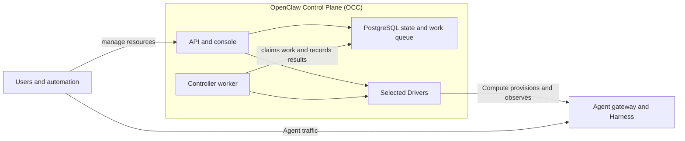

# OpenClaw Enterprise architecture

OpenClaw Enterprise (OCE) consists of the OpenClaw Control Plane (OCC) and
managed Agent runtimes. OCC owns platform resources, authorization, deployment
intent, and audit evidence; Agent runtimes execute model turns and tools.

This page describes the core components and their boundaries. Update it when
those boundaries or interactions change. Driver implementations, settings,
procedures, and feature limitations belong in the [reference](reference/README.md),
[guides](README.md#start-and-deploy), and [flows](README.md#understand-the-code).
The [platform design](design.md) defines the authoritative target architecture;
its proposed capabilities are not all implemented.

## Core components

| Component         | Responsibility                                                                                                                                       |
| ----------------- | ---------------------------------------------------------------------------------------------------------------------------------------------------- |
| API and console   | Authenticate callers, authorize exact resource operations through IAM, record desired state, and serve the browser console.                          |
| Controller worker | Claim durable lifecycle work, reauthorize the original operation, and reconcile infrastructure through Compute.                                      |
| PostgreSQL        | Persist platform state, IAM policy, controller work, and attributable audit evidence.                                                                |
| Drivers           | Implement Installation-selected capabilities against infrastructure and external systems. OCC retains platform resource ownership and authorization. |
| Agent runtime     | Run an Agent-owned gateway for connections and messages, and a Harness for Agent turns and tools.                                                    |

The API and worker run as separate processes and coordinate through persistent
state. Drivers provide the integration boundary; adding an implementation does
not add a new core architectural component. See [Driver selection and contracts](reference/drivers/selection.md).

## Ownership and lifecycle

- **Installation:** Each OCE deployment has one server-owned Installation. It
  selects Drivers and contains the platform's Namespaces.
- **Namespace:** The tenant boundary for Agents, configuration, and credentials.
  Resource references and authorization retain that exact scope.
- **Agent:** A persistent definition with its own identity, revision history,
  and gateway. Creating an Agent records state without starting a workload.
- **AgentRevision:** The immutable snapshot admitted for one deployment. The
  worker provisions it and activates it before it receives traffic. Editing
  source configuration requires a new deployment to change the running revision.

The gateway and Harness can share a workload or run separately, depending on
execution topology. Their lifecycle follows the owning Agent and its active
revision. See [concepts](guides/concepts.md) for the resource model and
[Harness execution](reference/harness-execution.md) for supported topologies.

## Security boundaries

Every protected API operation requires an authenticated identity and exact
resource authorization. Driver integrations do not bypass OCC authorization or
acquire independent platform resource authority.

Tenant workloads retain their owning Namespace and Agent identity. Credentials
are delivered only to their selected consumers. Platform mutations and
authorization denials produce attributable audit evidence; authorization and
audit failures fail closed. The [security reference](reference/security.md)
owns enforcement details and supported limitations.

## Implementation details

- [Feature and Driver reference](reference/README.md): supported contracts and implementation-specific behavior.
- [Runtime flows](README.md#understand-the-code): startup, reconciliation, and request execution through source.
- [Deployment guide](guides/deploy.md): local and production setup.
- [Settings reference](reference/settings.md): deployment and runtime configuration.
- [Testing](testing.md): verification procedures, test settings, and infrastructure prerequisites.
