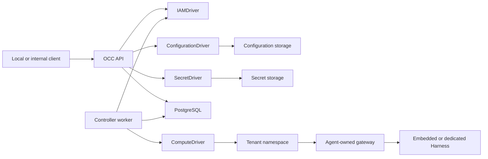
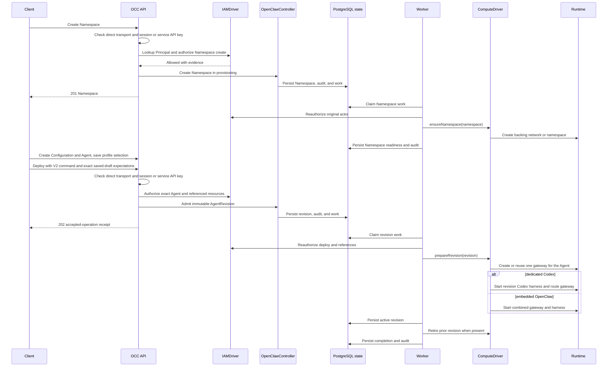

# OpenClaw Enterprise architecture

OpenClaw Enterprise provides an OpenClaw Control Center (OCC) that manages
Agents, tenant isolation, workload execution, authorization, and audit evidence.

This document describes the current implementation. The
[platform design](design.md) defines the authoritative target architecture;
capabilities described there are not necessarily implemented. Current supported
behavior is owned by the [feature reference](reference/README.md), procedures by
the [guides](README.md#start-and-deploy), and source execution by
[flow docs](README.md#understand-the-code).

## System overview

The control plane consists of an API, an independent controller worker,
PostgreSQL-backed state, and Installation-selected Drivers. The API also serves
the [platform console](reference/console.md) at `/console/`. It lists resources,
creates Agents and their Configuration drafts, shows Agent details and immutable
revisions, and edits supported Slack and Teams settings on saved drafts. Its
static browser modules use same-origin sessions and the existing authorized
APIs; they add no frontend service or resource persistence. Deployment and live
runtime health remain outside the console.



OCC owns platform resources and desired state. The worker realizes that state
through the selected Compute Driver; Drivers do not own platform resources or
bypass OCC authorization.

## Platform resources

```text
Installation
└── Namespace
    ├── Configuration
    ├── ServiceAccount
    ├── Secret
    └── Agent
        └── AgentRevision
```

- **Installation:** The singleton platform boundary that configures Providers and selects its Drivers.
- **Provider:** Installation-owned client and related Driver configuration; not an OCC resource.
- **Namespace:** A tenant boundary that isolates its resources and workloads.
- **Configuration:** A Namespace-owned native OpenClaw configuration document.
- **ServiceAccount:** A Namespace-owned provider account with an opaque
  credential reference; credential values are not returned through the API.
- **Agent:** A Namespace-owned Agent referencing one Configuration and,
  optionally, one ServiceAccount in the same Namespace and one configured Provider.
- **Secret:** A Namespace-owned value stored by the selected SecretDriver and
  returned through OCC as metadata only.
- **AgentRevision:** An immutable snapshot of the Agent's Configuration,
  Harness, Secret references, credentials, nullable Provider reference, and selected Compute implementation.

Creating an Agent does not start a workload. Deployment creates an immutable
revision, which the controller worker provisions asynchronously.

## Control plane

The API authenticates human clients with Better Auth sessions and non-Agent
automation with service API keys, resolves caller identity through the selected
IAM Driver, authorizes access to exact resources, and records resource changes.
PostgreSQL stores platform state, IAM policy, controller work, and attributable
audit evidence.

Compose and Helm run one shared initializer after database migration and before
API/worker startup. Both processes load initialized state; only the initializer
mounts credential output. Fresh native-IAM bootstrap creates human and non-Agent service administrators
with separate bindings to the same Role. Better Auth owns their credentials;
bootstrap delivers the initial service key through protected storage. Auth
persistence and the Installation/IAM commit are separate. Any bootstrap failure
preserves created artifacts and requires operator verification and manual repair. Existing Installations receive no backfill. See
[authentication](reference/authentication.md#installation-and-account-ownership)
and the [bootstrap flow](flows/local-password-authentication.md).

The controller worker claims pending Namespace and AgentRevision work,
reauthorizes the original operation, and invokes the selected Compute Driver.
Resource changes, queued work, and audit evidence are committed together.

The HTTP entrypoint composes the request infrastructure in
[`apps/controller/src/http`](../apps/controller/src/http). Protected registration
requires an exact handler for each ordinary API operation and installs admission,
strict request validation, current identity lookup, and documented permissions.
The API keeps authentication, bootstrap, and runtime-service operations under
explicit separate registration profiles. Domain handlers retain resource and
audit transactions. Configuration validation and ownership failures use the
shared [contract error constructors](../packages/contracts/src/configuration-errors.ts)
so HTTP response mapping does not depend on the Kubernetes Configuration Driver.

The main implementation boundaries are:

| Component            | Responsibility                                               |
| -------------------- | ------------------------------------------------------------ |
| `apps/controller`    | HTTP API, admission, composition, and controller worker.     |
| `apps/gateway`       | Programmatic local Slack/Teams hosted lifecycle composition. |
| `packages/contracts` | Platform resources, Driver contracts, and API schemas.       |
| `packages/occ`       | Platform ownership, lifecycle, persistence, and work queue.  |
| `packages/iam`       | Identity lookup and exact-resource authorization.            |
| `packages/audit`     | Attributable audit events and sensitive-value sanitization.  |

See the [controller worker](reference/controller.md), [authentication](reference/authentication.md),
and [API reference](reference/api.md) for operational details.

## Drivers

OCC selects the Drivers used by its Installation:

| Driver                 | Responsibility                                                  | Available implementations                        |
| ---------------------- | --------------------------------------------------------------- | ------------------------------------------------ |
| `IAMDriver`            | Resolve identities and authorize exact-resource access.         | Bundled native IAM or an installed Driver.       |
| `ComputeDriver`        | Provision tenant infrastructure and Agent workloads.            | Bundled Docker, Kubernetes, or installed Driver. |
| `ConfigurationDriver`  | Store Namespace-owned OpenClaw configuration documents.         | Filesystem, Kubernetes ConfigMaps, or installed. |
| `SecretDriver`         | Store Namespace-owned Secret values and validate delivery refs. | Bundled Kubernetes Secrets.                      |
| `ServiceAccountDriver` | Provision upstream provider accounts and their credentials.     | Optional ChatGPT Provider member.                |

A configured [Provider](reference/providers.md) owns a client and its related
Driver membership. Only the API constructs the ChatGPT client and injects its
Provider into the bundled ServiceAccount Driver; the worker validates nonsecret
metadata. Agent and revision `providerId` references are nullable. Managed
access tokens require exact Provider, Driver, workspace, and account binding.

Compute owns workload provisioning, readiness, activation, and retirement.
Other selected Drivers can participate through bounded lifecycle hooks without
assuming workload ownership.

See the [ComputeDriver contract](reference/drivers/compute.md),
[Driver installation guide](reference/drivers/selection.md), and
[Kubernetes Secret Driver](reference/drivers/kubernetes-secret.md).

## Agent execution

Every deployed Agent has its own OpenClaw gateway. The selected Harness
determines its execution topology:

- **Embedded OpenClaw:** The gateway and Harness run in one workload.
- **Dedicated Codex:** The gateway and Harness run in separate workloads with
  separate identities, authenticated transport, and an Agent-owned shared
  workspace.

Only an active AgentRevision receives traffic. Updating an Agent or its
Configuration does not change an existing workload until a new revision is
deployed and activated.

### Agent provisioning sequence

Agent runtime provisioning is asynchronous. Agent creation records resource
state only; `deploy` admits an immutable `AgentRevision`, and the worker later
invokes the selected Compute Driver for runtime effects.

Production and PostgreSQL development composition install the original
request/account participants, workload-profile operator service, candidate and Use
resolvers, and the selected Compute renderer contribution. Complete profile
admission remains unavailable while the immutable-definition custodian and required
runtime, identity, credential and storage contributors are absent. The sequence
below requires those genuine current suppliers. An accepted
[identified V2 command](reference/lifecycle-deploy-v2.md) returns an operation
receipt; it does not return the revision document or its identifier.



See [Agent management](reference/agents.md) and the
[Harness execution topology](flows/harness-execution-topology.md).

## Channels and delivery state

The [`apps/gateway` application](reference/hosted-gateway.md) composes the local
Slack and Teams hosted channel lifecycle for programmatic consumers. Its admitted
startup consumer invokes the original enrolled startup port once and awaits the
owned lifetime. The [protected Gateway startup components](reference/gateway-startup-v1.md)
implement command and process ownership. The
[Agent/V2 bootstrap and material components](reference/gateway-startup-agent-bootstrap.md)
retain the original Agent subject, confirmed startup claim and local consumer
parent. Executable deployment remains unavailable until genuine protected
bootstrap, authority, material and physical-settlement participants are connected;
the unbound startup reader fails closed.

The Kubernetes channel profile runs native Slack and Teams configuration in
each Agent's dedicated gateway, with gateway-only channel credentials and private
runtime state. PostgreSQL
owns controller resources, audit, and infrastructure work; it is not a gateway
runtime database or a channel event inbox. The separate same-Agent workspace
does not expose the private gateway claim to the dedicated Harness.

Authenticated manual app, human, and Agent binding APIs now persist exact
ownership and versioned status. Their internal resolver is mapping-only: it
does not verify received events or the complete audience, admit a turn, or grant
runtime authority. Receipt identity/classification helpers likewise perform no
durable intake. These are separate from native plugin delivery and from the
proposed independent inbox or shared-app outbound broker.

Only Slack has documented live channel coverage; Teams still requires the
separately reviewed public webhook and end-to-end verification. Retained gateway
storage and ordinary readiness do not certify complete shared-Agent collaboration,
safe cross-version rollback, host-loss recovery, or exactly-once external effects.
See [channels](reference/channels.md), [manual bindings](reference/channel-bindings.md),
the [source flow](flows/channel-delivery.md), and the proposal-only
[channel roadmap](../specs/22-channel-hosting-roadmap.md).

## Security boundaries

- Ordinary controller API access uses authenticated human sessions or non-Agent
  service API keys; IAM authorizes each operation against its exact Installation,
  Namespace, Agent, or revision. The console uses human sessions only.
- Namespace isolation prevents access to another tenant's resources or
  workloads.
- Agent revisions, workload identity, configuration, and credentials remain
  scoped to their owning Agent.
- Namespace-owned Secret values are stored by the selected SecretDriver; OCC
  responses, audit records, ConfigMaps, and consumers without an admitted binding
  for that Secret carry only metadata or references.
- Production Kubernetes workloads use restricted Pod security, NetworkPolicies,
  least-privilege ServiceAccounts, and projected workload identity.
- Dedicated gateway and Harness workloads receive only the credentials required
  for their respective responsibilities.
- Mutations and authorization denials produce attributable audit evidence;
  missing authorization or audit dependencies fail closed.

See [identity and access management](reference/authorization.md), [security](reference/security.md), and
[Secret storage and delivery](flows/secret-storage-and-delivery.md).

## Deployment modes

**Local development** runs the API, controller worker, and PostgreSQL through
Docker Compose. The default Compute Driver provisions Agent workloads as Docker
containers; the API is available only through loopback.

**Production Kubernetes** runs the API and worker as separate Pods backed by
PostgreSQL. The selected Kubernetes Compute Driver creates isolated tenant
namespaces, Agent-owned gateways, and embedded or dedicated Agent workloads.
The production API is internal-only.

Reviewed installed Drivers can be selected in both development and production.
See [Docker development](reference/drivers/docker-compute.md),
[Kubernetes deployment](guides/deploy.md), and the
[Kubernetes Compute Driver](reference/drivers/kubernetes-compute.md).

## Current limitations

The current implementation does not provide:

- Public ingress or external identity federation.
- Console deployment, rollback, Agent deletion, or live runtime-health controls.
  Provider and Namespace console pages remain read-only; Agent creation and
  supported channel draft editing use the existing management APIs.
- Production lifecycle status and recovery reads in the default composition.
  The [lifecycle status API](reference/lifecycle-status-api.md) has contracts and
  handlers, but requires server-owned current authorization and observation
  dependencies; absent dependencies return `503 DEPENDENCY_UNAVAILABLE`.
- A general, verified pre-execution sandbox policy barrier for every runtime.
  Optional SandboxDriver facets and delegated OpenShell Harness provisioning
  exist, but upstream compatibility and enforcement limitations remain; see
  the [SandboxDriver reference](reference/drivers/sandbox.md).
- SecretBroker substitution, brokered model credentials, or an approved
  restricted model-egress proxy.
- Agent-owned service-principal API-key authentication, token exchange, or
  general production workload-token verification. Non-Agent service API keys
  are supported; the selected runtime-service listener has a separate, narrow
  X.509-SVID authentication boundary.
- Secret value history, automatic Secret rotation, automatic workload restart
  after Secret update, or automatic provider credential refresh.
- Shared Kubernetes clusters or multi-replica Agent gateways.

The [platform design](design.md) describes target capabilities beyond the
current implementation.

## Related documentation

- [Platform design](design.md)
- [Documentation index](README.md)
- [Configuration reference](reference/settings.md)
- [Controller worker](reference/controller.md)
- [Identity and access management](reference/authorization.md)
- [Security model](reference/security.md)
- [ComputeDriver contract](reference/drivers/compute.md)
- [Docker Compute Driver](reference/drivers/docker-compute.md)
- [Kubernetes Compute Driver](reference/drivers/kubernetes-compute.md)
- [Production Kubernetes deployment](guides/deploy.md)

## Native runtime-security components

The [`components/runtime-security` Go module](../components/runtime-security/README.md)
implements OpenShell gateway operations and SPIFFE identity consumption.
The controller invokes OpenShell operations through a versioned JSON subprocess
boundary; the Go executable owns protocol, TLS, credential loading and exact
readback checks. Both controller image targets include the executable built
from the selected Go builder image.

### Local workload identity provider

The Go module includes a [SPIFFE Workload API component](reference/workload-identity.md)
that receives X.509 material and fetches or validates audience-bound JWT-SVIDs
from a configured trusted local Unix socket. It selects one exact identity and
withdraws access when its stream or credential validity is lost. The operator
diagnostic consumes this component without printing credentials.

The controller can explicitly select a separate
[authenticated runtime authority listener](reference/runtime-service-transport.md)
whose owned native child consumes the Workload API and authenticates exact
service peers through mutual TLS. Its admitted profiles permit historical
`readOperation`, or an initial dedicated gVisor Harness `bind` request. The bind
path currently rejects before effects when authoritative preparation, approved
workload-profile and protected Compute inputs are unavailable. This listener
does not establish active runtime authority or replace ordinary API authentication.

Runtime activation and gateway-to-harness transport do not automatically consume
this identity component. Constrained registration, actual guest attestation and
current runtime authorization remain separate integration requirements.
