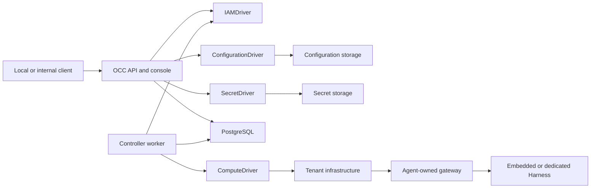

# OpenClaw Enterprise architecture

OpenClaw Control Plane (OCC) stores desired Agent state and runs a worker that
turns it into workloads through selected Drivers. This page describes the current
implementation; the [platform design](design.md) defines the authoritative target,
including capabilities that have not shipped.

## System overview

The control plane contains an API, an independent worker, PostgreSQL, and
Installation-selected Drivers. The API also serves the [platform console](reference/console.md)
at `/console/`; browser actions use the same authorized APIs. The console creates
Agents and Configuration drafts, inspects immutable revisions, and edits supported
Slack and Teams settings on saved drafts. Its bounded V2 deployment panel retains
commands before submission and reads exact operation outcomes; admission still
requires genuine suppliers and saved account/profile selection. Live runtime-health
controls remain outside its scope.



OCC owns platform resources and desired state. Drivers operate the backing
infrastructure; they do not bypass OCC authorization or become resource owners.

## Platform resources

Each deployment has one Installation. Its Namespaces contain Configurations,
ServiceAccounts, Secrets, and Agents. Each Agent owns immutable AgentRevisions.
References must stay within their admitted scope.

[Concepts](guides/concepts.md) defines these resources and distinguishes platform
identities from Kubernetes identities. [Feature reference](reference/README.md)
owns their fields, permissions, and lifecycle rules.

[Agent plugins](reference/agent-plugins.md) defines the optional Agent-owned
plugin map. AgentRevision snapshots record the requested plugin IDs and policy;
startup resolves them through the selected PluginDriver.

## Control plane

The API authenticates humans through Better Auth sessions and non-Agent automation
through service API keys, then authorizes exact resource operations and records
changes. PostgreSQL stores platform state, IAM policy, controller work, and audit
evidence. Resource mutations, queued work, and audit records commit together.

Compose and Helm initialize the Installation after database migration and before
starting the API and worker. Only the initializer mounts bootstrap credential
output. See [startup](flows/platform-startup.md) and
[bootstrap recovery](guides/deploy/service-keys.md#recover-an-incomplete-bootstrap)
for initialization ordering and failure handling.

| Component            | Responsibility                                                |
| -------------------- | ------------------------------------------------------------- |
| `apps/controller`    | API, console, admission, composition, and worker entrypoints. |
| `apps/gateway`       | Programmatic local Slack/Teams hosted lifecycle composition.  |
| `packages/contracts` | Resource models, Driver interfaces, and API schemas.          |
| `packages/occ`       | Resource ownership, lifecycle, persistence, and work queue.   |
| `packages/iam`       | Identity lookup and authorization.                            |
| `packages/audit`     | Audit events and sensitive-value sanitization.                |

The [HTTP entrypoint](../apps/controller/src/http) registers exact handlers,
strict validation, current identity lookup and documented permissions. Authentication,
bootstrap and runtime-service routes use separate explicit registration profiles.
Domain handlers own resource/audit transactions; shared
[configuration error constructors](../packages/contracts/src/configuration-errors.ts)
keep HTTP mapping independent of the Kubernetes Configuration Driver.

## Drivers

Installation configuration selects infrastructure implementations for compute,
configuration, identity, Secrets, optional provider service accounts, and optional
Agent plugin translation.
[Driver reference](reference/README.md#drivers) owns available implementations
and contracts; [selection](reference/drivers/selection.md) explains trusted package loading.

Compute owns workload provisioning, readiness, activation, and retirement.
Other Drivers may participate through bounded
[Compute lifecycle hooks](flows/compute-driver-lifecycle-hooks.md).
[Providers](reference/providers.md) supply authenticated clients to related Drivers.
[PluginDriver](reference/drivers/plugin.md) resolves curated Agent plugin
selections and renders native runtime policy during revision startup.

## Agent execution

An Agent's gateway serves client connections. Embedded OpenClaw runs the gateway
and Harness together; dedicated Codex uses separate workloads with separate
identities and an Agent-owned shared workspace. See
[Harness execution](reference/harness-execution.md) for topology and credential boundaries.

[Agent execution duration](reference/agents.md#execution-duration-selection)
is configured with `maximumExecutionMs`: omitted creation selects `null`
(uncapped), while a positive safe integer selects a finite millisecond cap.
Deployment freezes that selection into the immutable revision. The selected
[turn journal](reference/turn-journal/execution.md#selected-native-execution-retention)
accepts an explicit finite-or-null attempt policy and retains mandatory native
stop responsibility in both modes. Its optional timer uses the original
pre-commit monotonic anchor; configured durations have no fifteen-minute ceiling.

The [hosted native owner](reference/hosted-native-execution.md) remains a
component integration surface requiring a matching SDK/native construction gate,
a production dispatcher and actual continuing authority. Persisted configuration
does not by itself change every deployed runtime. Lifecycle read APIs and
protective intent storage do not yet supply a complete user-to-runtime
stop/start workflow. See the [implementation record](../specs/24-configurable-execution-limits.md)
for implemented cap components, remaining composition and runtime qualification.

### Agent provisioning sequence

Agent creation records a definition; deployment admits an immutable
AgentRevision for the worker to provision asynchronously. The sequence below
shows effects after successful admission. Production and PostgreSQL development
compose request/account participants, the workload-profile operator service,
candidate/Use resolvers and the Compute renderer contribution. Complete profile
admission remains unavailable without the immutable-definition custodian and
required runtime, identity, credential and storage contributors. See
[identified V2 deployment](reference/lifecycle-deploy-v2.md).

```mermaid
sequenceDiagram
    participant Client
    participant API as OCC API
    participant IAM as IAMDriver
    participant OCC as OpenClawController
    participant DB as PostgreSQL state
    participant Worker
    participant Compute as ComputeDriver
    participant Runtime

    Client->>API: Create Namespace
    API->>API: Authenticate caller
    API->>IAM: Authorize Namespace creation
    IAM-->>API: Allowed with evidence
    API->>OCC: Create Namespace in provisioning
    OCC->>DB: Commit Namespace, audit, and work
    API-->>Client: 201 Namespace
    Worker->>DB: Claim Namespace work
    Worker->>IAM: Reauthorize original actor
    Worker->>Compute: ensureNamespace(namespace)
    Compute->>Runtime: Prepare backing network or namespace
    Worker->>DB: Commit Namespace readiness, audit, and completion

    Client->>API: Create Configuration and Agent
    API->>IAM: Authorize exact resources
    API->>OCC: Record resource definitions
    OCC->>DB: Commit resource state and audit
    API-->>Client: Created resources, no Agent runtime yet

    Client->>API: Save workload profile; submit identified V2 deployment command
    API->>IAM: Authorize deployment and referenced resources
    API->>OCC: Admit immutable AgentRevision
    OCC->>DB: Commit revision, audit, and work
    API-->>Client: 202 accepted-operation receipt
    Worker->>DB: Claim revision work
    Worker->>IAM: Reauthorize deployment and references
    Worker->>Compute: prepareRevision(revision)
    alt dedicated Codex
        Compute->>Runtime: Prepare Agent gateway and separate Codex Harness
    else embedded OpenClaw
        Compute->>Runtime: Prepare combined gateway and Harness
    end
    Compute-->>Worker: Revision ready for activation
    opt Driver activates before commit
        Worker->>Compute: Activate prepared revision
    end
    Worker->>DB: Commit active revision under the live claim
    opt Driver activates after commit
        Worker->>Compute: Activate committed revision
    end
    Worker->>Compute: Retire prior revision when present
    Worker->>DB: Commit activation audit and work completion
```

Editing a draft does not change the running revision. Admission alone does not
prove runtime readiness. The [controller reference](reference/controller.md)
defines lifecycle and retry behavior; the [worker flow](flows/controller-worker.md)
traces persistence and Driver calls.

## Channels and delivery state

The [`apps/gateway` application](reference/hosted-gateway.md) composes the local
Slack and Teams hosted channel lifecycle for programmatic consumers. Its admitted
startup consumer invokes the original enrolled startup port once and awaits the
owned lifetime. The [protected Gateway startup components](reference/gateway-startup-v1.md)
implement command and process ownership. The
[Agent/V2 bootstrap and material components](reference/gateway-startup-agent-bootstrap.md)
retain the original Agent subject, confirmed startup claim and local consumer
parent. Executable deployment remains unavailable until genuine protected
bootstrap, authority, material and physical-settlement participants are connected;
the unbound startup reader fails closed.

The Kubernetes channel profile runs native Slack and Teams configuration in
each Agent's dedicated gateway, with gateway-only channel credentials and private
runtime state. PostgreSQL
owns controller resources, audit, and infrastructure work; it is not a gateway
runtime database or a channel event inbox. The separate same-Agent workspace
does not expose the private gateway claim to the dedicated Harness.

Authenticated manual app, human, and Agent binding APIs now persist exact
ownership and versioned status. Their internal resolver is mapping-only: it
does not verify received events or the complete audience, admit a turn, or grant
runtime authority. Receipt identity/classification helpers likewise perform no
durable intake. These are separate from native plugin delivery and from the
proposed independent inbox or shared-app outbound broker.

Only Slack has documented live channel coverage; Teams still requires the
separately reviewed public webhook and end-to-end verification. Retained gateway
storage and ordinary readiness do not certify complete shared-Agent collaboration,
safe cross-version rollback, host-loss recovery, or exactly-once external effects.
See [channels](reference/channels.md), [manual bindings](reference/channel-bindings.md),
the [source flow](flows/channel-delivery.md), and the proposal-only
[channel roadmap](../specs/22-channel-hosting-roadmap.md).

## Security boundaries

IAM authorizes each operation against its exact resource. Namespace isolation,
Agent-scoped identities, and explicit Secret bindings constrain access. OCC
responses and audit records contain Secret metadata or references, not values.
Missing authorization or audit dependencies fail closed.

Production Kubernetes uses restricted Pod security, scoped ServiceAccounts, and
NetworkPolicies. [Security reference](reference/security.md) owns these controls
and their enforcement limits.

## Deployment modes

- **Local development:** Compose runs the API, worker, and PostgreSQL; the API
  binds to loopback and Docker Compute provisions Agent containers.
- **Production Kubernetes:** the API and worker run separately; Kubernetes Compute
  provisions tenant infrastructure and Agent workloads. The API remains internal.
- **SSH execution:** SSH Compute runs embedded OpenClaw on preprovisioned Linux
  hosts. Host networking remains the operator's responsibility; consult the
  [SSH reference](reference/drivers/ssh-compute.md) for supported composition.

Follow [Deploy](guides/deploy.md) for operator procedures.

## Current limitations

Supported capabilities and limits live with their owning features:
[authentication](reference/authentication.md), [console](reference/console.md),
[security](reference/security.md), and [sandbox execution](reference/drivers/sandbox.md).
The default composition does not supply production lifecycle status/recovery
observation dependencies; absent suppliers return `503 DEPENDENCY_UNAVAILABLE`.
Stored protective intent and read APIs do not implement complete runtime stop/start.
Agent-owned API keys, public ingress, external identity federation, general
workload-token verification, brokered model credentials, shared-cluster qualification
and multi-replica gateways remain outside supported scope. The target design does
not establish that a capability is implemented.

## Related documentation

- [Documentation map](README.md)
- [Platform design](design.md)
- [Testing](testing/README.md)

## Native runtime-security components

The [`components/runtime-security` Go module](../components/runtime-security/README.md)
implements OpenShell gateway operations and SPIFFE identity consumption.
The controller invokes OpenShell operations through a versioned JSON subprocess
boundary; the Go executable owns protocol, TLS, credential loading and exact
readback checks. Both controller image targets include the executable built
from the selected Go builder image.

### Local workload identity provider

The Go module includes a [SPIFFE Workload API component](reference/workload-identity.md)
that receives X.509 material and fetches or validates audience-bound JWT-SVIDs
from a configured trusted local Unix socket. It selects one exact identity and
withdraws access when its stream or credential validity is lost. The operator
diagnostic consumes this component without printing credentials.

The controller can explicitly select a separate
[authenticated runtime authority listener](reference/runtime-service-transport.md)
whose owned native child consumes the Workload API and authenticates exact
service peers through mutual TLS. Its admitted profiles permit historical
`readOperation`, or an initial dedicated gVisor Harness `bind` request. The bind
path currently rejects before effects when authoritative preparation, approved
workload-profile and protected Compute inputs are unavailable. This listener
does not establish active runtime authority or replace ordinary API authentication.

Runtime activation and gateway-to-harness transport do not automatically consume
this identity component. Constrained registration, actual guest attestation and
current runtime authorization remain separate integration requirements.
