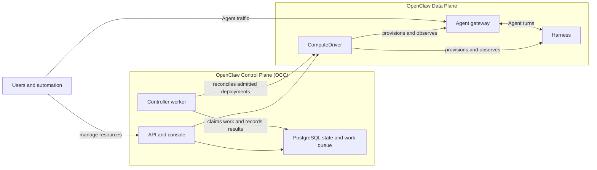
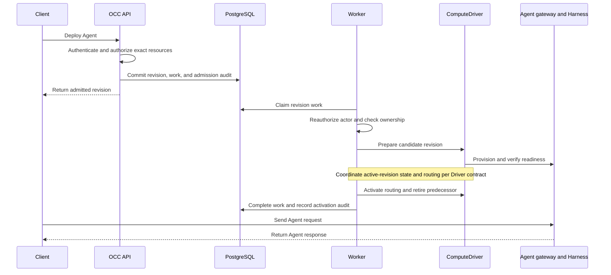

# OpenClaw Enterprise architecture

## System overview

OpenClaw Enterprise (OCE) consists of the OpenClaw Control Plane (OCC) and the
OpenClaw Data Plane, where Agents run. OCC owns platform resources,
authorization, deployment intent, and audit evidence. The data plane comprises
ComputeDriver, Agent gateways, and Harnesses.

The API serves requests and the browser console. An independent worker
reconciles durable work through the selected ComputeDriver; PostgreSQL holds
platform state, IAM policy, work, and audit evidence. Agent gateways handle
connections and messages, while Harnesses execute Agent turns and tools.

## Concepts

- **Installation:** One server-owned deployment boundary that selects Drivers
  and contains Namespaces.
- **Namespace:** The tenant boundary for Agents, configuration, and credentials.
- **Agent:** A persistent definition with its own identity, gateway, and revision
  history. Creating it records state without starting a workload.
- **AgentRevision:** An immutable deployment snapshot. Editing source
  configuration requires a new deployment to change the running revision.

See [Concepts](guides/concepts.md) for the full terminology, resource model, and
control-plane/data-plane distinction.

## Control Plane

OCC authenticates callers, authorizes exact resource operations, admits deployment
snapshots, and records attributable audit evidence. Its API and worker run as
separate processes and coordinate through persistent state. The worker claims
lifecycle work, reauthorizes the original operation, and reconciles its outcome.

### Code components

| Component                                     | Responsibility                                                           |
| --------------------------------------------- | ------------------------------------------------------------------------ |
| [`apps/controller`](../apps/controller)       | HTTP API, console, admission, Driver composition, and controller worker. |
| [`packages/contracts`](../packages/contracts) | Resource types, Driver contracts, and API schemas.                       |
| [`packages/occ`](../packages/occ)             | Platform ownership, lifecycle, persistence, and work queue.              |
| [`packages/iam`](../packages/iam)             | Identity lookup and exact-resource authorization.                        |
| [`packages/audit`](../packages/audit)         | Attributable audit events and sensitive-value sanitization.              |

### Drivers

The Installation selects trusted Drivers for IAM, configuration, Secrets,
provider integrations, and execution. OCC calls ComputeDriver to provision and
observe the data plane while retaining authorization and lifecycle decisions.
Selected sandbox capabilities can participate in Harness provisioning and
containment through Compute's lifecycle.

Drivers implement existing capability contracts; adding an implementation does
not by itself change the core architecture. See [Driver selection](reference/drivers/selection.md)
and the [Driver reference](reference/README.md#drivers) for supported contracts
and implementations.

## Agent Execution

Deployment admits a revision before the worker provisions it. A replacement can
be prepared while its predecessor serves; activation directs new traffic to the
replacement before the previous revision is retired.

The gateway and Harness share a workload in embedded execution or run separately
in dedicated execution. The diagram summarizes successful reconciliation;
activation commit ordering and recovery depend on the Driver contract. See
[Harness execution](reference/harness-execution.md), the
[worker flow](flows/controller-worker.md), and the
[execution topology flow](flows/harness-execution-topology.md).

## Security Boundaries

Every protected API operation requires an authenticated identity and exact
resource authorization. Drivers do not bypass OCC authorization or acquire
independent platform resource authority. Tenant workloads retain their owning
Namespace and Agent identity; credentials go only to their selected consumers.
Mutations and authorization denials produce attributable audit evidence.

See the [security reference](reference/security.md) for isolation, credential
boundaries, enforcement details, and verification limits.

## Deployment

- **Local Docker:** Docker Compose runs the API, worker, and PostgreSQL. Docker
  Compute provisions Agent workloads as containers; API access is loopback-only.
  Start with the [quickstart](guides/quickstart.md) and
  [development deployment](guides/deploy.md#development).
- **Production Kubernetes:** Helm runs the API and worker as separate Pods with
  external PostgreSQL. Kubernetes Compute provisions tenant infrastructure and
  Agent workloads. Controller access is internal-only, with operator-managed
  credentials and network policy. See [production deployment](guides/deploy.md#production).

## Limitations

- Controller authentication supports sessions and service API keys; public
  signup, OIDC, and bearer authentication are unsupported. See [authentication](reference/authentication.md).
- The console supports Agent creation, draft deployment, runtime credential
  setup, and supported workspace file edits. Rollback, live runtime health,
  and deletion remain unavailable. See [console capabilities](reference/console.md).
- Kubernetes requires a cluster dedicated to one Installation. Guarded revision
  routing does not provide physical process fencing during node partitions or
  manual replacement. See [Kubernetes requirements and execution limits](reference/drivers/kubernetes-compute.md).
- Dedicated native session resume after gateway restart remains unsupported;
  retained storage does not establish continued execution. Sandbox selection
  also does not establish general per-tool admission. See [Harness execution limits](reference/harness-execution.md).

These are current architectural and operator-facing constraints. Feature and
Driver references own the detailed limits; the [platform design](design.md)
includes target capabilities beyond the current implementation.

## Related docs

- [Documentation map](README.md): guides, feature references, and runtime flows.
- [Platform design](design.md): authoritative target architecture.
- [Settings](reference/settings.md): deployment and runtime configuration.
- [Testing](testing.md): test settings, infrastructure prerequisites, and verification.
