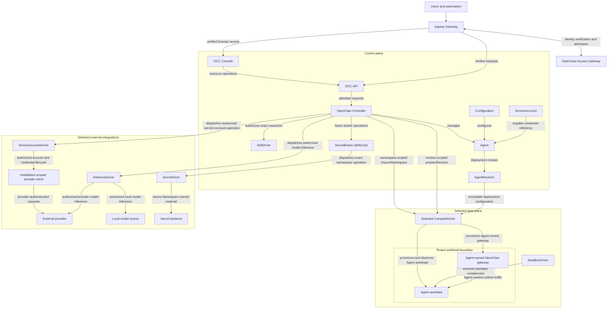

# OpenClaw as the Open Enterprise Agent Platform

## Summary

OpenClaw Enterprise provides a multi-tenant control plane for configuring,
deploying, and operating agents. Each deployment owns exactly one Installation
containing multiple isolated Namespaces.

Enterprise functionality is mediated by the OpenClaw Controller (OCC). This is a new component that is responsible for provisioning and orchestrating agents.

The platform introduces a small set of resource primitives for managing agents.
OCC owns these platform resources and their lifecycles; external systems own
the underlying infrastructure, external provider resources, and local model
sources accessed through one common Driver abstraction.

The bundled platform deployment uses Kubernetes. An Installation can select its
bundled or an installed Driver implementation in development and production.

## Motivation

The existing OpenClaw gateway serves a single tenant. Operating agents for an
organization currently requires separate deployments, manually maintained
configuration, and application-specific integration work. Organizations lack a
shared way to manage tenant isolation, access, policy, deployment, and audit.

The platform needs one resource model for an agent, its configuration, the
version being deployed, and the infrastructure that runs it. Compute, model
inference, external identity, policy, messaging, and secret integrations need
explicit ownership boundaries without introducing a separate resource for each
runtime detail.

## Goals

- Provide a multi-tenant OpenClaw control plane with exactly one server-owned
  Installation and explicit Namespace and authorization boundaries.
- Validate externally authenticated identity and admit requests to the exact
  Installation and, when applicable, Namespace.
- Manage one isolated OpenClaw gateway per Agent, allowing multiple gateways
  in the same Namespace.
- Define the v1 resources used to configure, deploy, constrain, and operate an
  Agent.
- Preserve exact-resource authorization, immutable deployment snapshots, stable
  workload identity, fail-closed behavior, and audit evidence.
- Provision each Agent-owned gateway and its Agent workload through the same
  operator-selected `ComputeDriver`, whether bundled or installed.
- Support model inference from an external provider or local model source
  without introducing either as a platform resource.
- Enforce admitted sandbox policies and, in the future brokered design, keep
  secret values, backend credentials, and provider credentials outside agent
  workloads. The approved KubernetesSecretDriver path stores Namespace-owned
  material before Agent creation and may deliver it by env only to explicitly
  selected consuming gateways; embedded OpenClaw and dedicated Codex production retain the
  explicitly scoped, topology-specific model-credential boundaries described
  below.
- Extend the platform through capability-specific contracts on one common
  Driver abstraction.

## Non-Goals

- Making the existing OpenClaw gateway multi-tenant.
- Hosting multiple Installations in one OpenClaw Enterprise deployment.
- Introducing an execution resource between an Agent and its workload.
- Specifying the OCC API or OCC Console beyond naming their surfaces.
- Specifying integration wire protocols, database schemas, audit storage,
  directory synchronization, or external policy internals.
- Performing identity-provider authentication, login, token exchange, or
  credential issuance in the access gateway.
- Defining connector or plugin resources, tool actions, or approval workflows.
- Delegating human identity or authentication to an Agent.
- Supporting cross-Namespace references.

## Proposal

1. Introduce OCC as the owner of the multi-tenant control plane, platform
   resources, authorization, deployment, integration dispatch, and audit.
   `OCC API` and `OCC Console` name product surfaces; production API and console
   contracts remain outside this architecture specification.
2. Use an Ingress Gateway as the public control-plane boundary. It forwards
   protected requests only after the OpenClaw Access Gateway (OAG) verifies
   externally authenticated identity and admits the exact requested scope.
3. Have OCC independently authorize every requested OpenClaw operation against
   the exact action, resource, and Namespace.
4. Define the v1 platform resources: `Namespace`, `Configuration`,
   `ServiceAccount`, `Agent`, `AgentRevision`, `Harness`, `Channel`, `Secret`,
   `SecretBroker`, `SandboxPolicy`, and `Restriction`.
5. Have OCC manage one OpenClaw gateway for each deployed Agent. The selected
   `ComputeDriver` creates that gateway with its Agent in the same tenant
   boundary. The bundled `KubernetesComputeDriver` uses the same exact cluster
   and Kubernetes namespace. A Namespace may contain multiple independently
   owned gateways; gateway lifecycle follows its owning Agent.
6. Provision an Agent workload from an admitted immutable `AgentRevision`
   through the selected `ComputeDriver` and enforce its exact `SandboxPolicy`
   through the selected `SandboxDriver`.
7. Keep authorization, service accounts, model inference, compute,
   sandboxing, secrets, and messaging behind bounded Driver contracts.
   Installing a Driver does not grant it resource ownership or permission to
   select itself; only server-owned selection gives an `IAMDriver` authority
   for its assigned resource kinds.
8. Provide durable platform state, exact-resource authorization, and audit
   evidence without selecting internal storage or wire formats.

## Architecture



The Ingress Gateway is the public control-plane boundary. An external identity
provider authenticates the caller, OAG verifies the resulting identity evidence
and tenant admission, and OCC authorizes the exact platform operation. The
control plane contains OCC. Each Agent's OpenClaw gateway runs alongside its
workload in the selected data plane. `IAMDriver` evaluates the selected
authorization policy. The selected `ComputeDriver` reconciles Agent-owned
gateways and workloads in the same tenant boundary; the bundled
`KubernetesComputeDriver` uses the same exact Kubernetes cluster and backing
namespace. OCC owns their lifecycle decisions.
`SandboxDriver` enforces the admitted policy for the exact Agent workload.
`InferenceDriver` invokes the selected external provider or local model source.
OCC API and OCC Console are named surfaces, not implementation or deployment
decisions.

## Common concepts

An OpenClaw Enterprise deployment owns exactly one server-selected
`Installation`. It is the outer administrative boundary for configured
Providers, installation-scoped IAM resources, and Namespaces. Bootstrap
creates one persistent Installation with a stable identifier; subsequent starts
reload that same Installation, and a conflicting configured identifier fails
closed. Platform resource writes are rejected before bootstrap completes.
There is no multi-Installation collection or caller-selected Installation.
Installation configuration selects server-owned Drivers,
including the authoritative `IAMDriver` for each resource kind and the selected
service-account, inference, compute, sandbox, secret, and messaging capabilities.
An Installation-scoped `Provider` owns an authenticated client and related
capability-specific Drivers; neither the Provider nor its client is a Driver or
an OCC resource. Each Agent has a nullable `providerId`, copied into each
immutable AgentRevision. Provider membership does not change model configuration
or authorize operations. The configured provider workspace is
provider connection context, not an OCC Namespace mapping. The selected Compute
Driver contains each Namespace's Agent-owned gateways and
workloads in the same exact tenant boundary. The bundled Kubernetes Driver uses
the Installation-selected cluster and each Namespace's backing Kubernetes
namespace.

The Installation identifier crosses only boundaries that require a deployment
identity: configuration, admission, trusted ingress, exported audit evidence,
and external deployment integrations. Ordinary Namespace and Agent resources,
internal IAM records and resource references, repository operations,
controller work, and Compute observations inherit their Installation from the
selected singleton platform. They do not repeat `installationId`.

Installation bootstrap establishes identity-provider trust and the first
administrator through a server-owned, single-use, installation-scoped setup
path. Normal requests are unavailable until setup completes, after which the
bootstrap path is disabled. Bootstrap decisions are audited. Only an
authorized human or installation-scoped service principal may create or
change Namespaces, Groups, Roles, AccessBindings, Restrictions, or
installation trust.

A `Namespace` is the tenant boundary inside the singleton Installation. Each
Namespace-scoped resource, identity, and access binding belongs to exactly one
Namespace. `namespaceId` is the explicit tenant-isolation key for scoped
resources, authorization, lookup, controller work, and Compute observations;
its absence on an IAM resource denotes singleton-wide scope.
Namespace-scoped references cannot cross the Namespace boundary.
Installation-scoped resources belong to the same server-owned Installation.

OCC owns persistent Namespace lifecycle and readiness. A Namespace starts
`provisioning` and becomes `ready` only after its backing tenant infrastructure
is ready. In the Installation-selected cluster, the bundled Kubernetes Driver
either provisions a driver-owned backing namespace or uses the exact existing,
operator-owned namespace requested through `POST /namespaces` with
`existingNamespace`. Existing-namespace selection additionally requires
Installation `administer` authorization at admission and immediately before
worker adoption. The requested name is persisted immutably and is unique across
active Namespace records. The operator-prepared namespace
must be `Active`, have an external-lifecycle annotation, enforce restricted Pod
Security, and contain no foreign tenant markers or NetworkPolicies. The worker
binds only its exact tenant label and annotation while preserving its manager;
the bundled Configuration Driver discovers the resulting exact tenant identity.
The shared worker keeps running, and Installation settings remain unchanged.
`ComputeDriver.ensureNamespace` reports infrastructure readiness as an
independently authorized Namespace lifecycle operation without starting a
gateway. Permanent provisioning failure marks the Namespace `failed`. Deletion
transitions an empty Namespace to `deleting`; `ComputeDriver.deleteNamespace`
removes OCC-owned tenant infrastructure before OCC tombstones the platform
resource. It removes a driver-owned backing namespace but preserves an
operator-owned existing namespace, tenant markers, and external resources. A failed,
incomplete, or deleting Namespace cannot admit deployments.

OCC owns platform resource records and lifecycles. Each Driver receives only
the exact scoped operation appropriate to its selected capability; it does not
own platform resources, select itself, grant itself permissions, or rewrite
revisions.

## Platform resources

| Resource         | Scope                     | Contract                                                                                                                                                                                                                                                                                                             |
| ---------------- | ------------------------- | -------------------------------------------------------------------------------------------------------------------------------------------------------------------------------------------------------------------------------------------------------------------------------------------------------------------- |
| `Namespace`      | Installation              | Tenant boundary for agents, configuration, messaging, secrets, policy, and runtime routing. OCC establishes its backing tenant infrastructure before contained Agents and their individually owned gateways can be deployed.                                                                                         |
| `Configuration`  | Namespace                 | Reusable nonsecret configuration for Agents. Deployment snapshots the admitted contents into an `AgentRevision`; later edits affect only later deployments.                                                                                                                                                          |
| `ServiceAccount` | Namespace                 | OCC-owned, provider-agnostic account with at most one opaque reference to a credential in its exact backing namespace. A selected ServiceAccountDriver privately links it to an upstream account. The account, Agent, and immutable revision never contain credential bytes or provider identity.                    |
| `Agent`          | Namespace                 | Stable author-facing agent resource. It can reference one same-Namespace ServiceAccount and one Installation Provider, and owns its revision history, at most one active revision, exactly one deployed OpenClaw gateway, and one stable OCC-created `WorkloadIdentity`.                                             |
| `AgentRevision`  | Namespace                 | Immutable snapshot of one Agent and the exact configuration, references, harness, sandbox policy, and selected runtime implementations admitted for one deployment. OCC activates it only after preparing the Agent-owned gateway and candidate workload, verifying containment, and configuring a nonserving route. |
| `Harness`        | Installation              | Versioned agent runtime published for the Installation. Deployment pins the admitted Harness version in the revision.                                                                                                                                                                                                |
| `Channel`        | Namespace                 | Messaging surface available to an Agent through its own Namespace-scoped OpenClaw gateway. OCC owns the Channel resource; the messaging provider independently authorizes provider operations and owns provider credentials.                                                                                         |
| `Secret`         | Namespace                 | Stable reference to Namespace-owned material stored by the selected SecretDriver. OCC metadata and revisions contain no value; default env delivery supplies only explicitly selected consuming Agent gateways.                                                                                                      |
| `SecretBroker`   | Namespace (deferred)      | Future broker-mediated secret access; not required for the default KubernetesSecretDriver storage and env delivery path.                                                                                                                                                                                             |
| `SandboxPolicy`  | Namespace                 | Workload containment requirements for an Agent deployment. The selected `SandboxDriver` must support and enforce the exact admitted policy.                                                                                                                                                                          |
| `Restriction`    | Installation or Namespace | Platform-wide guardrail enforced by every relevant authority and integration. It can narrow an otherwise allowed operation, but it cannot grant or expand permission.                                                                                                                                                |

Identities, groups, roles, permissions, and access bindings are IAM resources,
not additional deployment primitives. Workloads, Kubernetes objects, Drivers,
external provider objects, and local model sources are not platform resources.
Native `ServiceAccount` records are OCC-owned representations, not provider
accounts, IAM principals, or Kubernetes ServiceAccounts. An optionally selected
`ServiceAccountDriver` creates an externally owned account and, through a
separate authorized operation, its credential. The concrete Driver privately
persists the exact upstream account, credential, and workspace identifiers;
none belongs to the public OCC resource. The provider independently authorizes
every upstream operation. A separately selected `InferenceDriver` executes an
authorized model operation against an already selected external provider account
or local model source. Each source retains its own resources, credentials,
authorization, and applicable policy.

## Access gateway

The external identity provider authenticates each human or automation caller.
OAG verifies the resulting identity evidence and admits the caller to exactly
one server-selected Installation. Namespace-scoped requests additionally
require admission to the exact existing Namespace. Installation-scoped
administrative requests do not require a Namespace. OAG does not perform
authentication, issue or exchange credentials, create a session, or grant an
OpenClaw permission.

Installation configuration establishes the trusted identity issuer, intended
audience, and verification authority. OCC owns the association between an
external tenant and an existing Namespace. OAG verifies the issuer, immutable
subject, audience, expiration, and required claims against that configuration.
For a Namespace-scoped request, it additionally verifies the exact existing
tenant association. Caller-supplied claims cannot select the Installation or
Namespace. An email address, unverified caller claim, or successful admission
is not proof of identity or platform permission.

The Ingress Gateway forwards only an OAG-admitted request and its verified
identity and scope. The evidence remains bound to the original request,
Installation, and applicable Namespace. OCC accepts this evidence only through
the Installation's trusted ingress boundary; direct or caller-supplied
admission is denied. Forwarding does not mint a credential or authorize a
resource. OCC independently resolves an existing platform identity, selects
the authoritative `IAMDriver`, and authorizes the exact operation and each
protected reference.

Missing, invalid, expired, conflicting, or unverifiable identity evidence;
unavailable OAG or configured trust; a missing, ambiguous, or mismatched
required tenant; or denied gateway access fails closed. The Ingress Gateway
does not forward a denied request or a request whose OAG decision cannot be
verified. OCC independently denies an unknown platform identity.

## IAM and authority

An external identity provider authenticates the caller. OAG verifies that
identity and admits the exact Installation and applicable Namespace; OCC
authorizes the exact action, resource, and scope. Neither external
authentication nor gateway admission grants an OpenClaw permission.

| Boundary                            | Owner                         | Responsibility                                                                                            |
| ----------------------------------- | ----------------------------- | --------------------------------------------------------------------------------------------------------- |
| Authentication                      | External identity provider    | Authenticate human and automation identities and own the resulting identity evidence.                     |
| Identity verification and admission | OAG                           | Verify external identity evidence and admit the exact Installation and, when required, Namespace.         |
| OpenClaw resources                  | OCC                           | Own Agents, revisions, native ServiceAccounts, Channels, IAM resources, and Namespace containment.        |
| Platform Restrictions               | OCC                           | Own Installation and Namespace guardrails and require each relevant selected Driver to enforce them.      |
| Agent runtime routing               | OCC-managed Agent gateway     | Route only its owning Agent's traffic within the exact Namespace; multiple Agents have separate gateways. |
| Native authorization                | `OCCIAMDriver`                | Evaluate OpenClaw roles, bindings, permissions, and applicable Restrictions.                              |
| External authorization              | Selected external `IAMDriver` | Evaluate its external authority's policy and enforce applicable platform Restrictions.                    |
| External resources                  | External system               | Own external resources, provider credentials, and provider authorization.                                 |
| Workload infrastructure             | Kubernetes                    | Authenticate and authorize its own workload and infrastructure identities.                                |

Native OpenClaw authorization assigns permissions to a specific principal or
Group through an explicit binding.

| Entity             | Meaning                                                                                                                                        |
| ------------------ | ---------------------------------------------------------------------------------------------------------------------------------------------- |
| `Principal`        | Stable OCC identity for an authenticated human.                                                                                                |
| `ServicePrincipal` | Explicit OCC automation identity scoped to one Installation or one Namespace.                                                                  |
| `WorkloadIdentity` | Stable OCC identity belonging to exactly one Agent.                                                                                            |
| `Group`            | OCC-managed collection of Principals.                                                                                                          |
| `Permission`       | One action on a resource kind, such as `openclaw.agents.read` or `openclaw.agents.deploy`.                                                     |
| `Role`             | A named set of Permissions.                                                                                                                    |
| `AccessBinding`    | Assignment of a Role to a `Principal`, `ServicePrincipal`, `WorkloadIdentity`, or `Group` at Installation, Namespace, or exact-resource scope. |
| `Restriction`      | A platform-wide guardrail that narrows otherwise allowed permissions.                                                                          |

OCC resolves a human to an existing `Principal` using immutable external
identity, such as provider, issuer, and subject. Automation resolves to an
existing `ServicePrincipal`. An unknown identity is denied; admission cannot
create a platform identity. Email, display name, authentication, and tenant
admission do not grant a permission.

An `AccessBinding` grants a Role at Installation, Namespace, or exact-resource
scope. Installation-scoped bindings administer the Installation and its
Namespaces. Namespace-scoped bindings apply only within one tenant.
Exact-resource bindings apply only to one named resource within its Namespace.

A `Group` belongs to its Installation or to one Namespace. A
Namespace-scoped Group can receive bindings only within that Namespace. A
`ServicePrincipal` belongs to exactly one Installation or one Namespace. An
installation-scoped `ServicePrincipal` can receive administrative bindings
only in its Installation. A Namespace-scoped `ServicePrincipal` can receive
bindings only in its Namespace or on exact resources within that Namespace.
An Agent's `WorkloadIdentity` can receive bindings only for its own Namespace
or exact resources within that Namespace.

OCC creates and owns each Agent's `WorkloadIdentity`. Every admitted revision
and Agent workload for that Agent uses the same identity, but only the Agent
workload bound to its single active revision can act. An Agent workload cannot
assume a human session, inherit a creator's Role, use the deploying user's
credentials or provider sessions, or select another Agent's identity.

Each Agent has one `WorkloadIdentity` backed by a dedicated Kubernetes
`ServiceAccount`. Its workload authenticates to OCC using a short-lived,
pod-bound `ServiceAccount` token. OCC verifies that the token is valid for OCC
and belongs to the exact Namespace, `ServiceAccount`, and active workload
associated with the Agent's `WorkloadIdentity` and active `AgentRevision`.
For each runtime operation, OCC checks the workload's current roles,
permissions, and applicable Restrictions. A candidate, retired revision,
revoked permission, or incorrectly scoped workload cannot authorize a runtime
or secret-broker operation.

## Authorization model

Each resource kind has exactly one authoritative `IAMDriver`. Installation
configuration selects the Driver; a request, Agent, external system, or Driver
cannot choose or replace it.

`OCCIAMDriver` is the native implementation. It authorizes an exact action
from the requesting identity's applicable `AccessBinding`, `Role`,
`Permission`, and `Restriction`. A native operation without an applicable
binding and permission is denied.

An external `IAMDriver` authorizes the resource kinds explicitly assigned to
it by using its external system's policy and enforcing applicable platform
Restrictions. An OCC-owned `Agent` or
`AgentRevision` may use an external authorization Driver without becoming an
externally owned resource. A `Channel` may continue to use `OCCIAMDriver`
when that external system does not authorize Channels.

For `create`, OCC authorizes the containing Installation or Namespace through
the selected `IAMDriver` for the resource kind being created. For `list`, OCC
uses that resource kind's authoritative `IAMDriver` to authorize the
resource-level `read` action for each candidate within the exact requested
Namespace. A listing returns only resources the caller is individually
authorized to read. An exact-resource binding makes a resource visible only
when it grants `read`; a deploy or update permission does not grant discovery.
OCC filters authorized resources before pagination and fails the list when
its selected authority is unavailable. Installation-scoped listings apply the
same rule within the exact Installation. Scope constrains the request but
never substitutes for resource-level permission. For another operation on an
existing resource, OCC selects the `IAMDriver` for that resource's kind and
authorizes the exact resource.

An operation that references multiple resources requires one successful
decision from each resource's authoritative `IAMDriver`. An allow for the
parent resource does not authorize its references. Platform Restrictions
independently narrow native and external authorization. Each selected Driver
enforces the Restrictions applicable to its role; unsupported,
unavailable, or unverifiable enforcement denies the operation. A Restriction
cannot grant permission, replace an authoritative policy, or select an
integration. OCC does not retry a denied or unavailable decision against
another authorization Driver.

## Secret access

The approved [SecretDriver storage and delivery](../specs/.archive/14-secret-driver.md)
contract uses Installation-selected `KubernetesSecretDriver` by default. Each
Secret belongs to one Namespace, can be created before any Agent exists, and
uses a Namespace-unique name. Same-Namespace Agents may consume it only through
explicit Configuration bindings and Agent assignment checks; cross-Namespace
references are unsupported. Namespace membership, Configuration access, Agent
access, or possession of a reference does not grant consumption. OCC stores
immutable Namespace/backend metadata without `agentId`, and the driver stores
mutable secret material independently of gateway creation. Protected storage
writes may contain plaintext; ordinary responses, OCC persistence, revisions,
ConfigMaps, and audit records contain references only.

Default delivery is explicit Kubernetes `secretKeyRef` environment injection
into only the selected consuming Agent gateway for an admitted revision. Native
OpenClaw SecretRefs resolve that environment. The separate dedicated Codex
model-credential boundary below is unchanged. Updating a Secret keeps its
reference stable and does not restart a workload; the operator redeploys or
restarts each consumer that should observe the latest value. Old revisions
retain references, not historical values. Admission checks current authorization;
Kubernetes process restarts do not reauthorize delivered env values. Immediate
loss of access requires stopping the workload or revoking the upstream credential.

Source identity and delivery mode are separate. CredentialGateway/OpenShell
substitution and `SecretBroker` resources are deferred. A future broker path
may keep values outside workloads and authorize each access, but those guarantees
do not describe environment delivery. The project-root `ref/design.md` remains
the external broker-target owner handoff outside this implementation worktree.

Production execution has two narrowly scoped exceptions while provider-credential
brokerage remains unavailable. The existing native API-key path uses an
operator-owned, Agent-specific Kubernetes Secret; for an associated native
account, an independently authorized operator materializes its exact source.
Only dedicated Codex or the combined embedded OpenClaw gateway/Harness receives
that Agent's `OPENAI_API_KEY`.

For a provider-managed account, API-side Kubernetes Compute stores the issued
access token and pinned provider workspace in one account-owned Secret in the
exact backing namespace. The revision snapshots only the OCC account identity,
generic `access_token` kind, and opaque Secret reference. Kubernetes projects
that account Secret directly into each associated dedicated Codex workload;
there is no Agent-specific credential copy. Codex logs in with its access token
under the forced provider workspace. Its separate gateway never receives the
token, workspace, or provider admin credential; embedded access-token execution
is unsupported. The API alone receives tenant-local direct Secret permissions;
the worker and workloads receive no Secret API permissions. However, a trusted
worker with Deployment write access can indirectly project tenant Secrets, so
its effective trust boundary remains the backing namespace. Provider credentials
never enter OCC resources, snapshots, routes, or audit records.

## OpenClaw gateways

OCC manages exactly one OpenClaw gateway for each deployed Agent. A Namespace
may contain multiple gateways, each belonging to a different Agent. Every
gateway is an Agent-owned, Namespace-isolated data-plane component that routes
only its owner's Channel traffic and runtime requests. It is distinct from the
Ingress Gateway and OAG.

OCC establishes an Agent's gateway through the selected `ComputeDriver`'s
revision-scoped `prepareRevision` operation. The gateway and its Agent workload
use the same selected data plane and exact backing tenant boundary. The bundled
Kubernetes Driver uses the Installation-selected cluster and backing namespace.
The admitted Agent configuration configures both the gateway and workload and
exists before the gateway starts. Gateway ownership remains stable
across that Agent's revisions; deploying or deleting one Agent cannot recreate,
delete, reconfigure, or route through another Agent's gateway. Agent deletion
removes only its gateway; Namespace deletion removes every remaining owned
gateway through `deleteNamespace`.

OCC prepares a nonserving route for the candidate Agent workload and enables
it only after the candidate's revision is the sole active revision and its
Harness is ready. Gateway routing includes both Namespace and Agent identity.
A gateway, configuration, or route failure leaves the previously active
revision and its credentials inaccessible to any other revision; failed
replacement requires exact-owner rollback or fail-closed traffic denial.

The gateway is not a platform primitive, authorization authority, or additional
workload identity. OCC owns the Namespace, Agent, gateway lifecycle, route
bindings, active AgentRevision, and activation decisions; `ComputeDriver`
realizes the admitted gateway infrastructure. The gateway accepts only its
owner's authorized Channels and workload. It cannot admit a tenant, authorize a
platform operation, grant a Permission, or substitute one Agent's identity for
another.

Each Agent explicitly selects one Harness execution topology:

- `embedded`: one Agent-owned OpenClaw gateway process also runs the built-in
  Harness. The combined workload necessarily shares the exact Agent's
  ServiceAccount, projected `WorkloadIdentity`, and Agent-specific model
  credential; there is no separate Harness process. Development and production
  both support this topology.
- `dedicated`: the Agent-owned gateway connects to its own distinct Codex
  workload. They use separate Kubernetes ServiceAccounts and network access;
  only Codex receives the exact Agent's projected identity and either its
  operator-owned model API key or its associated account-owned access token.
  The gateway never assumes that identity or receives the model credential.

The selected Harness comes from the Agent's native provider/model configuration;
OCC snapshots its server-approved identity, version, and explicit execution
mode in each immutable revision. A native model catalog may offer multiple
models when every selectable entry explicitly resolves to the same approved
Harness and provider. The provider name alone does not determine the Harness:
an `openai/*` model explicitly routed through an enabled Codex websocket plugin
uses dedicated Codex execution. Sharing a Kubernetes namespace never grants
another Agent access to gateway credentials, Channel credentials, workload
identity, provider configuration, or runtime traffic.

## Agent deployment

An `Agent` is the stable, user-configured platform resource. Its explicit
`executionMode` is either `embedded` or `dedicated`. Its `Configuration`,
`ServiceAccount`, `Channel`, `Secret`, and `SandboxPolicy` references belong to
its Namespace; its native Configuration selects a Harness approved for the same
Installation. Its optional `providerId` references Installation-owned Provider
configuration; null preserves providerless Agents.
Editing an Agent or one of its referenced resources changes only
the inputs available to a future deployment; it does not change an existing
`AgentRevision` or running Agent workload.

Deploying an Agent follows one path.

1. OAG verifies the caller's externally authenticated identity and admits the
   caller to the exact Installation and Namespace.
2. OCC authorizes deployment of the exact Agent and enforces applicable
   Restrictions through the authoritative `IAMDriver` for Agents.
3. OCC resolves the Agent's referenced `Configuration`, `ServiceAccount`,
   `Channel`, `Secret`, and `SandboxPolicy` resources, selects the approved
   Harness from native provider/model policy, and checks its explicit execution
   mode. Future `SecretBroker` references are outside the current deployment
   path.
4. Each separately protected reference receives its own allow decision from
   the authoritative `IAMDriver` for that exact resource.
5. OCC validates Namespace and Installation scope for every reference. It resolves
   the optional Provider and required related Drivers; a managed access token
   requires the exact private Provider, Driver, workspace, account, and issued
   credential binding.
6. OCC verifies that the exact backing tenant infrastructure is ready and that
   the selected `SandboxDriver` supports the entire `SandboxPolicy`. For the
   bundled Kubernetes Driver, that infrastructure is the backing namespace in
   the selected cluster.
7. OCC creates an immutable `AgentRevision` from the admitted Agent,
   configuration, references including nullable `providerId`, server-approved Harness identity/version and
   explicit mode, sandbox policy, and selected compute and sandbox
   implementations.
8. OCC gives both selected Drivers the same revision, exact Namespace, and
   stable Agent `WorkloadIdentity`. The worker rechecks Provider metadata and
   managed credential ownership after current IAM authorization and before effects.
9. The selected Compute Driver invokes revision-scoped `prepareRevision` to
   provision the exact Agent's configured gateway and requested topology.
   Embedded OpenClaw runs inside that gateway; dedicated Codex runs as a
   separate, nonserving candidate in the same namespace. Both topologies are
   supported in production. The
   gateway configuration exists before its process starts. A dedicated
   candidate app-server may start idle alongside the previous revision, but
   cannot receive traffic or execute Agent turns before activation.
10. `SandboxDriver` establishes and verifies the exact admitted policy before
    the candidate Agent workload can execute Agent turns.
11. OCC configures a nonserving route through the exact Agent-owned gateway for
    the candidate workload.
12. OCC records the ready candidate as the sole active revision and enables its
    exact Agent-owned route. Only that active revision can receive traffic or
    execute Agent turns.
13. Once the new route is active, OCC retires the previous revision. If
    activation or routing fails, it does not irreversibly delete the previous
    workload before recovery.

The active AgentRevision is the immutable record of the Agent's deployed
version. OCC serializes activation for each Agent and uses its single active
revision as the source of truth for Agent workload authorization and gateway
routing. A candidate app-server can start idle, but a candidate or retired
revision cannot receive traffic or execute Agent turns.
Failures before activation leave the previously active revision and Agent
workload unchanged. Failures after activation require fail-closed rollback.

## ComputeDriver

`ComputeDriver` realizes two independently scoped infrastructure lifecycles:

1. Namespace-scoped `ensureNamespace` creates or reconciles only the backing
   tenant infrastructure; `deleteNamespace` removes that infrastructure after
   OCC authorizes deletion of an empty Namespace. The bundled Kubernetes Driver
   provisions and removes a driver-owned Kubernetes namespace, or reconciles
   and removes only OCC-owned infrastructure inside a discovered,
   operator-owned existing namespace.
2. Revision-scoped `prepareRevision` creates or reuses the exact Agent's
   configured gateway and realizes the topology pinned in its immutable
   revision: one embedded OpenClaw process or a separate, nonserving dedicated
   Codex workload. Both are supported production topologies. `retireRevision`
   stops only that
   revision's owned runtime while preserving its Agent's gateway when a
   replacement requires it. Agent deletion removes its own gateway.

One selected Compute Driver owns both lifecycles in the same data plane. There
is no separately selectable `GatewayDriver`. Namespace lifecycle observations
identify the exact Namespace and report backing-infrastructure readiness or
deletion without repeating the singleton Installation identifier. Gateway and
workload observations identify both the Namespace and owning Agent.

Both operations use the same selected data plane and exact tenant boundary
chosen for the platform Namespace. The bundled Kubernetes Driver uses the
Installation-selected cluster and exact backing Kubernetes namespace. OCC owns
the Namespace, gateway lifecycle, Agent, immutable revision, workload identity,
route bindings, authorization decisions, and desired state. The driver consumes
that admitted intent and reports readiness or failure without changing platform
ownership.

The bundled `KubernetesComputeDriver` and reviewed installed implementations can
be selected in development and production. Gateway reconciliation occurs
during its owner's deployment and revision replacement; gateway removal occurs
when that Agent or its Namespace is deleted. Agent workload preparation cannot
mutate another Agent's gateway or workload or expose the previously active
revision's credentials. Kubernetes independently owns scheduling and the
infrastructure lifecycle when the bundled Driver is selected.

The driver cannot target another cluster or Namespace, adopt another tenant's
resources, change an Agent's configuration, rewrite its revision, select another
identity, authorize a platform operation, or grant permissions. Gateway
provisioning failure keeps the exact Agent deployment unready without changing
Namespace readiness. Agent workload provisioning failure leaves sibling Agents
and their gateways untouched and restores or fails closed for the previous
active Agent workload. OCC does not select a fallback cluster or compute
implementation.

## SandboxDriver

`SandboxDriver` enforces the exact `SandboxPolicy` admitted for one
`AgentRevision`. Installation configuration selects one implementation.
Before creating a candidate revision, OCC verifies that the selected Driver
supports the complete policy; unsupported, unavailable, or ambiguous
enforcement rejects deployment.

After candidate Agent workload provisioning, the Driver establishes and verifies
containment before the Harness executes Agent turns. The enforcement matches the exact
revision, Namespace, `WorkloadIdentity`, admitted policy, and applicable
Restrictions. OCC activates the revision only after that containment is
ready. `SandboxDriver` does not provision workloads, own resources, select
another identity, grant permissions, or replace an Agent's gateway.

## Drivers and Providers

A **Driver** is the common integration boundary for a selected platform
capability. OCC selects each Driver implementation through Installation
configuration and passes the exact operation, scope, identity, and applicable
Restrictions relevant to that capability. After OAG admits the request, the
selected authorization Driver evaluates the exact requested operation; an
execution Driver receives admitted intent only after OCC verifies that
authorization. A Driver reports its decision, readiness, or operational result
without acquiring platform-resource ownership or permission to select itself.

| Driver contract        | Responsibility                                                                                                                                                                                                        |
| ---------------------- | --------------------------------------------------------------------------------------------------------------------------------------------------------------------------------------------------------------------- |
| `IAMDriver`            | Evaluate the exact platform action and resource using its selected native or external authority. `OCCIAMDriver` evaluates OCC-owned roles and bindings.                                                               |
| `ServiceAccountDriver` | Create upstream service accounts and separately issue their credentials after exact OCC authorization; privately own provider bindings and credential lifecycle while the provider retains its independent authority. |
| `InferenceDriver`      | Perform authorized inference against an admitted external-provider model or local model source without exposing provider credentials, secret values, or reusable model credentials to Agent workloads.                |
| `ComputeDriver`        | Ensure Namespace infrastructure, store authorized account credentials, and provision one Agent-owned gateway with each Agent workload in the same exact tenant boundary.                                              |
| `SandboxDriver`        | Enforce and verify the complete admitted containment policy before an Agent workload can execute Agent turns.                                                                                                         |
| `SecretDriver`         | Store Namespace-owned secret material and validate safe delivery references. KubernetesSecretDriver is the default; broker/substitution delivery is deferred.                                                         |
| `ChannelDriver`        | Realize authorized Namespace-local messaging operations while the messaging provider retains independent authorization and credentials.                                                                               |

One implementation may satisfy multiple Driver contracts, but OCC selects each
role explicitly. Authority for one role does not grant another role, resource
ownership, or permission. The selected `IAMDriver` evaluates authorization
before side effects; an effectful Driver handling a caller request runs only
after OAG admits that caller and OCC authorizes the exact operation.
`ComputeDriver` ensures backing Namespace infrastructure through an
independently authorized Namespace lifecycle operation, then creates each
Agent-owned gateway through that Agent's admitted revision operation. Each
relevant Driver enforces applicable platform Restrictions, and unsupported or
unverifiable enforcement fails closed.

`ChatGPTServiceAccountDriver` is one concrete implementation of the
`ServiceAccountDriver` capability. It receives `Provider<ChatGPTClient>`; the
client owns the configured workspace, trusted transport, and mounted admin
credential. `provider[].drivers` declares the exact related Driver selections,
and composition injects the Provider into its concrete member. The generic Driver
contract has no Provider identity field. All related Drivers are required. The current ChatGPT Provider requires the selected ServiceAccount
Driver; installed-package Provider injection is deferred. Only the API
entrypoint initializes the client and concrete Driver. The worker shares
nonsecret Provider metadata but receives neither the admin credential nor a
runtime Provider object. The [Provider reference](reference/providers.md) owns
the current configuration and lifecycle contract.

OCC authorizes account creation and credential issuance separately before any
provider or Kubernetes side effect. The concrete Driver creates the provider
account, then privately binds its Provider, Driver, account, and workspace
identifiers to the exact OCC account and Namespace. Credential issuance persists the provider credential
identifier privately for exact deletion and future rotation or reconciliation;
the public account contains only a generic credential kind and opaque
same-Namespace Secret reference. API-side Compute creates the account-owned
Secret, and Kubernetes projects its token and workspace directly into the exact
dedicated Codex workload. Provider-backed operations fail closed when provider
authority, the exact private binding, tenant-local Secret authority, or
compatible dedicated execution is unavailable. OAuth refresh and automated
rotation remain deferred.

One Installation-selected `InferenceDriver` may support server-approved OpenAI
or other provider models and local model sources. The immutable admitted Agent
Configuration and AgentRevision select the exact authorized model target;
local inference does not require a provider account. A denied, unavailable, or
unapproved target cannot fall back to another provider, local model, or
credential. Agent workloads cannot bypass OCC, their selected
`InferenceDriver`, or applicable model and network Restrictions.

Each `AgentRevision` pins the selected compute and sandbox implementations.
Installing or upgrading a Driver cannot replace either implementation for an
existing revision. OCC rejects removal while an active or candidate revision
depends on it. A changed runtime selection applies only to a later authorized
deployment. Current authorization, provider authority, and secret access remain
subject to immediate revocation.

## Repository layout

Capability directories contain Driver implementations; shared provider clients
are Installation-scoped integration dependencies rather than Driver
capabilities. Packages own platform contracts and state; applications provide
control-plane product entry points.

```text
apps/
  controller/
  access-gateway/
  console/
packages/
  contracts/
  occ/
  iam/
  broker/
  audit/
drivers/
  iam/
  service-accounts/
  inference/
    openai/
    local/
  compute/
  sandbox/
  secrets/
  channels/
tests/
  conformance/
  integration/
```

The application directories name controller, access-gateway, and console
components; they do not define OCC API or OCC Console contracts, which remain
deferred. External providers, provider-side accounts and service accounts,
and provider resources remain owned by their respective external systems
rather than becoming platform resources. An OCC-owned native `ServiceAccount`
remains only a platform representation; it never acquires ownership of a
provider account.

## Failure behavior

OpenClaw fails closed when any required boundary or dependency fails:

- Identity verification, trusted ingress, or exact-scope admission.
- Resource authorization, platform Restrictions, active workload identity, or
  current permissions.
- Resource scope, Namespace isolation, selected SecretDriver storage, or future
  broker-mediated secret access.
- Selected sandbox support or verified policy enforcement.
- Exact Agent-owned gateway readiness or candidate route activation.
- Selected runtime availability or Kubernetes workload provisioning.

The selected `IAMDriver` evaluates each exact request before a side effect.
`ComputeDriver` ensures Namespace infrastructure only after its independently
authorized Namespace lifecycle operation. Authorization, reference validation,
backing Namespace readiness, selected inference target, and sandbox policy
support complete before OCC creates a revision. The Agent-owned gateway is
configured and becomes ready during that exact revision's preparation. A
denied request may invoke its authoritative `IAMDriver` but cannot create a
gateway, workload, resource, inference request, or messaging side effect.

If candidate provisioning, containment enforcement, or nonserving route
preparation fails, the candidate remains inactive and the previous active
revision, Agent workload, and route remain unchanged. Once cutover begins,
OCC disables the previous route before activating its replacement. A failure
during or after cutover retains the previous workload but leaves routing
disabled until the new route succeeds or the previous revision and route can be
independently verified and restored.

OCC never substitutes another Namespace, identity, `IAMDriver`,
`SecretBroker`, `SecretDriver`, gateway, provider, or runtime implementation.

## Audit

OAG records identity-verification and admission decisions, their requested
scope, and safe denial reasons. OCC records the acting identity, requested
action, exact resource, scope, selected `IAMDriver`, applicable Restrictions,
their enforcement outcome, and the result for platform operations. Exported
audit events retain the stable Installation identifier at their top level so
evidence remains attributable outside the singleton platform; nested resource
references retain only their exact resource and applicable Namespace. Deployment
audit identifies the candidate and previous active revisions, selected
service-account, compute, sandbox, inference, channel, and secret Drivers,
Agent-owned gateway and workload operations, the selected approved model
target, readiness decisions, route changes, and any rollback outcome. Audit
records contain no credentials, secret values, prompts, provider message
contents, or runtime message contents.

## Platform invariants

The platform preserves:

- **Singleton Installation:** each deployment owns exactly one persistent,
  server-selected Installation. Its stable identifier crosses configuration,
  admission, exported-audit, and external deployment boundaries; ordinary
  resources and internal operations inherit it from the selected platform.
- **Explicit scope:** each resource belongs to the Installation or exactly one
  Namespace. The Namespace is the tenant boundary; Namespace-scoped references
  cannot cross it.
- **Agent-owned, Namespace-local runtime routing:** OCC manages exactly one
  OpenClaw gateway for each deployed Agent; a Namespace may contain multiple
  gateways. `ComputeDriver` creates each gateway with its owning Agent in the
  same selected Kubernetes cluster and backing namespace. Routing identifies
  both Namespace and Agent, and gateway ownership remains stable across that
  Agent's revisions.
- **Independent authorization:** an external identity provider authenticates;
  OAG verifies identity and scope; OCC authorizes exact platform operations.
  Kubernetes and external providers retain their own authority.
- **Single-writer ownership:** OCC owns platform resources, desired state,
  native platform policy, and revisions. External systems retain their own
  policy. Selected Drivers evaluate authority or report external and
  infrastructure state without rewriting platform resources or granting
  themselves permissions.
- **Provider-neutral service accounts:** OCC owns each exact Namespace-scoped
  account and generic credential reference. Its selected service-account Driver
  privately owns the exact Provider, Driver, upstream account, credential, and workspace binding;
  upstream authority never replaces exact OCC authorization.
- **Immutable deployment:** an `AgentRevision` captures the exact admitted
  Agent configuration, dependencies, sandbox policy, selected Harness identity
  and version, explicit execution mode, nullable Provider reference, and runtime
  integrations. Editing an
  Agent or changing runtime integrations affects only a later deployment.
- **Stable workload identity:** each Agent has one OCC-owned runtime identity.
  At most one revision is active, and only the exact Agent workload bound to
  that revision executes, receives traffic, or acts. It cannot inherit the
  initiating user's credentials or permissions.
- **Platform-wide Restrictions:** each applicable guardrail narrows native and
  external authority and is enforced by each relevant selected Driver.
- **Enforced containment:** a candidate cannot run its Harness or receive
  traffic before its selected sandbox driver proves enforcement of the entire
  admitted policy.
- **Namespace-owned secrets:** the selected `SecretDriver` stores material without
  requiring an Agent or gateway. Explicit env bindings deliver it only to each
  selected consuming gateway; no cross-Namespace sharing, value snapshots, or
  automatic rotation is supported.
  Only the combined embedded gateway may bind its model API key through this
  path; dedicated Codex retains its separately owned model credential. Only dedicated
  Codex may instead receive its associated account's directly projected access
  token and forced provider workspace; its separate gateway never receives
  either credential.
- **Selected model inference:** one Installation-selected `InferenceDriver`
  invokes only the exact approved external-provider or local model target. A
  denied or unavailable target never falls back to another model or source.
- **Server-owned integration selection:** installation configuration selects
  exactly one Driver implementation for each required role. A client, external
  system, or Driver cannot select or authorize itself.
- **Fail-closed operations:** unavailable authorization, invalid references,
  stale state, gateway unavailability, integration failure, or provisioning
  failure blocks the operation. OCC never substitutes an unauthorized
  fallback.
- **Auditable changes:** mutations produce attributable audit evidence without
  recording credentials, secret values, provider message contents, or runtime
  message contents.

## Near Term Future work

- Production OCC API contracts and admission.
- OCC Console design and implementation.
- Agent and Plugin Directories.
- Plugin invocation, authorization, and approvals
- Production Installation-wide administration and access-gateway admission.
- Audit export, retention, and operational integrations.
- Additional primitives: Budges, Routers

## Repository access profiles

The repository-access proposal distinguishes native scoped-token Git/gh, mediated credentials with local history, and an optional history-isolated snapshot/service boundary. Long-lived platform credentials remain trusted-side; native mode permits scoped ephemeral GitHub tokens. See [repository access modes](../specs/20-repository-access-modes.md) for authority, revoke, history and compatibility contracts. These are implementation targets, not changes to currently supported runtime behavior.
