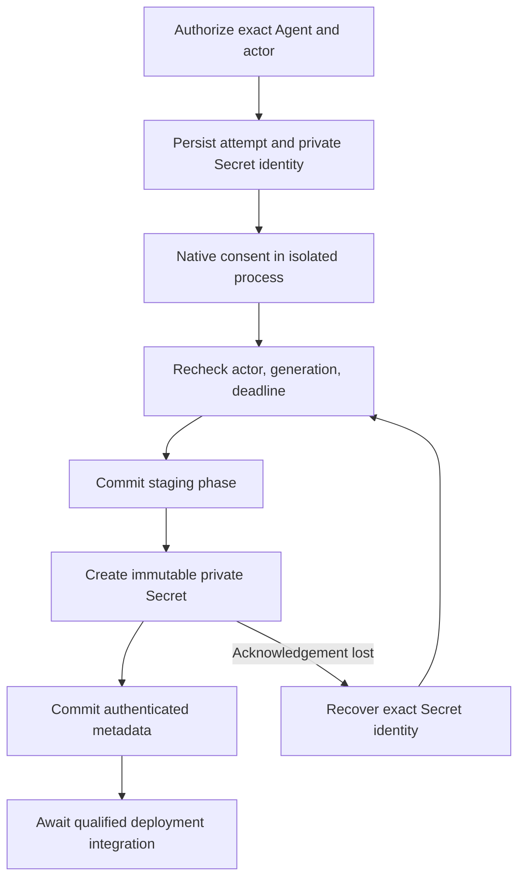

# Agent OAuth Custody Flow

## Overview

OCC retains a completed, provider-qualified OAuth credential for one Agent before
deployment. This implementation supplies internal acquisition and custody
operations and authenticated Agent endpoints. Runtime delivery and image
qualification remain pending; no deployed OAuth runtime is qualified yet.

## Entry Points

- `packages/occ/src/agent-oauth.ts:AgentOAuthCustody` owns generations and custody transitions.
- `apps/controller/src/providers/agent-oauth/acquire.ts:acquireAgentOAuth` connects native acquisition to custody.
- `apps/controller/src/providers/agent-oauth/socket.mjs:createAgentOAuthSocketServer` owns the interactive acquisition connection.

The main catalog owner must choose qualified SDK paths and method metadata.
Requests cannot supply module paths, runtime images, or native state directories.

## Flow

## Execution Trace

### 1. Bind an attempt before consent

`packages/occ/src/agent-oauth.ts:AgentOAuthCustody.begin`

`AgentOAuthCustody.begin` locks the Namespace and Agent, authorizes `administer`,
and compares the caller's expected generation. The database assigns custody to
one Agent, actor, and generation. New attempts preserve the connection identity
and supersede older unfinished attempts. A handoff or active native owner must
be retired before reconnect can replace it.

### 2. Bind interactive input to the authenticated connection

`apps/controller/src/index.ts:createFastifyApp`

The Console opens `/namespaces/:namespaceId/agents/:agentId/oauth/acquire` with
WebSocket subprotocol `occ.agent-oauth.v1`. The upgrade requires the existing human
session cookie, exact configured Origin and Host, and the direct-request admission
boundary. No credentials or callback values appear in the URL. Admission and
subsequent authority checks require Agent `administer` and `operate`.

One `begin` frame supplies `providerConnectionId` and `expectedGeneration`.
The latter is the current OAuth generation, including when the draft setup has
changed; use zero only when status is null. The owner checks the locked draft's
exact `pco` selection and its `operate` grant, then allocates a new `aoc` generation.
No socket resumes an earlier attempt. Reusable setup does not copy authorization.

Private `instructions` frames contain a device URL/code/expiry or a browser URL
with `input: redirect-url`. Browser replies carry the complete redirect URL plus
the exact attempt ID and generation on the same socket. Frames are text JSON,
limited to 16 KiB; redirect input is limited to 8 KiB. Unknown fields, duplicate
begin/input, binary frames, and stale attempt input close acquisition. Native
validation checks callback URI, code, and the original state before exchange.

Normal HTTP `GET .../oauth` returns redacted status or null. `POST
.../oauth/attempts/:attemptId/cancel` takes `connectionId` and `generation` and
requires the initiating actor. These operations work across controller replicas.
Socket disconnect aborts unfinished acquisition; explicit login is required to
retry. Completed authenticated custody survives normal socket completion.
Status reads turn expired unfinished attempts into `reconnect_required`; a
controller crash does not authorize replay or automatic consent.

### 3. Acquire through native APIs

`apps/controller/src/providers/agent-oauth/native-acquisition.mjs:createNativeOAuthAcquisition`

The adapter calls native `runManagedModelsAuthLoginFlow` in a child with a fresh
home and native state directory. Native code owns the device-code and browser
state/PKCE exchanges. Only consent instructions reach the initiating actor's
challenge callback. Child stdout/stderr are discarded. The complete persisted
profile goes privately to custody, then the child and scratch state are removed.
Production composition must provide memory-backed or operator-encrypted scratch
and restart cleanup before enabling this adapter.

### 4. Persist credentials separately from resource metadata

`packages/occ/src/agent-oauth.ts:AgentOAuthCustody.acquisition`

The `agent_oauth_attempts` table contains closed metadata, never credential
bytes. The immutable Secret identity and Driver ID are committed before backend
creation. `KubernetesSecretDriver.stage` uses that identity for deterministic,
immutable creation; an existing object must match ownership and bytes exactly.
Ordinary Secret CRUD does not enumerate this private custody record.

`AgentOAuthCustody.acquisition` checks the persisted provider/profile binding,
actor, generation, phase, and deadline under the Agent lock before staging. It
checks authority again after storage returns. Backend creation holds the Agent
lock so deletion cannot outrun a pending write. The owner then releases that
transaction for session revalidation and acquires a fresh Agent lock before
publishing authenticated status. This avoids nested database connections while
rejecting a revoked session or changed selection before admission. Safe status omits backend locations
and material. `authenticated` means acquired consent; model access is unverified.

### 5. Recover or discard pending custody

`packages/occ/src/agent-oauth.ts:AgentOAuthCustody.recover`

If staging loses its acknowledgment, `acquireAgentOAuth` invokes `recover` for
the same attempt while its initiating socket remains live and authorized. The
owner discovers the exact immutable Secret, releases the transaction for session
verification, then rechecks the current selection, generation, deadline, and
abort signal under a fresh Agent lock before admitting it. It never repeats
consent or returns credential bytes. Cancellation, disconnect, and authority loss
remain terminal; missing material requires reconnect.
Cancellation and supersession reject retained acquisition handles. Cleanup
discovers even unacknowledged Secrets and retains metadata on deletion failure.
Final Agent deletion calls `cleanupAgentOAuthForDeletion` after runtime retirement.
The worker holds the Agent/work transaction and renews its claim through that
transaction while deleting Secrets; custody history is removed only after cleanup.
Stopping an Agent and local cleanup do not revoke upstream authorization.

## Failure Modes

Expired, cancelled, superseded, or unauthorized completions cannot stage material.
Backend errors return stable, material-free errors. Database rollback cannot undo
external creation, so the committed identity remains available for recovery.

The native initializer conditionally inserts under the public SDK transaction,
reopens the profile, and preserves existing rotated credentials. Its caller must
provide current generation/PVC/execution authority at each import. That runtime
fence and the single-refresh-owner deployment flow are not implemented yet.

## Debugging and Verification

Controller conformance covers identity isolation, stale callbacks, redaction,
uncertain creation, and authority loss during backend lookup. PostgreSQL tests
cover constraints and concurrent generation allocation. Child-process tests use
fixture SDK modules; separate native-store tests use the actual locally selected
SDK and simulate persisted rotation. None proves live provider consent, refresh,
model access, or a qualified deployed image. The `native-oauth-store` test lane
requires an explicit native executable until image qualification is complete.

## Related docs

- [Design and recovery contract](../../specs/36-agent-predeployment-oauth.md)
- [Harness execution topology](harness-execution-topology.md)
- [Database entities](../reference/cheatsheets/database-entities.md)

## Manual Notes

[keep this for the user to add notes. do not change between edits]

## Changelog

- 2026-09-23 16:00: Connect lost-ack recovery to the live acquisition owner and preserve cancellation fences. (01a0cc43-d13b-7cb2-ae15-1fd56e61bbf4 - 214d9d41)
- 2026-09-23 12:00: Document exact provider selection, authenticated socket, and replica-independent management. (01a0cc43-d13b-7cb2-ae15-1fd56e61bbf4 - 3c167162)
- 2026-09-23 04:10: Document acquisition and custody boundaries and pending delivery qualification. (01a0cc43-d13b-7cb2-ae15-1fd56e61bbf4 - 2d19d17d)
