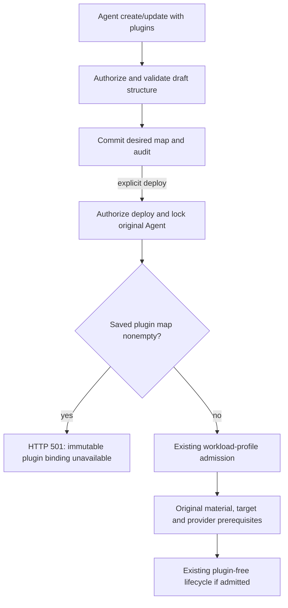

# Agent Plugin Deployment Flow

## Overview

An authorized caller can save an Agent's desired plugin map through Agent
create/update. Current deployment normalization refuses a nonempty map with
HTTP `501`, before Configuration material acquisition, candidate/revision
insertion, or provider workload work. An absent or empty map follows ordinary
plugin-free admission and adds no plugin material to the fixed renderer.

Configured PluginDrivers, internal catalog discovery, and explicit legacy
component startup remain separate implemented components. They do not provide
the immutable plugin artifact and startup-input binding required for current
admitted Kubernetes deployment.

## Entry Points

- [HTTP handlers](../../apps/controller/src/index.ts): existing Agent draft and
  explicit deployment routes; no new plugin installation or inventory route.
- [DeploymentService](../../packages/occ/src/services/deployment/service.ts):
  `deployAgent` / `deployAgentCommand` use the original admission path.
- [Candidate normalizer](../../packages/occ/src/services/deployment/candidate-normalization.ts):
  `createDeploymentCandidateNormalizerV2` owns the current nonempty-plugin refusal.
- [Bundled PluginDrivers](../../apps/controller/src/drivers/plugin/index.ts):
  trusted Installation selection and internal `listCatalog` operations.

## Flow

## Execution Trace

### 1. Save desired state under exact-Agent authority

Agent reads require `read`; create/update use their ordinary permissions and
exact Namespace, Configuration, and ServiceAccount checks. Shared contracts
validate the selection shape. Catalog membership, native app mapping, resolved
release metadata, and native representability are not proved by a draft save.
The successful mutation stores desired state and audit evidence in its original
transaction. It changes neither the reusable Configuration nor active runtime.
On update, omission preserves the map, `{}` clears it, and a nonempty map replaces
it completely.

### 2. Enforce the current deployment boundary

`createDeploymentCandidateNormalizerV2` obtains the exact Namespace and Agent,
authorizes deployment, selects the original Compute dependencies, and locks the
Agent. It checks the locked draft's plugin map before Configuration material
acquisition and normalized candidate publication. Any nonempty map raises
`NotImplementedError("agent_plugins.immutable_profile", ...)`, mapped by
[HTTP error handling](../../apps/controller/src/http/errors.ts) to HTTP `501`,
`NOT_IMPLEMENTED`. Disabled entries count as nonempty.

The rejection leaves the saved draft available. It does not enqueue a plugin
revision to discover support at startup. A configured catalog, empty Driver
configuration, or successful internal native catalog read does not change this
boundary. Absent/empty maps continue through the original admission requirements;
this check alone grants no deployment authority.

### 3. Preserve Compute's independent boundary

[The Kubernetes Compute driver](../../apps/controller/src/drivers/compute/kubernetes/index.ts)
also rejects nonempty retained/replayed revision selections before preparation,
activation, prepared-child verification, or current-launch retrieval can open
provider/launch work. Existing renderer/material/target/full-image-set checks,
immutable ConfigMap ownership, prepared holding, cancellation, and late-work
joins remain authoritative.

[The shared selection helper](../../apps/controller/src/drivers/compute/plugin-runtime.ts)
returns no runtime material for absent or valid empty selections. The original
fixed startup/readiness constants remain unchanged. No plugin ConfigMap, mount,
environment, native config, or new startup script is injected after an accepted
fixed plan.

### 4. Retain explicit legacy components without promoting them to admission

The legacy Docker component can carry an explicit nonempty selection through
bounded runtime environment data and separate plugin-aware startup programs in
[the shared runtime module](../../apps/controller/src/drivers/compute/runtime/runtime-entrypoints.ts).
Its plugin-free path retains its original commands. SSH remains plugin-free
embedded OpenClaw and rejects nonempty selections before host effects.

The retained OpenClaw helper resolves bundled metadata, installs a pinned package,
and checks the native installation and configuration. The Codex helper performs
`plugin/list`, `plugin/read`, configuration, and `plugin/install` operations,
then checks native identity/configuration before its component readiness signal.
Startup-time resolution can select later catalog metadata for the same desired
ID. These are component behaviors, not an immutable material producer or an
admitted Kubernetes installation path. They do not create a public bypass for
the HTTP `501` refusal.

### 5. Interpret status and historical records correctly

A nonempty current draft rejected at admission has no newly admitted plugin
candidate from that request. Existing worker status and historical revision
snapshots retain their own lifecycle meaning. Neither a stored requested map nor
`activeRevisionId` proves installation or readiness. Legacy cutover and native
proof records below describe their original source/runtime context; they are not
current deployment capability claims. See the [controller worker flow](controller-worker.md)
for the original reconciliation behavior.

## Debugging and Verification

- Distinguish a successful draft mutation from the later deployment result.
- For a nonempty saved map, expect the explicit HTTP `501` immutable-binding
  refusal; inspect earlier authorization/ownership errors separately.
- Clear the map to request ordinary plugin-free admission. This does not waive
  material, target, credential, or other deployment prerequisites.
- Test configured catalog and legacy translation components against their own
  interfaces. A passing component test does not qualify admitted Kubernetes plugins.
- Preserve credentials in protected runtime state. Historical native failures or
  successes are not new execution evidence for this composed source.
- The [testing guide](../testing/plugins.md) records fixtures and native proof
  history. Current live admission requires the real immutable plugin binding and
  its integration; no live result is claimed by this documentation change.

## Related docs

- [Agent plugin reference](../reference/agent-plugins.md).
- [PluginDriver selection and limits](../reference/drivers/plugin.md).
- [Controller worker](controller-worker.md).
- [Harness execution topology](harness-execution-topology.md).
- [Deployment guide](../guides/deploy.md).
- [Agent plugin testing](../testing/plugins.md).

## Manual Notes

[keep this for the user to add notes. do not change between edits]

## Changelog

The following dated records retain their historical source, runtime, account,
and proof scope. They do not override the current HTTP `501` admission boundary
or establish that this composed fixed renderer supports nonempty plugins.

- 2026-09-08 16:05: Corrected Codex Linear support to the existing bridge path and kept live local-Kubernetes proof pending (codex/01a08228-c3ec-7ab2-b0c0-74f49a8ec8a7 - 79021fa)
- 2026-09-08 17:02: Recorded current Codex Linear proof boundary: native install/readiness passed, bridge app batch request passed, force-refresh app state showed Linear enabled/callable, and a normal turn invoked Linear `list_teams` before timing out in native `waitingOnApproval` without a result (codex/01a08228-c3ec-7ab2-b0c0-74f49a8ec8a7 - 79021fa)
- 2026-09-08 17:34: Recorded the native diagnostic blocker: direct Linear execution requires app reauthentication, the diagnostic native model turn emitted a Codex Apps URL elicitation that was declined, and normal OCC proof remains pending reconnection and rerun (codex/01a08228-c3ec-7ab2-b0c0-74f49a8ec8a7 - b4fa273)
- 2026-09-08 18:05: User substituted Google Calendar for the required Codex live proof; Calendar curated metadata and normal-turn `list_calendars(max_results:1)` proof remain pending, while Linear remains historical connector evidence (codex/01a08228-c3ec-7ab2-b0c0-74f49a8ec8a7 - b4fa273)
- 2026-09-08 18:12: Verified Google Calendar curated metadata from live Agent cache after native install: `google-calendar@openai-curated-remote` version `1.2.7`, app `connector_947e0d954944416db111db556030eea6`, `required:true`; Calendar normal-turn proof remains pending (codex/01a08228-c3ec-7ab2-b0c0-74f49a8ec8a7 - b4fa273)
- 2026-09-08 15:30: Added opt-in Kubernetes and test-only Docker plugin proof prerequisites without claiming live proof completion (codex/01a08228-c3ec-7ab2-b0c0-74f49a8ec8a7 - 1471b4c)
- 2026-09-08 14:30: Documented plugin admission, the Codex 501 boundary, and serialized OpenClaw replacement (codex/01a082a0-aa05-7af0-af28-5568d12d623f - 1471b4c217e4879a6b430890ac216b2026e9bd46)

- 2026-09-08 18:18: Google Calendar 1.2.7 normal-Agent acceptance passed with the designated service account, matching tool/result evidence, and zero skips (codex/01a08228-c3ec-7ab2-b0c0-74f49a8ec8a7 - ef51e45).
- 2026-09-09 13:39: Updated the flow for Agent-owned plugin maps, full-map replacement, startup catalog resolution, and revision snapshots that freeze requested state rather than native release artifacts (codex/01a08228-c3ec-7ab2-b0c0-74f49a8ec8a7 - 237dd0a).
- 2026-09-09 14:50: Simplified bootstrap and catalog projection, kept native metadata/configuration readiness, and standardized both native plugin proofs on Kubernetes (codex/01a08228-c3ec-7ab2-b0c0-74f49a8ec8a7 - 44f80f2).
- 2026-09-09 15:49: Aligned bootstrap/install ordering, replacement semantics, and pre-commit versus post-commit failure and worker completion with current implementation (codex/01a08228-c3ec-7ab2-b0c0-74f49a8ec8a7 - 08abf9c).

- 2026-09-11: Removed the per-Agent plugin inventory GET and its inferred installation query. Read desired selections from Agent configuration and deployment outcomes from existing revision/status surfaces; native catalog discovery remains available to the PluginDriver. (NOT_IN_SPEC)
