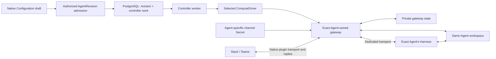

# Channel configuration, mapping, and delivery

This flow describes the current source. The
[channel reference](../reference/channels.md) owns supported limits,
[native configuration](../reference/configuration.md#native-channel-configuration)
owns configuration syntax, and
[manual bindings](../reference/channel-bindings.md) owns administrative mapping.
The independent intake and broker in the
[roadmap](../../specs/22-channel-hosting-roadmap.md) are not part of this flow.

## Native configuration to the gateway

The Teams provider edge below requires a separately reviewed public webhook;
the current native-channel deployment does not provision or verify that path.

1. The authenticated API authorizes the Configuration, Agent, and referenced
   resources. Deployment snapshots the complete admitted native document,
   including [Installation-controlled logging](common-logging.md), in an
   immutable AgentRevision; editing the draft does not mutate an existing revision.
2. The worker claims durable infrastructure work, refreshes authorization,
   and invokes the selected Compute Driver. This is the
   [controller lifecycle](controller-worker.md), not provider event admission.
3. Kubernetes Compute's `enabledChannels` recognizes only `slack` and `msteams`,
   rejects embedded execution with channels, and requires explicit runtime
   channel credentials and proxy configuration. The reviewed network policy
   and gateway-only Secret projections belong to that exact Agent.
4. The gateway runs the native channel plugins supplied by its image. Native
   provider transport and replies stay in that runtime; the dedicated Harness
   does not receive the channel credentials or private gateway claim.
5. Compute observes gateway/Harness readiness and the controller completes the
   applicable revision activation. Readiness is not proof of a live channel
   conversation. Teams also requires its separately reviewed public webhook
   path; the ordinary private gateway route is not that webhook.

Source entry points:

- [Revision lifecycle](../../apps/controller/src/worker.ts) and
  [controller ownership](../../packages/occ/src/index.ts).
- [Kubernetes channel requirements, network, credentials, and claims](../../apps/controller/src/drivers/compute/kubernetes/index.ts).
- [Runtime launch and readiness wrappers](../../apps/controller/src/drivers/compute/runtime/runtime-entrypoints.ts).
- [Native channel draft editor](../../apps/controller/src/console/channels.mjs).
- [Production PostgreSQL composition](../../apps/controller/src/composition/production.ts)
  and [infrastructure work queue](../../packages/occ/src/state/postgres-work-queue.ts).

## Manual binding administration is a separate path

The central API admits caller credentials and validates the declared route
schema before
[`performChannelBindingOperation`](../../apps/controller/src/channels/channel-binding-routes.ts)
dispatches to the
[binding service](../../packages/occ/src/channel-bindings.ts).
Installation administration is required for all binding operations. Creating or
enabling an Agent binding additionally checks the administrator's current exact
Agent `read` and `operate`; a human binding resolves the original issuer/subject
through the selected IAM provider. Successful mutations and audit commit together.

The [binding storage constraints](../../migrations/0016_channel_principal_bindings.sql)
retain unique app, human, and channel ownership. Identity and target fields are
immutable; status changes use an expected version. This path does not accept
provider payloads, install a bot, or dispatch work.

Separately, the internal
[`resolveChannelCandidateBindingsV1`](../../apps/controller/src/channels/channel-principal-bindings.ts)
consumes a normalized receipt, reads exact persisted ownership, re-resolves the
human, checks current Agent permissions, and rereads binding versions after
asynchronous IAM work. It returns a `candidate-mapped` / `mapping-only` result
with observed IDs and versions, not an admission capability. No public
receipt-resolution or channel-ingress endpoint connects these pieces today.

The [receipt helper](../../apps/controller/src/channels/shared-turn-receipt.ts)
does not store history. A future consumer must independently establish verified
delivery, complete live audience and common workspace/repository grants,
conversation/checkpoint ownership, atomic durable admission, runtime authority,
and the Agent mutation fence. A parsed receipt or mapped sender is not enough.

## Recovery boundaries

The gateway's private state and dedicated shared workspace are separate from
controller PostgreSQL. A controller work retry reconciles infrastructure; it
does not replay a missed Slack event or Teams activity. Native plugin custody,
turn adoption, and external reply/tool outcomes depend on the actual upstream
image and must be verified independently.

The current launch wrappers forward the first `SIGTERM` or `SIGINT` to their
direct gateway or Codex child, schedule a `SIGKILL` fallback after eight seconds,
and exit when that child exits. Those handlers, one gateway replica, and `Recreate`
do not establish a tested drain, compatible termination grace, storage fencing,
or rollback protocol. The maintenance acceptance still requires real proof of
shutdown and recovery; these source observations do not demonstrate a runtime
failure or satisfy that gate. See the
[maintenance proposal](../../specs/22-channel-hosting-roadmap.md#maintenance-and-recovery-acceptance).

Use the [deployment guide](../guides/deploy.md),
[channel verification boundaries](../reference/channels.md#verify-and-diagnose),
and [Harness/storage flow](harness-execution-topology.md) to select the real
runtime checks. No diagram edge or source test body certifies provider
delivery, safe cross-version upgrade, or completed shared-Agent release gates.
