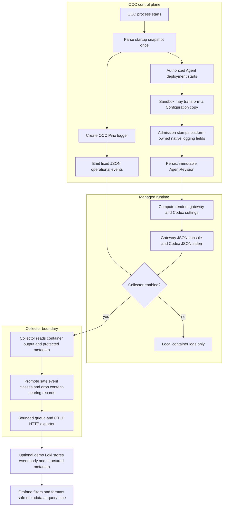

# Common Operational Logging Flow

## Overview

Trusted startup configuration selects the OCC logging level. Authorized Agent
deployment freezes runtime logging in an immutable AgentRevision. Optional
Collectors export reviewed operational records; PostgreSQL audit remains separate
durable evidence.

## Entry Points

- Trigger: start the API, worker, migration, or bootstrap process; deploy an
  Agent; enable the optional Docker Compose or Helm logging Collector.
- Source: `apps/controller/src/composition/installation-config.ts:loadStartupConfigurationSnapshot`
- Source: `packages/occ/src/index.ts:OpenClawController.deployAgent`
- Source: `deploy/helm/openclaw-enterprise/templates/collector.yaml:logging.collector.enabled`
- Assumptions: trusted startup YAML, an authorized deployment request, selected
  Compute Driver support, and operator-owned Collector configuration when remote
  export is enabled.

## Flow

## Execution Trace

### 1. Startup parses one configuration snapshot

`apps/controller/src/composition/installation-config.ts:loadStartupConfigurationSnapshot`

API and worker parse trusted YAML once and pass `startupConfiguration.logging`
into driver composition. Invalid logging configuration fails startup before
requests or work. The [settings reference](../reference/settings.md) owns the YAML
shape and values.

### 2. Processes log fixed sanitized events

`apps/controller/src/server.mjs:start`

Worker (`apps/controller/src/worker.mjs`), bootstrap
(`scripts/bootstrap-installation.mjs`), and migration (`scripts/migrate-production.mjs`)
also create Pino loggers at the selected level. The API disables Fastify request
logging; bootstrap and migration separate success protocol output from structured
failure diagnostics. Before Pino writes, `apps/controller/src/logging.ts:emitOccLogEvent`
retains reviewed scalar fields and drops unapproved fields, credentials, provider
payloads, request/reply objects, and unsafe strings. This source boundary is distinct
from the Collector filter in step 7.

### 3. Admission freezes runtime logging

`packages/occ/src/index.ts:OpenClawController.deployAgent`

If the trusted ComputeDriver declares `runtimeLogging: "driver"`, admission
validates and freezes the native document without rewriting logging fields. The
[Compute contract](../reference/drivers/compute.md#runtime-logging-ownership)
owns that pipeline; OCC logging and audit remain unchanged.

Otherwise, deployment lets the SandboxDriver transform a frozen copy of the
Namespace-owned Configuration, then stamps native logging fields before validation.
The admitted document has matching `logging.level` and `logging.consoleLevel`,
JSON console style, and `diagnostics.otel.logs=false`; it drops the retired
`logging.redactSensitive` key. Runtime code owns console and tool redaction.
The source Configuration is unchanged; the immutable AgentRevision preserves its
admitted policy across restarts and later Configuration edits.

### 4. Compute renders settings from the revision

`apps/controller/src/drivers/compute/docker/index.ts:DockerComputeDriver.prepareRevision`

Kubernetes rendering follows
`apps/controller/src/drivers/compute/kubernetes/index.ts:KubernetesComputeDriver.deployment`.
Both Drivers require consistent admitted logging fields. Kubernetes mounts the
document read-only at `/etc/openclaw/openclaw.json` as immutable startup input.
Gateway uses JSON console logging; dedicated Codex app-servers use JSON stderr
and host-owned arguments disabling OTLP export and prompt logging. Lifecycle
hooks and SecretBindings cannot override those reserved destinations.

### 5. Docker collection is an explicit development override

`apps/controller/src/drivers/compute/docker/index.ts:DockerComputeDriver.prepareRevision`

The optional `compose.logging.yaml` starts a pinned Collector and routes OCC,
gateway, and Codex containers through Docker's nonblocking `fluentd` driver.
Docker Compute sets runtime `LogConfig` from `OCC_DOCKER_LOGGING_ADDRESS`, which
must be reachable from the Engine. See the
[Docker procedure](../guides/observability.md#docker-compose).

### 6. Kubernetes collection is bundled or equivalent

`deploy/helm/openclaw-enterprise/templates/collector.yaml:logging.collector.enabled`

Helm renders a Collector DaemonSet that reads node CRI files and uses Pod metadata
to associate records with managed workloads. The
[Kubernetes observability procedure](../guides/observability.md#kubernetes-and-helm)
owns enablement and existing-Collector reuse; the
[security reference](../reference/security.md#operational-log-collection-boundary)
owns deployment isolation limits.

`k8sattributes` maps identity before `transform/kubernetes-resource` removes
internal Pod labels; removing shared labels per record would lose identity for
later records in the batch.

The chart validates one exporter destination: an IPv4 `/32` or paired
namespace/Pod selectors, with a bounded TCP port. It renders exporter egress
alongside DNS/API access. Empty Collector metrics selectors grant no ingress;
paired selectors admit port 8888. Policies are additive. The independent demo
provides private Loki OTLP export through the same filter.

### 7. Collector exports only operational classes

`deploy/logging/collector.yaml:transform/operational`

The shared Collector policy keeps transport-derived identity before parsing
untrusted JSON. It promotes fixed OCC event names, gateway records from the
`gateway` subsystem, and Codex stderr records from `codex_app_server`; malformed,
oversized, unclassified, content-bearing, and protocol stdout records are
dropped before remote export. Exporter credentials and TLS settings live in
Collector-only configuration. Finite queues and retry limits make operational
logs best-effort, but outage or overflow cannot block API service, worker
reconciliation, or PostgreSQL audit persistence.

### 8. The demo dashboard presents existing metadata

`deploy/helm/openclaw-observability-demo/templates/grafana.yaml:logs.json`

Loki retains event bodies and normalizes attributes as structured metadata.
Grafana formats metadata at query time without changing records. See the
[demo guide](../guides/observability/demo.md#read-and-narrow-operational-logs)
for panels, correlation, and authorization limits.

## Debugging and Verification

- For unexpected process levels, check the startup snapshot; for runtime levels,
  compare the admitted AgentRevision with rendered container settings.
- Use the [observability guide](../guides/observability.md#tests) for delivery,
  Collector metrics, and deployment troubleshooting.
- Packaging and Collector tests prove configuration, filtering, bounded queues,
  and startup boundaries. Select real runtime suites separately for gateway,
  Codex, model-turn, or OpenShell deployment proof.
- If a runtime Pod enters `CrashLoopBackOff` before a model turn with a config
  lock failure under `/etc/openclaw`, inspect the admitted Configuration for
  retired fields before treating the run as a completed case.

## Related docs

- [Settings reference](../reference/settings.md)
- [Security controls](../reference/security.md)
- [Observability guide](../guides/observability.md)
- [Deployment guide](../guides/deploy.md)
- [Common OpenTelemetry logging spec](../../specs/20-common-otel-logging.md)

## Manual Notes

[keep this for the user to add notes. do not change between edits]

## Changelog

- 2026-09-25 11:31: Documented query-time operational summaries and filtering in the accompanying demo dashboard change. (01a0d57b-51eb-7551-874e-38c5b633af76 - 1a458b227585c572ec0ac70fd10efc3834165075)

- 2026-09-23 17:40: Documented private Collector scraping and selected in-cluster export in the accompanying observability change. (authoring-run/8fb2b0ce-9ad1-401c-a9b9-4e3919b5f573 - faf0b0ae467a3bebfd5b5ed0a92f259248e5da74)

- 2026-09-04 21:04: Documented that native logging admission drops the retired redaction key while preserving JSON levels, disabled OTLP logs, runtime redaction ownership and read-only Kubernetes config mounting. (cody/01a06dd0-9fff-7e90-aae3-4e7099a6d154 - 87234e1766e5802b45424523246a52a4b2d45590)

- 2026-09-02 10:42: Added the source-backed common logging flow for startup policy, revision admission, runtime rendering, and Collector export. (cody/01a06333-d27e-7b00-b27d-f4a17262849b - 1242406b6863c8953abe4827c601c2173129ee50)
- 2026-09-03 17:56: Simplified repeated settings and guide detail while preserving the logging lifecycle, admission, Collector filtering, and audit boundaries. (cody/01a05fa0-6720-7f42-891b-c2c0495c8d12 - 61ef68bc61129c90130bb65b0fc48373f0c70866)
