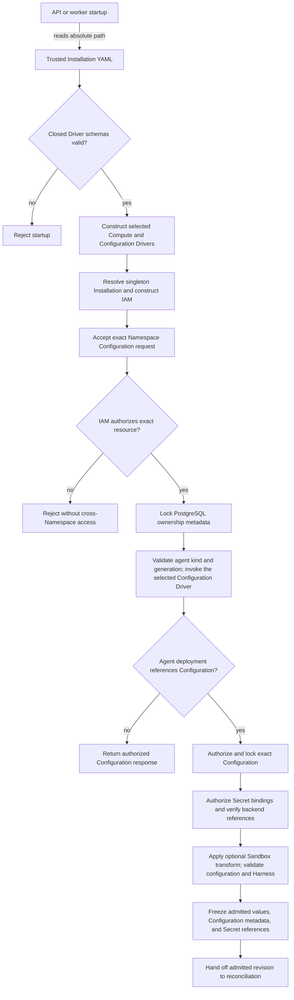

# Configuration Driver and Agent Revision Flow

## Overview

The OCC API and worker load trusted, singleton Installation settings from
startup YAML and validate each selected Driver before construction.
Authenticated API
requests then create, read, replace, or delete exact Namespace-owned native
OpenClaw configuration documents through the selected bundled or installed
Configuration Driver. The bundled Kubernetes implementation persists each
document in a tenant-owned ConfigMap.
Each Configuration requires immutable `kind: "agent"` and a server-managed
generation; documents preserve unresolved inline SecretRefs without interpreting
them. Agent deployment authorizes the separate Secret bindings, applies any
selected Sandbox Driver transformation, and freezes the admitted values into an
immutable AgentRevision. Configuration identity, kind, generation, and Secret
references are recorded separately. This flow stops when OCC persists that
revision and hands off workload reconciliation; the selected Compute Driver
then owns the Agent gateway, while worker execution and secret resolution remain
outside this flow's scope.

## Entry Points

- Startup: [controller server](../../apps/controller/src/server.mjs) and
  [controller worker](../../apps/controller/src/worker.mjs) read the absolute
  `OCC_CONFIG_PATH`; production requires the file, while development may use
  its explicit development defaults.
- Source: `apps/controller/src/composition/installation-config.ts:loadInstallationConfiguration`
  and `packages/occ/src/index.ts:OpenClawController.createConfiguration`.
- Requests: [Configuration routes](../../packages/contracts/src/api/routes.ts)
  accept `POST /namespaces/:namespaceId/configurations` and
  `GET`, `PATCH`, or `DELETE` of
  `/namespaces/:namespaceId/configurations/:configurationId`.
- Assumptions: one persisted Installation, a selected IAM Driver, exact
  Namespace placement, an authorized principal, available PostgreSQL state,
  and the permissions required by the selected Configuration Driver. The
  bundled Kubernetes Driver requires namespaced ConfigMap CRUD permission.

## Flow



## Execution Trace

### 1. Construct the selected Installation Configuration Driver

`apps/controller/src/composition/installation-config.ts:loadInstallationConfiguration`

The API and worker load trusted Installation selections and validate the chosen
Configuration Driver's schema and implementation-owned rules before
constructing its bundled or installed implementation. OCC receives that exact
capability and identity; invalid settings or a mismatched factory reject
startup. Installation settings never come from a Configuration Driver. The
[Driver package loading flow](driver-plugin-loading.md) owns package identity,
validation, trust boundaries, and IAM construction.

### 2. Resolve singleton state and select Drivers

`apps/controller/src/composition/production.ts:composeProduction`

[Production composition](../../apps/controller/src/composition/production.ts)
loads the sole persisted Installation from
[PostgreSQL platform state](../../packages/occ/src/state/postgres-state.ts).
The API and worker load the same trusted startup document and persisted
Installation identity. The [Driver loading flow](driver-plugin-loading.md)
traces process-local construction and the selected Secret, Sandbox, and
ServiceAccount branches. Existing AgentRevisions retain their selected Compute
identity and immutable admitted configuration; subsequent Configuration edits
apply only to later deployments.

### 3. Authorize the exact Namespace Configuration operation

`packages/occ/src/index.ts:OpenClawController.createConfiguration`

[Configuration route contracts](../../packages/contracts/src/api/routes.ts)
are dispatched by the
[controller request handler](../../apps/controller/src/index.ts) to
`OpenClawController.createConfiguration`, `getConfiguration`,
`updateConfiguration`, or `deleteConfiguration` in
[OCC](../../packages/occ/src/index.ts). OCC resolves server-owned Namespace
identity and checks the selected IAM Driver before touching tenant data:
creation targets the exact Namespace-owned Configuration resource; reads,
updates, and deletes target the exact Configuration identifier in that
Namespace. Creation requires `kind: "agent"` and a native root-object JSON
document; omitted or unknown kinds and malformed request shapes fail with
`400`. Updates require the complete replacement `values` document and accept
optional `secretBindings`; `kind`,
`generation`, and ownership are server-owned and cannot be supplied or changed.
OCC preserves nested values and SecretRefs unchanged. Malformed,
generation-mismatched, or ownership-invalid persisted ConfigMaps fail with
`503`.
Authorization denial fails with `403`, a missing exact resource with `404`, an
Agent dependency conflict with `409`, and unavailable IAM or storage with
`503`. OpenClaw resolves inline SecretRefs at runtime; Configuration CRUD
preserves them in `values`. OCC separately authorizes `operate` on each Secret
selected by `secretBindings`, including retained bindings when PATCH omits the
field. Omission preserves bindings; `{}` clears them. The
[Configuration reference](../reference/configuration.md#secret-bindings) owns
the binding contract, and the [Secret flow](secret-storage-and-delivery.md)
traces storage and delivery. Secret Broker substitution remains unimplemented.

### 4. Lock metadata and invoke the selected Configuration Driver

`apps/controller/src/drivers/configuration/kubernetes/index.ts:KubernetesConfigurationDriver.create`

Configuration ownership, immutable `kind: "agent"`, generation, creation time,
normalized Secret bindings, and server-generated `cfg_` identity are persisted by
[PostgreSQL platform state](../../packages/occ/src/state/postgres-state.ts);
the live configuration document is not duplicated into Configuration metadata.
OCC owns API-level native Configuration validation before it calls the selected
bundled or installed Configuration Driver. The Driver owns backing document
storage and checks storage-specific identity and ownership. When the bundled
Kubernetes implementation is selected, `KubernetesConfigurationDriver` in
[the Kubernetes Configuration implementation](../../apps/controller/src/drivers/configuration/kubernetes/index.ts)
validates its storage envelope, discovers its exact tenant-labeled Kubernetes
namespace using the existing cluster-scoped namespace-observer `get`/`list`
grant, and derives its deterministic ConfigMap name. For an externally owned
namespace explicitly selected by `existingNamespace`, the Compute worker first
binds its tenant identity during provisioning; Configuration creation returns
`409` until that explicitly external platform Namespace is `ready`. It then
checks object
ownership labels, kind/generation annotations, and creation time. Each ConfigMap
has exactly one data entry: `openclaw.json`, containing the serialized native
configuration document and its unresolved inline SecretRefs. Kubernetes driver
reads reject malformed stored objects, extra entries, and oversized documents.
Create calls
`createNamespacedConfigMap`, read calls `readNamespacedConfigMap`, replace calls
`replaceNamespacedConfigMap` with the observed `resourceVersion`, and delete
calls `deleteNamespacedConfigMap` with the observed object identity when
available. Creation starts at generation `1`; each successful PATCH replaces
the entire native document and advances the generation exactly once. Metadata
and ConfigMap updates share OCC's existing transactional/compensating boundary.
A referenced Configuration cannot be deleted. Tenant child-data access remains
limited to namespaced ConfigMap `create`, `get`, `update`, and `delete`;
Kubernetes cannot restrict `create` by `resourceNames`, so that verb must use
its own namespaced Role rule. ConfigMap `list`/`watch`, Secrets, Pods, and
cluster-wide tenant-resource access remain unavailable.

Startup validates the bundled Kubernetes Configuration Driver's authentication
configuration but does not probe tenant ConfigMaps or ConfigMap RBAC. Its first
exact CRUD call checks actual tenant namespace existence and authorization; a
driver-managed provisioning Namespace can return `503` until its Kubernetes
namespace and API RoleBinding are ready. Explicitly selected external Namespaces
instead reject Configuration creation with `409` before readiness; after
readiness, a missing API RoleBinding returns `503`. The development filesystem
Driver persists OCC-validated
documents under the configured root and checks only server-generated file
ownership. Installed implementations validate and use their own backing-storage
prerequisites.

### 5. Resolve the Agent reference and freeze an immutable revision

`packages/occ/src/index.ts:OpenClawController.deployAgent`

`createAgent` and `updateAgent` in
[OCC](../../packages/occ/src/index.ts) separately authorize and verify the
Agent's exact same-Namespace `configurationId` and ensure its Configuration kind
is `"agent"`. `deployAgent` then locks the Agent, authorizes a read of the
referenced Configuration, and locks its ownership metadata. It authorizes the
caller's selected Secret bindings and the Agent service principal's consumption,
checks topology/model-source compatibility, and asks the selected Secret Driver
to verify each backend reference. This resolves backend identity, not credential
bytes or inline SecretRefs.

Next OCC reads the selected Configuration Driver's stored document. For the
bundled Kubernetes Driver, that document is the `openclaw.json` ConfigMap entry.
When the selected Sandbox Driver exposes `configureAgent`, OCC transforms a
frozen copy before Configuration Driver validation and Harness selection. The
stored reusable Configuration and its generation remain unchanged. OCC freezes
the admitted values, including any remaining inline unresolved SecretRefs, into
`AgentRevision.configuration`; separate `configurationId`, `configurationKind`,
and `configurationGeneration` fields pin the selected Configuration metadata.
The revision also pins the selected OpenClaw or Codex Harness descriptor,
execution mode, Compute identity, optional Sandbox identity, Agent service
principal, saved `maximumExecutionMs`, and any selected Secret Driver identity
and normalized bindings. The execution cap is an Agent setting, separate from
the native Configuration document. Creation omission selects `null` (uncapped);
Agent PATCH omission preserves its saved value. The identified deployment
command must match that value in `expectedDraft.maximumExecutionMs`, and each
newly admitted revision records the explicit finite-or-null snapshot. A later
draft edit does not change an existing revision or execution selection. See
[execution duration selection](../reference/agents.md#execution-duration-selection)
for the current configuration contract and its runtime boundary.
Backend locators and value bytes are not stored in the revision. Subsequent nested
Configuration edits increment its generation but affect only later explicit
deployments; historical revisions and their admitted snapshots remain unchanged.
PostgreSQL enforces the supported kind, positive generation, exact admitted
snapshot shape, ownership, and revision immutability. OCC records an
attributable sanitized admission event and hands the immutable revision to
Compute-owned reconciliation without resolving credential bytes or starting a
gateway during HTTP admission. A development worker can subsequently create or
reuse exactly one gateway for the owning Agent during revision preparation.
When Kubernetes Compute owns that gateway, it creates a distinct immutable,
Agent-owned ConfigMap from the admitted configuration and mounts it
read-only at `OPENCLAW_CONFIG_PATH=/etc/openclaw/openclaw.json`. It never mounts
the mutable Configuration Driver ConfigMap; each changed admitted generation
selects a new immutable snapshot and rolls the stable Agent gateway. Previous
snapshots remain until Namespace deletion because earlier Pods may still mount
them; safe earlier cleanup is deferred. Production workers also reconcile
embedded OpenClaw and dedicated Codex Agent revisions, connecting each
Agent-owned gateway only to its own active workload.

## Debugging and Verification

Run focused Configuration conformance and integration checks:

```bash
node --test tests/conformance/configuration-occ.test.mjs tests/conformance/kubernetes-configuration.test.mjs
node --test tests/integration/configuration-controller.test.mjs tests/integration/postgres-platform-state.test.mjs
```

PostgreSQL integration requires configured database URLs; skipped cases do not
prove live persistence. Live ConfigMap and least-privilege RBAC proof requires
a disposable Kubernetes cluster and tenant credentials; client fixtures do not
replace that evidence. Startup emits structured
`startup-error` or `worker.startup-error` events for invalid YAML and
unavailable dependencies. Verify missing or unknown kinds are rejected,
creation starts at generation `1`, updates advance it once without permitting a
kind change, requests preserve the exact native document and inline references,
and ConfigMaps store exactly one `openclaw.json` entry. Verify denials against
exact Namespace and Configuration identity. Prove snapshot safety by changing
a nested Configuration value after deployment and confirming the prior
AgentRevision's native document, Configuration identity, kind, and generation
remain unchanged while a later deployment observes the new generation. Verify
same-Namespace Agents receive separate gateways only when an eligible
development worker prepares their revisions. Kubernetes conformance verifies
immutable Agent-owned configuration projection without a live cluster;
dedicated-cluster coverage of the changed projection remains unverified when
its optional integration is skipped.

## Related docs

- [Installation Driver package loading flow](driver-plugin-loading.md)
- [Configuration Driver guide](../reference/configuration.md)
- [Controller and startup configuration](../reference/settings.md)
- [Controller lifecycle](../reference/controller.md)
- [Agent lifecycle](../reference/agents.md)
- [Kubernetes Compute Driver](../reference/drivers/kubernetes-compute.md)
- [Configuration Driver implementation specification](../../specs/.archive/03-configuration-driver.md)
- [OpenClaw-native Configuration specification](../../specs/.archive/05-openclaw-native-configuration.md)
- [Configuration kind and Agent-owned gateway specification](../../specs/.archive/06-configuration-kind.md)

## Manual Notes

[keep this for the user to add notes. do not change between edits]

## Changelog

- 2026-09-01 19:09: Trace Secret-binding admission and optional Sandbox transformation before immutable revision creation; remove the obsolete TODO link. (01a05f95-dd80-7011-990f-d1c46b5bb3cc - aa366c49c44834d59f74994c5fd37fb8096f169f)
- 2026-08-28 17:58: Updated moved feature-reference links for the documentation organization. (01a036f4-cf1d-7cc1-bbc1-000879038ac8 - 4270aa29b7015562049f46c6027962fd85b584a9)
- 2026-08-27 00:05: Removed stale contract-suite commands and kept production-behavior conformance and integration verification. (01a036f4-cf1d-7cc1-bbc1-000879038ac8 - ab560806dbd945436835ab092ebd10bf3e50d942)
- 2026-08-25 08:46: Clarified API-level Configuration validation and development filesystem Driver persistence boundaries. (01a03630-cd9f-7352-9e64-1d30de98c7dd - 949e57ba008486c7ad60978df79dc53cce31bee9)
- 2026-08-21 20:53: Combined duplicate Configuration startup phases and narrowed verification to capability-specific tests and explicit infrastructure prerequisites. (01a0269c-0551-7f01-9dfc-ffb2a0896c94 - f6491502262d6190c95d2a910ee46283c30244f9)
- 2026-08-21 20:05: Kept the trace focused on Configuration ownership and linked the canonical Driver startup flow. (01a0269c-0551-7f01-9dfc-ffb2a0896c94 - b651c4ae38310032f8cda47c868a9b282fb12ff3)
- 2026-08-21 19:28: Clarified production package-backed IAM, Compute, and Configuration startup plus state-aware persisted IAM authorization refresh. (01a0269c-0551-7f01-9dfc-ffb2a0896c94 - a45b01d258c6a6b10db2301cad3303e2fa520f09)
- 2026-08-21 17:28: Updated Configuration Driver initialization to the single asynchronous Installation-and-Drivers startup path. (01a0269c-0551-7f01-9dfc-ffb2a0896c94 - d17a87541cbebc8e333bd00bd90c42e734d91a80)
- 2026-08-21 16:24: Clarified that production configuration reconciliation supports both embedded OpenClaw and dedicated Codex. (01a0259c-c825-71c3-8092-eb2afb161355 - 1379b0f500317e7f32559c711e31378eb22a8072)
- 2026-08-20 22:43: Documented immutable Agent-owned Kubernetes configuration mounts and deferred snapshot cleanup; clarified that Secret Broker credential resolution and current-head live-cluster proof are unavailable. (01a02141-dc9e-7242-8a4f-0c74e14eebd5 - fb2be5b5b514f29669bd62aaac70d7c835de68d0)
- 2026-08-20 22:26: Documented immutable Agent Configuration kind, monotonic generations, separate immutable revision metadata, exact-resource authorization, and Compute-owned per-Agent gateway handoff. (01a02141-dc9e-7242-8a4f-0c74e14eebd5 - fb2be5b5b514f29669bd62aaac70d7c835de68d0)
- 2026-08-20 19:03: Removed duplicate OpenClaw credential validation; OCC preserves native JSON while OpenClaw and SecretBroker own configuration and secret semantics. (01a01add-3345-76a2-8bf2-221bf4075636 - ba62d21b422da3175ce0035162b05c19323c95e1)
- 2026-08-20 18:37: Documented native OpenClaw configuration documents, inline unresolved SecretRefs, centralized credential validation, single-entry ConfigMaps, and deeply immutable revision snapshots. (01a01add-3345-76a2-8bf2-221bf4075636 - 2a82234a9214da410e75f94c07cd29aa165a6fa1)
- 2026-08-19 15:12: Documented singleton startup configuration, Driver schemas, exact Namespace ConfigMap CRUD, and immutable AgentRevision admission. (01a01b65-5e90-78f0-b899-ce53454884c6 - 1e048452d44be143677c4a2b83c959979126846c)
- 2026-08-19 15:24: Clarified lazy ConfigMap authorization and unavailable live-cluster proof. (01a01b65-5e90-78f0-b899-ce53454884c6 - 1e048452d44be143677c4a2b83c959979126846c)
- 2026-08-19 16:19: Simplified runtime Driver selection and tracked revision stability across Compute configuration changes as future work. (01a01b65-5e90-78f0-b899-ce53454884c6 - 0e8413ee880a21a2db9b83cbf952f6d565378d67)
