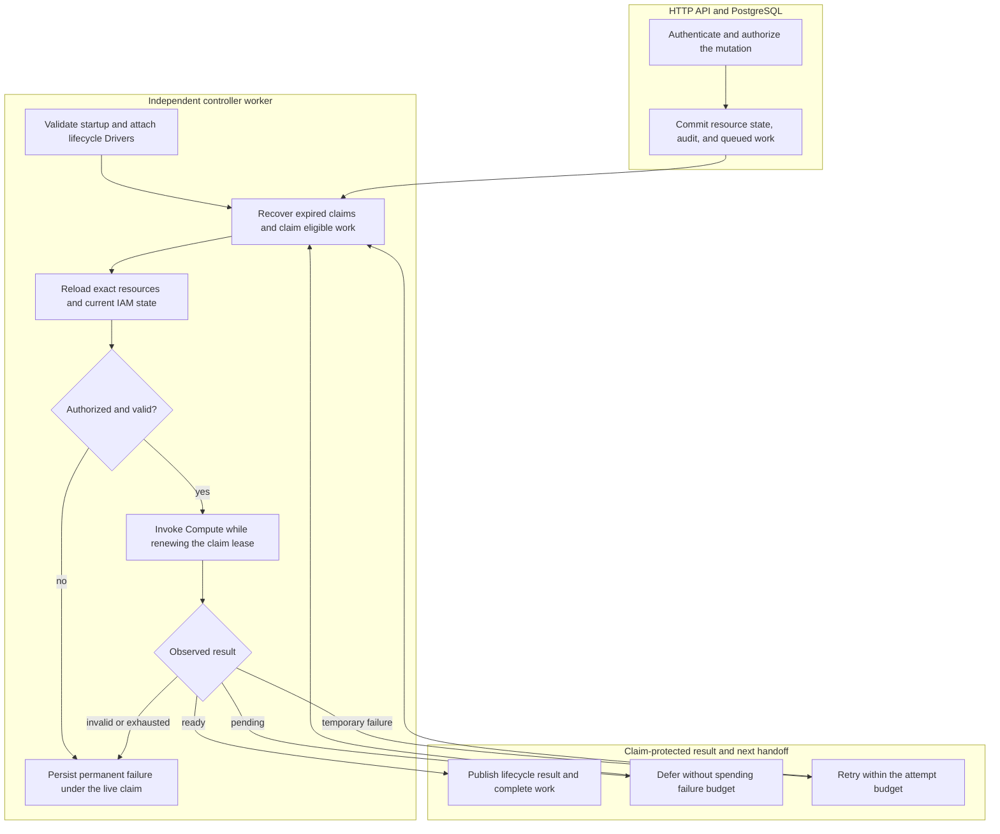

# Controller Worker Flow

## Overview

The controller worker turns accepted OCC operations into infrastructure changes.
The HTTP API commits resource state and work in PostgreSQL; a separate worker
process claims the work, rechecks the original actor's current authorization,
invokes the selected Compute Driver, and persists the observed result while it
still owns the claim. This trace starts at worker initialization and follows one
accepted Namespace or AgentRevision operation through completion, deferral,
retry, or permanent failure.

The [controller reference](../reference/controller.md) owns the reconciliation
contract. The [deployment guide](../guides/deploy.md) owns process setup for
both development and production. Driver-specific runtime creation continues in
the adjacent flows linked below.

## Entry Points

- Trigger: Compose or Helm starts `apps/controller/src/worker.mjs`; an
  authenticated API mutation commits Namespace or AgentRevision work.
- Source: `apps/controller/src/worker.mjs:configuration`,
  `apps/controller/src/worker.ts:ControllerWorker.start`, and
  `packages/occ/src/state/postgres-state.ts:operations.append`.
- Assumptions: The database is initialized and contains the singleton
  Installation; the API and worker use the same application-role database and
  selected Driver identities. Production supplies trusted Installation YAML.
  Each work record carries its original actor and exact resource ownership.

## Flow

## Execution Trace

### 1. Initialize the independent worker process

`apps/controller/src/worker.mjs:configuration`,
`apps/controller/src/worker.ts:ControllerWorker.start`

The [entrypoint](../../apps/controller/src/worker.mjs) requires development or
production mode, a PostgreSQL URL, and positive worker timing values. It removes
an old readiness marker, loads trusted startup configuration, opens its own
application-role connection pool, and constructs `ControllerWorker`.
Development without `OCC_CONFIG_PATH` selects and preflights the Docker Compute
Driver. Production requires explicit startup configuration.

`start()` loads the already-bootstrapped Installation, validates persisted native
IAM state, and attaches selected Configuration, Sandbox, and IAM lifecycle hooks
to Compute. Shared startup composition supplies the optional Sandbox Driver to
the bundled Kubernetes Compute Driver. A selected hook requires Compute to
support `setLifecycleDrivers`; invalid or unavailable selected capabilities stop
startup. Production then runs Compute preflight before emitting `worker.started`
and starting `run()`.

The exported worker records its single start attempt before any startup await.
Concurrent or repeated starts reject. A stop during startup joins the current
stage and suppresses later startup stages, dispatch, and `worker.started`.
All stop callers share one promise that joins startup, the loop, and the state's
supplied pool-close capability. Startup errors remain with the start caller;
shutdown still cleans up. A stopped instance cannot restart. The ordinary
entrypoint already awaits startup sequentially.

The worker has no HTTP listener, Better Auth session service, or provider-admin
client. Compose and Helm keep it separate from the API process. See the
[development](docker-compose-development.md) and
[production](production-startup.md) startup flows for their input boundaries.

### 2. Commit API admission and the durable work record

`apps/controller/src/index.ts:perform`,
`packages/occ/src/index.ts:OpenClawController`,
`packages/occ/src/state/postgres-state.ts:operations.append`

The API authenticates and authorizes the caller before invoking controller
operations such as `createNamespace`, `deleteNamespace`, or `deployAgent`.
Within the PostgreSQL transaction, `operations.append` verifies exact ownership
and maps the accepted operation to `PostgresWorkQueue.enqueue`. The state,
admission audit, and queue entry commit together; a rollback does not leave
orphan work for the worker.

For deploy, the API retains a UUID transition locator and its sanitized request
ID before opening the transaction. Canonical `deployAgent` checks the stored
runtime intent under the Agent lock, rejects a disabled or stopped head, and
initializes or advances a running intent selecting the newly frozen revision.
It appends the trusted success audit, immutable original admission association,
and mandatory original work in that same unit, including direct domain callers
that disable unrelated operation recording. A lost COMMIT acknowledgement is
resolved through a fresh exact scoped read of that locator, retained revision,
original work, and success audit. Work completion and later head advancement do
not erase the committed admission. Missing proof remains unavailable.

The queue record freezes the original actor, Namespace owner, lifecycle target,
and, for revision work, exact Agent and immutable AgentRevision. Its idempotency
key identifies the operation. Reusing that key with a different actor, owner, or
target is rejected. The API returns accepted lifecycle state without waiting for
Compute; the next owner is the independent worker.

New revision work also freezes a paired runtime transition and lifecycle
generation. Enqueue and database ownership constraints reject changing, adding,
or removing this pair on replay, including removal to NULL; terminal replay
retains its terminal state. Namespace work and genuinely historical revision
work have neither field.

### 3. Recover expired claims and claim one eligible operation

`apps/controller/src/worker.ts:ControllerWorker.run`,
`packages/occ/src/state/postgres-work-queue.ts:PostgresWorkQueue.claim`

Each loop first calls `recoverStale()`, then `claim()`. The
[PostgreSQL queue](../../packages/occ/src/state/postgres-work-queue.ts) selects
eligible queued work with `FOR UPDATE SKIP LOCKED`, assigns a fresh claim token
and lease deadline, and increments the attempt count. Another live claim for
the same Agent, or the Namespace for Namespace work, prevents concurrent
ownership of that target.

No available item leads to a bounded idle delay. After processing or during idle
polling, `health()` queries pending work, refreshes the private readiness marker
through `onHealthy`, and emits `worker.health`. The marker therefore records a
successful real queue-health observation, not merely a running process.

### 4. Reload ownership and reauthorize before infrastructure effects

`apps/controller/src/worker.ts:ControllerWorker.process`,
`apps/controller/src/worker.ts:ControllerWorker.processRevision`,
`apps/controller/src/worker.ts:ControllerWorker.authorizeRevision`

Namespace work reloads its exact resource and expected `provisioning` or
`deleting` status. Work whose target has already changed completes as
`SUPERSEDED_TARGET`. Otherwise `authorize()` reloads IAM state and checks the
original actor. Provisioning also checks restrictions on the exact Namespace;
placement into an existing Kubernetes namespace requires Installation
administration permission again.

Revision work reloads its Namespace, Agent, admitted revision, and current active
revision. `processRevision()` rejects mismatched owners, an unready Namespace,
an invalid Agent Principal, a changed Harness descriptor, or a different Compute
Driver identity. `authorizeRevision()` checks current `deploy` permission and,
when a ServiceAccount snapshot is present, current `read` permission for that
exact ServiceAccount. Admission-time permission does not substitute for these
checks. The worker then resolves the revision's frozen Provider metadata and
rechecks any managed credential's exact Provider, Driver, workspace, and issued
account binding before Compute effects. It uses a read-only projection and has
no Provider client or admin key. The
[Provider-managed credential delivery flow](service-account-driver-credential-delivery.md) owns these checks.

Before `bindAgent` or another running revision effect, `RevisionReconciler`
checks the exact revision's original admission and retained intent, including its
Installation, Namespace, Agent, revision, initiating actor and recorded pair.
`WorkerRevisionCurrentness` then reads that association against a fresh running
intent head around renewal and effect waits. A stopped, disabled or later
same-revision generation cannot reuse the original work. Both-null work fields
retain historical behavior only when both the original admission and current
lineage are absent. Missing required correspondence suppresses effects; the
current head never relabels old work or supplies account or provider authority.
Maintenance retains the validated original pair and must pass the same fresh
currentness checks before running or publishing another observation.

Revoked actors and denied operations become permanent results before runtime
creation. A revision older than the current active revision completes as
superseded; an already-active revision enters finalization or maintenance rather
than changing the active pointer again.

### 5. Invoke Compute while renewing the live claim

`apps/controller/src/worker.ts:ControllerWorker.observe`,
`apps/controller/src/worker.ts:ControllerWorker.observeRevision`,
`apps/controller/src/worker/leased-effect.ts:LeasedEffects.runRevision`

Namespace dispatch calls `ensureNamespace` or `deleteNamespace`. Revision
dispatch optionally binds the exact Agent, then calls `prepareRevision` with its
immutable snapshot. The worker validates the returned observation's owner and
shape before treating it as ready. A pending observation defers convergence;
an invalid observation fails permanently.

`LeasedEffects.runRevision()` requires the original currentness reader, renews
the exact claim before each effect and roughly every third of the lease while
it runs, and carries the worker's abort signal into Compute. It checks fresh
currentness before and after renewal and after effect waits. The nested
preparation-to-activation or deactivation check also reads the same wrapper's
first-failure latch, so a late provider return cannot start a second stage after
observed claim loss. Pending heartbeats and the provider call are joined before
the wrapper returns. `WorkClaimLostError` retains claim-loss classification;
`WorkerRevisionCurrentnessLostError` denies stale running work separately.
Namespace effects and exact legacy retirement retain their existing leased
path. These observations do not prove an already-started external effect stopped
or authorize replay of an uncertain operation.

Compute owns infrastructure dispatch, including delegation to a configured
Sandbox Driver. For example, the
[Kubernetes implementation](../../apps/controller/src/drivers/compute/kubernetes/index.ts)
uses its selected Sandbox Driver for Namespace setup, Harness provisioning, and
cleanup. The worker does not independently create sandbox resources or bypass
Compute ownership. Docker dispatch continues in the
[Docker Compose development flow](docker-compose-development.md).

The bundled [OpenShell Sandbox Driver](../reference/drivers/openshell-sandbox.md)
invokes the Go `oce-runtime-security` executable through a bounded subprocess
adapter. The native gateway client verifies the create response and then reads back the
Sandbox with `GetSandbox`. The name, workspace, caller-owned metadata and
normalized launch specification must match, and the provider ID must stay
stable across successful create/readback. A duplicate or uncertain create
permits one matching readback; an absent or conflicting record remains a
failure. This verifies persisted launch intent, not a live Pod, guest identity
or effective supervisor policy. Cancellation is rechecked after connection and
credential setup so a lost claim cannot submit a new RPC during those waits.

### 6. Persist the result and finish revision activation

`apps/controller/src/worker.ts:ControllerWorker.finalize`,
`apps/controller/src/worker/finalization.ts:WorkerFinalization.finalizeRevision`,
`apps/controller/src/worker/finalization.ts:WorkerFinalization.completeActivatedRevision`

Finalization uses the original `transactWithQueue()` with explicit READ
COMMITTED isolation. Revision success and active-maintenance publication lock
Namespace, then Agent, renew the original claim, and read the original
admission, retained intent and current head on that same transaction before
CAS, audit or queue publication. The parent locks retain this correspondence
through the transaction terminal; no lock is held across Compute. Namespace
success retains its existing provisioning/deletion transitions, lifecycle
evidence and atomic queue completion. Failed provisioning and incomplete
deletion keep their existing outcomes.

Revision activation crosses a separate infrastructure boundary. Once preparation
is ready, a Driver selecting `activationOrder: beforeCommit` activates before
the database pointer changes. Otherwise production activation runs after the
claim-protected compare-and-set of `Agent.activeRevisionId`; the first dedicated
revision is staged inactive until that commit. A changed active pointer causes
`ACTIVE_REVISION_CHANGED` and retry instead of overwriting a concurrent result.

After the pointer commit, the worker finishes required activation through the
currentness-aware effect path and separately retires the exact predecessor.
`completeActivatedRevision()` repeats the Namespace, Agent, claim and fresh
intent checks in the second original transaction before activation evidence,
queue completion or maintenance publication. A head change during cleanup
prevents that successful publication. The first pointer commit and external
effects may already have happened: this does not make infrastructure and database
state atomic, establish durable exact cleanup acceptance, or grant uncertain
replay. Existing retry/maintenance handling remains for dependency failures;
currentness loss does not invent a new durable terminal outcome.

### 7. Defer, retry, or stop and hand off the next iteration

`apps/controller/src/worker.ts:ControllerWorker.finalizeActiveRevision`,
`packages/occ/src/state/postgres-work-queue.ts:PostgresWorkQueue.defer`,
`packages/occ/src/state/postgres-work-queue.ts:PostgresWorkQueue.retry`

Pending convergence returns work to the queue with backoff and restores the
attempt consumed by the claim. Real dependency failures retain that attempt and
retry within the configured budget. Permanent failures, exhausted attempts, and
the convergence deadline produce terminal failure instead. See the
[controller reference](../reference/controller.md) for the supported outcomes
and the [settings reference](../reference/settings.md#controller-worker-environment)
for their timing controls.

If Compute declares a maintenance interval, successful activation schedules
another exact-revision observation. An incomplete active-runtime maintenance
observation closes the current bounded item and schedules a new one so that a
provider outage does not abandon reconciliation of an authorized active runtime.
Each new claim reauthorizes its original actor.

`worker.completed` reports the applied queue outcome and code only after the
owning transaction commits. An active-revision conflict reports
`ACTIVE_REVISION_CHANGED` with `retry`, or `permanent` when the attempt budget
is exhausted. A failed transaction or lost claim emits no completion. Revision
activation success is reported only after cleanup and the observation transaction
complete. Maintenance reports the current item's completion or permanent failure,
even when a failed item schedules another observation. Polling then continues.
Lease loss is reported as `worker.error` with `CLAIM_LOST` rather than publishing
stale lifecycle state. On `SIGTERM` or `SIGINT`, shutdown removes readiness,
aborts in-flight work, waits for the loop, closes PostgreSQL, and emits
`worker.stopped`. Expired unfinished claims are recoverable by a later worker.

## Debugging and Verification

- `worker.started` identifies the selected `computeDriverId` and optional
  `sandboxDriverId`. `worker.health` with `status: ready` reports a successful
  pending-work query. Neither event proves an Agent model turn.
- `worker.startup-error` precedes processing when the mode, database,
  Installation, Driver selection, or preflight is invalid. The worker has no
  HTTP health endpoint; packaged probes inspect the private readiness marker.
- When accepted operations stay queued, compare the API and worker database and
  Installation configuration, then inspect `worker.completed` outcomes and
  `worker.error`. `ACTOR_REVOKED` and `AUTHORIZATION_DENIED` require checking
  current IAM state; `DEPENDENCY_UNAVAILABLE` identifies retryable dispatch
  failure; `CLAIM_LOST` means the worker no longer owns publication.
- [PostgreSQL worker revision tests](../../tests/integration/postgres-worker-agent-revision.test.mjs)
  and [stale-claim tests](../../tests/integration/postgres-worker-stale-claim.test.mjs)
  exercise durable dispatch and claim ownership with their explicit PostgreSQL
  prerequisites. They do not replace a real deployed Harness/model-turn check.
- [Sandbox startup tests](../../tests/integration/sandbox-driver-startup.test.mjs)
  check composition boundaries; real Sandbox infrastructure verification belongs
  to [the explicit k3d integration](../../tests/integration/sandbox-driver-openshell-k3d-real.test.mjs).

## Related docs

- [Provider-managed credential delivery](service-account-driver-credential-delivery.md)

- [Controller reference](../reference/controller.md)
- [Deployment guide: development and production](../guides/deploy.md)
- [Controller settings](../reference/settings.md)
- [IAM authorization](../reference/authorization.md)
- [Docker development flow](docker-compose-development.md)
- [Production startup flow](production-startup.md)
- [Docker Compose development flow](docker-compose-development.md)
- [Harness execution topology](harness-execution-topology.md)
- [Compute Driver contract](../reference/drivers/compute.md)
- [Sandbox Driver contract](../reference/drivers/sandbox.md)

## Manual Notes

[keep this for the user to add notes. do not change between edits]

## Changelog

- 2026-09-01 19:09: Preserve providerless API-key execution and document Provider metadata checks before workload effects. (01a05d97-f2b0-71d0-bfc3-01ee7d6d58f9 - b079c4b755ef336a9c65bb4eb737e3aedbfdaa7d) (01a05f95-dd80-7011-990f-d1c46b5bb3cc - aa366c49c44834d59f74994c5fd37fb8096f169f)
- 2026-08-28 17:56: Converted the worker overview into a source-ordered execution trace covering startup, admission, lease ownership, current authorization, Compute and Sandbox delegation, activation, and retry. (01a036f4-cf1d-7cc1-bbc1-000879038ac8 - 4270aa29b7015562049f46c6027962fd85b584a9)
