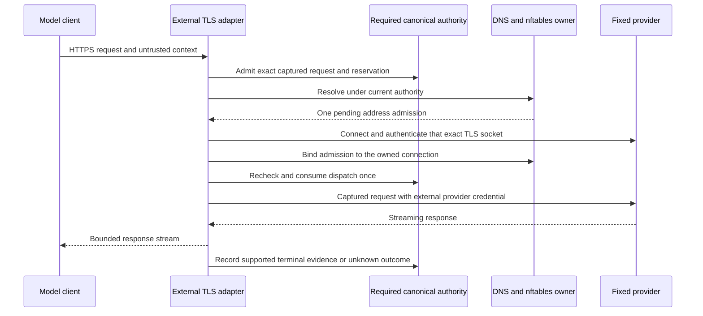

# External model egress adapter flow

The `oce-egress` and `oce-dnsgate` executables implement the transport and network
parts of external model credential custody. They are development components. The
canonical authority service, protected workload binding, admitted-turn integration,
and durable grant store are required dependencies that are not supplied by these
executables. No existing controller or HarnessDriver invokes this path.

This page traces the adapter source. It does not establish an available delegated
model operation. See the [egress reference](../reference/egress.md) for configuration
and verification limits, the [delegation reference](../reference/delegation.md) for
the current library boundary, and [deployment](../guides/deploy.md) for supported
installation procedures.

The main implementation is the
[TLS connection engine](../../dataplane/services/ds-tlsproxy/src/oce_egress/engine.rs)
and the [DNS service](../../dataplane/services/ds-dnsgate/src/oce/mod.rs), with the
[DNS kernel adapter](../../dataplane/services/ds-dnsgate/src/oce/kernel.rs) owning
namespace enforcement.

## Startup

The DNS executable validates its explicit UID/capability profile and exclusively
creates its owned default-deny nftables table. It exposes its protected Unix
socket after enforcement initialization. Readiness additionally requires a fresh
positive response from the actual authority. A missing authority denies readiness.

The TLS executable loads the selected configuration and TLS material, validates
the complete provider credential descriptor, and checks both authority and DNS
readiness before opening its listener. `--check-config` checks configuration and
TLS loading without reading the provider credential or contacting dependencies.
The local helper uses these real executables; it does not supply an authority
fixture.

## Implemented request sequence

The following sequence requires successful responses from the separately owned
canonical authority. A caller's bearer or opaque turn reference is untrusted
input; forwarding it over an authenticated service socket does not establish the
protected workload, original turn, or current assignment.

The TLS adapter captures the first request through Hyper HTTP/1 with a 16 MiB
body ceiling. It rejects an excessive declared length before reading the body and
reserves the declared length once. Each received chunk is checked against that
declaration and the ceiling. It checks the fixed route, parsed security headers,
JSON framing, and selected client-tool categories. The parsed tree is dropped
after field validation; hashing and forwarding retain the original bytes.
Synchronous validation must finish within the same five-second acquisition
window before its socket guard is removed or authority work begins.

Canonical authority must apply the complete typed request profile to those same
immutable bytes. The adapter generates one reservation and moves the captured
owner into its joined admission worker. A typed borrowed envelope is measured
and serialized into one frame, capped at 32 MiB + 64 KiB of payload plus its
four-byte prefix. Encoding must finish within the original one-second RPC
deadline before the Unix connection opens. Ordinary RPC and DNS bounds remain
smaller; see [request and admission bounds](../reference/egress.md#request-and-admission-bounds)
for receiver compatibility and memory limits. The worker records a known
admission before returning ownership, including when the downstream future has
been cancelled. The adapter does not generate another reservation or retry the
provider when a result is ambiguous.

DNS uses the DS resolver and address policy, then installs a short pending endpoint
lease. TLS connects directly to that numeric address and authenticates the fixed
hostname on the same socket. It consumes the pending admission into a flow before
reading the selected provider credential. No second resolver, redirect, pooled
connection, or reconnect participates in this sequence.

A separate acknowledged dispatch transition is required before HTTP application
bytes can reach the provider. Owner-backed `Bytes` transfers the captured body
into Hyper without another full forwarding copy. Hyper drives the authenticated
connection and response framing. An independent monitor owns shutdown handles for both sockets
and renews only the same operation and flow. Each renewal remains capped by the
original monotonic operation deadline.

A separate response-idle watchdog starts from the original dispatch attempt and
closes both sockets without waiting for a renewal RPC or another body poll. Only
validated response headers or nonempty, validated data accepted for forwarding
restart its interval. Empty frames, invalid data, polls and renewals do not;
downstream backpressure counts as lack of progress. Required administrator
configuration permits 100–300,000 milliseconds, with the local profile explicitly
selecting five minutes. None of these progress updates extends the original
operation ceiling or current authority. The exchange joins both watchdogs and
its other owned work during cleanup.

Provider HTTP 4xx/5xx responses retain their status but receive a fixed
credential-free JSON error body and fixed headers. The adapter discards the
provider's arbitrary error headers and body, preserves redirect refusal, and
keeps the original dispatched receipt unknown. Successful model output is not
subject to a general credential-value redactor.

## Completion and revocation

An HTTP stream ending is insufficient to release uncertain remote work. The
selected HTTP 200 SSE profile requires a complete, valid terminal provider event,
clean HTTP completion, successful downstream completion, and current authority.
Failed or incomplete provider outcomes can prove ended execution without proving
model success. Other responses and incomplete evidence remain unknown.

Authority denial, changed policy, expiry, or a failed currentness check closes the
owned sockets. DNS removes an endpoint only when no other live owner needs it.
The nftables set represents the union of permitted endpoints; it cannot identify
individual operations sharing one provider IP. Exact socket cancellation belongs
to TLS. Cleanup uncertainty denies readiness and retains the owner's cleanup
obligation.

The DNS candidate retains consumed-operation fences for its process lifetime,
with an explicit finite capacity. Restarting a DNS namespace against the same
authority incarnation is unsupported until canonical recovery supplies a durable
fence. Whole-service replacement requires a fresh authority incarnation. This
constraint also applies to local development with an externally supplied
authority process.

## Verification boundary

Actual socket tests exercise Hyper, incoming and outgoing TLS, framed Unix
transport, exact request forwarding, deadlines, and cancellation. Their scripted
authority responses are transport fixtures. Separate disposable-namespace tests
exercise real nftables, conntrack, capability delivery, refusal without authority,
and cleanup. Neither establishes canonical authorization or Kubernetes policy.

The fixed API-key profile targets `api.openai.com`. Existing Codex workload
identity federation, the ChatGPT Codex endpoint, Responses Lite, and embedded Lite
tool declarations require separately qualified authentication and operation
profiles. A successful token exchange alone does not establish a provider-backed
turn through these adapters.
