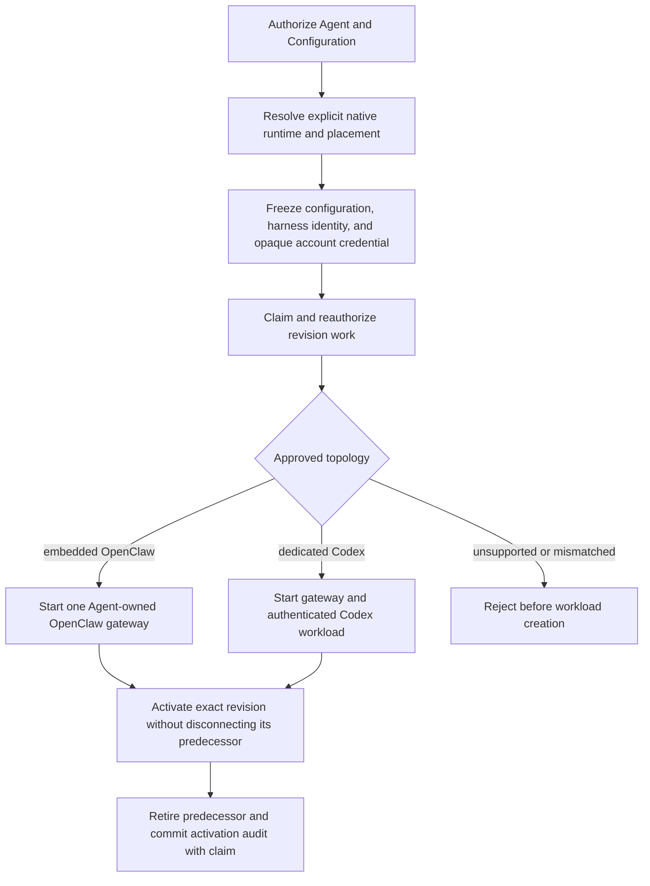

# Harness Execution Topology Flow

## Overview

An authorized deployment resolves its harness from native selected-model/provider policy, freezes
the Agent's explicit `embedded` or `dedicated` placement and provider-neutral account credential
in its AgentRevision, and asks Compute to start that topology. The flow ends after guarded route
publication, predecessor retirement, and exactly-once activation audit.

This trace describes the legacy direct Docker/Kubernetes Compute runtime path.
It is not qualification of the separate
[admitted native Gateway startup](../reference/gateway-startup-agent-bootstrap.md).
The hosted executable supplier remains unbound, and complete workload-profile
admission still requires its missing original contributors.

## Entry Points

- Trigger: exact-Agent `POST /namespaces/:namespaceId/agents/:agentId/deploy` and durable revision
  reconciliation.
- Source: `packages/occ/src/index.ts:OpenClawController.deployAgent` and
  `apps/controller/src/worker.ts:ControllerWorker`.
- Assumptions: authorized actor; ready Namespace; same-Namespace native agent Configuration;
  explicit Agent execution mode; and either operator-materialized API-key credentials or a
  Driver-issued, account-owned access-token Secret.
- Admission additionally requires an identified V2 saved-draft command, the exact
  saved workload-profile selection and genuine current admission/capability
  suppliers. See [identified deployment commands](../reference/lifecycle-deploy-v2.md).
  This trace describes runtime effects after successful admission.

## Flow

## Execution Trace

### 1. Resolve and freeze the native harness

`packages/occ/src/index.ts:OpenClawController.deployAgent`

OCC authorizes and locks the exact Agent and Configuration. Selected-model/provider
`agentRuntime.id` explicitly selects `codex` or `openclaw`; only an unambiguous built-in
configuration defaults to embedded OpenClaw. Missing ambiguous/plugin runtime policy, conflicting
routes, unsupported IDs, and harness/mode mismatches fail closed. OCC validates each primary
and fallback model through the same resolver; fallbacks must keep the
primary provider and Harness. It preserves their order in the native configuration.
The admitted revision immutably
captures its native configuration, approved harness identity/version, explicit mode, Compute
selection, Agent ServicePrincipal, and saved `maximumExecutionMs` selection.
The [duration setting](../reference/agents.md#execution-duration-selection) is
explicitly `null` for uncapped or a positive safe integer for a finite cap;
subsequent Agent draft edits do not mutate that admitted revision. Production admits both approved
`openclaw`/`embedded` and `codex`/`dedicated` combinations. An associated
`access_token` additionally requires dedicated Codex; the frozen account
contains only its OCC identity, credential kind, and opaque Secret reference.

### 2. Claim work and realize the approved topology

`apps/controller/src/worker.ts:ControllerWorker`

The worker claims exact revision work, reauthorizes its actor and ownership, revalidates its frozen
approved harness, and calls `ComputeDriver.prepareRevision`.

`apps/controller/src/drivers/compute/docker/index.ts:DockerComputeDriver.prepareRevision`

Docker embedded execution starts one Agent-owned OpenClaw gateway container. Dedicated
execution starts a separate Codex container before its gateway, using authenticated
`APP_SERVER_URL`/`APP_SERVER_TOKEN` WebSocket transport. Only the embedded gateway or
dedicated Codex container receives the provider key and workload-hook environment.

`apps/controller/src/drivers/compute/kubernetes/index.ts:KubernetesComputeDriver.prepareRevision`

Production dedicated workloads use separate Agent-owned gateway/Codex ServiceAccounts,
authenticated same-Agent transport, and default-deny NetworkPolicies. Native API-key execution
retains its independently materialized operator-owned model key. Provider-backed dedicated Codex
instead receives `CODEX_ACCESS_TOKEN` and `CODEX_CHATGPT_WORKSPACE_ID` directly from one
account-owned Secret; its separate gateway receives neither value. API-side Kubernetes Compute
creates that exact tenant Secret during credential issuance. The worker has no direct Secret API
permissions, although its trusted Deployment authority can indirectly project tenant Secrets.
Production embedded OpenClaw starts one combined gateway/Harness with the exact Agent
ServiceAccount, projected token, operator-materialized Agent-specific model key, and initially
nonserving gateway route; no Codex workload or app-server credential exists.

When a selected SandboxDriver provisions the dedicated Harness,
`providerHarnessReady` lists Pods using the same Agent/revision/role labels as
the active Service. It validates the complete observation and requires exactly
one nonterminating candidate with the supplied Harness labels and `Ready=True`.
An unready second live candidate blocks readiness even when the first is Ready.
Malformed or incomplete observations throw through the existing preparation
cleanup path. `activateRevision` repeats this check before changing routing.
See the [Kubernetes readiness contract](../reference/drivers/kubernetes-compute.md)
for candidate rules and the limits of this observation.

The optional [gVisor profile (Alpha)](../reference/drivers/gvisor.md)
uses Compute's own dedicated Deployment path with a fixed RuntimeClass in
both development and production. It retains a distinct Compute implementation
in admitted revisions and checks observed Pod placement during rollout and
after Deployment readiness. Matching nonterminal Pods remain subject to the
runtime check even when deletion has been requested; safely placed deleting
Pods do not count toward readiness. It does not invoke OpenShell or change credential placement;
node-side runsc/platform proof and live lifecycle/tool qualification remain
separate requirements.

### 3. Publish safely and complete activation once

`apps/controller/src/worker.ts:ControllerWorker`

The predecessor's Kubernetes Service selector remains intact while
`prepareRevision` stages the replacement. The worker then commits the database
`activeRevisionId` with an exact compare-and-set before Kubernetes default
after-commit activation. During that cutover, `KubernetesComputeDriver.activateRevision`
can mutate the `Recreate` gateway Deployment and Service before the replacement
is ready. If activation, readiness, predecessor retirement, or audit completion
fails, the worker requeues the revision with `REVISION_FINALIZATION_INCOMPLETE`;
recovery retries activation and retirement for the already-active revision.
This path does not guarantee the previous route stays serving through every
failed cutover. Lost claims and foreign/stale workloads fail closed.

Kubernetes gateways in both modes mount their own persistent SQLite and media
directories. Embedded gateways also retain their attested default workspace on
the same private claim so continued turns survive Pod replacement. Dedicated
Codex receives only the shared workspace claim; the gateway's nested Codex home
remains ephemeral. The driver creates dedicated shared and private claims before
their consuming Pods and relies on workload readiness instead of waiting for
`Bound`, which would deadlock `WaitForFirstConsumer` storage classes. A nonroot
gateway-image init container prepares private SQLite and media directories
without credentials or elevated privileges.

For dedicated execution, the gateway entrypoint publishes bundled and plugin
skills into the shared runtime-assets tree before spawning OpenClaw, so Codex
sees the directional shared workspace, session, skill, and generated-image
mounts after the gateway has prepared them. Private gateway state, claim roots,
`CODEX_HOME`, tokens, and credentials remain outside the dedicated Harness.
Predecessor retirement retains the current gateway and both owned claims; final
gateway teardown deletes the exact-owned private and shared claims by UID before
deleting the gateway. The [storage contract](../reference/drivers/kubernetes-compute/storage-and-credentials.md#gateway-storage)
owns claim sizes, mount paths, StorageClass requirements, and final teardown.

## Selected journal execution component

The separate [hosted native owner](../reference/hosted-native-execution.md)
connects one original dispatch to the
[selected turn journal](../reference/turn-journal/execution.md#selected-native-execution-retention).
The direct deployment path above does not install a production dispatcher or
bind the saved revision policy to this component's actual consumption authority.
The native gate and Node SDK must share the current successor codecs before
this sequence can run against a real native owner.

1. `HostedNativeOwner.dispatchAndConsumeAndInitiate` invokes the original
   combined PostgreSQL transaction. The actual consumption authority supplies
   the exact execution recipient, immutable limit reference/version and explicit
   finite-or-null `maximumExecutionMs` selection.
2. The original writer samples `pre-commit-monotonic-v2` immediately before
   dispatch under its Agent lock. The source, epoch and anchor survive only with
   the newly known-committed, single-use initiation claim. Startup and later waits
   count against a finite cap from this anchor.
3. `SelectedExecutionController.acceptInitiation` retains the authenticated
   pending native construction before construction effects. It transfers
   mandatory `host-stop-v2` cleanup responsibility into the original host's local
   owner and retains the exact control in PostgreSQL. Only definite retention
   and live original checks allow construction through the native gate.
4. A `host-controlled-v2` ready receipt embeds that same control. The controller
   retains the original ready owner and then the exact start record before
   confirming the native gate. A lost acknowledgment leaves this owner gated;
   exact readback can resolve it without a second acceptance.
5. A finite cap arms bounded timer waits against the original monotonic
   deadline. Uncapped selection keeps the same stop owner with a `null` deadline
   and no duration timer. Finite initiation and ongoing authority calls still
   govern their own operations. Failed acceptance after stop transfer but before
   ready retention requests the original cleanup in either mode.
6. Expiry or an admitted protective stop invokes the retained exact native
   cleanup lane independently of the continuation queue and new database writes.
   The journal retains uncertain ownership and capacity. A timer firing, cancel
   acknowledgment or closed socket does not establish physical helper/task
   closure or authorize replay.

These are current journal/controller component transitions. Actual native
construction, model/tool interruption, complete task/helper closure and the
original current-authority composition still require runtime qualification.
The [hosted owner verification procedure](../reference/hosted-native-execution.md#configuration-and-verification)
separately describes its PostgreSQL/socket integration fixture and remaining
real-native prerequisites.

## Debugging and Verification

- Check placement, immutable policy, and conflicts:
  `node --test tests/conformance/configuration-occ.test.mjs`.
- Check guarded activation and recovery:
  `node --test tests/integration/postgres-worker-agent-revision.test.mjs` with its explicitly
  provisioned application-role PostgreSQL database.
- `harness-topology-k3d-real.test.mjs` and `production-tui-k3d-real.test.mjs` use
  identified [V2 deployment commands](../reference/lifecycle-deploy-v2.md), verify
  the operation acknowledgement, then separately read the requested revision.
  Their setup still requires complete admission suppliers and the applicable
  ServiceAccount and admitted workload profile saved for each Agent. Missing
  saved setup fails before submission; it is not a model-turn or denial result.
- `docker-compute-real.test.mjs` and `service-account-driver-real.test.mjs` still
  submit bodyless deployment requests and expect revision-shaped responses. They
  require current command and response handling as well as complete admission
  setup before establishing current model-turn coverage.
- Once that setup is complete, real disposable-k3d coverage must verify the
  selected topology, exact identity and model-key placement, authenticated
  dedicated transport, enforced networking, active routing and provider-backed
  turns. Select the actual runtime images, infrastructure and credentials through
  the [test environment settings](../testing/docker.md#docker-compose-development-test-environment).
  An HTTP fixture, readiness response or historical receipt does not establish
  those outcomes on the current source.
- Provider-backed dedicated Codex coverage additionally selects
  `OCC_TEST_CHATGPT_SERVICE_ACCOUNT_REAL=1` and an authorized mounted
  `OCC_TEST_CHATGPT_ADMIN_KEY_PATH`; this scenario does not use `OPENAI_API_KEY`
  and remains subject to the service-account suite's deployment blocker above.
- Treat unavailable credentials, runtime images, provider access, or either real model response as
  a verification failure. Never substitute a readiness probe, handshake, fixture, or skipped test.

## Related docs

- [Harness execution topology implementation specification](../../specs/.archive/07-harness-execution-topology.md)
- [Platform design](../design/workloads.md#openclaw-gateways)
- [Agent placement and deployment](../reference/agents/deployment.md#execution-mode)
- [Controller worker](../reference/controller/reconciliation.md#agentrevision-lifecycle)
- [Selected turn journal](../reference/turn-journal/execution.md#selected-native-execution-retention)
- [Hosted native execution owner](../reference/hosted-native-execution.md)
- [Docker Compute Driver](../reference/drivers/docker-compute.md)
- [Kubernetes Compute Driver](../reference/drivers/kubernetes-compute.md)
- [Compute Driver lifecycle hooks flow](compute-driver-lifecycle-hooks.md)
- [Service Account Driver credential delivery flow](service-account-driver-credential-delivery.md)
- [Shared-drive specification](../../specs/.archive/12-dedicated-harness-shared-workspace-drive.md)

## Manual Notes

[keep this for the user to add notes. do not change between edits]

## Changelog

- 2026-09-01 19:09: Corrected Kubernetes after-commit activation semantics and merged the dedicated shared-workspace runtime ordering into this topology trace. (01a05f95-dd80-7011-990f-d1c46b5bb3cc - aa366c49c44834d59f74994c5fd37fb8096f169f)
- 2026-08-28 21:20: Removed host-process local-test topology coverage; document Docker and Kubernetes runtime execution and verification. (01a036f4-cf1d-7cc1-bbc1-000879038ac8 - 3ec166eb5fae39ed0f51ffb5ebd93338c4a2db94)
- 2026-08-28 17:58: Updated moved feature-reference links for the documentation organization. (01a036f4-cf1d-7cc1-bbc1-000879038ac8 - 4270aa29b7015562049f46c6027962fd85b584a9)
- 2026-08-27 00:05: Replaced the removed schema-contract suite with the authoritative harness-placement conformance test. (01a036f4-cf1d-7cc1-bbc1-000879038ac8 - ab560806dbd945436835ab092ebd10bf3e50d942)
- 2026-08-24 23:46: Distinguished operator-materialized API keys from API Compute-owned account Secrets, provider-neutral revision snapshots, direct dedicated-Codex token projection, and worker Secret authority. (01a03542-30ff-77a1-9967-587d55548ace - 51033bee121374332df2791e90e2290a5c892e5d)
- 2026-08-21 14:01: Consolidated explicit runtime selection, canonical approval, isolated dedicated credentials, predecessor-safe activation, and real dual model-turn proof. (01a021b2-292b-7ee1-ab55-4f8dc4f0ba7c - 8796ccc)
- 2026-08-21 12:43: Documented dedicated and embedded model execution, the supported shared model, isolated in-memory Codex authentication, managed execution policy, and bounded proxy propagation. (01a0119a-9843-7423-a4c6-955ff4187bd9 - be58d1b)
- 2026-08-21 19:17: Documented explicit placement, immutable native Harness resolution, embedded versus dedicated Compute ownership, existing production credential/transport boundaries, recoverable activation, and two real provider-turn integration scenarios. (01a021b2-292b-7ee1-ab55-4f8dc4f0ba7c - 149882c)
