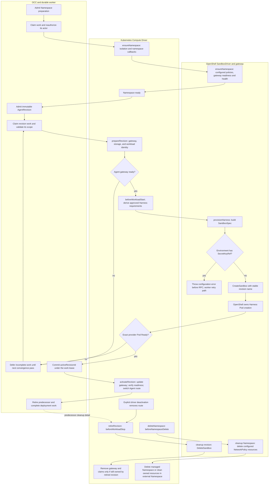

# Kubernetes and OpenShell Agent Workload Lifecycle Flow

## Overview

This flow follows an admitted Agent deployment through the durable controller worker,
Kubernetes Compute Driver, and OpenShell SandboxDriver. The running example is a
production **dedicated Codex Harness**, with the bundled Kubernetes Compute Driver
and OpenShell selected for the Installation. It covers Namespace preparation,
workload creation, readiness, activation, replacement, retirement, and Namespace
deletion. It stops at the OpenShell gateway API boundary and the Kubernetes
observations used by OCC; it does not trace upstream OpenShell controller or
sandbox-supervisor internals.

The central division is that **Compute decides the approved workload requirements
and owns routing; OpenShell creates the dedicated Harness workload**. Compute still
creates the Agent gateway. There are two different gateways: the per-Agent OpenClaw
gateway serves Agent traffic, while the Namespace-local OpenShell gateway accepts
sandbox management RPCs. The operator must install the OpenShell gateway separately.

The [OpenShell reference](../reference/drivers/openshell-sandbox.md) owns supported
configuration and compatibility requirements. This is a trace of the current
Enterprise adapter, not a claim that an unmodified upstream OpenShell release
supports every required projection.

**Current execution limit:** Compute includes Secret-backed transport and model
environment entries in a production Harness. The adapter's `environment()` helper
currently rejects every `valueFrom.secretKeyRef` entry before `CreateSandbox`.
Consequently, the unadapted production path stops at request construction. The
provider creation and activation stages below explain the downstream lifecycle
when that compatibility boundary is satisfied; the real integration test uses an
explicit test-only credential bridge and projected-token patch.

### Lifecycle methods and selected-driver callbacks

“Lifecycle hook” can refer to two different interfaces here:

| ComputeDriver operation | When it runs                                                                            | OpenShell participation                                                                                                         |
| ----------------------- | --------------------------------------------------------------------------------------- | ------------------------------------------------------------------------------------------------------------------------------- |
| `ensureNamespace`       | Reconcile a provisioning Namespace.                                                     | Calls `SandboxDriver.ensureNamespace` after baseline infrastructure and selected-driver callbacks.                              |
| `prepareRevision`       | Prepare or observe an immutable AgentRevision, including subsequent convergence passes. | Calls `provisionHarness` with Compute-approved requirements, then observes provider Pod readiness.                              |
| `activateRevision`      | Finish activation after the worker commits the active revision for this driver.         | Observes the existing provider Pod; Compute updates the gateway, network policies, and Agent Service. No additional create RPC. |
| `deactivateRevision`    | Remove routing during initial dedicated deployment or an explicit driver call.          | No SandboxDriver callback; Compute changes the Service selector.                                                                |
| `retireRevision`        | Retire a predecessor during replacement/recovery, or an explicit driver call.           | Calls revision-scoped `cleanup` before removing a gateway still owned by that revision.                                         |
| `deleteNamespace`       | Tear down an empty Namespace.                                                           | Calls Namespace-scoped `cleanup` before removing Namespace resources.                                                           |

The shared ComputeDriver contract also has optional `bindAgent`, `activationOrder`,
and `maintenanceIntervalMs`. This Kubernetes implementation has no `bindAgent`
callback or maintenance interval and uses the default activation order after the
database commit. These options do not add extra Kubernetes/OpenShell lifecycle
stages in this trace.

Selected **non-Compute** Drivers can separately contribute these callbacks through
`computeLifecycleHooks`:

| Callback                 | Concrete Kubernetes call site                                                 | Ordering and effect                                                                    |
| ------------------------ | ----------------------------------------------------------------------------- | -------------------------------------------------------------------------------------- |
| `afterNamespacePrepared` | Inside `ensureNamespace`, before Sandbox `ensureNamespace`.                   | Selection order; namespace preparation must succeed before readiness.                  |
| `beforeWorkloadStart`    | Inside dedicated `prepareRevision`, before constructing Harness requirements. | Selection order; contributes validated opaque environment placeholders to the Harness. |
| `beforeWorkloadStop`     | Inside `retireRevision`, and as preparation-failure compensation.             | Reverse selection order; completes before destructive workload teardown.               |
| `beforeNamespaceDelete`  | Inside `deleteNamespace`, and as compensation for failed namespace callbacks. | Reverse selection order; completes before Namespace teardown.                          |

OpenShell's `ensureNamespace`, `provisionHarness`, and `cleanup` are direct
SandboxDriver operations. They are separate from this callback dispatcher.
There is currently no Agent stop, pause, resume, or delete API/worker operation.
The teardown methods below describe the driver contract and replacement cleanup,
not an implemented owner-facing stop workflow.

## Entry Points

- Trigger: `POST /namespaces` admits Namespace preparation; deploying through
  `POST /namespaces/:namespaceId/agents/:agentId/deploy` admits revision work;
  deleting an empty Namespace admits Namespace teardown. The worker claims and
  processes that durable work.
- Source: `apps/controller/src/worker.ts:ControllerWorker`,
  `apps/controller/src/drivers/compute/kubernetes/index.ts:KubernetesComputeDriver`,
  and `apps/controller/src/drivers/sandbox/openshell.ts:OpenShellSandboxDriver`.
- Assumptions: trusted Installation selection has composed the drivers; the
  worker has PostgreSQL and Kubernetes access; runtime images, transport/model
  credential references, storage, namespace-local OpenShell gateway, and the
  required admission/runtime integration are configured. Embedded OpenClaw with
  OpenShell is rejected. The immutable revision pins the selected driver and
  dedicated Harness identity.

## Flow



The Namespace and revision lanes represent separate work items. Namespace readiness
does not itself deploy an Agent. A replacement follows the same preparation path
while the old Agent route remains selected. Explicit driver teardown and Namespace
deletion are separate paths, not automatic deletion of the newly deployed workload.
The normal production environment takes the SecretKeyRef failure branch with this
adapter; the integration test's bridge removes that unsupported input. Exceptions
follow the worker's failure/retry path described below rather than the diagram's
normal readiness-deferral loop.

## Execution Trace

### 1. Compose drivers and freeze the deployment input

`apps/controller/src/composition/installation-config.ts:loadInstallationConfiguration`

Trusted startup accepts the bundled OpenShell SandboxDriver only with bundled
Kubernetes Compute. It attaches the selected SandboxDriver and snapshots selected
non-Compute lifecycle callbacks before Compute operations begin. Production startup
also requires Compute's activation and deactivation stages. Kubernetes `preflight`
constructs authenticated clients and lists one Namespace to validate connectivity
and the response; it does not prove provider readiness, all future RBAC permissions,
or a working Agent turn.
The worker's callback owner order is Configuration, Sandbox, then IAM; cleanup
reverses that order. OpenShell currently implements its direct Sandbox operations
without contributing these callbacks.

Before the worker ever sees the revision, OCC invokes OpenShell's `configureAgent`
contribution while composing gateway configuration. For dedicated Codex it sets the
Codex app-server sandbox configuration to `danger-full-access`: the selected
OpenShell workload sandbox supplies the outer containment. This setting does not
authorize an unsandboxed fallback if OpenShell cannot provision the workload.

OCC validates the composed configuration and admits an immutable AgentRevision with
its configuration snapshot, Harness selection, Compute identity, optional account
snapshot, and `sandboxDriverId`. Editing the Agent or Configuration later does not
rewrite that revision. See the [revision admission flow](configuration-driver.md)
for the API-side authorization and freeze sequence.

### 2. `ensureNamespace` establishes the tenant before an Agent exists

`apps/controller/src/drivers/compute/kubernetes/index.ts:KubernetesComputeDriver.ensureNamespace`

After the Namespace work item is authorized, Compute resolves the backing Kubernetes
namespace. For a managed namespace it reconciles the Namespace with OCC ownership
metadata and restricted Pod Security labels, then waits for `Active`. An explicitly
selected existing namespace must already exist, be active, satisfy adoption and
isolation checks, and have unique logical ownership. Compute claims that placement
without converting it into an OCC-owned physical namespace.

Once placement is usable, Compute reconciles `openclaw-quota`, `openclaw-limits`,
and baseline NetworkPolicies: `default-deny` for ingress/egress, `allow-dns` to the
configured DNS peer on TCP/UDP 53, and `allow-gateway-ingress` from approved gateway
clients to the configured port. This stage has no Agent gateway, Harness, or guessed
Agent ServiceAccount. Kubernetes resources are reconciled with ownership checks;
matching a resource name alone does not authorize adoption.

Compute then runs `afterNamespacePrepared` callbacks in selection order. If one
fails, the dispatcher compensates completed owners with `beforeNamespaceDelete` in
reverse order. After those callbacks succeed, Compute invokes OpenShell's
`ensureNamespace` with the physical namespace name, Kubernetes object client, and
the operation's cancellation signal.

OpenShell applies configured `gateway.networkPolicyResources`, optionally checks
the configured gateway Service and selected ready Pod, and calls the gateway health
RPC. This readiness helper makes one observation; it does not poll until ready.
It uses Compute's native Kubernetes object client, attaches Namespace ownership
metadata, and applies resources with the same field manager without forcing
conflicts. Despite the option name, validation accepts general resource objects
and explicitly rejects Secrets; it does not strictly enforce `kind: NetworkPolicy`.
It does not install the OpenShell gateway. Only after this returns does Compute
report `namespaceReady: true` for the worker to persist. A later failure in Sandbox
`ensureNamespace` is outside the dispatcher's namespace-callback compensation block;
the next work attempt must safely repeat completed setup.

If a managed Namespace has not appeared or become active, Compute returns incomplete
readiness. A Kubernetes 403 after tenant access becomes necessary is also returned
as incomplete readiness, allowing RBAC setup to converge. Other caught errors are
returned as a typed failure for the worker to classify.

### 3. The worker authorizes and fences revision preparation

`apps/controller/src/worker.ts:ControllerWorker.processRevision`

The worker reloads the Namespace, Agent, immutable revision, and previous active
revision. It checks exact ownership, the Agent's stable ServicePrincipal, Namespace
readiness, Harness support, and the pinned Compute/Provider identities. It
reauthorizes the original deployment actor and any required account or Secret
access before calling Compute. The request does not inherit permanent authority
merely because deployment was allowed earlier.

The worker defaults to a 250 ms poll interval, five-second work lease, and five
dependency-error attempts. It holds that lease and heartbeats it around provider operations.
Its abort signal flows into Compute, the callback dispatcher, and OpenShell calls.
Lost authority or a lost lease must prevent subsequent activation. Database
transactions fence publication of the active revision; they do not make external
Kubernetes or OpenShell changes transactional.

### 4. `prepareRevision` prepares the Agent gateway and shared state

`apps/controller/src/drivers/compute/kubernetes/index.ts:KubernetesComputeDriver.prepareRevision`

Compute first validates the revision topology and configuration ownership, resolves
the pinned SandboxDriver, and verifies that the namespace is active with its
baseline NetworkPolicies present. A missing prerequisite returns `ready: false`.
Unsupported topology or inconsistent ownership fails closed.

Compute derives stable per-Agent resource names from a 12-character SHA-256 suffix
of the Agent ID. It checks any existing gateway's revision annotations and immutable
configuration reference. It refuses conflicting data for the same revision and
does not roll a newer gateway back to an older revision.

For the dedicated path it then prepares these resources:

| Resource                          | Identity and contents                                                                                       | Why it exists                                                                      |
| --------------------------------- | ----------------------------------------------------------------------------------------------------------- | ---------------------------------------------------------------------------------- |
| Immutable gateway ConfigMap       | Exact revision configuration plus Configuration identity/generation metadata.                               | Makes the gateway consume the admitted snapshot.                                   |
| Gateway Kubernetes ServiceAccount | `gateway-<agent-hash>`; automatic token mount disabled.                                                     | Separate identity for the per-Agent gateway.                                       |
| Shared workspace PVC              | Stable Agent-owned claim; `ReadWriteMany`, 40 GiB.                                                          | Shares approved workspace categories between gateway and Harness across revisions. |
| Gateway private-state PVC         | `gateway-state-<agent-hash>`; `ReadWriteOnce`, 10 GiB, configured SQLite-compatible storage class.          | Persists gateway-owned state; not a Harness mount.                                 |
| Gateway Deployment and Service    | `gateway-<agent-hash>`; one replica, immutable config mount, transport references, gateway readiness probe. | Runs the Agent's OpenClaw gateway and exposes it.                                  |

For initial deployment, Compute reconciles the gateway Deployment and channel
network policy here. For a replacement, it stages the candidate configuration while
preserving the existing gateway until activation. Dedicated preparation waits for
the current gateway to be ready before starting the candidate Harness.

`gatewayReady` checks the owned Deployment's observed generation and ready replicas,
then its owned Service and a ready EndpointSlice. When a Service UID is available,
the EndpointSlice must reference that Service UID. Gateway readiness is therefore
more than the existence of a Deployment object.

### 5. `beforeWorkloadStart` runs before the Harness handoff

`apps/controller/src/drivers/compute/lifecycle-hooks.ts:ComputeLifecycleDispatcher.beforeWorkloadStart`

After the gateway is ready, Compute reconciles the Agent's Kubernetes ServiceAccount
`agent-<agent-hash>`. If the Agent Service does not exist, it creates it with an
inactive selector so a new workload cannot immediately receive Agent traffic.
Existing routing is preserved during replacement. Account authentication egress is
also prepared when the admitted account uses an access token.

Compute calls `beforeWorkloadStart` in selected-driver order. Callbacks may return
bounded, validated `opaque-` environment placeholders. They cannot change images,
commands, placement, network policy, or immutable revision data. Contributions go
to the dedicated Codex Harness; they do not enter the separate gateway. The
dispatcher freezes the combined launch result and compensates already-completed
owners in reverse order if preparation fails.

Compute then builds the ordinary dedicated Agent Deployment **in memory** and
extracts `HarnessWorkloadRequirements`. With OpenShell selected, that Deployment is
not submitted to Kubernetes. The requirements are a deliberately bounded handoff,
not a copy of every Deployment field, init container, or probe.

### 6. Compute passes exact identity, mounts, command, and credential references

`apps/controller/src/drivers/compute/kubernetes/index.ts:KubernetesComputeDriver.harnessRequirementsFromDeployment`

| Requirement               | What crosses into the SandboxDriver                                                                                                                              |
| ------------------------- | ---------------------------------------------------------------------------------------------------------------------------------------------------------------- |
| Image and command         | The selected Harness image and explicit combined command/arguments.                                                                                              |
| Labels                    | Exact Namespace, Agent, ServicePrincipal, revision, and workload-role scope from the approved Pod template.                                                      |
| Kubernetes ServiceAccount | `agent-<agent-hash>`, taken from `spec.serviceAccountName`.                                                                                                      |
| Projected token           | Exact configured audience and expiry, file `token`, mounted read-only at `/var/run/secrets/openclaw/service-principal`. This path requires projected-token mode. |
| Workspace mounts          | The approved PVC name, each subpath, container path, and read-only flag.                                                                                         |
| Environment               | Literal values and exact `valueFrom.secretKeyRef` names/keys, including transport/model credential references and accepted hook placeholders.                    |

The shared PVC grants both processes read/write workspace access. Sessions are
gateway-writable and Harness-read-only; generated images are Harness-writable and
gateway-read-only; bundled and plugin skills are gateway-writable and Harness-read-only. The
Harness never receives the gateway's private-state PVC through this extraction.

The identity and credential concepts remain separate:

- The Kubernetes ServiceAccount selects the Pod's Kubernetes identity. Both its
  resource and the ordinary Compute Pod template disable automatic token mounting;
  the approved projection is explicit.
- The OCC ServicePrincipal is the Agent's stable logical identity, carried in
  ownership and workload metadata. A projected token does not by itself prove that
  OCC implements workload-token authentication for every API.
- An optional OCC ServiceAccount identifies an external account and its admitted
  credential reference. It can supply `CODEX_ACCESS_TOKEN` and workspace ID to the
  Harness; otherwise the runtime uses the per-Agent model API-key reference. It
  does not choose the Pod's Kubernetes ServiceAccount.

Secret values do not enter the SandboxDriver requirements. The references must
reach the provider workload faithfully; resolving them through an ad hoc worker
Secret read would change the credential boundary.

### 7. `provisionHarness` asks OpenShell to create the revision workload

`apps/controller/src/drivers/sandbox/openshell.ts:OpenShellSandboxDriver.provisionHarness`

OpenShell verifies that the revision is dedicated Codex and pinned to this driver.
It derives a stable sandbox name from the revision ID and configured prefix. That
identity is reused across retries; a new revision gets a new sandbox name. The
default is `sb-` plus 16 hexadecimal hash characters, bounded to 19 total characters.

The adapter translates the requirements and trusted driver configuration into the
gateway request. It builds workload labels, image, command, approved PVC mounts,
and projected token. It adds configured runtime
class, process and filesystem policy, network policies, resources, and optional
user-namespace settings.

At `environment(requirements)`, literal entries can be serialized, but any
`valueFrom` entry throws `OpenShell v0.0.113 cannot receive secretKeyRef environment
…`. No gateway create RPC occurs in that case. Compute does not resolve or inline
the Secret as a fallback. The production requirements normally include these
references, so this is a concrete current limitation, not just an upstream caveat.
The downstream steps assume a supported compatibility path; the repository's live
test explicitly bridges credentials and patches the exact token projection.

The handoff also does not copy Compute's ordinary Deployment resource settings:
OpenShell uses `kubernetes.agentResources`, defaulting to an empty resource map.

`kubernetes.serviceAccount.mode: driverConfig` places Compute's exact ServiceAccount
name in `driver_config.kubernetes.pod.service_account_name`. In
`gatewayConfigured` mode that field is omitted: the gateway must already be
configured to attach the same exact identity. This mode is not permission to use a
shared or default ServiceAccount.

`sandboxDataMount` aliases one approved PVC subpath into a path under `/sandbox/`.
It must identify an approved mount unambiguously and cannot weaken a read-only
mount. The adapter derives filesystem allowances from these mounts and the token
projection, then merges configured policy paths. This does not replace the shared
workspace with an unrelated OpenShell default claim.

The gateway endpoint is explicit or derived from the namespace-local Service.
Gateway workspace defaults to `default`; request timeout defaults to 10 seconds.
The gateway client sends health/create/delete gRPC requests with configured TLS and
optional bearer-token-file authentication. This control-plane credential is separate
from the Harness model credential and workload identity.

`CreateSandbox` transfers workload construction to OpenShell. Success must return
the expected name; `AlreadyExists` is accepted for the stable revision identity.
The adapter does not fetch or compare the existing Sandbox's specification,
ownership, or phase in that branch. There is no internal adapter polling/retry loop.
The adapter returns a `SandboxResourceRef` containing namespace, Agent, revision,
and resource name. Compute validates that reference before observing readiness.

### 8. Observe provider readiness and defer incomplete work

`apps/controller/src/drivers/compute/kubernetes/index.ts:KubernetesComputeDriver.providerHarnessReady`

Compute lists Pods using the full approved label selector. It accepts a
non-deleting Pod in the expected physical namespace with the exact Agent/revision
and `workload-role: agent`, and a `Ready=True` condition. It returns that observation
to the worker as `ready`.

This check does **not** re-verify the provider Pod's image, ServiceAccount, mounted
volumes, security context, or effective OpenShell policy. It also does not run the
ordinary Agent Deployment's readiness probe itself. OpenShell and its trusted
integration own those properties. `CreateSandbox` success, Pod readiness, route
activation, and a successful model turn are distinct observations.

If no matching ready Pod exists yet, `prepareRevision` returns `ready: false`.
The worker defers incomplete work and repeats preparation on a later convergence
pass; the stable sandbox name makes a repeated create request safe at the API
identity boundary. Returning incomplete readiness after `provisionHarness` does not
invoke `beforeWorkloadStop` or delete the just-created sandbox.

The nearby `if (deployment === undefined)` branch in Compute belongs to the
ordinary, non-provider Deployment path. It handles a missing readback after
reconcile by compensating workload hooks and returning incomplete readiness.
OpenShell's path returns before that branch.

### 9. Commit the revision, then `activateRevision` switches the route

`apps/controller/src/worker.ts:ControllerWorker.finalizeRevision`

Once preparation reports ready, the worker publishes the candidate as
`activeRevisionId` in a lease-fenced transaction, checking the expected predecessor.
Kubernetes uses the default activation order **after** that commit. On initial
dedicated deployment, the worker also invokes deactivation before committing to
ensure no candidate route is prematurely selected.

`apps/controller/src/drivers/compute/kubernetes/index.ts:KubernetesComputeDriver.activateRevision`

For the OpenShell path, activation performs these operations in order:

1. Recheck readiness of the exact provider Harness revision.
2. Reconcile enabled channel policy, the shared workspace claim, and gateway
   private-state claim.
3. Reconcile the per-Agent gateway Deployment using the candidate's immutable
   configuration. The gateway uses `Recreate`; replacement can interrupt service.
4. Wait for `gatewayReady`, including its Service endpoints.
5. Reconcile policies permitting the gateway to reach the exact Agent revision and
   the Agent's runtime egress.
6. Switch the stable Agent Service to the exact Agent/revision/workload-role labels.
   The provider path omits the ordinary Deployment-name selector.

The gateway reaches Codex through `ws://agent-<agent-hash>:18790` and its per-Agent
transport credential. Compute owns this routing switch; OpenShell does not publish
the active revision or select the gateway's backend.

After activation succeeds, the worker retires the predecessor, records completion,
and completes the durable deployment work. The database commit and Kubernetes
activation are separate: if the process fails after the commit, a later attempt
recognizes the already-active revision and resumes finalization. It reauthorizes
and resolves current provider/Secret metadata, re-runs activation, and retires every
lower-numbered revision. It does not re-run `prepareRevision` in this branch because
Kubernetes declares no maintenance interval. An active pointer
alone is not proof that all activation and retirement effects have completed.

### 10. Failures preserve retry and compensation boundaries

`apps/controller/src/worker.ts:ControllerWorker.finalizeRevision`

| Outcome                                                                               | What happens next                                                                                                                                                                   |
| ------------------------------------------------------------------------------------- | ----------------------------------------------------------------------------------------------------------------------------------------------------------------------------------- |
| Namespace, gateway, or Harness not ready                                              | Defer pending work with backoff; convergence passes do not consume dependency-error attempts. The convergence deadline still bounds waiting.                                        |
| Revision preparation throws, including OpenShell configuration errors                 | The worker's outer revision catch reports `DEPENDENCY_UNAVAILABLE` and consumes a retry attempt. It does not recognize every driver exception as a permanent configuration failure. |
| Namespace returns a typed failure                                                     | `permanent` fails the work; `retryable` consumes the dependency retry budget.                                                                                                       |
| Worker authorization/ownership/driver validation fails                                | Explicit permanent worker results fail the work; no fallback driver or workload is selected.                                                                                        |
| Activation or predecessor retirement throws after commit                              | Defer `REVISION_FINALIZATION_INCOMPLETE`; retain the committed active pointer and resume finalization later.                                                                        |
| Lease lost or operation aborted                                                       | Cancel provider work and prevent unfenced finalization. A later claim may reconcile effects already performed.                                                                      |
| `beforeWorkloadStart` callback fails                                                  | Dispatcher compensates completed callback owners in reverse.                                                                                                                        |
| Harness construction/create/readiness observation throws after launch hooks completed | Compute invokes `beforeWorkloadStop` with cleanup enabled, then rethrows. If cleanup also fails, it throws an aggregate preparation/cleanup error.                                  |
| Workload or Namespace teardown callback fails                                         | Resource deletion does not proceed past that failed callback; retry can complete revocation first.                                                                                  |

The default worker convergence deadline is 15 minutes. This is separate from the
10-second provider request timeout and the dependency retry budget. “Retry” is
therefore not an indefinite guarantee that a bad configuration will eventually
work. The deadline measures pending convergence from the original work item's
creation, including postcommit finalization. Queue deferral refunds that claim's
attempt increment; it does not erase previous dependency errors. Backoff is jittered
and exponential, from one second up to five minutes. Expired leases do not refund
the attempt. Permanent failure or deadline exhaustion does not automatically
retire prepared resources or restore a previous active pointer.

Preparation compensation revokes callback contributions; it is not a transaction
rollback of every ConfigMap, PVC, Service, or provider sandbox already created.
The OpenShell preparation catch path does not call Sandbox `cleanup`. Revision
retirement owns the explicit `DeleteSandbox` operation. Idempotent preparation and
later teardown must tolerate partial external effects.

When cleanup follows cancellation, the callback dispatcher can use a fresh,
bounded five-second cleanup signal. Teardown is sequential in reverse order and
stops at the first failing cleanup callback. A preparation callback that performs a
partial effect and then throws must handle its own partial work: the dispatcher
only marks a callback completed after it resolves. See the [callback flow](compute-driver-lifecycle-hooks.md) for validation and
compensation internals.

### 11. `deactivateRevision` and `retireRevision` implement driver teardown

`apps/controller/src/drivers/compute/kubernetes/index.ts:KubernetesComputeDriver.deactivateRevision`

The worker uses deactivation for initial dedicated deployment and retirement for
replacement/recovery. There is no current Agent stop API. If a caller explicitly
uses the driver to stop the current workload, deactivation and retirement provide
the separate routing and resource operations. In dedicated mode, Compute sets the
Agent Service selector to `agent-<agent-hash>-inactive`, using a
precondition that the Service still selects the target revision. A stale stop must
not disconnect a newer active revision. Deactivation does not delete the Pod,
revoke model credentials by itself, or invoke an OpenShell RPC.

`apps/controller/src/drivers/compute/kubernetes/index.ts:KubernetesComputeDriver.retireRevision`

Compute verifies the revision's pinned identity and namespace ownership, then runs
`beforeWorkloadStop` callbacks. With OpenShell selected, it calls revision-scoped
Sandbox `cleanup`. OpenShell derives the same sandbox name from the immutable
revision and calls `DeleteSandbox`; it does not need a surviving Pod to find the
sandbox. A missing sandbox is accepted as already cleaned up.

Compute then checks the gateway's current revision annotation. It removes the
gateway, its Service and ServiceAccount, and the gateway-private and dedicated
shared workspace claims only if that gateway still belongs to the retired
revision. A predecessor's retirement preserves a gateway already updated to its
replacement. Explicitly retiring the current dedicated revision can therefore
delete its shared workspace claim; persistence across replacement does not imply
persistence after current-revision teardown.

If the physical namespace is already absent, Compute runs workload-stop callbacks
and returns without contacting the namespace-local gateway. Retirement does not
independently wait for every provider Pod to disappear after a successful delete
RPC. Further provider teardown is owned by OpenShell/Kubernetes.

### 12. `deleteNamespace` tears down an empty tenant

`apps/controller/src/drivers/compute/kubernetes/index.ts:KubernetesComputeDriver.deleteNamespace`

Namespace deletion is admitted only for an empty logical Namespace: no Agents,
Configurations, Secrets, or ServiceAccounts. It does not loop over those resources
and delete them. Given the current lack of an Agent deletion API, this is an
important limit on deleting a previously populated Namespace through the API. Compute treats an already-missing namespace as deleted. It checks ownership
before operating on an existing namespace and reports incomplete deletion while
Kubernetes marks it terminating.

Compute invokes `beforeNamespaceDelete` callbacks, then Sandbox `cleanup` without
a revision. OpenShell removes the resources from `gateway.networkPolicyResources` in reverse
order. This Namespace cleanup does not enumerate revision sandboxes or uninstall
the OpenShell gateway.

For a managed namespace, Compute requests Kubernetes Namespace deletion with the
observed UID precondition and waits for absence across convergence passes. For an
externally managed namespace, it removes OCC-owned resources while preserving the
physical namespace. The worker persists logical deletion only after
`namespaceDeleted: true`. A cleanup failure keeps deletion incomplete or failed
according to its classification; it does not authorize deleting unrelated tenant
resources.

### 13. Process shutdown closes connections without retiring Agents

`apps/controller/src/drivers/sandbox/openshell.ts:OpenShellSandboxDriver.close`

OpenShell's `close()` closes its injected and cached gateway clients and clears the
cache. It does not delete Sandboxes. The worker's `stop()` aborts work, waits for
its loop to end, and closes state; process shutdown is not Agent retirement.

## Debugging and Verification

Use the current revision ID and physical namespace, not just the Agent display
name. These read-only commands separate resource creation from readiness and
routing:

```sh
kubectl -n "$NAMESPACE" get deploy,svc,pvc,serviceaccount,networkpolicy
kubectl -n "$NAMESPACE" get pods \
  -l "openclaw.dev/agent=$AGENT_ID,openclaw.dev/revision=$REVISION_ID,openclaw.dev/workload-role=agent" \
  -o wide
kubectl -n "$NAMESPACE" get service "$AGENT_SERVICE" -o jsonpath='{.spec.selector}'
kubectl -n "$NAMESPACE" get endpointslice \
  -l "kubernetes.io/service-name=$GATEWAY_SERVICE"
kubectl -n "$NAMESPACE" get pod "$HARNESS_POD" \
  -o jsonpath='{.spec.serviceAccountName}'
kubectl -n "$NAMESPACE" get events --sort-by=.metadata.creationTimestamp
```

| Symptom                                           | Inspect the boundary                                                                                                                                                                                         |
| ------------------------------------------------- | ------------------------------------------------------------------------------------------------------------------------------------------------------------------------------------------------------------ |
| Namespace never becomes ready                     | Namespace phase/ownership, restricted admission setup, ResourceQuota/LimitRange, RBAC, baseline and configured policies, OpenShell gateway Service/Pods and health RPC.                                      |
| No Harness create request                         | Preparation may still be waiting for the Agent gateway Deployment or EndpointSlice; workload-start callbacks and requirement extraction run later.                                                           |
| Sandbox exists but revision stays incomplete      | Exact provider labels, Pod deletion timestamp and Ready condition; then image startup, token/Secret projections, PVC mounts, and OpenShell events.                                                           |
| Configuration/ownership failure                   | Driver identity, exact namespace and revision, approved ServiceAccount/token projection, PVC subpath/read-only flags, immutable gateway configuration.                                                       |
| Active revision recorded but traffic still fails  | Durable deployment work may still be finalizing; inspect gateway revision annotations, gateway rollout/readiness, exact Agent Service selector, policies, transport credentials, and predecessor retirement. |
| Replacement retirement or explicit teardown fails | Callback revocation failures, DeleteSandbox outcome, UID/ownership conflicts, and Kubernetes termination state.                                                                                              |

The [OpenShell compatibility and verification guidance](../reference/drivers/openshell-sandbox.md)
describes the required provider integration for exact ServiceAccount, token,
SecretKeyRef, and PVC delivery. In particular, the documented stock upstream
integration requires test-only bridging/patches for capabilities it cannot express
directly. Keep that limitation visible when interpreting a ready Pod.

Kubernetes NetworkPolicies and OpenShell network policies are different enforcement
layers. Kubernetes policies are additive; the current Compute runtime policy
permits public TCP/443 with listed private/link-local exclusions, while OpenShell
policy supplies configured destination rules. The readiness check does not prove
that either effective policy was enforced. Likewise, a process policy or selected
RuntimeClass is desired configuration, not an independent containment attestation.

For code-level verification, use the existing
[Kubernetes conformance tests](../../tests/conformance/kubernetes-compute.test.mjs),
[Sandbox startup integration tests](../../tests/integration/sandbox-driver-startup.test.mjs), and
[lifecycle callback tests](../../tests/conformance/compute-lifecycle-hooks.test.mjs).
For actual provider behavior, follow the [testing guide](../testing.md) and the
OpenShell reference's real Kubernetes integration instructions with an explicitly
selected disposable cluster and authorized credentials. Prove an authenticated
Agent model turn, allowed/denied filesystem and network behavior, exact workload
identity/projections, and teardown separately from API acceptance or Pod readiness.
Do not print Secret data or bearer tokens while troubleshooting.

## Related docs

- Source: [Kubernetes Compute implementation](../../apps/controller/src/drivers/compute/kubernetes/index.ts),
  [OpenShell adapter](../../apps/controller/src/drivers/sandbox/openshell.ts),
  [OpenShell gateway RPC client](../../apps/controller/src/drivers/sandbox/openshell-gateway-client.ts),
  [worker](../../apps/controller/src/worker.ts), and
  [lifecycle dispatcher](../../apps/controller/src/drivers/compute/lifecycle-hooks.ts).

- [ComputeDriver contract](../reference/drivers/compute.md)
- [Kubernetes ComputeDriver reference](../reference/drivers/kubernetes-compute.md)
- [SandboxDriver contract](../reference/drivers/sandbox.md)
- [OpenShell SandboxDriver reference and configuration](../reference/drivers/openshell-sandbox.md)
- [Controller worker flow](controller-worker.md)
- [Harness execution and shared storage](harness-execution-topology.md)
- [Selected-driver lifecycle callbacks](compute-driver-lifecycle-hooks.md)
- [Configuration and revision admission](configuration-driver.md)
- [Driver-issued account credentials](service-account-driver-credential-delivery.md)
- [Secret storage and gateway delivery](secret-storage-and-delivery.md)
- [Existing Kubernetes namespace placement](kubernetes-existing-namespace-placement.md)

## Manual Notes

[keep this for the user to add notes. do not change between edits]

## Changelog

- 2026-09-02 22:22: Added the source-traced Kubernetes/OpenShell Agent lifecycle, ownership handoffs, callbacks, readiness and retry paths, activation, and teardown. (01a05f89-07a0-7373-86ff-e3cb440beed6 - 71ce151dbf18b6da3145ec6a7e26c59c0cbb8946)
