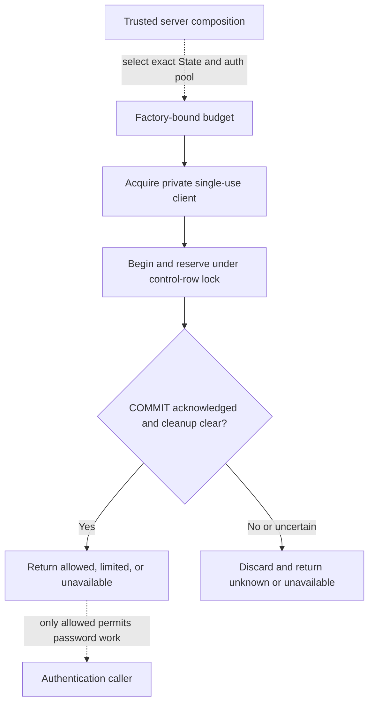

# Password-attempt budget

## Overview

This trace describes the PostgreSQL State component that reserves a password
attempt before account lookup or password hashing. It is an available source
component, not an enabled sign-in path: production and development authentication
composition do not yet select it, and its SQL supplier is not registered.

The component returns an independently settled reservation result. It does not
authenticate a person, create a session, or establish the outcome of the caller's
later transaction.

## Entry Points

- `packages/occ/src/state/postgres-pool.ts:createPostgresPasswordBudgetPool`
  creates the selected public pool and a private reservation pool.
- `packages/occ/src/state/postgres-password-attempt-budget.ts:createPostgresStateWithPasswordBudget`
  binds the State, pool, Installation, epoch, key confirmation, and timeout.
- `packages/occ/src/ports/password-attempt-budget.ts:PasswordAttemptBudget`
  accepts a 32-byte, purpose-separated account digest from trusted server
  composition. It does not receive the password, account identifier, or HMAC key.

## Flow

Solid edges describe implemented component behavior. Dashed edges identify the
authentication integration that remains to be supplied.



## Execution Trace

### 1. Bind the selected pool and State

`packages/occ/src/state/postgres-password-attempt-budget.ts:matchesPostgresPasswordBudgetPair`
checks the factory-created pair against the exact serving State and authentication
pool, Installation, epoch, and a copied 32-byte key confirmation. A structural
copy or separate State instance does not satisfy the check.

`packages/occ/src/state/postgres-pool.ts:createPostgresPasswordBudgetPool`
preserves ordinary public-pool reuse and creates a private pool with one client
at a time and one use per client. Deployment capacity must include that additional
connection. Equal configuration does not establish that both pools reach the same
PostgreSQL server; receiving composition must verify server identity separately.

### 2. Reserve and observe settlement

`packages/occ/src/state/postgres-password-attempt-budget.ts:createPostgresStateWithPasswordBudget`
installs client error observation before SQL, begins a short transaction, and calls
the fixed reservation function. The unregistered
`sql-suppliers/password-attempt-budget.sql` locks the capacity/epoch control row
before an account key, evaluates database time after waits, and bounds expired-row
cleanup. It does not evict live reservations or refund attempts.

An acknowledged COMMIT can return `allowed`, `limited` with a retry delay, or
`unavailable` after authorized cleanup. Once COMMIT starts, an error or missing
acknowledgment yields `unknown`. The client is discarded without another query,
including ROLLBACK; the component does not replay the reservation.

### 3. Retain disposal and shutdown uncertainty

`packages/occ/src/state/postgres-pool.ts:beginPasswordBudgetCheckout`
distinguishes cancellation before native checkout from an uncertain checkout
already started. The private admission gate remains held until observed local
disposal. Pool shutdown closes admission, starts both native pool shutdowns, and
waits for the private drain. Faults remain observable in Promise and callback
forms.

Local client removal or shutdown does not prove PostgreSQL backend settlement.
The public pool retains native idle-client completion semantics. The component
assumes cooperative code in the same process; it does not isolate hostile code
holding arbitrary JavaScript references.

## Debugging and Verification

With the matching prepared dependency graph, run:

```sh
node --test tests/conformance/password-attempt-budget.test.mjs
node scripts/ci/run-tests.mjs audit
```

Conformance uses real `pg-pool` with synthetic, no-network client transport. It
covers admission, shutdown, client errors, and unknown outcomes, not SQL behavior.

The `password-budget-manual` lane maps the integration file outside `ci` and
`full`. It requires seven fixture manifests for two-controller reservations,
direct/transitive role authority, direct/transitive MAINTAIN, and
direct/inherited ADMIN cases. Missing manifests or skipped expected cases fail
the lane. No fixture is created by that mapping. Restricted-role PostgreSQL,
same-server identity, key custody, and the real authentication caller remain
separate prerequisites.

## Related docs

- [Local password authentication](local-password-authentication.md)
- [PostgreSQL test setup](../testing/postgresql.md)
- [CI selection and results](../testing/ci.md)

## Manual Notes

## Changelog

- 2026-09-29 01:15: Document the received State component and pending authentication integration (authoring-run/279ba32b-540d-4466-8b8c-d5f1f2ed19b1 - 33a2528163d5bbff311bb685345e60aadb24a70a)
