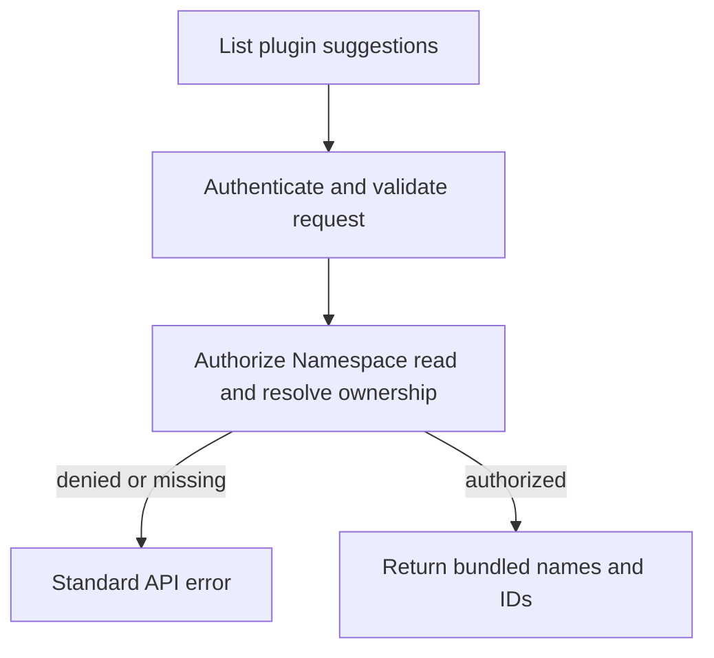

# Plugin Suggestions Flow

## Overview

A Namespace reader requests static plugin names and IDs for autocomplete.
The request ends with suggestion metadata; it does not save selections, inspect
an account, or contact a native runtime. The console UI is a separate consumer.

## Entry Points

- Trigger: `GET /namespaces/:namespaceId/plugin-suggestions`.
- Source: `apps/controller/src/index.ts:createFastifyApp`.
- Assumptions: an authenticated principal and exact Namespace `read` permission.

## Flow

## Execution Trace

### 1. Authorize the Namespace read

`apps/controller/src/index.ts:createFastifyApp`

The declarative route uses existing request validation and identity resolution.
Its handler calls `OpenClawController.getNamespace`, which authorizes the exact
Namespace and verifies that it belongs to the active Installation. Authentication,
authorization, and missing-resource failures use the normal API error path.

### 2. Return the release-owned suggestions

`apps/controller/src/index.ts:perform`

After authorization succeeds, the handler returns the immutable bundled entries
in the standard list envelope. The response schema exposes only `id` and `name`.
No Agent, Provider, ServiceAccount, selected PluginDriver, or cache is involved.
The consumer can filter this list locally; saving a selection still uses the
separate [Agent configuration and deployment flow](agent-plugins.md).

## Debugging and Verification

Run `node --test tests/integration/console-api.test.mjs` for real HTTP/OCC/IAM
coverage of metadata responses, reads before an Agent exists, and denied access.
Run `pnpm openapi:check` to check the generated endpoint contract.
No upstream credentials or plugin-runtime proof is needed for this static read.

## Related docs

- [Autocomplete contract](../reference/agent-plugins.md#autocomplete-suggestions).
- [HTTP API](../reference/api.md).
- [Implementation spec](../../specs/28-codex-plugin-suggestions.md).

## Manual Notes

[keep this for the user to add notes. do not change between edits]

## Changelog

- 2026-09-15 15:32: Documented static autocomplete request ownership and exits (01a091f2-5124-7732-ab79-15625b5facae - c7bbe7dc1ee0a2c3eec4f698391d891aaf6ae3ea)
