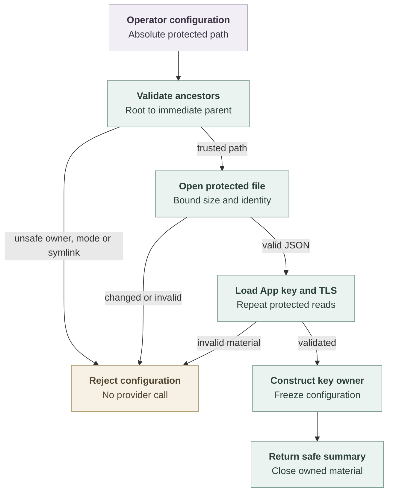

# Repository credential configuration flow

## Overview

The standalone repository credential application validates operator-selected
configuration, GitHub App key material, and TLS files before returning a frozen
configuration owner. Its `--check-config` entry point reports a nonsecret
summary and closes that owner. This flow stops before provider requests or
listener startup.

## Entry Points

- Trigger: `pnpm credentials:check-config /absolute/path/service.json`.
- Source: `apps/repository-credentials/src/check-config.ts:checkConfiguration`
  and `apps/repository-credentials/src/config.ts:loadConfiguration`.
- Assumptions: Node 24, prepared build output, operator-selected absolute paths,
  and the ownership and permission policy in the [reference](../reference/repository-credentials.md#configuration).

## Flow

## Execution Trace

### 1. Establish a protected path from the filesystem root

`apps/repository-credentials/src/config.ts:readProtected`

The loader requires a normalized absolute path and validates its directory
ancestors in root-to-leaf order. Each accepted prefix therefore protects the
next path component against replacement by another local user. Ancestors must
be directories owned by root or the service user. Group/other writes fail except
for a root-owned sticky ancestor above the immediate parent. The immediate
parent remains unwritable by those users.

The loader opens the final basename without following symlinks. It checks the
file owner, mode, link count, type, and size, performs a bounded read, and compares
the open file with the named inode and its original metadata. Invalid or replaced
files fail before their contents become configuration.

### 2. Validate configuration and construct material owners

`apps/repository-credentials/src/config.ts:loadConfiguration`

The application validates the service policy and GitHub configuration, then
repeats protected reads for the App key, certificate, and TLS key. The GitHub key
owner accepts the configured RSA signing key; TLS context creation validates
the certificate and private-key pair. The frozen result owns the selected
factory and TLS buffers. Failure closes any constructed owner and clears loaded
buffers before returning `invalid-configuration`.

### 3. Report the validation result and close material

`apps/repository-credentials/src/check-config.ts:checkConfiguration`

The check returns the gateway origin, configured profiles, and maximum session
duration. Its `finally` block closes the material owner, and the CLI prints only
the safe summary. It creates no session, listener, or provider request.

## Debugging and Verification

Run `pnpm credentials:build`, then the configuration command from the
[operator guide](../guides/repository-credentials.md). Success prints JSON with
`valid: true`; failure prints `invalid-configuration`. Inspect every ancestor
when safe-looking files still fail validation. A shared writable deployment
directory can permit substitution of an otherwise private configuration tree.

Run the configuration and emitted-package cases in the [testing guide](../testing/repository-credentials.md).
They exercise real generated RSA/TLS files and the actual loader. They establish
startup validation, not live GitHub behavior or platform integration.

## Related docs

- [Repository credential reference](../reference/repository-credentials.md)
- [Repository credential operator guide](../guides/repository-credentials.md)
- [Repository credential tests](../testing/repository-credentials.md)
- [Current architecture](../ARCHITECTURE.md)

## Manual Notes

[keep this for the user to add notes. do not change between edits]

## Changelog

- 2026-09-18 03:32: Document protected ancestor validation and configuration ownership with the accompanying security correction (codex/01a0b287-be12-7492-8826-a168e5b53103 - 2d4877aaf438c919a2240109cb2e7067e4d75b4d)
