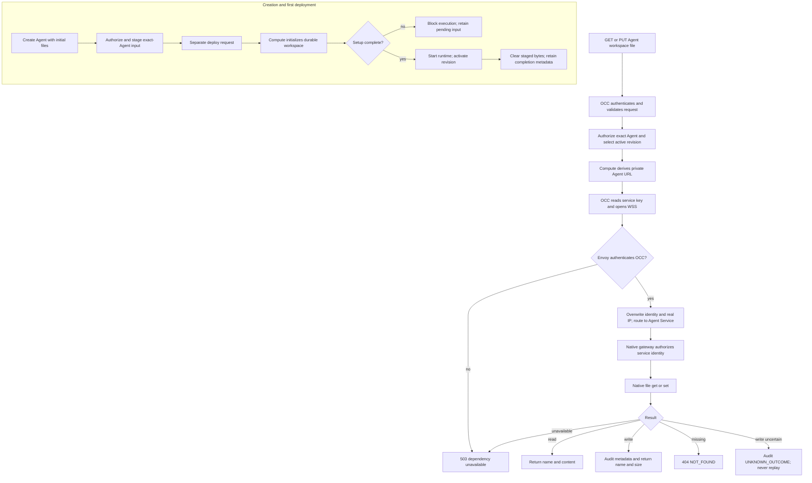

# Agent Workspace Files Flow

## Overview

An authenticated caller supplies initial `AGENTS.md`, `SOUL.md`, `IDENTITY.md`,
and `USER.md` contents at Agent creation. OCC stages those inputs privately;
Compute initializes the exact Agent's durable workspace before first execution.
After activation, OCC discards staged bytes and retains completion metadata.

A later read or edit authorizes the exact active Agent, derives its private
endpoint through Compute, and sends one native file RPC through Envoy Gateway.
This flow ends at setup completion or the bounded live-file response; model
execution and general revision activation belong to adjacent flows.

## Entry Points

- `apps/controller/src/index.ts:createFastifyApp` accepts initial contents through
  `POST /namespaces/:namespaceId/agents` and handles live `GET` and
  `PUT /namespaces/:namespaceId/agents/:agentId/workspace/files/:name`.
- `packages/occ/src/index.ts:createAgent` authorizes creation and persists private
  setup state; `apps/controller/src/worker.ts` passes it to Compute on deployment.

For live file access, the Kubernetes worker must have provisioned the Agent's private HTTPRoute and
native gateway. Installation operators enable the shared Envoy Gateway,
native trust, and network restrictions described in
[deployment](../guides/deploy/workspace-routing.md#agent-workspace-files). The
[routing reference](../reference/gateway-routing.md) owns the current transport
and credential contract.
By default, the chart requests a private CA and listener certificate from
cert-manager and uses a derived Service DNS hostname. Operators can provide
an existing issuer and explicit hostname instead.

## Flow

## Execution Trace

### 1. Creation validates and privately stages the inputs

`apps/controller/src/console/agents/create.mjs` fills four textareas from
`workspace-defaults.mjs` and submits their values with `WORKSPACE_DEFAULTS_ID`.
`apps/controller/src/index.ts:createFastifyApp` rejects a stale defaults identity;
`packages/contracts/src/workspace-setup.ts:normalizeInitialWorkspaceFiles`
rejects unknown names, invalid Unicode, NUL, and values above 16 KiB UTF-8.
An absent or empty map creates no setup state. The HTTP create route has a
448 KiB default body limit; a configured controller limit takes precedence.

`packages/occ/src/index.ts:createAgent` checks Namespace-scoped Agent creation,
exact Configuration read, and the existing binding permissions. Its transaction
creates a stopped Agent and, when keys were supplied, a private `workspaceSetups`
record keyed by exact Namespace/Agent. No AgentRevision is created. Inputs do
not enter the Agent, Configuration, revision snapshot, public response, or
metadata-only create audit. The original API strings are preserved; Console
textarea values use LF newlines.

### 2. Deployment initializes storage before execution

`apps/controller/src/worker.ts` reads private setup state while resolving
`ComputeRevisionContext`. A selected Driver without `supportsWorkspaceSetup`
returns `WORKSPACE_SETUP_UNSUPPORTED`. The existing deployment worker owns the
Agent's serialized startup and passes `workspaceSetup` to Compute.

The bundled Drivers deliver inputs to the shared
`apps/controller/src/drivers/compute/workspace-setup-runtime.ts:WORKSPACE_SETUP_RUNTIME`:
Kubernetes uses an owned Secret and gateway init container; Docker uses a
separate setup container and Agent-owned durable volumes; SSH uses the protected
exact-Agent directory and remote helper. Delivery does not put document strings
in container arguments or environment values. Dedicated Harness startup must
also verify completion before execution. Unsupported workspace placement fails
instead of writing outside the Agent's managed storage.

The runner checks the exact setup identity and workspace path, rejects links
and conflicting files, and verifies OpenClaw `2026.9.1` and the optional rendered
template digest. With no completion marker it runs native `setup` without
starting the gateway, preserving native initialization such as Git creation.
It atomically replaces supplied files, including empty strings, only if the
existing value is absent, stock, or already submitted. It runs native setup
again so native `BOOTSTRAP.md` lifecycle sees the submitted profile, verifies
the results, then atomically writes `.oce-workspace-setup.json`.

A matching marker skips application, including after lost acknowledgement.
Incomplete writes retry against the same safe-content conditions. A divergent
file or missing/mismatched marker after recorded completion blocks startup;
it never authorizes replay over later user edits. Native setup output and
failure details are suppressed at the delivery boundary to avoid disclosing
contents.

### 3. Activation clears staged contents and keeps completion metadata

`apps/controller/src/worker.ts` completes setup in the activation-completion
transaction only after checking the exact active revision and work claim.
`workspaceSetups.complete` removes document bytes and retains identity and
completion metadata. Drivers remove or replace private delivery bytes with
metadata; subsequent startup verifies the durable workspace marker.

Failed or never-deployed Agents retain pending inputs. Agent deletion removes
the private setup record through `packages/occ/src/index.ts:deleteAgent` and
Driver cleanup owns the Agent's runtime storage. There is no public setup read
or update endpoint. Creation without supplied keys follows ordinary startup.
Once an Agent is active, live edits follow the independent path below and do
not update the original setup record.

### 4. Composition configures private access

`apps/controller/src/server.mjs:start` validates the optional absolute
`OCC_GATEWAY_API_KEY_PATH` before opening the database. Production and
PostgreSQL development composition bind the selected Compute Driver to
`createWorkspaceFilesAccess`. The key is API-only; the worker manages routes
without reading this credential. Node loads any `NODE_EXTRA_CA_CERTS` trust
bundle at startup.

For the chart's automatic CA, the API Pod waits for cert-manager's generated
root Secret and receives only its public certificate. It does not receive the
CA signing key. An explicit external issuer uses the configured public CA
bundle, or Node's existing trust store when no bundle is configured.

There is no per-Agent map. Kubernetes endpoint derivation uses the admitted
Namespace and Agent IDs plus trusted Installation routing settings. A Driver
without the optional endpoint capability cannot serve this file feature.

### 5. OCC admits one exact-Agent file operation

`apps/controller/src/index.ts:createFastifyApp` requires a valid user
session or scoped service API key. Native Agent credentials cannot invoke this
administration surface. `GET` needs Agent `read`; `PUT` needs Agent `operate`
and, for session callers, passes the browser CSRF boundary. OCC resolves the
active AgentRevision before invoking Compute endpoint resolution.

Only the four names are accepted. `PUT` accepts only `{ "content": "..." }`,
rejects NUL and unpaired UTF-16 surrogates, enforces 16 KiB of UTF-8 content,
and uses a 48 KiB request-body limit. The deadline and disconnect signal cover
admission and native access.

### 6. Compute resolves a route and OCC loads the current key

`apps/controller/src/composition/workspace-files.ts:createWorkspaceFilesAccess`
uses `ComputeDriver.getGatewayEndpoint(revision)`. Kubernetes returns
`wss://<hostname>/namespaces/<namespaceId>/agents/<agentId>` without reading
Kubernetes resources. The optional hostname defaults to the same Service DNS
name used by Helm, derived from the shared Gateway's name and namespaces.
Preparation and activation create or repair the route;
resolution itself does not prove that the gateway is serving.

The API reads the mounted key for each operation, so new connections pick up
Secret rotation without an API restart. Missing routing, missing or invalid
key material, expired deadlines, and unavailable targets fail closed. No URL
or credential comes from caller JSON or headers.

### 7. Envoy authenticates and routes the native connection

`apps/controller/src/gateway/workspace-files-client.ts:requestNativeWorkspaceFile` opens WSS with only the
service key in `x-api-key`. The client verifies the server hostname and CA;
there is no leaf pin, device enrollment, native token, or client-certificate
option. It connects as a backend operator with `deviceIdentity: null` and no
self-asserted scopes.

The Gateway-level Envoy SecurityPolicy verifies and strips the key. The exact
Agent HTTPRoute overwrites `x-occ-identity`, removes forwarded and native-scope
headers, and sets `X-Real-IP` to Envoy's direct downstream socket address. It
rewrites the upgrade path to `/` and selects the existing same-namespace Agent
gateway Service. Namespace attachment labels, route ownership checks, and
restricted Kubernetes RBAC protect this mapping.

Native trusted-proxy configuration recognizes the Envoy socket source and the
fixed identity. `allowRealIpFallback` accepts its genuine nonloopback OCC
connection address even within a shared Pod CIDR. NetworkPolicy admits only
Envoy to the native gateway; the CIDR is not an independent authentication
boundary. Native Configuration omits a gateway token in this mode. The native
hello must grant `operator.admin` for writes; reads also accept `operator.read`.

### 8. Native file access returns a bounded result

`apps/controller/src/gateway/workspace-files-client.ts:requestNativeWorkspaceFile`

The client invokes only `agents.files.get` or `agents.files.set` for the native
primary Agent `main`. Reads re-check the response content limit and return
`{ name, content }`; writes return `{ name, size }`. There is no list, delete,
compare-and-swap, generic RPC, chat bridge, or PostgreSQL file copy.

The Kubernetes PVC retains the native workspace across gateway Pod replacement.
Certificate renewal under the same trusted CA affects new WSS connections
without restarting OCC. Root-CA replacement requires restarting the API with
its updated trust bundle.

Writes audit only the Agent resource, authorization action, outcome, reason
when present, and file name. If a dispatched write has an unknown outcome,
OCC returns `503 UNKNOWN_OUTCOME`, attempts the corresponding audit, and never
replays it. The native client closes in the operation's cleanup path.

## Debugging and Verification

- For initial setup failure, check revision/work status and the selected Driver's
  support, native release, defaults identity, and durable workspace placement.
  `WORKSPACE_SETUP_FAILED` intentionally omits document bytes. Do not delete a
  completion marker to force a replay; missing initialized storage needs operator
  recovery, not reuse of the creation payload.
- A stale `workspaceDefaultsId` rejects creation with `409 RESOURCE_CONFLICT`;
  reload the Console create form before submitting again. A create response alone
  does not prove runtime initialization; verify active revision and live content.
- The implementation gates initialization before execution. Structural checks,
  Driver fixtures, and runtime setup checks each prove different boundaries;
  the required first-use, retry, and redeploy scenarios need the real workflow
  integration evidence described in the [feature spec](../../specs/34-agent-workspace-files-setup.md#verification).
- For `503 DEPENDENCY_UNAVAILABLE`, check the Compute routing settings and key
  mount, then the Gateway, Certificate, SecurityPolicy, and HTTPRoute status.
  Check DNS/CA trust and exact NetworkPolicy peers before changing native auth.
- `400 INVALID_REQUEST` indicates a file-name or content-contract violation.
- `403 FORBIDDEN` can indicate missing exact-Agent IAM or session PUT CSRF
  rejection. Granting a native service scope does not change human IAM.
- An authenticated native upgrade failure can indicate missing trusted-proxy
  configuration, a simultaneous token, a loopback real IP, or absent native
  identity scopes. Do not fix it by inventing a forwarded address.
- [Testing](../testing/README.md) separates API conformance, Helm rendering, and the
  real Envoy/cert-manager/native-runtime proof. A calculated URL, ready proxy,
  or rendered chart does not establish file writes or model consumption.

## Related docs

- [Agents](../reference/agents.md#workspace-files)
- [Kubernetes Compute Driver](../reference/drivers/kubernetes-compute.md)
- [Settings reference](../reference/settings/production.md#required-production-controller-environment)
- [Production deployment](../guides/deploy/workspace-routing.md#agent-workspace-files)
- [HTTP API](../reference/api.md)

## Manual Notes

[keep this for the user to add notes. do not change between edits]

## Changelog

- 2026-09-22 04:18: Added creation-time staging, native setup before execution, completion and retry boundaries, and live-edit handoff. (01a0c755-0518-7502-a533-64cd7465de15 - f3dbdd41c8f3b49573d1353a4b06ce510ee43a56)

- 2026-09-18 00:02: Confirmed that Compute returns the standard private Service endpoint; local routing proof now runs OCC inside Kubernetes instead of adding a host-only port seam. (authoring-run/245cc03e-4bd3-48b3-ba17-8d5e2768262d - 782017d5405e156116bd31e78fa744ef20c540cc)

- 2026-09-01 17:26: Replaced per-Agent endpoint maps with Compute-owned private Envoy routes, API-key authentication, and cert-manager certificate renewal. (01a04ae1-7ba7-7372-88a4-488e01f690ae - 3e26931d31ba03a7fa187c12009867c636a86041)

- 2026-09-01 12:03: Documented the operator-configured endpoint map, API startup loading, Helm ConfigMap mount, and private WSS proxy boundary. (NOT_IN_SPEC)
- 2026-09-01 12:03: Added the trusted-proxy native Configuration precondition that omits gateway auth tokens and recorded Docker/Kubernetes automatic token projection omission for that explicit mode. (NOT_IN_SPEC)
- 2026-09-01 12:03: Clarified Docker tmpfs workspace lifetime and Kubernetes PVC workspace-file persistence proof boundaries. (NOT_IN_SPEC)
- 2026-09-01 13:24: Replaced the superseded generic gateway administration flow with the current four-file workspace route and recorded the missing WSS target provisioning gap. (NOT_IN_SPEC)
- 2026-09-01 08:38: Replaced the superseded native-device enrollment flow with the current fixed CLI execution path through Kubernetes exec. (cody/01a05d9c-4cb5-7602-8df5-56d7f8309f44 - 7b4a819f02d6950e8cc2a2e08eb29c2f668493ad)
- 2026-08-31 16:49: Documented canonical private-key storage with derived native identity; the independent PVC identity pin remains unchanged. (cody/01a04ae1-7ba7-7372-88a4-488e01f690ae - f2e164c)
- 2026-08-31 12:52: Corrected the native SDK pin and documented manual pairing pause, single helper barrier, and one reconnect under the enrollment deadline. (cody/01a04ae1-7ba7-7372-88a4-488e01f690ae - 61542d0)
- 2026-08-31 12:41: Documented bundled Kubernetes native gateway enrollment, controller-owned token readiness, Agent-scoped dispatch, and unknown-outcome handling. (cody/01a04ae1-7ba7-7372-88a4-488e01f690ae - 61542d0)
