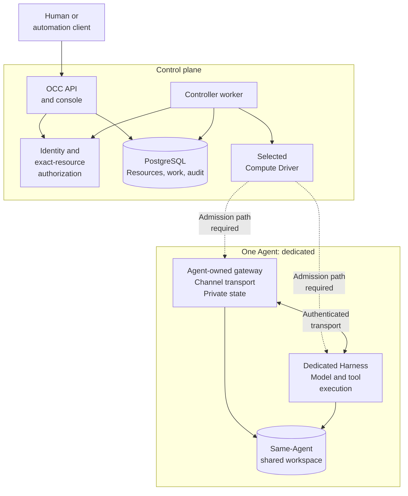
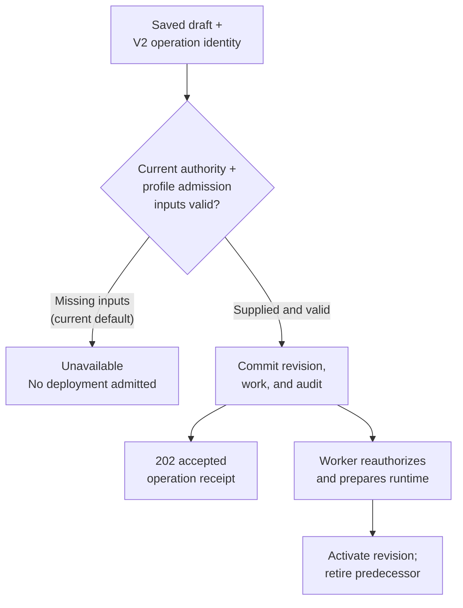

# `integration/dev` overview

**Team review snapshot · 8 September 2026 ·
[source `1a94f1c`](https://github.com/openclaw/openclaw-enterprise/commit/1a94f1c7f24443bd8f99aa6955466b117b134ea0)**

OpenClaw Enterprise is a multi-tenant control plane for configuring, deploying,
and operating Agents. `integration/dev` brings together the control plane,
runtime isolation, identity, credentials, channel delivery, and recovery work for
review before integration into `main`.

**The branch contains substantial implementations, but the new deployment and
hosted Gateway paths still require admission and protected startup dependencies
to be connected.**
Component tests and recorded evidence must be read within those limits.

This overview is a review entry point. The [platform design](design.md) owns the
target architecture; [current architecture](ARCHITECTURE.md) and
[feature references](reference/README.md) own implementation details and supported
behavior. This snapshot does not certify a release.

## System at a glance

The **OpenClaw Control Center (OCC)** owns platform resources, authorization, and
desired state. A separate worker realizes that state through selected **Drivers**,
which adapt infrastructure and external services. A **Harness** runs the Agent's
model and tools.

The diagram summarizes component ownership; dashed links mark the incomplete
default deployment path. Each Installation contains isolated Namespaces. Agents,
Configurations, Secrets, and ServiceAccounts belong to a Namespace; deployment
captures an immutable AgentRevision. Creating an Agent starts no workload.

The dedicated topology separates gateway and Harness identities, credentials,
and private state. Embedded OpenClaw combines gateway and Harness in one workload.
The Alpha gVisor path selects dedicated placement. See
[Harness execution](flows/harness-execution-topology.md) for both layouts.

## What the team is reviewing

| Area                               | Work present in the branch and its current boundary                                                                                                                                                                                                                                                                                                                                                                                            |
| ---------------------------------- | ---------------------------------------------------------------------------------------------------------------------------------------------------------------------------------------------------------------------------------------------------------------------------------------------------------------------------------------------------------------------------------------------------------------------------------------------- |
| **Control plane and console**      | API admission, exact-resource authorization, PostgreSQL persistence, bootstrap, worker composition, and Driver selection. The console supports browsing, Agent creation, and selected channel draft edits; deploy, rollback, deletion, and runtime-health controls remain unavailable. [Architecture](ARCHITECTURE.md) · [Console](reference/console.md)                                                                                       |
| **Deployment and recovery**        | Identified V2 commands, saved-draft checks, immutable revision admission, operation receipts, replay/recovery components, and worker cancellation. Default deployment lacks complete profile-admission inputs; lifecycle status reads lack their production dependencies. [Deployment](reference/lifecycle-deploy-v2.md) · [Status API](reference/lifecycle-status-api.md)                                                                     |
| **Runtime isolation and identity** | Docker/Kubernetes Compute, Alpha dedicated gVisor, Go SPIFFE identity consumption, and a narrow authenticated runtime-service listener. gVisor fixture coverage does not qualify the complete Codex/model path; runtime binding still requires genuine preparation and authority inputs. [gVisor](reference/drivers/gvisor.md) · [Runtime transport](reference/runtime-service-transport.md)                                                   |
| **Credentials and model access**   | Secret delivery, credential/profile contracts, and Rust DNS/TLS adapters for external model egress. Egress remains an implementation candidate requiring canonical authority. The Alpha runtime retains its documented Harness-readable credential placement. [Secrets](flows/secret-storage-and-delivery.md) · [Egress](reference/egress.md)                                                                                                  |
| **Channels and shared turns**      | Slack/Teams bindings, local hosted Gateway lifecycle, and PostgreSQL/process-local turn-journal implementations. Bindings alone do not admit turns; journal integration with channel, runtime, and canonical context storage remains required. Hosted Gateway executable startup is unavailable without protected bootstrap. [Channels](reference/channels.md) · [Gateway](reference/hosted-gateway.md) · [Journal](reference/turn-journal.md) |
| **Build and verification**         | Explicit TypeScript, Go, Rust, and image tooling; focused checks and integration suites; release-evidence collectors and validators. Release fixtures and evidence adapters remain unfinished. [Build graph](reference/build.md) · [Testing](testing.md) · [Release evidence](reference/release-evidence.md)                                                                                                                                   |

## Deployment: where the pieces meet

A V2 deployment command retains one operation identity and the exact draft the
caller intends to deploy. Admission must validate current authorization and the
selected workload profile before committing a revision, work, and audit together.
An accepted response is an **operation receipt**, not a running-Agent guarantee.

Both production and PostgreSQL development composition still lack the complete
profile-binding, capability, and inserted-row sources needed by this path.
Default lifecycle status/recovery reads return `503 DEPENDENCY_UNAVAILABLE`
without their current authorization and observation dependencies. See
[deployment integration requirements](reference/lifecycle-deploy-v2.md#verification-and-remaining-integration)
and [lifecycle status](reference/lifecycle-status-api.md).

## Review priorities

1. **Complete the production connections.** Trace an identified deployment through
   profile admission, durable work, runtime binding, Gateway bootstrap, and
   activation. Identify the real producer for every required input.
2. **Verify ownership through failure.** Check that authorization, workload identity,
   credentials, and storage stay bound to the exact Agent and revision through
   cancellation, replacement, and uncertain outcomes. A timeout alone does not
   establish that a provider stopped or that replay is safe.
3. **Exercise channels independently.** Manual mappings and local wrappers do not
   establish live delivery or recovery. Slack has documented live coverage;
   Teams still needs separately reviewed public-webhook and end-to-end verification.
4. **Assess evidence against the composed branch.** Separate component checks from
   real database, cluster, runtime, identity, model, and channel execution. The
   release harness currently marks every component fixture `to-build` and its
   adapters `pending`; imported passing results remain unverified claims.

Use the [development verification loop](development-loop.md) for focused editing,
complete handoff evidence, and combined integration checks. Record the source,
commands, outcomes, and whether evidence was executed, reused, failed, skipped,
or unavailable. A green test run can include skipped infrastructure suites.

## Working with this branch

Develop narrow changes in isolated worktrees. The coordinator serializes reviewed
changes into `integration/dev`, which remains parallel to `main`; the team reviews
the accumulated branch before landing it. Follow the repository's
[integration instructions](../AGENTS.md#development-integration) and retain the
required correctness, security, and outgoing-content reviews.

For a deeper review, start with [current architecture](ARCHITECTURE.md), then open
the feature references above. Use [deployment guidance](guides/deploy.md) for
environment setup and the [spec archive](../specs/README.md) for design history.
Recorded milestone completion is separate from current release acceptance.
