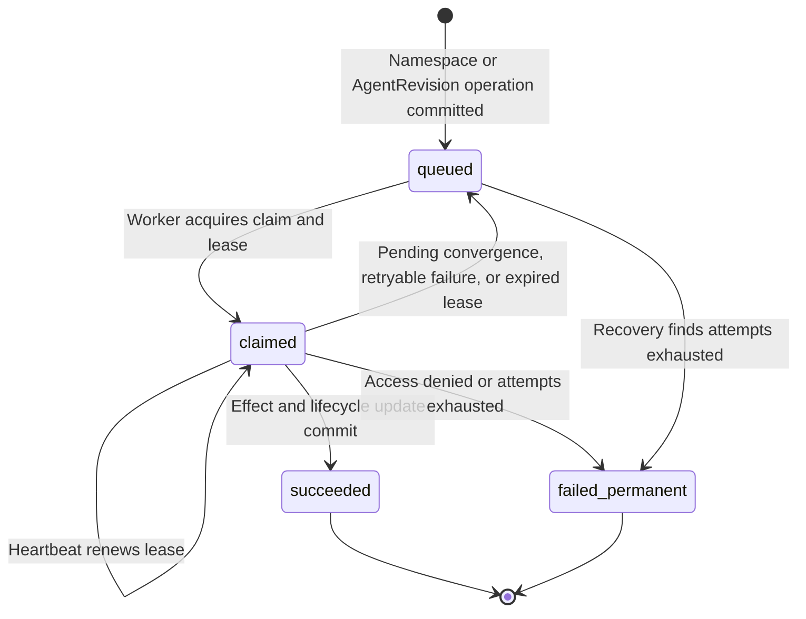

# Controller reconciliation

The controller worker advances Namespaces from `provisioning` to `ready`,
finishes deleting empty Namespaces, and prepares and activates admitted Agent
revisions. It runs separately from the OpenClaw Control Center
(OCC) HTTP API, polls durable PostgreSQL work, and calls its selected Compute
Driver. The supported development default is the bundled Docker Compute
Driver, which creates one Docker network per Namespace and starts real
OpenClaw/Codex containers for admitted revisions. Both development and
production workers can use reviewed bundled or installed Drivers and reconcile
Namespace operations plus supported Agent revisions. The bundled Kubernetes
Driver supports embedded OpenClaw and dedicated Codex; see
[deployment guide](../guides/deploy.md).

This reference owns durable reconciliation, queue states, and recovery guarantees.
The [worker flow](../flows/controller-worker.md) explains their execution through
the source; the [quickstart](../guides/quickstart.md) and deployment guide own
process startup procedures.

## Requirements

- Node.js 24 or newer and the repository's existing workspace dependencies.
- For the supported development path, Docker Engine and `docker compose`.
- A migrated local PostgreSQL database and an API using the same application
  connection; the full Compose stack starts both. See the
  [configuration reference](settings.md#local-compose-and-postgresql-configuration).
- For default PostgreSQL-backed development, the API must also use the
  filesystem Configuration Driver root. Compose mounts `occ_configuration_data`
  only into the controller at `/app/.development/configurations`.
- A bootstrapped Installation. Compose's `bootstrap` service and the Helm
  initialization Job run `scripts/bootstrap-installation.mjs` after migration
  and before the API or worker. Direct-process setups run that initializer first.
- `NODE_ENV=development` or `NODE_ENV=production` and the application-role
  `OCC_DATABASE_URL`.
- In production, the shared absolute `OCC_CONFIG_PATH` to trusted Installation
  startup YAML selecting the approved IAM, Compute, and Configuration Drivers.

The worker does not support process-local state. Never start it with migration or
PostgreSQL administrator credentials.

## Configuration

The worker requires its own `NODE_ENV` and `OCC_DATABASE_URL`. Production also
requires the same absolute `OCC_CONFIG_PATH` startup YAML as the API.
Development omits `OCC_CONFIG_PATH` to select the bundled Docker Compute
Driver; the default filesystem Configuration Driver is API-only and uses the
controller's `OCC_DEVELOPMENT_CONFIGURATION_ROOT`. Set `OCC_CONFIG_PATH` only to
choose another trusted Driver set explicitly. The worker resolves the singleton
Installation internally. Driver IDs,
implementations, and closed-schema settings come from the YAML; worker
environment variables can tune the poll interval, claim lease, maximum
attempts, and optional readiness-marker path. Defaults and validation are
defined in the [worker configuration reference](settings.md#controller-worker-environment).

The API's listener and Better Auth settings are not worker inputs. Both
processes must use the same migrated PostgreSQL database.

## Startup and readiness contract

Both processes resolve the persisted singleton Installation internally. Their
YAML selects the approved IAM, Compute, and Configuration Drivers. Reviewed
bundled and installed implementations are available in development and
production. Driver-owned closed schemas are validated before construction;
missing files, unknown fields, unavailable implementations, or plaintext
credentials fail closed. See the [Configuration guide](configuration.md).

The API additionally requires `OCC_AUTH_SECRET` and `OCC_AUTH_BASE_URL`.
Better Auth sessions authenticate controller API callers; ordinary
exact-resource IAM permissions and Restrictions still authorize every
operation. Operators must expose the API only through an internal `ClusterIP`
Service and enforce default-deny ingress with explicitly approved namespace and
Pod selectors.

Before serving requests or claiming work, both processes verify the existing
Installation and persisted IAM state. When the bundled Kubernetes Compute
Driver is selected, they also verify explicit Kubernetes credentials, TLS
trust, and exact Kubernetes Namespace access. The bundled Kubernetes
Configuration Driver validates its authentication settings at startup but
checks tenant ConfigMap access only when its first CRUD request runs; a
driver-managed provisioning Namespace can return `503` until its tenant
namespace and API RoleBinding exist. Explicitly selected external Namespaces
instead reject Configuration creation with `409` until ready. AgentRevisions
retain their selected Compute identity and immutable
Configuration snapshot and explicit Harness execution mode. Production worker
claim, stale-claim recovery, and backlog queries include Namespace and both
approved AgentRevision pairs: `dedicated` Codex and `embedded` OpenClaw. Each
Agent-owned gateway serves only its own active revision; unsupported
Harness/mode combinations and external ingress remain unavailable.

## Namespace lifecycle

Creating a Namespace saves `provisioning` and queues its provisioning operation
in the same transaction. An Installation administrator can also specify
`existingNamespace` to persist the exact existing Kubernetes namespace before
provisioning starts. Before acting, the worker reloads current IAM policy,
reauthorizes the original actor, and confirms the operation still belongs to
its exact Namespace. External selection additionally requires Installation
`administer` authorization at admission and immediately before adoption. The
worker asks the Compute Driver to ensure backing infrastructure and sets `ready`
once it is ready; selecting an existing namespace never requires stopping the
shared worker.

Deleting an empty Namespace saves `deleting` and queues a distinct teardown
operation. The worker rechecks the original actor's permission, asks the same
Compute Driver to delete the Namespace and its owned Agent gateways, and records
a tombstone after Namespace deletion. Tombstoned Namespaces disappear from public reads.

Selected non-Compute Drivers may run hooks after Namespace infrastructure
readiness, before workload start, before workload retirement, and before
Namespace removal. Compute owns every transition; revocation failures block
teardown, launch values are restricted to `opaque-` placeholders, and production
workers process Namespace operations plus embedded OpenClaw and dedicated Codex
Agent revisions. See
[ComputeDriver lifecycle hooks](drivers/compute.md#optional-selected-driver-hooks).

Backing infrastructure behavior is defined by the selected
[Docker](drivers/docker-compute.md) or [Kubernetes](drivers/kubernetes-compute.md)
Compute implementation. A successful
queue transition does not itself establish enforcement of cluster admission,
NetworkPolicy, or a SandboxDriver facet; those guarantees require the selected
implementation and its documented infrastructure.

## AgentRevision lifecycle

An authorized bodyless Agent deployment reads its exact Namespace-owned native
Configuration and permits the selected SandboxDriver to transform a copy before
validation. It snapshots the admitted document, including unresolved inline
SecretRefs, alongside the native-selected Harness identity,
server-approved version, explicit Agent execution mode, and Compute
implementation. If the Agent has an associated native
[service account](service-accounts.md), the revision also snapshots its
identity and opaque credential reference. OCC separately
authorizes the referenced Configuration and any exact associated account,
then atomically records the new running intent, exact success audit, immutable
revision admission association, and original revision operation. New deployment
work is mandatory even for direct OCC callers using `recordOperations: false`.
The source Configuration identity and generation remain pinned even when the
admitted copy differs. Later Configuration, account, or Agent placement changes
never mutate an admitted revision; see [Agent references and deployment](agents.md#revisions-and-deployment).
PostgreSQL enforces the exact admitted snapshot shape, so the worker trusts
persisted structure instead of revalidating it.

Before processing that operation, the worker reloads current IAM policy,
reauthorizes the original actor for the exact Agent and `read` on any exact
account captured in the immutable revision, and checks its owning ready
Namespace, stable Agent-owned service principal, and whether the pinned Harness
identity, version, execution mode, and Compute implementation are approved.
Account authorization uses the revision snapshot, not a later mutable Agent
association. Revoked account access fails the operation permanently with
`AUTHORIZATION_DENIED`, records an attributable deployment-denial audit, and
never calls Compute or activates the revision. Production accepts both dedicated
Codex and embedded OpenClaw. It prepares the candidate
and its Agent-owned gateway, records the exact active revision, activates the
existing concrete Kubernetes route when applicable, and retires the prior
revision. The live claim remains unfinished until the worker atomically records
one attributable activation audit and completes the durable operation.
Already-active recovery repeats safe route activation and predecessor retirement
before that same audit/finalization; idle dedicated app-servers can overlap,
but normal reconciliation routes requests only to the active revision. This does
not provide independent process fencing during Kubernetes node partitions or
manual replacement; see the [gateway rollout limitation](drivers/kubernetes-compute.md#execution-modes).
See the
[Harness execution topology flow](../flows/harness-execution-topology.md) for the
full placement, runtime, and recovery sequence.

A recovered older operation never replaces a newer active revision: the worker
marks it superseded without calling Compute. Sibling Agents have independent
queue lanes, while revisions for the same Agent serialize. The default
PostgreSQL-backed development Compute Driver provisions Docker resources; manual
host-process debugging also needs PostgreSQL for a durable worker path. The explicitly selected
Kubernetes driver creates a hardened Deployment and dedicated Kubernetes
ServiceAccount for the revision's existing Agent ServicePrincipal. Its
audience-scoped projected token is required in production but does not
implement ServicePrincipal token verification or exchange. The Agent Service
remains nonserving until its exact
revision is active. Production then selects that Agent's ready workload;
selected SandboxDriver facets are pinned at admission and enforced by the
selected Driver. See the [SandboxDriver contract](drivers/sandbox.md) for
provider-specific preparation and failure boundaries.

## Worker implementation and verification

[ControllerWorker](../../apps/controller/src/worker.ts) retains the public
construction, startup, shutdown, and selected Driver lifecycle. It composes seven
internal modules. The [runner](../../apps/controller/src/worker/runner.ts) polls,
recovers stale claims, dispatches work, and reports health.
[Namespace reconciliation](../../apps/controller/src/worker/namespaces.ts) and
[revision reconciliation](../../apps/controller/src/worker/revisions.ts) preserve
the exact claim, original actor, resource scope, and immutable admission checks.
[Revision inputs](../../apps/controller/src/worker/revision-inputs.ts) resolve
current authorization, Provider bindings, and scoped Secret projections;
[cleanup](../../apps/controller/src/worker/cleanup.ts) performs the ordered
activation, predecessor retirement, and maintenance effects.

Each effect uses [LeasedEffects](../../apps/controller/src/worker/leased-effect.ts)
to renew the claim before calling the Driver and serialize periodic heartbeats.
Claim loss or shutdown propagates cooperative cancellation to the active effect;
its lease scope drains pending heartbeat work before returning. Composition
supplies narrow repository callbacks and frozen projections of explicitly
selected, bound repository and queue methods. These projections restrict both
the TypeScript interface and the runtime method surface.

[Finalization](../../apps/controller/src/worker/finalization.ts) alone owns
lifecycle publication, audit writes, and queue outcomes. Namespace publication
and completion share one queue-bound transaction. Revision success preserves the
staged sequence: compare-and-set the active revision in the first transaction,
perform applicable activation and retirement effects, then recheck the claim,
Agent principal, and active revision before recording the activation audit and
completing work in a second transaction. Activation required before the first
commit remains in revision reconciliation. Failed intervening effects retain
the existing pending and recovery behavior.

With the [PostgreSQL application-role test configuration](settings.md#postgresql-test-environment),
run [postgres-worker-leases.test.mjs](../../tests/integration/postgres-worker-leases.test.mjs)
and [postgres-worker-reconciliation.test.mjs](../../tests/integration/postgres-worker-reconciliation.test.mjs)
using `node --test` and each file's path. The lease suite targets actual database
lease loss, successor-claim protection, and shutdown draining. The reconciliation
suite targets claim identity and attribution, Namespace denial and supersession,
active-revision compare-and-set races, failure between publication and completion,
and transactional audit rollback. Their recording Drivers observe worker
ordering; live Docker, Kubernetes, and Harness execution require their separate
runtime suites described in the [testing guide](../testing.md).

## Controller queue states

Every controller operation persists in PostgreSQL and moves through the
following states:

- **`queued`:** The operation is durable and awaiting an eligible worker. New
  work becomes available immediately; retries wait until their persisted
  backoff expires. Both development and production workers process Namespace
  operations and admitted AgentRevisions through the selected bundled or
  installed Compute Driver. The bundled Kubernetes Driver supports embedded
  OpenClaw and dedicated Codex in both modes.
- **`claimed`:** One worker owns a time-limited claim and increments the attempt
  count. It checks current authorization, calls the appropriate Compute Driver
  method, renews its lease before each effect, and keeps renewing while it runs.
  Consecutive short effects must not starve renewal. Only the current claim
  token can publish lifecycle state, audit evidence, or completion.
- **`succeeded`:** The exact Namespace or AgentRevision operation completed
  successfully. Namespace transitions finalize with their audit; an Agent
  revision first becomes active and publishes its route, then commits its
  activation audit and queue completion together. This terminal record remains
  available for idempotency.
- **`failed_permanent`:** Processing stopped because authorization failed, an
  unrecoverable error occurred, or the retry limit was exhausted. The failure
  is audited, and the terminal operation is never retried automatically.

### Deferred Namespace and Agent convergence

The worker defers a Namespace or AgentRevision operation when its Compute Driver
successfully observes infrastructure that is not ready yet and reports no
operational failure. Examples include waiting for an operator-provisioned
tenant RoleBinding, Agent image startup, a ready gateway Pod or EndpointSlice,
or completion of Kubernetes Namespace deletion.

`defer()` is a transition, not an additional queue state. It returns the work
to `queued`, releases its claim, schedules bounded backoff, records audit
evidence, and restores the attempt consumed when the work was claimed. The
worker can observe ordinary convergence repeatedly without exhausting its
failure budget.

Actual dependency failures instead use `retry()`, which also returns work to
`queued` but retains the consumed attempt. Once `OCC_WORKER_MAX_ATTEMPTS` is
exhausted, the operation becomes `failed_permanent`. Pending convergence has
its own limit: `OCC_WORKER_CONVERGENCE_TIMEOUT_MS`, measured from the original
operation creation time. Exceeding it fails the operation with
`CONVERGENCE_DEADLINE_EXCEEDED`. See the
[worker configuration reference](settings.md#controller-worker-environment) for
defaults and supported overrides.

For Agent replacement, the existing route remains live while its nonserving
replacement starts. The worker preserves the predecessor's Service selector
until fenced activation succeeds, then publishes only the verified replacement
and retires the previous workload. Failed activation leaves the predecessor
and its route intact.

If a worker exits or stops renewing its lease, stale-claim recovery either
requeues the operation or marks it `failed_permanent` after its final attempt.
Recovery can also terminalize an already queued operation whose attempts are
exhausted.

## Authorization, retries, and scope

- Namespace provisioning and deletion remain the only Namespace infrastructure
  operations; AgentRevision preparation and retirement use the same Compute
  Driver while preserving each Agent's stable gateway identity.
- PostgreSQL accepts only Namespace lifecycle work or fully owned
  AgentRevision work and rejects malformed queue shapes.
- Creating or updating Agent metadata does not enqueue infrastructure work.
- Every admitted AgentRevision is created through the canonical deployment
  path with pinned Harness and Compute metadata, then processed asynchronously.
- Work is isolated by `namespaceId`. Namespace lifecycle operations serialize
  per Namespace, while the underlying queue preserves independent Agent lanes.
- Current IAM policy is reloaded before each effect. Revoked access fails
  permanently without calling Compute; temporary dependency failures retry.
- Expiring claim leases recover interrupted work. A stale worker cannot commit
  Namespace changes, revision activation, audit evidence, or completion after
  losing its claim.

## Observability

Use the [observability guide](../guides/observability.md) to set log levels,
configure export, and verify delivery. The API and worker share the OCC Pino
logger. The API disables Fastify's default request logging and emits one
sanitized `http.completed` record per response with the generated
request ID, method, route template, status, and duration. Unexpected internal
failures add `http.unexpected_error` with a bounded error code.

The worker emits fixed operational event classes through the same logger:

- `worker.started`: confirms the selected Compute Driver and optional
  SandboxDriver.
- `worker.health`: reports readiness and pending work count at debug level.
- `worker.completed`: includes `namespaceId`, work identity, attempt, outcome,
  and a stable result code; AgentRevision operations also include `agentId` and
  `revisionId`.
- `worker.error`: reports `CLAIM_LOST` or `WORKER_UNAVAILABLE` without exposing
  credentials.
- `worker.stopped`: confirms graceful shutdown.

Bootstrap and migration scripts use the same level and write machine-protocol
success records to stdout. Their structured failure diagnostics go to stderr.
Startup failures write `startup-error`, `worker.startup-error`,
`installation.bootstrap-failed`, or `migration.failed` and exit before serving
or processing work. Log sanitization keeps only reviewed scalar fields and drops
credentials, provider payloads, request objects, and unbounded error values. The
worker does not expose an HTTP health endpoint.

## Failures and diagnostics

- **Namespace stays `provisioning`:** Start the separate worker, verify both
  processes use the same database, and inspect `worker.health` and
  `worker.completed` output.
- **Docker Namespace or Agent container does not become ready:** Confirm Docker
  Engine access from the worker, image availability, the configured runtime
  image variables, the trusted Compose bridge CIDR, and the per-Namespace
  Docker network labels. Use
  [Docker Compute Driver troubleshooting](drivers/docker-compute.md#troubleshooting).
- **Configuration creation returns `503`:** Confirm the API, not the worker,
  has `OCC_DEVELOPMENT_CONFIGURATION_ROOT` set and can write the
  `/app/.development/configurations` mount backed by `occ_configuration_data`.
- **AgentRevision does not activate:** Confirm its Namespace is `ready`, the
  original actor retains exact-Agent `deploy` permission and `read` on any
  account in its immutable revision, and its pinned Harness descriptor and
  Compute implementation match the worker.
- **Kubernetes Namespace or Agent workload does not become ready:** Confirm
  the API and worker selected the same configured driver and the worker uses
  the bootstrapped singleton Installation; check explicit cluster authentication,
  externally provisioned tenant-local RBAC, enforced NetworkPolicies, image
  availability, and gateway EndpointSlices. For local Kubernetes runs, confirm the
  dedicated context uses a loopback-only API and the fixture image was imported;
  see the
  [Kubernetes Compute Driver guide](drivers/kubernetes-compute.md).
- **Installation is not bootstrapped:** Confirm the Compose `bootstrap` service
  or Helm initialization Job succeeded against the API/worker database. For
  direct-process setup, run `scripts/bootstrap-installation.mjs` with the selected
  environment's protected output settings before starting either process.
  Resolve [failed initialization](../guides/deploy.md#recover-an-incomplete-bootstrap)
  manually before another attempt; bootstrap does not clean up or retry.
- **Startup YAML is missing or rejected:** Set production `OCC_CONFIG_PATH` to
  the same absolute, readable file for API and worker. Remove unknown Driver
  fields and plaintext credentials; verify all selected Driver
  implementations and exact Kubernetes access.
- **Configuration operations fail:** Verify exact Namespace or Configuration
  authorization, tenant-local ConfigMap CRUD, and a native JSON configuration
  document;
  see [Configuration troubleshooting](configuration.md#failure-semantics-and-limitations).
- **`A valid PostgreSQL connection URL must be explicitly configured.`:** Set
  `OCC_DATABASE_URL` to the migrated application's `postgresql:` connection.
- **Worker mode is rejected:** Set `NODE_ENV=development` or
  `NODE_ENV=production` explicitly. Production additionally requires valid
  trusted startup YAML selecting the supported Kubernetes Drivers.
- **`AUTHORIZATION_DENIED` or `ACTOR_REVOKED`:** Inspect the initiating actor's
  current role, binding, exact-Namespace Restrictions, and `read` permission on
  any service account captured in the immutable revision; see [IAM](authorization.md).
- **`CLAIM_LOST`:** Another valid claim recovered the operation. The stale
  attempt cannot publish lifecycle state; inspect subsequent worker events.

## Related

- [API operations, authentication, and permission reference](api.md)
- [Namespace lifecycle and deletion](namespaces.md)
- [Agent Configuration, revisions, and deployment](agents.md)
- [Native service accounts and account authorization](service-accounts.md)
- [Controller and PostgreSQL configuration](settings.md)
- [Docker Compute Driver and Compose development](drivers/docker-compute.md)
- [Namespace Configuration and Kubernetes ConfigMaps](configuration.md)
- [Kubernetes Compute Driver and local-cluster verification](drivers/kubernetes-compute.md)
- [Identity and access management](authorization.md)
- [Implementation architecture](../ARCHITECTURE.md)

## Internal runtime intent and allocation records

OCC state repositories expose `runtimeAssignments` for immutable per-Agent intent
history and unbound runtime allocations. The current intent head advances by
expected-generation compare-and-set. Allocations require a ready Namespace,
an exact current running intent and an admitted AgentRevision; their gateway and
harness generations advance independently under an Agent lock. Runtime mutations
within one unit of work also execute serially, including calls awaited together
with `Promise.allSettled`; stale generations conflict against the preceding
mutation’s state. PostgreSQL
constraints and triggers preserve ownership, immutable history and monotonic
sequences. The in-memory adapter preserves the same observable transaction
behavior within one process.

The controller delegates its shared mutation boundary to
[MutationRunner](../../packages/occ/src/application/mutation-runner.ts). Nested
transactions, mutations, and reads join its current unit of work. The outer
transaction creates a missing Installation or rejects a different Installation ID
before running its work. Registered Driver compensations belong to that outer
unit and run in reverse order on an ordinary failure. A deployment admission
failure marks the unit as failed even if its caller catches the rejection.
`forRepositories` copies explicit repository and method selections for read and
mutation callbacks and supplies frozen projections of bound method delegates,
including when a read joins a mutable unit. The store retains ownership of
commit, accepted-operation draining, and repository-handle lifetime.
`PostgresCommitOutcomeUnknownError` is rethrown without compensation or replay;
recovery still uses the caller's retained admission locator.

Verify the runner and wired controller with
`node --test tests/conformance/mutation-coordinator.test.mjs` and, with the existing
[PostgreSQL application-role test configuration](settings.md#postgresql-test-environment),
`node --test tests/integration/postgres-mutation-atomicity.test.mjs`.

The bodyless deployment route and canonical `deployAgent` domain operation now
admit running intents. They initialize an absent head or advance its exact stored
running generation; disabled and stopped heads conflict. They do not allocate
provider instances, select runtime policy, bind identities, or establish current
execution authority. Historical revisions have no admission association unless
explicitly admitted through this operation; existing active pointers and healthy
workloads are not backfilled. Profile references identify stored values only;
persistence does not approve a runtime profile or attest a guest.

Every `deployAgent` caller supplies a mandatory `DeployAgentAdmissionContext` with
a UUID-v4 `transitionRef`, sanitized `requestId`, and synchronous trusted audit
factory. It retains the context before opening its outer transaction. The
canonical operation verifies the resulting event's exact actor, action, request,
scope, and revision before appending it once. The API derives these inputs from
its authenticated request and retains the existing `202` response shape.

`runtimeAdmissions` exposes narrow internal reads for each revision's immutable
original association and committed-admission recovery. After an unknown COMMIT,
`recoverDeployAgent` opens a fresh read transaction and requires the exact retained
intent, revision owner and service principal, original reconcile work, and
successful audit. Completed or permanently failed original work remains valid
admission evidence, including after a newer head exists. Missing, mismatched, or
unavailable proof remains unavailable; recovery never automatically deploys a
duplicate. No additional revision-read permission is required by this internal
recovery path. Retained caller memory is required; repeated HTTP POSTs are not
idempotent.

Before opening a transaction, the trusted caller retains a fresh UUID-v4
`transitionRef` or `createEffectRef`. After `PostgresCommitOutcomeUnknownError`,
read the exact locator under the same Namespace/Agent scope before deciding any
next action. Intent locator reuse conflicts. Exact allocation effect replay
returns the original immutable record, including after head advancement; changed
component, generation or profile inputs conflict. Historical readback grants no
current runtime authority. Actor and diagnostic request references are retained
independently of identity revocation; they are bounded reference strings, not
credentials or implicit idempotency keys. Attribution and profile references
contain 1–200 ASCII letters, digits, dots, underscores, colons, slashes or hyphens.

Verify with `node --test tests/conformance/runtime-assignment-memory.test.mjs`
and, with the existing PostgreSQL application-role test configuration,
`node --test tests/integration/postgres-runtime-assignment-state.test.mjs`.
The database suite verifies real constraints, concurrent transactions and lost
COMMIT acknowledgement. It explicitly skips when its database URL is absent.
The admission bridge is covered by
`node --test tests/conformance/runtime-admission-memory.test.mjs` and
`node --test tests/integration/postgres-runtime-admission.test.mjs`, alongside the
actual API and revision-worker suites. These tests establish persistence and
controller behavior; selected test Compute observations do not prove live
provider identity or effect fencing.
