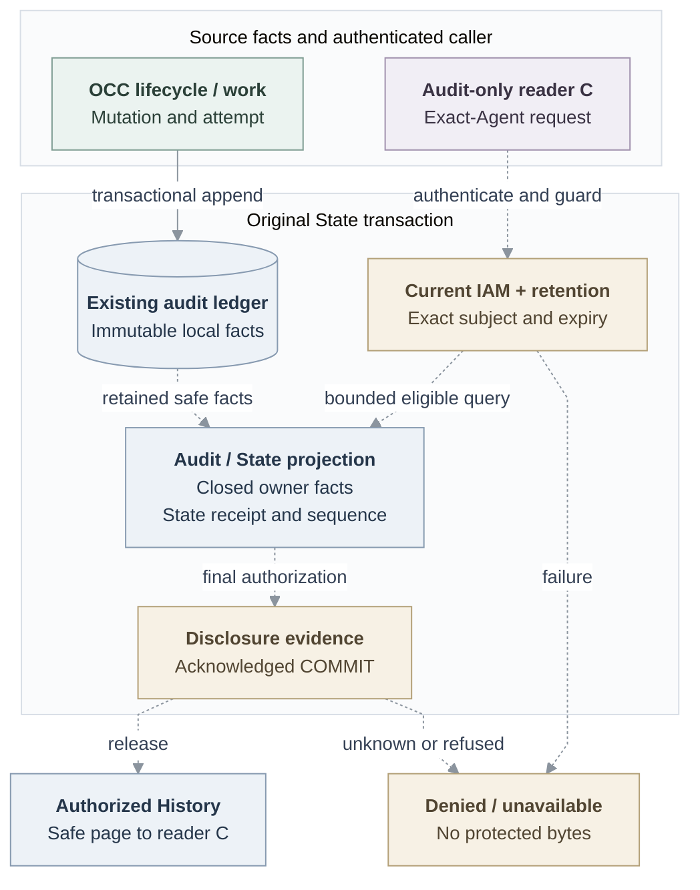

# RFC: Basic Agent observability

**Date:** 2026-09-18

**Status:** Proposed; selected scope, implementation and qualification pending.

**Owners:** OCC lifecycle, Audit/State, selected IAM Driver; authentication, runtime and credential owners supply their facts.

**Historical source baseline:** `046e12b007bb1b4928bd3f7497a2353714be11a8`. Source checks below additionally pin main and separate suppliers; they do not establish deployment.

## Decision

A deploys a personal or team Agent; different requester B asks it to read an approved GitHub repository's HEAD. Separately granted reader C opens History and follows the original initiator, Agent/revision executor, exact resource/authorization, accepted work and strongest observed result. Missing attribution stays unresolved; uncertain execution stays unknown.

Deliver optional diagnostics, then create/update/deploy/stop History with a small console, then the genuine [ordinary-Agent repository read](31-basic-observability/repository-read.md). Personal/team Agents share the existing resource model. Ownership, membership, participation, deployment rights and known IDs confer no History access; content authority remains separate.

First serving History requires current account/IAM/State, exact mutation recovery and the complete [retention contract](31-basic-observability/retention.md): default 30-day expiry, live-ledger deletion within another 24 hours, explicit indefinite mode and restore continuity. Missing capability or dependency failure makes protected History unavailable, without automatic downgrade.

## Current boundary and scope

Pinned main provides transactional lifecycle audit and [State append/list](https://github.com/openclaw/openclaw-enterprise/blob/724dcb5cb80b5e76a62e8267a21185a2e91a85c2/packages/occ/src/state/platform-state.ts#L410), not bounded History. Controller work records deployment/reconciliation authority, not B's invocation. The [platform design](https://github.com/openclaw/openclaw-enterprise/blob/724dcb5cb80b5e76a62e8267a21185a2e91a85c2/docs/design.md) and current references remain authoritative until implementation updates them. All new routes and joins below remain proposals.

### Optional diagnostics

Start with the [observability procedure](https://github.com/openclaw/openclaw-enterprise/blob/e5ddd0b91306dbcd4ffcda13eb8352fd88c468f8/docs/guides/observability.md). The separate [file overlay](https://github.com/openclaw/openclaw-enterprise/blob/e5ddd0b91306dbcd4ffcda13eb8352fd88c468f8/compose.logging.local.yaml) places an operator-owned OTLP receiver behind the filtered Collector, using the pinned image, read-only native configuration, mounted output directory and existing `OTEL_EXPORTER_OTLP_LOGS_ENDPOINT`. Add no application log API, global mode or Agent file mount. Trusted Drivers may retain `runtimeLogging: "driver"` pipelines.

Ordinary development needs no Collector. Authentication, exact selected-IAM authorization, secret filtering and mandatory PostgreSQL audit remain enforced. Operators own file access, rotation, disk bounds, copies and cleanup. Best-effort diagnostics establish no protected History, receipt, complete attribution, verified execution, retention or independent integrity; later History cannot promote old logs into evidence.

## Design and failure behavior

### Facts and their owners

Extend the existing ledger: lifecycle/work produces causation; Audit validates owner-specific facts; State persists and queries; selected IAM authorizes; HTTP and console disclose. Provider-specific behavior stays in the credential Driver/Provider.

The solid edge is [existing transactional audit](https://github.com/openclaw/openclaw-enterprise/blob/724dcb5cb80b5e76a62e8267a21185a2e91a85c2/apps/controller/src/index.ts#L1765). Dashed edges are proposed History integration. Source proves neither their composition nor installed behavior. Diagnostics remain independent.

Use `AuditHistoryFactV1` and State-created `AuditHistoryEventV1`, schema `openclaw.audit-history/v1`, as separated in the [lifecycle supplier](https://github.com/openclaw/openclaw-enterprise/blob/e8cc2b47ec181d802d5f92a63ac49945a676b99e/packages/contracts/src/audit-history.ts#L185). Preserve nominal/prefixed and owner-issued opaque IDs; never truncate authoritative IDs. Reject unknown versions/fields, excessive depth, unsafe text and events over **8,192 encoded UTF-8 bytes**.

| Safe projection         | Required meaning                                                                                                                                                                                        |
| ----------------------- | ------------------------------------------------------------------------------------------------------------------------------------------------------------------------------------------------------- |
| Identity                | Stable event ID, server-owned Installation/Namespace, exact historical Agent subject and affected resource.                                                                                             |
| Time and result         | Tagged database receipt or explicit legacy anchor; separate producer `occurredAt`; closed source/action/phase/result/reason. Requested, accepted, observed and unknown remain distinct.                 |
| Attribution             | Authenticated initiator or unresolved; separate controller or genuine Agent/revision/ServicePrincipal executor and truthful assurance.                                                                  |
| Authority and causation | Established IAM decision, actual authorization principal, exact action/resource, Driver and available admission ID; stable operation and available request/admission/parent-event/revision/attempt IDs. |

Internal `AuditEvent.outcome` remains `success/denied/failure`. Legacy facts require original trusted provenance; never synthesize causation. One ID identifies one immutable fact; conflicting reuse fails. Mutation, mandatory evidence and work intent commit together; work preserves causation across claims, retries, supersession, completion and failure. Queue completion cannot certify physical stop or provider success.

Validate closed projections before persistence and disclosure. Exclude raw `details`, credentials, custody handles, identity labels/issuer/subject claims, requests/plans, URLs, headers, commands, paths, prompts, responses, provider bodies and exception text. Browser, Agent, model/tool, header, provider and network data cannot assert owner facts. Opaque references remain protected metadata, never lookup authority; serialized assurance grants no effect authority.

**Proposal — owner decision pending:** Audit/State/authentication freeze event/view membership around real producers: lifecycle first, repository facts after accepted exports. Account/login facts retain authentication-owned transactions and subjects; disclosure/Installation-retention facts remain mandatory in the common ledger without fabricated Agent subjects or speculative lifecycle enums.

### Access and disclosure

| Fixed role                      | Exact permission and target                              |
| ------------------------------- | -------------------------------------------------------- |
| `audit_reader`                  | `read_audit`: exact Agent or Namespace-wide Agents only. |
| `audit_retention_administrator` | Only `manage_audit_retention`: singleton Installation.   |

Ordinary `read/operate/administer` imply neither action. Installation `administer` explicitly grants/revokes these roles for existing identities/groups through [common IAM administration](31-basic-rbac.md). Consume `IAMPolicyAdministrationV1.bindPolicy`; OCC owns `readPolicy/applyChange/readPolicyOperation`. Its bounded atomic writer validates subjects/targets, owns IDs, and commits bindings, revision, withdrawal intent, receipt and evidence in original State. Preserve revoked-binding identity, unknown-COMMIT recovery and the last usable local administrator guard. Authentic retained Agent parentage enables grant/revoke/regrant after deletion only for the fixed audit role, retaining exact filters; caller parentage and ordinary-grant exceptions are forbidden. Accept/compile exports before composition; unsupported transactional Drivers fail without Native fallback, another catalog/writer or remote mutation.

`GET /namespaces/:namespaceId/agents/:agentId/history` returns safe events and an optional cursor in the existing API envelope. Require current exact historical-Agent `read_audit`, not a live Agent row. Use indexed `PlatformUnitOfWork.audit.queryAgentHistory`, its lifetime binder and adapters; never filter unbounded `list()`. Limit **1–100**; optional operation/revision/time/closed-result filters. Descending database bigint keysets travel as decimal strings. Authenticate a bounded versioned cursor binding Installation, current principal, Driver, subject, normalized filters, original upper/last sequence and expiry. Proposed query defaults are 50 events and cursors bounded to 4,096 bytes/15 minutes; these do not select recovery validity. Bound validation work; no authority, snapshot, total count or Installation scan is implied. Commits and retention can change subsequent pages.

Each page and exact recovery uses one short **READ COMMITTED State write transaction with IAM read-bound authorization**. Bind intent before resource locks: Installation authority → sorted required account/session guards → complete native policy-table barrier/head → protected resources → retention `FOR SHARE`. No late policy upgrade. Sample database time after locking, authorize and query; reauthorize immediately before disclosure append. Release bytes only after acknowledged COMMIT. Earlier committed revoke prevents disclosure; refused/unknown commit or dependency failure returns a sanitized error without a page. Released bytes cannot be recalled. Review all participating writers' SQL.

**Proposal — owner decision pending:** State/Audit/API specify expiry crossing between the selected post-lock timestamp and response release, with bounded transactions, cancellation and fail-closed release. Do not silently resample or extend expiry. Acceptance must settle this rule for pages and recovery.

The direct exact-Agent console needs no configuration-read permission. Use no-store responses, escaped DOM, request-ID errors and view cancellation; handle loading, empty, denied, error, pagination, stale responses and unknown outcomes.

### Exact mutation recovery

Unknown COMMIT for `createAgent/updateAgent/deployAgent/stopAgent` returns **503 `UNKNOWN_OUTCOME`**, safe Namespace/Agent/event/operation IDs and a sealed reference. Observe through `GET /namespaces/:namespaceId/agents/:agentId/mutation-outcomes/:eventId`, supplying the reference in a dedicated header. Verify it before trusting claims; match every path/retained identity, original principal and selected Driver. Reauthorize the original primary action/target: Namespace Agent collection for create, exact Agent otherwise. Neither a live row nor `read_audit` is required. Use indexed exact-event lookup and the disclosure/restore gates.

`accepted` returns only bound action, operation/event/Agent and applicable revision IDs, proving local acceptance. Missing, expired, erased, unverifiable or uncertain evidence stays `unknown`, never rollback. Malformed inputs/denials expose no facts; dependency errors remain sanitized. Observation reveals no other history/configuration/provider data and creates no work; an explicit later mutation is new.

After authentication, allocate audit ID and operation UUID before outer State; carry server request ID through narrow `AgentMutationContext`. Lifecycle owns Agent/revision IDs; deploy/stop retain context in work. The accepted event binds subject/resource, original primary target/action, initiator, Driver, operation/request. State prepares only from that transaction's appended event; seal a bounded purpose-specific reference **before COMMIT**, aborting on preparation/sealing failure. The original transaction owner drains/classifies COMMIT, suppresses unsafe compensation and preserves the prepared reference through uncertainty. A prepared signature proves no commit.

**Proposal — owner decision pending:** composition/operators provision a shared purpose-specific key ring; choose envelope/header/limits, concrete finite validity, rotation and verifier retention, including indefinite records. Preserve supported restart/replica continuity, pre-distribute verifiers before signer rollover, separate cursor purpose and exclude references from logs/telemetry. Do not borrow cursor lifetime. Account/policy receipts and durable invocation/reply fences keep their owners and lifetimes; audit erasure cannot permit redispatch.

### Evidence failure

New authority, privileged mutation, credential dispatch, retention changes and disclosure require established local evidence before effects/bytes; new restrictive intent shares the transaction. Already accepted protective work may continue during remote-delivery failure. Audit failure must not block safe refusal/closure or fabricate durable stop/revoke acceptance. Report append refusal, unknown COMMIT, pressure and overdue erasure through sanitized health without protected content/high-cardinality labels. Application roles cannot alter accepted facts; trusted producer compromise, database/host administrators and independent backups are outside local integrity assurance.

## Acceptance and delivery

| Increment                       | Required evidence before claiming completion                                                                                                                                                                                                                                                                                                                                                             |
| ------------------------------- | -------------------------------------------------------------------------------------------------------------------------------------------------------------------------------------------------------------------------------------------------------------------------------------------------------------------------------------------------------------------------------------------------------- |
| Diagnostics                     | Real authenticated Compose OCC/Namespace traffic reaches the sanitized host file; sink failure preserves API/audit outcomes; verify file handling. Docker/Podman admission limits cannot prove Agent/model turns: use supported Kubernetes.                                                                                                                                                              |
| Non-serving source cuts         | Closed facts, shared guards, bounded query/recovery and all-writer SQL pass review; no early History availability.                                                                                                                                                                                                                                                                                       |
| First serving lifecycle History | Real create/update/deploy/stop, retries/supersession, lost COMMIT, exact recovery across restart/replicas/rotation, cross-scope/revoke/account/Group/Restriction races, pagination and privacy. Limited-role PostgreSQL proves post-deletion exact grant/revoke/regrant. Actual browser covers every console state. Both retention modes, restore, installed durability and sweeper gates pass together. |
| Complete feature                | Distinct A/B/C follow the genuine [repository-read acceptance](31-basic-observability/repository-read.md#acceptance-and-delivery).                                                                                                                                                                                                                                                                       |

Local accounts suffice; federation and every neighboring runtime/channel milestone are not prerequisites. Preserve the tested diagnostic commit, cumulative buildable RFC-first successor cuts, necessary supplier ancestry and final-tree equality. Complete SQL/security/independent integrated review after writers stop; repeat affected review after repairs. Update current references, generated API, guides and flows. Record exact revisions, dependencies, fixtures, cleanup and missing proof separately for source/database, composed, installed, live-provider and release evidence. These are acceptance requirements, not reported passes.

## Alternatives and follow-ups

Keep one ledger and its exact observation route; whole-response loss before receiving the reference is outside recovery. The following require separately selected use cases:

| Later capability                                               | Owner and closure evidence                                                                                                                                                                      |
| -------------------------------------------------------------- | ----------------------------------------------------------------------------------------------------------------------------------------------------------------------------------------------- |
| Transcripts/broader content; Installation search; CLI          | Content/IAM and State/API: separate content authority, bounded authorized queries; CLI reuses History.                                                                                          |
| General policy UI or remote mutation                           | IAM: grant ceilings and durable-intent/recovery contract.                                                                                                                                       |
| Search/idempotency/replay/compensation/journal/status recovery | Lifecycle/API: pre-response identity, deduplication and real unknown-outcome proof.                                                                                                             |
| Remote export; cryptographic/independent witnessing            | Audit/operator/independent trust domain: stable IDs/version/receipt/causation, custody, acknowledgment, replay/completeness and evidence-loss verification. Local audit supplies no such claim. |

Richer retention and stronger runtime assurance remain explicit follow-ups in their companions; no selected outcome is removed.
