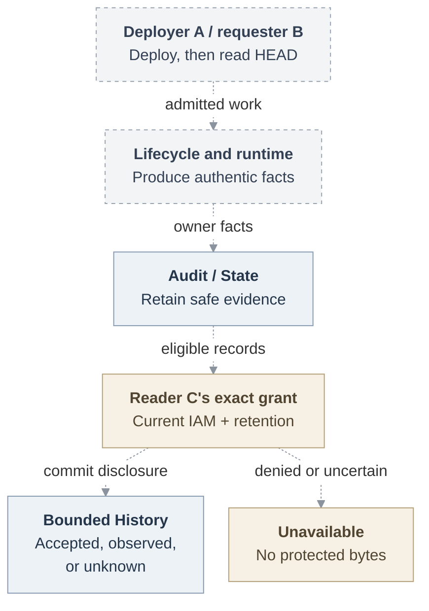

# RFC: Basic Agent observability

## Problem and goal

An operator can accept an Agent deployment without knowing which later human request caused a repository operation or what actually completed. OpenClaw Enterprise (OCE) needs a bounded History that lets an authorized reader follow reliable facts without receiving credentials or conversation content.

The complete selected journey has three distinct people. A deploys a personal or team Agent. B asks that Agent to read an approved GitHub repository's HEAD. Separately granted audit-only reader C follows the original initiator, Agent/revision executor, exact authorization and resource, accepted work, and strongest observed result. Missing attribution stays unresolved. Uncertain execution stays unknown.

**Date:** 2026-09-18

**Status:** Proposed. Selected scope, implementation and qualification pending.

**Owners:** OpenClaw Control Plane (OCC) lifecycle, Audit/State and selected IAM Driver. Authentication, runtime and credential owners supply their facts.

**Historical source baseline:** `046e12b007bb1b4928bd3f7497a2353714be11a8`. Later source pins describe separate evidence, not a replacement historical baseline or a deployed feature.

## Proposed journey

This is the proposed connected journey. Dashed edges remain unqualified joins even where endpoint components exist. History reports what each owner establishes. It does not perform the repository operation or turn a deployment actor into requester B.

## MVP boundary and present evidence

Deliver optional filtered diagnostics first. Then deliver create, update, deploy and stop History with a small console and exact mutation recovery. Complete the feature with the genuine ordinary-Agent repository read above. Local accounts and one qualified admission/runtime/channel profile suffice for that scenario.

The first serving History requires current account, IAM and State behavior, both retention modes, exact recovery, and restore continuity. The default expires records after 30 days and deletes them from the live ledger within another 24 hours. Explicit indefinite retention is also selected. Missing dependencies make protected History unavailable without automatic downgrade.

Pinned main contains transactional lifecycle audit and State append/list. The [History shapes](31-basic-observability/interfaces.md#facts-and-events) remain proposed. Existing audit establishes neither bounded serving History nor the repository join, installed enforcement or live-provider qualification. New routes and connections remain proposals until accepted owner contracts and connected evidence establish them. Current platform design and feature references remain authoritative.

Personal and team Agents use the existing resource model. Ownership, membership, participation, deployment rights and known IDs confer no History access. Content permission remains separate. Transcripts, Installation-wide search, general policy editing, replay machinery and remote audit export are outside this selected scope.

## Supporting design

- [Architecture](31-basic-observability/architecture.md) explains existing owners, delivery order, diagnostics and dependency failure. Its [request lifecycle](31-basic-observability/architecture.md#request-lifecycle) and [SVG](31-basic-observability/request-lifecycle.svg) show why disclosure waits for acknowledged evidence.
- [Security](31-basic-observability/security.md) explains fact authenticity, protected metadata, local integrity limits and the evidence needed to close threats.
- [Interfaces](31-basic-observability/interfaces.md) separates producer facts from State-created events, defines exact authorization and known query shapes, and preserves unresolved recovery and release choices.
- [Retention](31-basic-observability/retention.md) owns trusted time, non-resurrection, SQL privileges, live deletion and continuity across every restored replica.
- [Repository read](31-basic-observability/repository-read.md) specifies the authentic A/B/C handoffs and acceptance on an ordinary Agent, managed Git child and live GitHub repository.

The decision and scope are above. Earlier detailed sections now live at [diagnostics](31-basic-observability/architecture.md#optional-diagnostics), [facts](31-basic-observability/interfaces.md#facts-and-events), [access](31-basic-observability/interfaces.md#authorization-and-policy-consumption), [recovery](31-basic-observability/interfaces.md#mutation-outcomes), [evidence failure](31-basic-observability/security.md#audit-failure-and-protective-work), [delivery](31-basic-observability/architecture.md#availability-and-delivery) and [follow-ups](31-basic-observability/security.md#accepted-limits-and-closure).

## References

- [Platform design at pinned main](https://github.com/openclaw/openclaw-enterprise/blob/e9766f35a25afa240ee109b41a6ef821fb68687e/docs/design.md) and [State append/list](https://github.com/openclaw/openclaw-enterprise/blob/e9766f35a25afa240ee109b41a6ef821fb68687e/packages/occ/src/state/platform-state.ts#L410).
- [Existing filtered log export](https://github.com/openclaw/openclaw-enterprise/blob/e9766f35a25afa240ee109b41a6ef821fb68687e/docs/guides/observability.md). The [local diagnostic-file procedure](31-basic-observability/architecture.md#optional-diagnostics) is proposed here.
