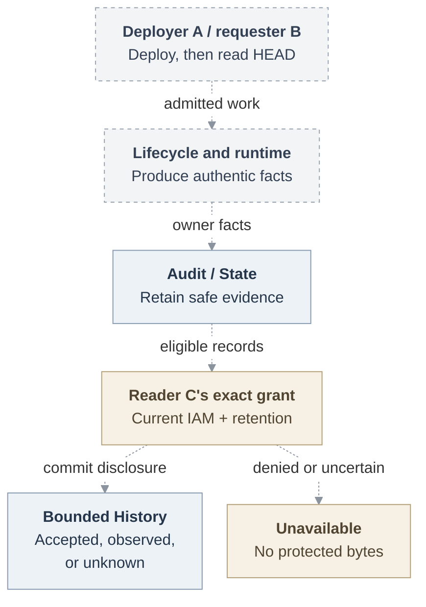

# RFC: Basic Agent observability

**Date:** 2026-09-18

**Status:** Proposed. Selected scope, implementation and qualification pending.

## Problem and proposal

Accepting an Agent deployment does not tell an operator what later ran, who requested it, or what completed. This RFC proposes a bounded History view for personal and team Agents, extending the existing audit ledger with safe facts, a paginated API and a small console. History distinguishes requested work, local acceptance, observed results and unknown outcomes without exposing credentials or conversation content. Missing attribution remains unresolved.

Installation administrators explicitly grant `audit_reader` for an exact Agent or Namespace-wide Agents. Every page requires current `read_audit`; ownership, membership, participation and deployment rights confer no access. The separate `audit_retention_administrator` role manages Installation retention without granting History access. These grants use [common IAM policy administration](31-basic-observability/interfaces.md#authorization-and-policy-consumption).

## Scope and delivery

The **first usable History milestone** covers create, update, deploy and stop, including retries, supersession and exact mutation recovery. It requires current account/IAM checks, atomic evidence in original State, acknowledged disclosure commits, both retention modes, installed durability, sweeper enforcement and restore continuity. Missing dependencies keep protected History unavailable. Recovery observes only the bound mutation result and creates no new work.

[Retention](31-basic-observability/retention.md) defaults to expiry after 30 days and live-ledger deletion within another 24 hours; administrators may explicitly select indefinite retention. Expired evidence must not reappear after restore.

The **complete selected MVP** also proves one [ordinary-Agent repository read](31-basic-observability/repository-read.md): deployer A deploys a personal or team Agent, different requester B asks it to read an approved GitHub repository's HEAD, and separately granted reader C follows B's request, the Agent/revision executor, exact authorization and resource, and the strongest observed result. Local accounts and one qualified execution profile suffice; every control required by that profile remains a dependency.

Optional filtered diagnostics can ship independently. Preparatory source changes cannot enable History before its serving gates pass. The [MVP checklist](31-basic-observability/mvp-scope.md#required-outcomes) defines **twelve required outcomes** and [eight delivery cuts](31-basic-observability/mvp-scope.md#small-reviewable-deliverables), with [dependencies for each milestone](31-basic-observability/mvp-scope.md#dependency-cut-points).

Dashed arrows show the proposed complete journey. History records each producer's facts; it does not execute the repository operation. See the [full request lifecycle](31-basic-observability/architecture.md#request-lifecycle).

## Supporting design

- [Architecture](31-basic-observability/architecture.md) defines responsibilities, diagnostics and delivery gates.
- [Interfaces](31-basic-observability/interfaces.md) defines facts, authorization, queries, disclosure and exact recovery.
- [Security](31-basic-observability/security.md) defines privacy, audit-failure behavior and local integrity limits.
- [Open decisions](31-basic-observability/mvp-scope.md#decisions-still-required) cover event membership, expiry at disclosure, recovery keys, purge authority and restore custody.

Transcripts, Installation-wide search, general policy editing, replay, richer retention and remote audit export are [deferred](31-basic-observability/security.md#accepted-limits-and-closure).

## References

The [source baseline](https://github.com/openclaw/openclaw-enterprise/blob/e9766f35a25afa240ee109b41a6ef821fb68687e/packages/occ/src/state/platform-state.ts#L410) provides transactional lifecycle audit and State append/list. Serving History and the repository connection remain proposed. The [platform design](https://github.com/openclaw/openclaw-enterprise/blob/e9766f35a25afa240ee109b41a6ef821fb68687e/docs/design.md) remains authoritative. Historical source baseline: `046e12b007bb1b4928bd3f7497a2353714be11a8`; later pins describe separate evidence.
