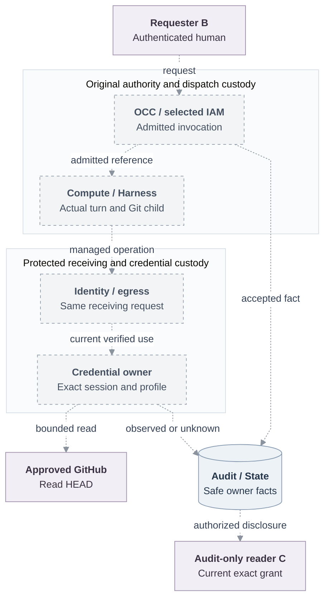

# Basic observability: trusted repository read

**Status:** Proposed selected behavior; shared invocation/runtime exports, credential-owner acceptance and connected qualification remain pending.

**Owners:** OCC/RBAC admission, Compute/Harness execution, identity/egress receiving controls, credential sessions/provider results, Audit/State projection.

## Decision

Deployer A creates and deploys a personal/team Agent. Different authenticated human B requests one approved GitHub HEAD read; separately granted audit-only reader C follows B's admission through an actual Harness turn, managed Git child, session and strongest observed or unknown result. [Lifecycle History](../31-basic-observability.md) can ship first. One qualified admission/runtime/channel profile and local accounts suffice for this scenario; full neighboring provider, Harness and retained-workspace deliveries are separate.

## Current boundary and scope

The separate [credential supplier](https://github.com/openclaw/openclaw-enterprise/blob/02f8fe0b1266462a5726c6684344394324a8bdf7/docs/reference/repository-credentials.md) supports Kubernetes embedded OpenClaw, rejects dedicated Harnesses, and defaults omitted profiles to `git-write`. It checks open session, exact grant/profile and original finite deadline; closure/expiry denies new exchanges and aborts owned exchanges while preserving possible dispatch. Worker checks concern the queued deployment actor, not per-exchange human currentness or an outage revocation guarantee. Revision bearer possession identifies neither B nor a native turn. Restart loses provider-token cleanup inventory; existing tokens may survive to expiry. Retained platform IDs cannot prove revocation.

That supplier is not the parent RFC's historical baseline. Pinned integration's [purpose resolver](https://github.com/openclaw/openclaw-enterprise/blob/559764103f8902a0a89de0882a44caa16f7ba3fd/packages/occ/src/runtime-authority/service.ts#L349) returns unavailable on eligible lookup. Components and definitions do not establish the proposed joined path.

## Design and failure behavior

### Admit one operation

Consume the common proposed `AgentInvocation` admission/status/result/cancel, server-owned `AgentAuthorityContext` and `AgentInvocationRuntime`. Current account/method/session and exact `invoke` admit the original human and personal/team authority. The common owner selects immutable revision and registers authority under the State/policy barrier. Repository use additionally needs an approved assignment and current exact Agent-ServicePrincipal `use_repository`; the credential owner's accepted source defines actual guarantees.

Preserve owner-issued opaque IDs, selected authority, actual authorization principal, IAM Driver, exact action/resource and admission reference. Initiator and authorization principal may differ. Callers cannot choose another human, generation, ServicePrincipal, session, URL, command, profile or output destination. Freeze the one-operation shape/vocabulary only after accepted owner exports. Observability adds no invocation API/record/queue, Work implementation, authority lease or native Gateway client.

The real managed Git child uses explicit **`git-read`** on the admitted repository; qualify packaged Git and GitHub against the proposed fixed operation:

```sh
git -c protocol.version=0 ls-remote --symref --exit-code -- <admitted-url> HEAD
```

The runtime supplies this fixed invocation; callers do not supply the placeholder. Provider permission ceilings alone establish neither one-use command authority nor human initiation. Profiles, protocol and credential custody remain with the credential owner.

### Connect authentic handoffs



All edges are proposed connections and remain dashed. Existing ledger/credential source does not prove this composition, installed receiving control or genuine live-Agent execution.

Compute/Harness must supply the actual turn, status/result/cancel, unknown-dispatch reconciliation and private credential delivery. Dedicated Codex/separate Gateway needs a reviewed consumer of `RepositoryCredentialRuntimeBinding` in the actual executing child/role, including PATH/trust/material/init/generation behavior; relaxing a topology check is insufficient.

For the protected profile: observe preparation with traffic disabled → bind the exact incarnation → persist immutable session attempt → open/read back → deliver without changing incarnation → validate current execution/material and serving selection → enable. Replacement needs fresh admission, never session rebinding or downgrade. Coordinate bootstrap-probe authority with existing owners; readiness alone is not current-serving selection.

Every reference needs its original source record and authorized diagnostic lookup. Independently authenticate request-to-authority and per-operation turn/session association, including concurrent turns sharing an execution. DTOs, copied IDs, deployment actor, Git author/configuration, model text or headers cannot establish B. Admission/dispatch and native reply submission keep independent durable fences that survive audit erasure. Unknown start/send/provider outcomes require reconciliation without blind redispatch. A native reply also requires current content authority, complete eligible audience and original reply custody.

The closed observation contains original invocation/authority references; provider-neutral repository/grant/session/profile IDs; admitted operation kind; dispatch state; strongest established transport/provider result. Apply the parent's [safe projection](../31-basic-observability.md#facts-and-their-owners), excluding credentials, custody handles, request plans, raw URLs/headers, commands, prompts, response bodies and exceptions. A bearer without authentic invocation association leaves attribution unresolved. New credential dispatch requires established local evidence; audit outage permits protective refusal/closure, not a newly claimed durable revoke.

### Currentness and closure

Authentication owns account/method/session validity; IAM exact authorization; the actual receiver execution assurance; Compute observation/termination; egress protected transport/streams; credential owners deadlines, closure and provider cleanup. History records facts and implements none of these enforcement controls.

Only actual receiving verification supplies assignment/generation/component/admitted-profile and original verification/expiry times. Protected evidence references require owner-authorized lookup. Compatibility records absent/unverified assurance. Serialized observations are not proof objects, leases or transferable authority; SVID/session strings do not prove physical origin. Same-connection/request and current-serving evidence must remain in owner custody across waits and final dispatch/delivery fences. A withdrawn waiter cannot authorize acquisition or cancel another current waiter's work.

The selected protected composition must measure **at most 30 seconds** from the defined authority-owner event to both new-work refusal and last protected bytes, including renewal-connectivity loss. Owners must specify event, evidence age, clock/skew, monotonic deadline, cadence and closure reserve. Preserve the [scoped five-second ceilings](https://github.com/openclaw/openclaw-enterprise/blob/559764103f8902a0a89de0882a44caa16f7ba3fd/packages/contracts/src/account-authority-v1.ts#L28) for dependency calls, operation starts, model rechecks and model closure; they are not global five-second revocation. These end-to-end guarantees remain unqualified; timers or maintenance intervals are insufficient.

Renewal cannot change owner, source grant/profile, generation or original absolute deadline. Enforced profiles cannot downgrade. Separately record route/stream closure, credential-session closure, provider cleanup, requested stop and observed termination. Durable runtime termination awaits Compute observation; local closure proves no remote cancellation. Accepted external effects may stay possibly dispatched/unknown, retaining settlement custody.

## Acceptance and delivery

Run A/B/C through one genuine ordinary Agent/Harness turn and real managed Git child to an owner-approved read-only live GitHub repository. C must see B, separate Agent/revision executor, selected authority/session, truthful assurance, exact authorization/resource, durable acceptance and strongest result/unknown. Pod exec, controller Git and fixture submitters do not pass.

Exercise stale/cross-Agent/revision/session authority, duplicate/unknown dispatch, concurrent turns, revoke before final dispatch, local audit outage, runtime closure, off-Pod denial and secret/reference exclusion. Where replying natively, exercise audience change and unknown/late send without replay. Qualify receiving and both withdrawal endpoints, renewal loss, delayed positives, blocked consumers and saturation on the same installed artifact. Keep source/database, composed, installed, controlled transport, live-provider and release evidence separate, with exact revisions, dependencies, cleanup and missing proof. These are future acceptance gates, not executed tests.

## Alternatives and follow-ups

A revision bearer or synthetic submitter is a useful component demonstration but cannot replace authentic requester attribution. Retain the existing owners rather than adding an OBS execution service.

Exact-container origin remains deferred until a stronger same-Pod guarantee is selected; identity/Compute must prove real caller-to-incarnation receiving custody. Independent physical termination during controller/Compute failure remains later hardening, owned by Compute/trusted runtime supervision and closed only with trusted expiry and measured observed stop. Neither weakens selected off-Pod protection or traffic withdrawal. Future durable provider-cleanup recovery belongs to the credential owner and needs protected custody/recovery plus provider-observed outcomes.
