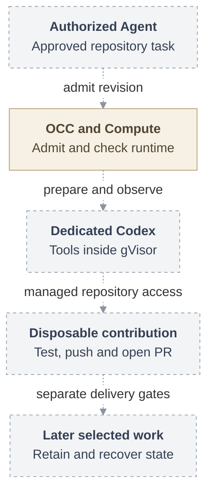

# RFC: gVisor container support

## Problem and goal

An operator needs an ordinary authorized Agent to work on a repository while
containing its untrusted tools. Running a model command successfully is only
the first step. The Agent must also complete a real contribution and, in later
selected deliveries, continue with its files and completed context after replacement.

Add an opt-in gVisor profile to the existing Kubernetes Compute Driver in
OpenClaw Enterprise (OCE). Dedicated Codex runs in the selected sandbox while
the trusted OpenClaw gateway remains separate. Preserve supported tools and
ordinary Compute choices. The complete selected outcome includes disposable
clone, edit, test, commit, push and an approved same-repository pull request,
followed by retained files, local commits, completed context and continuing recovery.

**Date:** 2026-09-18

**Status:** Accepted direction. Implementation and qualification pending.

**Owner:** Kubernetes Compute and its runtime consumers.

## Proposed journey

Proposed journey. Dashed connections require integration and qualification.
OpenClaw Control Plane (OCC) admits the revision, and its existing Compute
Driver owns execution through observed stop. The diagram groups delivery
outcomes. It does not mean retained work must wait for every protected-profile gate.

## MVP boundary and present evidence

The first runtime checkpoint proves dedicated Codex, model and tool use on one
operator-managed runtime combination. Existing supported storage suffices for
that checkpoint. The initial contribution delivery additionally requires the
complete disposable storage lifecycle and managed Git/`gh` in real tool children.
The checkpoint alone does not complete the selected MVP.

Retained current state and continuing recovery remain selected subsequent
increments. Protected identity, network and credential composition has its own
gates. Each deployment must satisfy its admitted profile. Choosing gVisor does
not grant repository authority, hide model credentials or establish destination
confinement. An explicitly selected stronger profile must never downgrade
automatically when a dependency fails.

The RFC's historical main baseline was `724dcb5`. Source at `e9766f3`
supplies the existing Compute lifecycle and dedicated topology. The
[interface inventory](31-gvisor-container-support/interfaces.md#compute-lifecycle-and-observation)
also records current plugin readiness additions at `12fddc4`. The
separately inspected repository supplier at `eb52cc4` supports embedded execution
only. Those source inputs establish neither this proposed dedicated integration
nor an installed sandbox. Source, composed behavior, installed runtime,
live-provider results and release readiness remain separate evidence.

The first profile excludes embedded execution, SandboxDriver composition and
adoption of existing namespaces. This proposal adds no supervisor, generic
command API, credential store or invocation authority. Broader backends and
stronger outage-termination claims have separately triggered follow-ups.

## Supporting design

- [Architecture](31-gvisor-container-support/architecture.md) explains the separate
  gateway and Harness, complete Pod observation and guarded containment. Its
  [vertical request lifecycle](31-gvisor-container-support/architecture.md#request-lifecycle)
  follows admission through contribution and closure. The
  [SVG](31-gvisor-container-support/request-lifecycle.svg) can be opened separately.
- [Security](31-gvisor-container-support/security.md) identifies hostile inputs,
  trusted operators, credential boundaries and the limits of each assurance
  profile. It separates missing proof from recorded scope limits.
- [Interfaces](31-gvisor-container-support/interfaces.md) defines current Compute
  calls, proposed runtime selection and known repository material. It names
  unresolved storage and observation choices without inventing service APIs.
- [Storage and recovery](31-gvisor-container-support/storage-and-recovery.md)
  explains explicit disposal custody, exclusion of every predecessor writer,
  canonical completed context and restore under fresh authority.
- [Delivery](31-gvisor-container-support/delivery.md) gives each selected increment
  a genuine user outcome and its qualification evidence, including installed
  runtime and independently observed provider results.

## References

- [Current ComputeDriver](https://github.com/openclaw/openclaw-enterprise/blob/e9766f35a25afa240ee109b41a6ef821fb68687e/packages/contracts/src/index.ts#L714)
  and [historical Compute contract](https://github.com/openclaw/openclaw-enterprise/blob/724dcb5cb80b5e76a62e8267a21185a2e91a85c2/docs/reference/drivers/compute.md).
- [Separate repository supplier](https://github.com/openclaw/openclaw-enterprise/blob/eb52cc4cfe68f08017e7ece6585fe7e937e0747a/docs/reference/repository-credentials.md).
- [gVisor installation](https://gvisor.dev/docs/user_guide/install/),
  [platforms](https://gvisor.dev/docs/user_guide/platforms/) and
  [Kubernetes RuntimeClass](https://kubernetes.io/docs/concepts/containers/runtime-class/).
