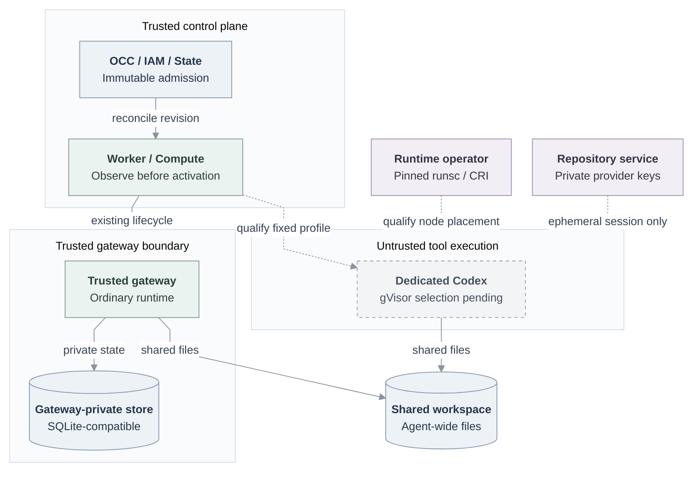

# RFC: gVisor container support

**Date:** 2026-09-18

**Status:** Accepted direction; implementation and qualification pending.

**Owner:** Kubernetes Compute and its runtime consumers.

## Decision

Add an opt-in gVisor profile to Kubernetes Compute. An ordinary authorized Agent
runs dedicated Codex with supported model/tools, then uses disposable storage
and managed Git/`gh` to clone, edit, test, commit, push and open an approved
same-repository PR. Retained files, local commits, completed context and
continuing recovery remain selected subsequent increments.

The existing [ComputeDriver](https://github.com/openclaw/openclaw-enterprise/blob/724dcb5cb80b5e76a62e8267a21185a2e91a85c2/docs/reference/drivers/compute.md)
owns preparation, readiness, activation, stop and retirement. Kubernetes
rendering, observation and containment remain internal. Add no supervisor,
generic command API, credential store or invocation authority.

## Current boundary and scope

[Main at `724dcb5`](https://github.com/openclaw/openclaw-enterprise/blob/724dcb5cb80b5e76a62e8267a21185a2e91a85c2/apps/controller/src/drivers/compute/kubernetes/index.ts#L166-L205)
has dedicated execution but no gVisor selection. The inspected
[repository supplier](https://github.com/openclaw/openclaw-enterprise/blob/eb52cc4cfe68f08017e7ece6585fe7e937e0747a/docs/reference/repository-credentials.md)
supports embedded execution only. Neither establishes this proposal's connected
or installed support.

Trusted Installation configuration adds:

```yaml
drivers:
  compute:
    id: compute-gvisor
    configuration:
      isolationProfile: gvisor-systrap
      # Supply normal Kubernetes authentication, images, resources,
      # network, servicePrincipalCredentials, and runtime configuration.
```

Omission preserves ordinary Kubernetes. Docker/Podman retain their
[supported contract](https://github.com/openclaw/openclaw-enterprise/blob/724dcb5cb80b5e76a62e8267a21185a2e91a85c2/docs/reference/drivers/docker-compute.md),
including rejection of Harness authentication bindings. Supported tools remain
available. Explicit weaker selections are allowed; a failed stronger selection
never downgrades automatically. Runtime, network and credential assurance are
independent, without promising every combination.

Admitted revisions pin `occ/kubernetes-gvisor`; ordinary Kubernetes cannot
execute them after configuration changes. Changed requirements need fresh
admission. Initially support direct dedicated Codex in OCE-owned tenant
namespaces; reject embedded execution, SandboxDriver composition, namespace
adoption, unknown profiles and unsupported configuration.

## Design and failure behavior



Solid edges show main's existing lifecycle and
[dedicated storage topology](https://github.com/openclaw/openclaw-enterprise/blob/724dcb5cb80b5e76a62e8267a21185a2e91a85c2/docs/reference/drivers/kubernetes-compute/storage-and-credentials.md).
Dashed edges are pending gVisor qualification and dedicated repository delivery.
Storage mounts establish neither disposable lifetime nor safe replacement;
no edge proves an installed sandbox.

### Placement and containment

The Agent Deployment requests `oce-gvisor-systrap`; the gateway stays ordinary.
Startup and every dedicated readiness check, including preparation/activation,
require a non-deleting RuntimeClass whose name and handler both equal that
value. Missing, deleting or mismatched classes refuse activation.

The operator installs the complete pinned [runsc distribution](https://gvisor.dev/docs/user_guide/install/)
with [`platform=systrap`](https://gvisor.dev/docs/user_guide/platforms/) and STRICT
sidecar policy on eligible nodes. OCE requires Kubernetes ≥1.35, immutable
approved images, enforcing NetworkPolicies, restricted Pod security, existing
Codex authentication/seccomp and resource limits. Controller permissions read
only the named RuntimeClass; node-runtime configuration remains operator-owned.

Observe the owned Deployment and complete candidate Pod set, including deleting
nonterminal Pods. Require exactly one eligible Running/Ready Pod with correct
ownership and RuntimeClass; an unsafe candidate overrides another Ready Pod.
Malformed/incomplete observations fail closed. Preserve independent positive
violation evidence even when another observation fails.

A positive isolation violation conditionally withdraws only the still-selected
revision route, runs owned lifecycle cleanup, then requests foreground deletion
of the exact Deployment with UID preconditions. Bound each phase even for
callbacks ignoring cancellation; retain original errors, timeouts, late outcomes
and cleanup custody before further guarded cleanup. Preserve successors and
unrelated resources. Pending readiness or unavailable APIs alone authorize no
deletion. Requested placement, deletion acceptance and expired waits prove
neither the executed binary nor termination.

### Trust and protected traffic

Treat repositories, dependencies, build scripts, model-selected commands and
the Harness as hostile. Protect host/other Agents, gateway state,
controller/provider credentials, repository grants and retained data. Trust
OCC/IAM/State, Kubernetes, node/storage operators, installed runtime, enforcing
CNI and credential services; claim neither a VM boundary nor protection from
their compromise. Tools receive no host paths/namespaces, engine sockets,
unrelated credentials, gateway-private state or service-control sockets.
Preserve identity, authorization and exact ownership checks. Runtime selection
grants no personal, team, repository or provider authority; shared workspace
data is Agent-wide.

| Profile                           | Assurance and limit                                                                                                                                                                                                                                                          |
| --------------------------------- | ---------------------------------------------------------------------------------------------------------------------------------------------------------------------------------------------------------------------------------------------------------------------------- |
| First usable runtime/contribution | Supported model authentication/networking; model credentials may be tool-visible, destinations unconfined, and copied session bearers lack workload-origin proof. Repository provider credentials still remain service-private.                                              |
| Selected protected composition    | One trusted egress service per execution assignment, independently enforced private ingress, verified receiving identity, external model/provider custody and owner-admitted operations. Ordinary off-Pod replay denial is required; exact-container proof remains deferred. |

[Identity](basic-agent-identity-mvp.md), [egress](31-basic-egress-proxy.md) and
[RBAC](31-basic-rbac.md) own protected composition. State owns assignment/current
serving; identity owns verified registration. Compute's optional observation
capability returns observed, terminated or unavailable from authentic original-create
and incarnation evidence, distinguishing ordinary Kubernetes from actual gVisor. With
protected traffic disabled: observe → bind → persist immutable session attempt
→ open/read back → deliver without replacing the incarnation → revalidate →
enable. Changed execution/relay requires fresh admission; rotation preserves
the original deadline. Owners must settle usable preparation/material and
bootstrap-probe contracts without circular readiness dependence.

Protect real model probes/tools and repository routes. Bind the actual receiving
connection/request and original requester through waits, concurrent turns,
dispatch and result delivery; recheck current authorization and audience. Measure new-work refusal **and last
protected bytes within 30 seconds**, including renewal loss; scoped stricter
five-second contracts prevail. Owners must define starting event, evidence age,
clock/skew, cadence and closure reserve. Deny locally before awaited cleanup.
Traffic withdrawal, provider settlement and observed physical stop remain
separate; exact stop stays pending until Compute observes termination.
Unavailable/termination-unverified outcomes remain explicit.
Embedded egress C1 and this RFC confer none of these stronger guarantees.

### Disposable storage and repository delivery

Side-effect-free admission persists a closed revision-owned disposable policy
in the existing deployment transaction. Absence of policy never permits
disposal or converts an Agent-retained claim. Strict legacy/new record shapes
and installed PostgreSQL constraints must agree. Compute creates a real shared
workspace and separate SQLite-compatible gateway-private store; Pod-local
`emptyDir` cannot share between Pods.

Existing State custody retains original create operations/plans and confirmed
Namespace/PVC UIDs before mounting consumers. Unknown commit/create
acknowledgments require original-operation readback, never name-only adoption.
Disposal checks original UID/spec/ownership and absent Pod/template references,
uses conditional deletion, and retains partial receipts/closed markers.
Unresolved creates keep cleanup pending; expose selection only after the whole
lifecycle works. Stop closes execution/session access; disposal eligibility and
confirmed disposal are separate; PVC deletion proves no physical erasure.
Retained stop preserves data; purge is separate.

Deliver only the service's ephemeral session to dedicated Codex; its gateway
receives none. App keys/JWTs/installation tokens and control sockets stay
service-private. Package managed Git/`gh` in the actual tool-child PATH with
its private service route/trust. Explicitly select
[`git-full`](https://github.com/openclaw/openclaw-enterprise/blob/eb52cc4cfe68f08017e7ece6585fe7e937e0747a/docs/reference/repository-credentials.md#profiles):
its wider PR/issue/REST/GraphQL ceiling is not a single-PR capability.
Preserve IAM, session attempts, original deadlines, close-before-reopen and
retryable cleanup. Delivery, repair and retirement remain generation-sensitive.
Material repair requires no old-generation candidates and
exactly one expected-generation Ready Pod before publication; this is not
retained-writer fencing. Supplier restart invalidates local sessions and loses
provider cleanup inventory: tokens may survive until expiry. Local closure or
replacement material does not prove remote revocation.

### Retained replacement and recovery

Persist the whole-Agent handoff in existing State/journal owners and establish
predecessor stop or an independently verified fence **before the first successor
writable init, preparation, repair or restore**. Cover gateway file access,
Harness, children, background processes, writable mappings and unresolved
creates. Unknown exclusion blocks replacement. Replica counts, database
pointers, storage access-mode names and partition-time Pod absence are
insufficient; unavailable nodes or delete acknowledgments prove no physical stop.

Persistence/native owners must supply the actual supported shared/private store
binding and canonical completed-context artifact from successful terminal
records in the sole journal. Verify the checkpoint, quiet-import into a fresh
exclusive native context, read back its exact digest, then activate under fresh
authority. Refuse missing, corrupt or incompatible state. Capture actual visible
writes; verify/export and restore to fresh stores. Preserve uncertain remote
effects without blindly repeating model dispatch, push or PR creation.

## Acceptance and delivery

These are required outcomes, not reported passes. Extend existing Kubernetes
Compute tests and the genuine ordinary-Agent workflow.

| Increment               | Completion evidence                                                                                                                                                                                                                                                                                                    |
| ----------------------- | ---------------------------------------------------------------------------------------------------------------------------------------------------------------------------------------------------------------------------------------------------------------------------------------------------------------------- |
| Runtime checkpoint      | Main-compatible selection, complete observation/containment, diagnostics and genuine Codex/model/tool/authentication/seccomp/cleanup on one operator-managed tuple. Existing supported storage suffices, with its existing limits.                                                                                     |
| Disposable contribution | Complete admission/create/disposal lifecycle, exact SQL review and fresh/upgrade PostgreSQL checks, role/PATH/material-generation repair and real clone/edit/test/commit/push/same-repository PR. Record approved base, actual test command/result, local/remote OIDs, PR head/base and independent provider readback. |
| Retained current state  | Qualified same-build/same-cluster gateway-only, Harness-only and combined replacement preserves files/local commits/completed context, denies writes without predecessor exclusion, and completes a resumed real turn under fresh authority.                                                                           |
| Continuing recovery     | Actual visible-write capture, verified artifact/export and fresh-store restore with proven compatibility and uncertain-effect preservation. Host-loss and changed-build claims need separate qualification.                                                                                                            |

Protected composition has its own identity/egress/receiving and withdrawal gates;
it is not automatically a prerequisite of every retained-state task. Each
deployment must satisfy its selected immutable profile; no weaker retained
combination is implied.

Cover invalid selections/classes, conflicting/terminating Pods, independent
observation failures, noncooperative cleanup, stale-selector races, UID guards,
unknown/late creates and stop regressions. Restricted operator receipts record
source/image digests; Kubernetes/containerd/runsc versions/configuration; Pod UID,
node, CRI sandbox and actual executable/hash/platform/flags; effective security,
eligible-node scheduling, complete additive network-policy denials,
PID/storage/log/socket/resource limits and cleanup. Keep source, composed,
installed, live-provider and release evidence separate; fixtures prove only
their exercised boundary. Missing evidence stays explicit.

[History](31-basic-observability.md) consumes authorized, owner-produced safe
identities/phases/reasons/outcomes, never raw errors, credentials, custody
handles, environments, commands, bodies or provider payloads. Rich qualification
artifacts require their own restricted access.

Keep stable milestone branches and exact evidence checkpoints, focused
backports and the first RFC commit as the logical stack base. Update living
[Kubernetes Compute](https://github.com/openclaw/openclaw-enterprise/blob/724dcb5cb80b5e76a62e8267a21185a2e91a85c2/docs/reference/drivers/kubernetes-compute.md),
[Driver selection](https://github.com/openclaw/openclaw-enterprise/blob/724dcb5cb80b5e76a62e8267a21185a2e91a85c2/docs/reference/drivers/selection.md),
[Harness flow](https://github.com/openclaw/openclaw-enterprise/blob/724dcb5cb80b5e76a62e8267a21185a2e91a85c2/docs/flows/harness-execution-topology.md)
and deployment/testing guides with implemented behavior and compatibility limits.

## Alternatives and follow-ups

**Proposal — owner decision pending:** Installation/OCC and consumers select
finite offered combinations; distinguish prospective default edits from an
explicit audited withdrawal of existing weaker admissions. No retroactive
upgrade, implicit grace, automatic replacement or continuation after withdrawal.
Compute/State/storage owners must choose the disposable terminal transition
before enabling disposal, preserving retained stop semantics.

**Proposal — security/Compute/CNI decision pending:** qualify containment before
any untrusted init/startup/replacement code, beyond the existing readiness gate;
unsupported tuples refuse restricted activation. Policy readback or a fixed delay
alone is insufficient. The [egress proposal](31-basic-egress-proxy.md) owns this
clarification.

For a selected consumer, deployment operators qualify broader installation
automation; Compute/Harness owners qualify embedded/decomposed OpenClaw and
additional backends. Selected stronger assurance requires runtime/identity/operator
proof of exact-container origin or independent termination during control-plane
outages. Host-loss/changed-build
recovery requires persistence/native compatibility and loss-window proof.
Durable provider cleanup stays with the credential owner and needs protected
custody/recovery plus provider-observed outcomes across restart. None replaces
the selected contribution, retained context or continuing recovery.
