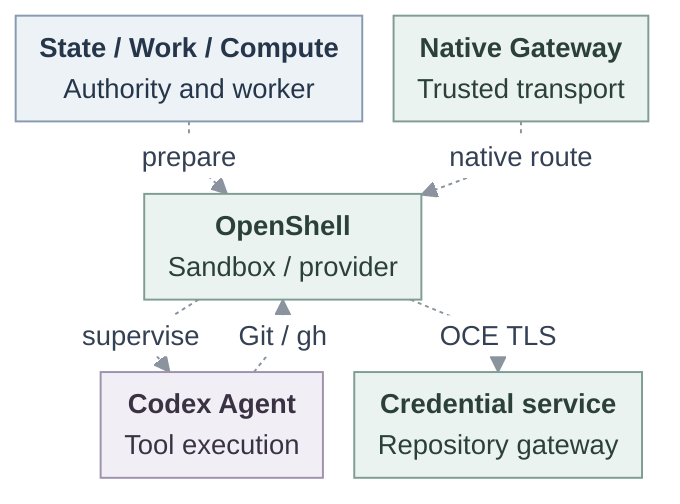
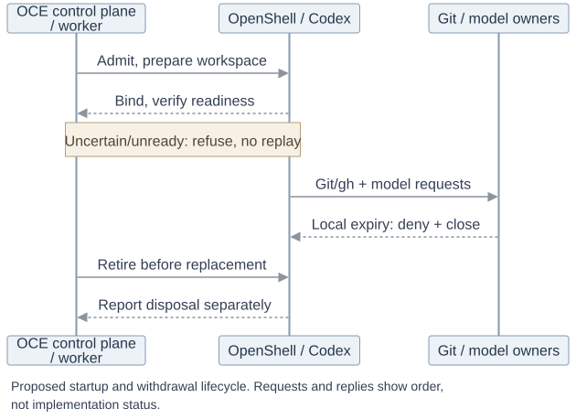

# OpenShell runtime integration

## Problem and decision

Finish the existing OpenShell integration so one dedicated Codex Agent, deployed through ordinary OpenClaw Enterprise (OCE) APIs and workers, can use a protected model, native Git and `gh`. This RFC proposes how those existing parts work together. The complete runtime is not yet supported.

**Agent access (Plan 1)** independently owns human enrollment, grants, discovery and native access. This work consumes existing authentication and IAM. Human identity, Agent ServicePrincipal and runtime assignment remain distinct. Personal or team repository grants require explicit admission, never inheritance from login or conversation. Additional authentication protocols, SSH/LFS and stronger isolation remain later work.

## Specification

| Contract   | Required behavior                                                                                                                                                                                                                                                                                                        |
| ---------- | ------------------------------------------------------------------------------------------------------------------------------------------------------------------------------------------------------------------------------------------------------------------------------------------------------------------------ |
| Runtime    | Existing Kubernetes Compute and OpenShell Sandbox Driver, dedicated Codex, stock OpenShell v0.1.0-pre.5. Pin and qualify exact images, models and tools.                                                                                                                                                                 |
| Repository | Exact OCE HTTPS gateway destination through OpenShell `tls: skip`, where the client verifies the OCE certificate. Authorize every effective request. Preserve `git-read`, `git-write`, `git-full` and token-bounded GraphQL. No direct GitHub or OpenShell GitHub provider bypass.                                       |
| Model      | OpenAI API-key profile reuses `ResolvedHarnessAuth`, Secret `operate`, exact UID/resourceVersion checks and attached provider identity. The trusted provider retains the real key.                                                                                                                                       |
| Custody    | GitHub App keys and provider tokens stay outside execution. Scoped capabilities occupy a private read-only volume, separate from writable workspace, with fresh material per replacement.                                                                                                                                |
| Authority  | Original State supplies admitted revision, finite deadline and stop ordering. Work supplies responsibility and fencing. Bind the observed Sandbox/Pod/revision/generation. Consumer timestamps and heartbeats cannot renew authority.                                                                                    |
| Assurance  | Explicit compatibility uses current IAM, ServicePrincipal and scoped bearer checks, with internal bearer replay remaining possible. Protected writes require trusted association with each authorized invocation and proven predecessor withdrawal. Unsupported enforced configurations refuse. Outages never downgrade. |
| Withdrawal | Actual Git/model request owners deny new traffic and close active exchanges within 30 seconds of renewal connectivity loss, preserving selected stricter five-second consumers. Closing the app-server alone is insufficient.                                                                                            |

## Contract

Configure Kubernetes/OpenShell, a persistent workspace, an explicit repository grant and an authorized model Secret. Deploy the saved Agent draft through this existing bodyless interface. The example is illustrative and unexecuted, with identifier placeholders:

```http
POST /namespaces/{namespaceId}/agents/{agentId}/deploy
```

Exact-Agent `deploy` permission freezes and deploys the saved draft. Missing required authorization rejects admission. HTTP 202 acknowledges admission, not readiness. The existing worker calls Compute, which passes `HarnessWorkloadRequirements` to `SandboxDriver.provisionHarness`.



Five owner groups, with dashed proposed handoffs. Compute and Driver are worker libraries. Kubernetes runs separate native Gateway and OpenShell-owned Codex Pods. The trusted native Gateway holds the original authenticated session, separately from Codex. The repository gateway authorizes requests and substitutes credentials toward GitHub. OpenShell's trusted provider connects to OpenAI.

Workspace initialization precedes revision-scoped enrollment. Withhold the route until exact workload binding, native readiness and provider readiness agree. The resulting Agent performs model turns, clone/fetch/push, and `gh` REST, GraphQL and PR creation.

Poll [deployment status](../docs/reference/agents.md#deployment-status) with revision read permission for completion or failure, not live health. To qualify a turn, an authorized operator uses `openclaw gateway call` inside the trusted Gateway Pod: `chat.send` submits it and `chat.history` reads the result.



[Editable lifecycle source](37-openshell-runtime/request-lifecycle.mmd). Lifelines group existing owners, not services. Git/model owners enforce local expiry after renewal loss: deny new traffic and close active exchanges within 30 seconds, or the selected stricter five seconds.

State transactions do not atomically settle external effects. Retain the original operation, COMMIT/unknown disposition and independently recorded session completion. Restart verifies that completion. Unknown issuance or missing knowledge leaves the route unavailable without blind replay, re-exporting one-time secrets or extending deadlines.

Replacement retires the predecessor before successor effects, preserving workspace edits while creating a fresh Sandbox/private generation. Revoke or expire capabilities independently of file deletion. CLOSED, stopped traffic, termination and DISPOSED are separate outcomes. Deleting a PVC proves no physical erasure.

## Implementation

1. **Agree the contract.** Review this RFC and support matrix, preserving the existing supplier RFC and independent Plan 1 ownership.
2. **Finish preparation.** Compute/OpenShell complete workspace initialization, revision enrollment and workload cleanup. Original State/Work supplies admission, finite currentness and uncertain settlement in parallel.
3. **Connect readiness.** Compute and native Gateway deliver the original session and retained completion, bind the exact workload and verify native/provider readiness. Restart verifies without replay.
4. **Activate callers.** Repository/model owners connect supported adapters and complete ordinary controlled-provider compatibility. Lift refusals only when real consumers exist.
5. **Qualify protection.** Runtime and traffic owners prove installed/live behavior, invocation association, withdrawal and recovery. Complete independent security review and polish before release.

Reuse existing owners and request/cancellation mechanisms. Add no backend, proxy, IAM evaluator, policy store, issuer or lease supervisor. Independent process killing during controller outage remains later hardening.

## Verification

Main contains credential foundations but still refuses repository-enabled Sandbox/workspace startup. Supplier preparation/session mechanisms exist, while ordinary activation and currentness joins remain unfinished. Historical pre.4 controlled-provider and embedded live-provider evidence does not qualify this pre.5 profile.

Acceptance has three levels:

- **Compatibility:** ordinary API/worker journey, genuine IAM/State, restricted PostgreSQL role, production tools and controlled providers.
- **Installed/live:** pinned images, real PVCs, authorized GitHub/OpenAI, model/tools, remote-ref-verified pushes and `gh` REST/GraphQL/PR creation.
- **Protected:** trusted per-write invocation association, predecessor withdrawal, and measured new/active Git/model closure after real renewal loss, including observation age and scheduling delay.

Exercise read-only push denial, exact-grant refusal, sibling isolation, source rotation, startup failure, restart/replacement, delayed/unknown effects and owned cleanup. Source, composed, installed, live and release evidence remain distinct.

Before release, pin the image/model/tool matrix and prove whether stock OpenShell can close active model requests within the bound. If it cannot, separately review a minimal upstream patch or fork. The bound cannot be waived.

## References

Maintained owners: [OpenShell Driver](../docs/reference/drivers/openshell-sandbox.md), [provisioning](../docs/flows/openshell-sandbox-provisioning.md), [repository credentials](../docs/reference/repository-credentials.md), [deployment](../docs/reference/agents/deployment.md), and [OpenShell testing](../docs/testing/openshell.md).
