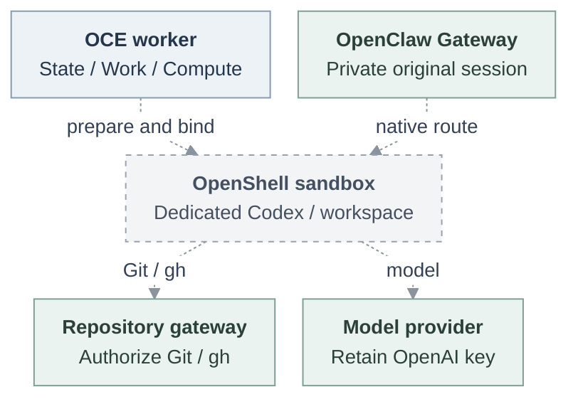

# OpenShell runtime integration

## Decision

Offer one optional dedicated Codex runtime managed by OpenClaw Enterprise (OCE), using stock OpenShell, the existing Git/`gh` credential gateway and a protected model. Connect the existing API/worker deployment path to persistent workspace, private session, provider readiness, credential delivery and replacement. This is a proposal, not a supported runtime.

[Agent access (Plan 1, PR #320)](https://github.com/openclaw/openclaw-enterprise/pull/320) ships independently. Human identity, Agent ServicePrincipal and runtime assignment remain distinct; repository grants require explicit admission, never inheritance from login or conversation.

## Reuse and ownership

Upstream [OpenClaw OpenShell support](https://docs.openclaw.ai/gateway/openshell) already supplies tool-sandbox lifecycle, SSH and filesystem bridging through `@openclaw/openshell-sandbox`. Evaluate this supported mechanism before adding equivalent helpers. Its sandbox boundary covers tool execution; the host OpenClaw Gateway, plugins and control RPC remain outside. It does not establish whole-Codex containment or OCE lifecycle integration.

| Owner                      | Reuse and remaining responsibility                                                                                                                                                                     |
| -------------------------- | ------------------------------------------------------------------------------------------------------------------------------------------------------------------------------------------------------ |
| OCE IAM, State and Work    | Existing grants, admitted revisions, finite deadlines, worker responsibility and fencing. Connect these to runtime readiness and retirement.                                                           |
| OCE Compute / Sandbox      | Existing deployment contracts. Connect persistent workspace, workload identity, private material and cleanup; choose one lifecycle owner per sandbox, never simultaneous native-plugin/OCE management. |
| OpenClaw Gateway / harness | Native transport, configuration, tool policy and execution approvals. Retain the original authenticated OpenShell session privately in the trusted Gateway, outside Codex.                             |
| OpenShell                  | Sandbox execution, destination policy and trusted model provider. Qualify the selected runtime placement and active-request cancellation.                                                              |
| Credential owner           | Existing repository gateway and receiver; authorize requests and retain GitHub App keys/provider tokens outside execution.                                                                             |

No new human IAM, policy engine/store, credential custodian, issuer, proxy or lease supervisor. Preserve existing Console and Control UI authorization boundaries.

## Selected contract

| Area              | Requirement                                                                                                                                                                                                                                                                                                                                                                                                                 |
| ----------------- | --------------------------------------------------------------------------------------------------------------------------------------------------------------------------------------------------------------------------------------------------------------------------------------------------------------------------------------------------------------------------------------------------------------------------- |
| Versions          | OCE's source baseline packages OpenClaw `2026.9.1`; current upstream capabilities are not installed-OCE proof. OpenShell pre.5 remains this proposal's reference. Main includes the pre.7 successor from [PR #301](https://github.com/openclaw/openclaw-enterprise/pull/301), but API/worker integration and runtime equivalence remain unqualified. Explicitly choose and pin image/model/tool versions before acceptance. |
| Repository        | Only the exact OCE HTTPS gateway through OpenShell `tls: skip`; clients still verify its certificate. Authorize every effective request, preserving `git-read`, `git-write`, `git-full` and token-bounded GraphQL. No direct GitHub or OpenShell GitHub-provider bypass.                                                                                                                                                    |
| Model and custody | Explicit authorized Secret through `ResolvedHarnessAuth`, Secret `operate`, exact UID/resourceVersion and attached provider identity. The trusted provider retains the real OpenAI key. Scoped capabilities use a private read-only volume separate from writable workspace, refreshed on replacement.                                                                                                                      |
| Authority         | Original State owns admitted revision, deadline and stop ordering; Work owns responsibility/fencing. Bind the observed Sandbox, Pod, revision and generation. Heartbeats or consumer timestamps cannot renew authority.                                                                                                                                                                                                     |
| Withdrawal        | Repository/model owners must deny new traffic and close active exchanges within 30 seconds, including loss of renewal connectivity; preserve selected stricter five-second consumers. Include observation age and scheduling delay. App-server closure alone is insufficient.                                                                                                                                               |

## Deployment and lifecycle

The existing bodyless `POST /namespaces/{namespaceId}/agents/{agentId}/deploy` requires exact-Agent `deploy`, freezes the saved draft and returns 202 for admission, not readiness. Missing authorization rejects admission. Workers pass harness requirements through Compute to the Sandbox Driver.

Dashed handoffs are proposed. Compute/Driver are worker libraries; the native Gateway and OpenShell-owned Codex occupy separate Kubernetes Pods.

Initialize workspace before revision-scoped enrollment. Route only when exact workload binding, native readiness and provider readiness agree. Trusted-proxy headers cannot replace the original session or prove invocation authority. Qualify turns through authorized native Gateway ingress; [deployment status](../docs/reference/agents.md#deployment-status) requires revision read and reports completion/failure, not live health.

State transactions cannot atomically settle external effects. Retain the original operation, its commit outcome (including unknown outcomes), and independently recorded original-session completion. Restart verifies completion. Unknown issuance, missing completion or unavailable currentness blocks routing: no blind replay, one-time-secret re-export or deadline extension.

Retire the predecessor before successor effects. Preserve workspace edits; create fresh Sandbox/private material. Revoke or expire capabilities independently of file deletion. CLOSED, stopped traffic, termination and DISPOSED are distinct; PVC deletion proves no physical erasure. Independent process stopping during controller outage remains later work.

## Delivery checkpoints

The first deliverable is an explicitly selected compatibility mode. Protected mode remains unavailable until its own checks pass.

1. **Compatibility:** connect ordinary deployment, workspace/session preparation, readiness and existing credential receivers using genuine IAM/State, restricted PostgreSQL, production tools and controlled providers. Use ServicePrincipal/scoped bearer checks; internal bearer replay remains possible. Resolve pre.5's unsupported token/Secret projection with existing owners; never omit required identity or copy supervisor tokens.
2. **Installed/live:** qualify pinned images, real PVCs and authorized GitHub/OpenAI: model turns, clone/fetch, remote-ref-verified pushes, and `gh` REST/GraphQL/PR creation. Historical pre.4 or embedded evidence does not qualify this runtime.
3. **Protected:** prove trusted association with each authorized invocation for writes, predecessor withdrawal and timed new/active Git/model closure after real renewal loss. Bearer possession does not establish per-write identity. Unsupported enforced configurations refuse; outages never silently downgrade.

Each checkpoint needs read-only push denial, exact-grant refusal, sibling isolation, Secret rotation, startup failure, restart/replacement, delayed/unknown effects and cleanup checks for owned resources. Source acceptance, composition, installation, live operation and release remain separate. Preparation helpers alone do not complete the API/worker path.

Before release, complete independent security review and prove stock OpenShell meets the active-model closure bound; otherwise separately review a minimal upstream patch/fork. The bound cannot be waived. Additional authentication profiles, SSH/LFS and stronger isolation remain deferred.

## References

Existing contracts: [OpenShell Driver](../docs/reference/drivers/openshell-sandbox.md), [provisioning](../docs/flows/openshell-sandbox-provisioning.md), [repository credentials](../docs/reference/repository-credentials.md), [deployment](../docs/reference/agents/deployment.md), [qualification](../docs/testing/openshell.md). Upstream reuse evidence: [pinned OpenClaw source](https://github.com/openclaw/openclaw/blob/3bbaf039b5ae920554fbd51b3398faaae16ac70b/docs/gateway/openshell.md).
