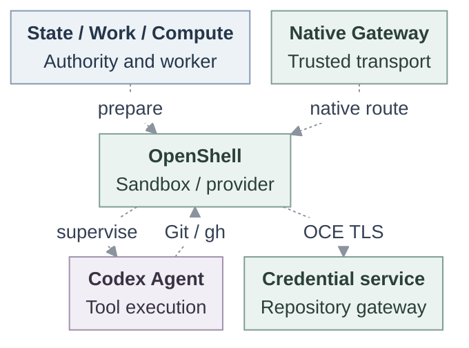

# OpenShell runtime integration

## Problem and decision

Finish the existing OpenShell integration so one dedicated Codex Agent, deployed through ordinary OpenClaw Enterprise (OCE) APIs and workers, can use a protected model, native Git and `gh`. This RFC proposes the composition; the complete runtime is not yet supported.

**Agent access (Plan 1)** independently owns human enrollment, grants, discovery and native access. Human identity, Agent ServicePrincipal and runtime assignment remain distinct. Repository grants require explicit admission, never inheritance from login or conversation.

## Specification

| Contract   | Required behavior                                                                                                                                                                                                                                                                                                 |
| ---------- | ----------------------------------------------------------------------------------------------------------------------------------------------------------------------------------------------------------------------------------------------------------------------------------------------------------------- |
| Runtime    | Existing Kubernetes Compute and OpenShell Sandbox Driver, dedicated Codex, stock OpenShell v0.1.0-pre.5. Pin exact images, models and tools. [PR #301](https://github.com/openclaw/openclaw-enterprise/pull/301)'s pre.7 work is separate, not an accepted substitute.                                            |
| Repository | Exact OCE HTTPS gateway through OpenShell `tls: skip`: skip interception while the client verifies the OCE certificate. Authorize every effective request. Preserve `git-read`, `git-write`, `git-full` and token-bounded GraphQL. No direct GitHub or OpenShell GitHub provider bypass.                          |
| Model      | Explicit authorized Secret reference through `ResolvedHarnessAuth`, Secret `operate`, exact UID/resourceVersion checks and attached provider identity. The trusted provider retains the real OpenAI API key.                                                                                                      |
| Custody    | GitHub App keys and provider tokens stay outside execution. Scoped capabilities occupy a private read-only volume separate from writable workspace, with fresh material per replacement.                                                                                                                          |
| Authority  | Original State supplies admitted revision, finite deadline and stop ordering. Work supplies responsibility and fencing. Bind observed Sandbox/Pod/revision/generation. Consumer timestamps and heartbeats cannot renew authority.                                                                                 |
| Assurance  | Explicit compatibility uses current IAM, ServicePrincipal and scoped bearer checks; internal bearer replay remains possible. Protected writes require trusted association with each authorized invocation and proven predecessor withdrawal. Unsupported enforced configurations refuse. Outages never downgrade. |
| Withdrawal | Git/model request owners deny new traffic and close active exchanges within 30 seconds of renewal connectivity loss, preserving selected stricter five-second consumers. Closing the app-server alone is insufficient.                                                                                            |

## Contract

Configure Kubernetes/OpenShell, persistent workspace, an explicit repository grant and an authorized model Secret. Deploy the saved Agent draft through the existing bodyless interface; this illustrative request is unexecuted:

```http
POST /namespaces/{namespaceId}/agents/{agentId}/deploy
```

Exact-Agent `deploy` permission freezes the draft. Missing authorization rejects admission. HTTP 202 acknowledges admission, not readiness. The worker calls Compute, which passes `HarnessWorkloadRequirements` to `SandboxDriver.provisionHarness`.



Five owner groups, with dashed proposed handoffs. Compute and Driver are worker libraries. Kubernetes runs separate native Gateway and OpenShell-owned Codex Pods. The repository gateway authorizes requests and substitutes credentials toward GitHub; OpenShell's trusted provider connects to OpenAI.

Current Kubernetes Gateway ingress uses trusted-proxy authentication. This proposal separately requires private custody of the original authenticated OpenShell session in the trusted Gateway, outside Codex. Trusted-proxy headers cannot replace that session or prove invocation authority. Preserve current Console configuration and Control UI defaults with their existing authorization boundaries.

Initialize workspace before revision-scoped enrollment. Withhold routing until exact workload binding, native readiness and provider readiness agree. Submit qualification turns through authorized native Gateway ingress. Poll [deployment status](../docs/reference/agents.md#deployment-status) with revision read permission for completion or failure; it does not report live health.


[Editable lifecycle source](37-openshell-runtime/request-lifecycle.mmd). Lifelines group owners, not services. Git/model owners enforce expiry locally within the selected bound.

State transactions cannot atomically settle external effects. Retain the original operation, COMMIT/unknown disposition and independently recorded original-session completion. Restart verifies completion. Unknown issuance, missing completion or unavailable currentness leaves routing unavailable without blind replay, re-exporting one-time secrets or extending deadlines.

Replacement retires the predecessor before successor effects, preserving workspace edits and creating fresh Sandbox/private material. Revoke or expire capabilities independently of file deletion. CLOSED, stopped traffic, termination and DISPOSED are separate outcomes; PVC deletion proves no physical erasure.

## Implementation

1. **Agree the contract.** Preserve existing supplier and independent Plan 1 ownership. Resolve pre.5's unsupported workload-token projection with the shared-contract, Compute and identity owners; this RFC does not approve omission or copying supervisor tokens.
2. **Finish preparation.** Compute/OpenShell join workspace initialization, enrollment and cleanup. Original State/Work supplies finite currentness and uncertain settlement in parallel.
3. **Connect readiness.** Compute and Gateway deliver original session and retained completion, bind the workload and verify native/provider readiness. Restart verifies without replay.
4. **Activate callers.** Repository/model owners connect production adapters through ordinary controlled-provider compatibility. Lift refusals only for completed consumers.
5. **Qualify protection.** Prove installed/live behavior, invocation association, withdrawal and recovery. Complete independent security review and polish before release.

Reuse existing owners and cancellation mechanisms. Add no backend, proxy, IAM evaluator, policy store, issuer or lease supervisor. Additional authentication profiles, SSH/LFS, stronger isolation and independent process killing during controller outage remain later work.

## Verification

Main still refuses repository-enabled Sandbox/workspace startup and unsupported Secret projections. Preparation/session components do not establish accepted ordinary session, currentness or workspace composition. Historical pre.4 controlled-provider and embedded live-provider evidence does not qualify pre.5.

Acceptance has three levels:

- **Compatibility:** ordinary API/worker journey, genuine IAM/State, restricted PostgreSQL role, production tools and controlled providers.
- **Installed/live:** pinned images, real PVCs, authorized GitHub/OpenAI, model turns, clone/fetch, remote-ref-verified pushes and `gh` REST/GraphQL/PR creation.
- **Protected:** trusted per-write invocation association, predecessor withdrawal, and measured new/active Git/model closure after real renewal loss, including observation age and scheduling delay.

Exercise read-only push denial, exact-grant refusal, sibling isolation, Secret rotation, startup failure, restart/replacement, delayed/unknown effects and owned cleanup. Source, composed, installed, live and release evidence remain distinct.

Before release, pin the image/model/tool matrix and prove stock OpenShell closes active model requests within the bound. If it cannot, separately review a minimal upstream patch or fork. The bound cannot be waived.

## References

Maintained owners: [OpenShell Driver](../docs/reference/drivers/openshell-sandbox.md), [provisioning](../docs/flows/openshell-sandbox-provisioning.md), [repository credentials](../docs/reference/repository-credentials.md), [deployment](../docs/reference/agents/deployment.md), and [OpenShell testing](../docs/testing/openshell.md).
