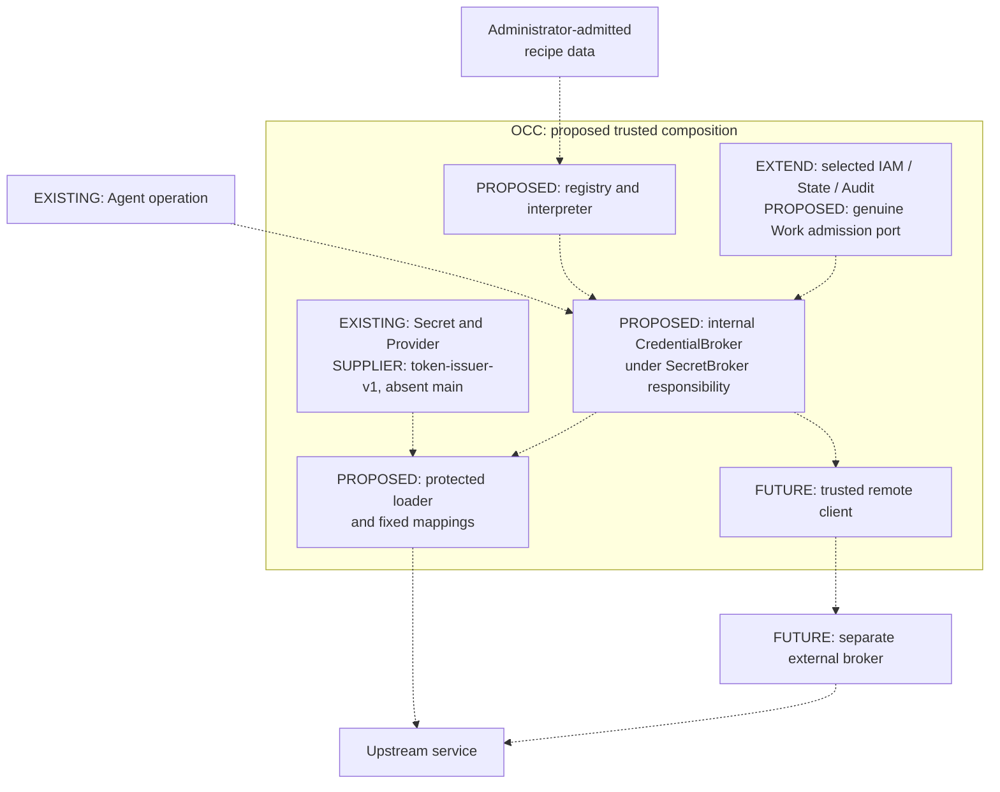

# RFC: Backend recipes and external brokers

**Status: Proposed — 15 September 2026.** This RFC defines the
OpenClaw Enterprise (OCE) extension contract. Availability is recorded in
[source status](conformance.md#source-status). The [platform design](../../docs/design.md)
remains authoritative. **MUST** and **MUST NOT** are normative requirements.

## Goal and delivery boundary

Deliver GitHub metadata, fetch, authorized direct push and same-repository PR
creation through one shared credential lifecycle. A synthetic non-GitHub service
must also complete an authorized bounded read through the implemented
issued-authentication path. [Conformance](conformance.md#acceptance) requires actual platform composition,
installed enforcement and bounded live GitHub qualification.

Third-party Git providers may supply recipes, provider implementations and deployment
configuration from separate private repositories. Public OCE owns only the generic
contracts and conformance requirements; provider-specific documentation and operational
details belong with those implementations. See the [extension boundary](interfaces.md#out-of-tree-provider-boundary)
and [provider qualification](conformance.md#q-03--qualify-each-third-party-provider-separately).

The MVP supports **one active gateway**, concurrent requests and **one pinned,
immutable version per recipe/primitive bundle**. Qualify identical-version restart
and one pinned deployment profile. Every replacement MUST wait for observed
predecessor termination; downtime is accepted. Replicas, horizontal availability, concurrent
bundle versions and migrations are future work. Offline upgrades require the
[retirement and drain rules](interfaces.md#lifecycle-requirements).

The diagram is a **proposed composition**. Labels distinguish implemented contracts from proposed composition and supplier
code. Dashed arrows are proposed connections; FUTURE labels mark deferred delivery.

[Interfaces and lifecycle](interfaces.md) own callable ports and custody;
[protocols](protocols.md) own admission, remote safety and protected children.

## Closed V1 capabilities

This is the fixed descriptive inventory, not registry identifiers or a plugin ABI.
Every mapping MUST fix its admitted service, profile, schemas and bounded parameters;
recipes select **implemented mappings only**, never arbitrary protocols.

| Capability                                 | Fixed mapping                                                                                                      |
| ------------------------------------------ | ------------------------------------------------------------------------------------------------------------------ |
| Connection verification                    | Admitted identity endpoint, service, read-only profile and response schema.                                        |
| Opaque repository resolution               | Bounded locator schema to canonical repository identity.                                                           |
| Bounded JSON read                          | Fixed endpoint-relative read, service/profile, closed request/result schemas and limits.                           |
| Git fetch                                  | Specialized Git capture/parser, admitted repository and immutable grant profile: read-only or combined read/write. |
| Git push                                   | Specialized push capture/parser, immutable combined read/write profile and finite limits.                          |
| Same-repository PR creation                | Specialized PR schema/submission, combined profile and original PR claim.                                          |
| GitHub App individually revocable issuance | Actual `token-issuer-v1`, fixed App authority and admitted read-only or combined profile.                          |

Repository/resource listing and pagination are outside MVP. Recipes MUST omit
`listResources` selections and advertise `listResources: false`; the Git facade
MUST expose no repository-listing capability. Startup MUST reject listing
selections, and requests MUST reject listing before credential acquisition,
upstream dispatch or other listing effects. Preserve connection verification,
explicit bounded-locator enrollment, metadata for an enrolled repository and Git
`info/refs` discovery. Resolution or connection verification alone grants no use;
normal Namespace isolation and Work/IAM/grant admission still apply.

Remote brokers, additional recipe authentication modes, remote streams/delegation
and protected derived downloads are future requirements, enabled only when a real
backend needs them and meets the applicable [acceptance requirements](conformance.md).
Unsupported recipe tuples MUST deny before effects or capability disclosure.

## Ownership requirements

- **O-01 — Composition.** OpenClaw Control Plane (OCC) MUST own recipe admission,
  interpretation, the broker and any future trusted remote client. Reuse existing
  IAM, State, Audit and Secret owners; add genuine Work admission. No per-recipe
  Driver, `BackendDriver`, independent broker database or parallel transaction
  abstraction.
- **O-02 — Platform boundaries.** Preserve `Provider<Client>` configuration,
  authenticated-client/member-Driver composition, `PluginDriver`'s Agent catalog,
  account credential delivery and `SecretDriver.resolve()` safe references.
  Protected material access requires an authorized loader; no plaintext Secret
  read API. The initial implementation uses internal OCC records and a minimal
  authorized administrator workflow within existing Namespace, IAM and audit
  boundaries. Public management of the designated Namespace `SecretBroker` is on
  the [roadmap](conformance.md#roadmap). Internal ports refine the
  GitHub RFC's proposed `CredentialGatewayDriver` composition and broker ownership,
  as described in [the owner reference](interfaces.md#owner-reference).
- **O-03 — Scope.** The server-selected Installation MUST admit recipe/primitive
  versions, trust and broker registrations. Connections, enrolled targets, grants,
  attempts and protected sources MUST belong to one Namespace. Authenticate and
  authorize every referenced owner; reject cross-Namespace references. Namespace
  deletion MUST preserve outstanding cleanup obligations.
- **O-04 — Authorization vocabulary.** Core MUST own closed management IAM
  envelopes and exact external-operation descriptors. Registered resource kinds
  and operations MUST NOT create IAM privileges; generic `operate` permission
  alone is insufficient. Discovery, enrollment and execution require separate
  decisions. Controller queue claims MUST NOT substitute for genuine root Work
  or authenticated Agent execution.
- **O-05 — Audit.** OCC MUST append bounded nonsecret actor, Namespace, resource,
  action, decision and attempt evidence through the existing State transaction.
  Audit events MUST NOT substitute for durable attempt records or authenticate
  arbitrary remote content as secret-free.

## Recipe requirements

- **R-01 — Definition.** Each JSON recipe MUST declare immutable identity, version,
  digest, format version, closed schemas and a finite operation table. Admission
  MUST pin each exact primitive/service/input-output-schema/profile/authentication/
  lifecycle tuple to implemented versions and digests. Descriptive capability lists
  MUST NOT expand the admitted combinations.
- **R-02 — Grammar.** Permit only constants, fixed field selection, primitive-owned
  encoding and bounded objects, arrays, strings, numbers, enums and nesting.
  Reject unknown fields, extra properties, remote schema references, recursive
  unbounded schemas, executable validators, expressions, regex transformations,
  scripts, imports, loops, branches and user functions. Core MUST own one fixed JSON
  snapshot/encode/validate path that retains an immutable value/bytes pair with its
  schema/definition identity. Restore MUST strictly validate that pair. Replaceable
  or transforming canonicalizers are not permitted.
- **R-03 — Execution.** Each operation MUST select one trusted primitive within
  the [fixed lifecycle](interfaces.md#lifecycle-requirements). Recipes MUST NOT
  supply callbacks, transports or canonical equivalence rules. Connection admission
  fixes origins, destinations, trust, audience and credential authority; request
  data MUST NOT select origins, authentication headers or secret sources. Recipe
  routes MUST remain endpoint-relative.
- **R-04 — Primitive ownership.** Core MUST own canonicalization, exact facts/byte
  capture, DNS/address selection, TLS, secret injection/signing, projection, Git
  parsing, dispatch and cleanup. Generic JSON MUST NOT retry or redirect
  automatically. Git streams, PR submission, credential responses and protected
  downloads require specialized primitives; ordinary projections MUST NOT handle
  protected material.
- **R-05 — Bounds.** Enforce the minimum of policy, connection, recipe, grant and
  remaining authority/material validity. Bounds MUST cover wire/decoded bytes,
  depth, requests, concurrency, backpressure and deadlines. Additional requests
  require implemented owners, fresh admission and aggregate accounting.
- **R-06 — Activation.** Reject invalid/duplicate identities, versions, source
  bindings, destinations, primitives and unsupported authentication/currentness
  combinations before activation or effects. Pin one immutable version per bundle;
  version changes require new admission and the L-05 offline-upgrade gate.
  Connections/grants MUST NOT silently retarget. Supported combinations MUST load
  without an OCE source edit. New primitives require implementation.

## Backend requirements

- **B-01 — GitHub.** Deliver metadata/fetch, authorized direct push and
  same-repository PR creation. Preserve read defaults, upstream branch rules and
  Agent opaque bearer authentication over server TLS. Add no OCE approval,
  branch-allowlist or provenance gate. Backend mTLS MUST NOT require Agent mTLS.
- **B-02 — GitHub capacity.** Each grant MUST select one immutable read-only or
  combined read/write token profile. Every operation and replacement MUST use that
  profile; connection preparation uses a separate read-only grant. Normally retain
  one current token; the second slot permits same-profile replacement. Enforce **two
  outstanding slots per lease and one in-flight mint**, durably enforced across
  concurrent requests and restart. Reservations,
  dispatched/unknown attempts and provider-valid retired tokens MUST remain charged.
  Free a slot only after definite no-issuance, confirmed revocation or evidenced
  expiry. Unknown inventory or two charged slots MUST deny another mint. Profile
  changes require fresh admission; another profile MUST NOT increase
  authority/capacity. Generic mechanisms MUST define their own finite bounds
  without inheriting these numbers.
- **B-03 — Third-party providers.** Require [synthetic non-GitHub conformance](conformance.md#acceptance)
  using opaque provider-instance and repository identities. Git and optional
  collaboration services MUST have independent resource, operation, service,
  audience and authentication-profile authority. Git rights confer no collaboration
  entitlement, and collaboration rights confer no Git entitlement. Unsupported
  capability or authentication combinations MUST deny without blocking GitHub delivery.
