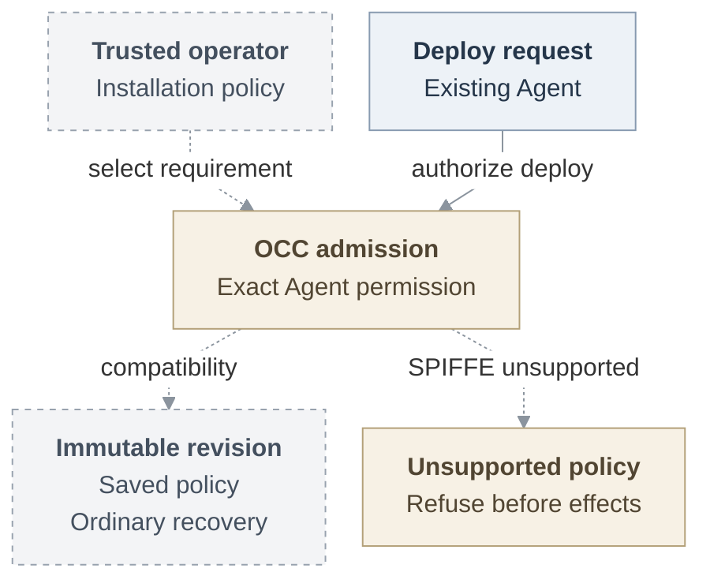

# RFC: Basic Agent identity MVP

**Status:** Proposed. Connected implementation and qualification remain pending.
**Baseline:** [Public main at `724dcb5`](https://github.com/openclaw/openclaw-enterprise/tree/724dcb5cb80b5e76a62e8267a21185a2e91a85c2).

## Problem and proposal

An operator needs to state which identity assurance an Agent deployment requires
and know that an unsupported selection cannot silently run with weaker protection.
The first change records that trusted policy in each immutable revision and makes
the existing deployment and recovery paths enforce it. An authorized caller can
observe ordinary compatibility admission or a refusal before protected preparation.

The longer-term problem remains: an Agent principal or repository bearer cannot
establish that a request came from the current execution. The selected protected
profile uses operator-managed [SPIRE](https://spiffe.io/docs/latest/deploying/registering/)
and rotating [X.509-SVIDs](https://spiffe.io/docs/latest/spiffe-specs/spiffe_workload_api/)
(workload certificates), retaining the existing Agent ServicePrincipal. Receivers
check the actual connection and current execution before credential acquisition
or protected work. Requester permission and response audience remain separate checks.

The original proposal and baseline above remain historical records. The
[current-source assessment](basic-agent-identity-mvp/delivery.md#current-source-and-proof-status)
uses public main `311bc230`. Repository credentials have landed. The policy cut
has implementation source, but final integration and qualification remain pending.

Proposed policy milestone. The solid edge is the existing deployment authorization
path. Dashed edges are proposed policy behavior. The retained
[full-profile lifecycle](basic-agent-identity-mvp/architecture.md#request-lifecycle)
follows execution preparation, serving selection, requests, and withdrawal.

## First usable milestone and complete scope

The first independently useful milestone is trusted operator policy, immutable
revision persistence, compatibility success, unsupported deployment and recovery
refusal, and separately authorized stop or cleanup. It introduces no positive
workload authentication or customer-write guarantee. Assignment storage, SPIRE
installation or issuance, attestation, new transport, protected model access,
provider consent, and per-write authorization belong to their later consumers.

The first positive identity milestone remains a real team Agent's approved
repository read through its actual Harness with explicit `git-read`. An embedded
OpenClaw checkpoint is optional.

The complete protected profile must also let personal and team Agents clone, edit, test, commit,
push, open a same-repository PR, and reply to an authorized audience. It requires
dedicated Codex, a separate trusted Agent Gateway, qualified gVisor, managed Git/`gh`,
and protected model access. The [six delivery checkpoints](basic-agent-identity-mvp/delivery.md#deliverable-cuts)
run from the policy milestone through execution assignment, registration, the
first Git read, complete contribution, and installed failure qualification. The
complete profile is not a universal prerequisite for initial 0.x. Before customer
repository writes, the separate [write-safety decision](basic-agent-identity-mvp/delivery.md#before-customer-repository-writes)
must prove predecessor withdrawal despite retained credentials and trusted
association of each effective write with its authorized request.

## Initial policy milestone

The operator supplies Installation YAML through `OCC_CONFIG_PATH`. After the
ordinary Namespace, Agent, Configuration, Harness-auth and IAM setup, a caller
uses the existing bodyless Agent deploy operation. Omission or explicit
compatibility preserves existing checks. Valid SPIFFE policy may load, but this
cut refuses its deployment after exact-Agent authorization. Saved-revision
recovery reads the admitted policy rather than today's startup default.

The [policy contract and example](basic-agent-identity-mvp/interfaces.md#operator-policy-and-revision-admission)
give the exact setting, response, persistence and recovery behavior. The
[acceptance plan](basic-agent-identity-mvp/delivery.md#policy-milestone-acceptance)
requires real API, State and worker proof, including permitted cleanup. This
groundwork changes no repository profile default and does not complete the later
protected identity requirements.

## Minimum release requirements

All seven requirements apply to one qualified complete protected-identity profile:

1. **Stable Agent, replaceable execution.** Bind each execution to its exact Agent,
   immutable revision, component, and independently observed incarnation. Replacement
   gets a fresh generation. [Retirement is irreversible](basic-agent-identity-mvp/architecture.md#assignment-and-serving).
2. **Verified workload identity.** Constrain SPIRE registration to the assigned
   workload. Check its actual connection and current execution before OCC admission,
   credential acquisition, or dispatch. Retain [exact-resource IAM checks](basic-agent-identity-mvp/interfaces.md#execution-and-registration).
3. **Protected Git and model consumers.** Keep workload keys and long-lived
   provider credentials outside tools. Independently enforced private ingress must
   [deny external and sibling off-Pod replay](basic-agent-identity-mvp/security.md#receiving-and-custody-controls)
   on every protected route.
4. **Explicit personal and team authority.** Bind operations to one admitted human
   connection or team authority, preserving requester and audience. Workload identity
   grants no provider consent or additional permissions. Qualify
   [both authority contexts](basic-agent-identity-mvp/delivery.md#authority-acceptance-cases).
5. **Bounded withdrawal and recovery.** Deny stale, retired, expired, or unavailable
   authority without extending its original lifetime. Measure new-work refusal and
   active-traffic closure within 30 seconds, including renewal loss and applicable
   [stricter five-second limits](basic-agent-identity-mvp/interfaces.md#currentness-and-expiry).
   Retain authorized cleanup. Local closure does not prove physical stop or provider revocation.
6. **Explicit compatibility.** Omitted configuration preserves existing checks
   without execution assurance. Pin the operator's enforcement selection in each
   admitted revision/session. Requests and dependency failures cannot
   [downgrade it](basic-agent-identity-mvp/architecture.md#availability-and-tradeoffs).
7. **Installed acceptance.** Demonstrate ordinary-Agent success and consequential
   denial, lifecycle, and outage cases. Complete independent security review and
   fixes. The [acceptance plan](basic-agent-identity-mvp/delivery.md#acceptance-evidence)
   requires more than source or fixture checks.

## Design and deferred work

Start with the [policy interface](basic-agent-identity-mvp/interfaces.md#operator-policy-and-revision-admission)
and its [source status](basic-agent-identity-mvp/delivery.md#current-source-and-proof-status).
[Architecture](basic-agent-identity-mvp/architecture.md) owns assignment, serving
and recovery. [Interfaces](basic-agent-identity-mvp/interfaces.md) owns the full
producer and consumer contracts. [Security](basic-agent-identity-mvp/security.md)
explains custody and assurance limits. [Delivery](basic-agent-identity-mvp/delivery.md)
retains later acceptance and personal consent. The first real human connection
remains to be selected.

OCE-managed SPIRE, exact-container or stronger-host proof, independent outage-time
physical termination, additional services/connectors, and mixed or narrower
delegation are [follow-ups](basic-agent-identity-mvp/delivery.md#decisions-and-follow-ups).

## References

- [Current repository credential contract](https://github.com/openclaw/openclaw-enterprise/blob/311bc23012d0fd269483168b865adf79df630542/docs/reference/repository-credentials.md)
  defines the landed session, profile and recovery behavior.
- [Agent authority proposal](https://github.com/openclaw/openclaw-enterprise/pull/245)
  owns admitted requester, operation and audience authority.
- [Egress proposal](https://github.com/openclaw/openclaw-enterprise/pull/249)
  owns protected routing and receiving transport.
