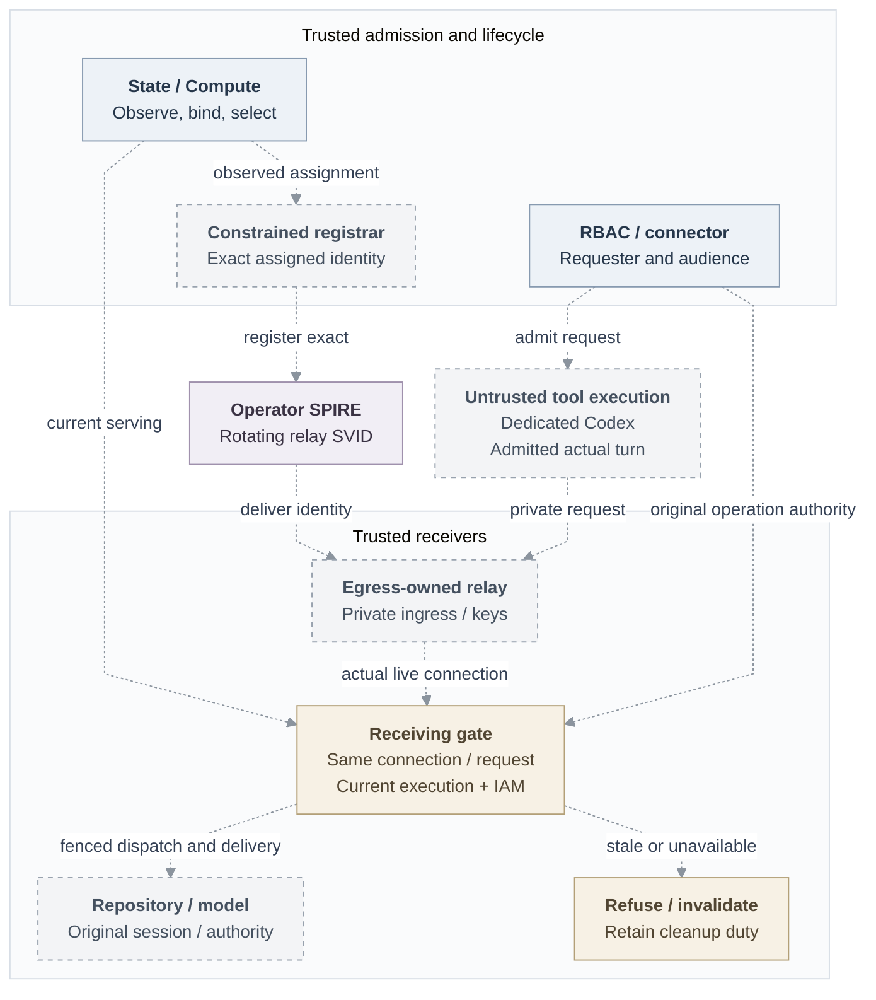

# RFC: Basic Agent identity MVP

**Status:** Proposed; connected implementation and qualification pending.
**Owners:** OCC/State, Compute, selected IAM, identity, egress and credential owners.
**Baseline:** [Public main at `724dcb5`](https://github.com/openclaw/openclaw-enterprise/tree/724dcb5cb80b5e76a62e8267a21185a2e91a85c2); separately identified suppliers below.

## Decision

An authorized member mentions a team Agent to change an approved repository and
open a PR. Its admitted team integration supplies authority; the requester remains
distinct from the deployer. The personal variant admits one connected human's
integration, up to its existing permissions. Team Git author metadata supplies
attribution only. Login, creator Roles and unselected provider sessions grant no authority; callers cannot substitute
person, team, connection, grant or audience.

Use operator-managed SPIRE, rotating X.509-SVIDs and the existing Agent
ServicePrincipal. The complete release requires dedicated Codex, a separate
trusted Agent Gateway, qualified [gVisor](31-gvisor-container-support.md), verified
Git/`gh`, protected model access and authorized replies. An optional embedded
repository checkpoint can shorten delivery; it cannot replace that outcome.

## Minimum release requirements

The complete MVP must satisfy all seven requirements on one qualified deployment
profile. The [delivery cuts](basic-agent-identity-mvp/delivery.md) identify smaller
reviewable checkpoints; completing a component or the first Git read does not
complete this release.

1. **Stable Agent, replaceable execution.** Retain the existing Agent principal.
   Bind each execution to its exact Agent, immutable revision, component and
   independently observed incarnation; replacement gets a fresh generation and
   retirement cannot be reversed.
2. **One operator-managed SPIRE profile.** Constrain registration to the assigned
   workload and use rotating X.509-SVIDs with protected key custody. Verify the
   actual receiving connection and current execution before OCC admission or
   repository credential acquisition/dispatch; retain exact-resource IAM.
3. **Two concrete consumers.** An ordinary Agent must use managed Git/`gh` through
   the existing repository service and a protected model route. The complete
   profile uses dedicated Codex/Gateway and qualified gVisor. Keep workload keys
   and long-lived provider credentials outside tools; independently enforced
   private ingress must deny external and sibling off-Pod replay on every route.
4. **Personal and team authority remain explicit.** Use the same workload model
   for both. Bind each operation to one admitted human connection or team service
   authority, retaining the requester and permitted audience separately. Identity
   supplies neither provider consent nor additional permissions. Missing personal
   authorization must deny, never switch to team authority.
5. **Bounded withdrawal and recovery.** Deny stale, retired, expired or unavailable
   authority; rotation/reconnect cannot extend its original lifetime. Measure
   new-work refusal and active protected-traffic closure within 30 seconds,
   including renewal loss, preserving applicable stricter five-second limits.
   Keep independently authorized cleanup and truthful termination observations.
6. **Explicit compatibility.** Preserve existing tools, authentication, IAM and
   session checks when enforcement is not selected. Pin the operator's requirement
   in each admitted revision/session; neither request input nor dependency failure
   can downgrade enforcement or manufacture execution assurance.
7. **Installed evidence.** Demonstrate successful ordinary-Agent work and the
   consequential denials, lifecycle and outage cases in the acceptance matrix,
   then complete security review and fixes. Source/fixture checks alone cannot
   claim the protected release.

Additional services, new human connectors, managed SPIRE installation,
exact-container proof, mixed/narrowed delegation and independent outage-time
physical termination are follow-ups. The required producer/consumer interfaces
below do not require completion of every adjacent feature or UI.

## Current boundary and scope

[Main](https://github.com/openclaw/openclaw-enterprise/blob/724dcb5cb80b5e76a62e8267a21185a2e91a85c2/packages/contracts/src/index.ts#L344-L745)
supplies immutable revisions, Agent principals, IAM and Compute seams.
[Actual admission](https://github.com/openclaw/openclaw-enterprise/blob/724dcb5cb80b5e76a62e8267a21185a2e91a85c2/apps/controller/src/index.ts#L1257-L1325)
accepts human sessions/non-Agent API keys; the
[model probe](https://github.com/openclaw/openclaw-enterprise/blob/724dcb5cb80b5e76a62e8267a21185a2e91a85c2/apps/controller/src/drivers/compute/kubernetes/runtime-entrypoints.ts#L552-L589)
receives the model key. The separate, unmerged
[repository supplier](https://github.com/openclaw/openclaw-enterprise/blob/eb52cc4cfe68f08017e7ece6585fe7e937e0747a/docs/reference/repository-credentials.md#L1-L24)
is embedded-only and bearer-based. Registration, Agent admission, current-serving
resolution, execution-bound sessions and protected consumers remain joins to build.
Source support establishes neither installed nor live-provider qualification.

Omitted Installation configuration retains compatibility: existing authentication,
IAM and session checks, without execution assurance. Only an authorized operator
selects enforcement, pinned in the admitted revision and operation/session.
Profile changes require fresh revision admission. Unsupported enforcement,
missing/stale evidence and dependency loss deny; requests and outages cannot downgrade.

## Design and failure behavior

### Authority and execution

| Record and owner                  | Required contract                                                                                                                                                                                    |
| --------------------------------- | ---------------------------------------------------------------------------------------------------------------------------------------------------------------------------------------------------- |
| Agent — OCC/State/IAM             | One immutable Namespace-scoped ServicePrincipal, retained across revisions. Extend actual admission and selected-IAM identity lookup; add no principal kind.                                         |
| Execution — State/Compute         | Opaque reference, generation, exact Agent/revision/principal/component, observed incarnation, original lifetime, current/retired state; at most one serving generation per component.                |
| Operation — RBAC and effect owner | `AgentAuthorityContext`/`AgentInvocation`, original connection/grant, exact scope, audience, authority generation and absolute deadline; identity-purpose currentness does not authorize operations. |

Deployment/replacement prepares execution independently of repeated requests:

1. Allocate pending execution from an admitted immutable revision. Compute observes
   Harness and relay with protected traffic disabled, then State binds them. Pod
   UID, container incarnation, restart discrimination and selectors remain adapter
   facts. Relevant restart/replacement requires fresh evidence; retirement is terminal.
2. A separately authenticated registrar creates only the assigned identity under
   the operator's trust domain/parent, using trusted selectors; broad or caller-authored
   registrations deny. Retain exact cleanup ownership. The
   [registration model](https://spiffe.io/docs/latest/deploying/registering/) and
   [Workload API](https://spiffe.io/docs/latest/spiffe-specs/spiffe_workload_api/)
   supply identities/keys, not operation permission.
3. Extend the existing `RepositoryCredentialDriver`: persist the immutable
   execution-bound attempt before opening/recording the session; deliver through
   `RepositoryCredentialRuntimeBinding` to the actual Harness. Retain only identical
   expectations across open/status/recovery; unsupported binding capability denies.
   Replacement closes the prior attempt and requires fresh admission. Verify actual
   shim/PATH invocation, readiness, generation replacement and retirement.
   Never rebind an open session or temporarily enable compatibility. Session material
   changes can restart workloads; reversing worker calls alone is insufficient.
4. Verify unchanged incarnation/material. Run the real protected authentication
   probe through a separately admitted bootstrap purpose; its concrete mechanism
   remains an owner decision. State/Compute serialize authoritative
   serving selection with predecessor withdrawal before enabling protected use.
   Bound or ready does not mean serving. Resolve from current State selection,
   fresh Compute/registration/profile evidence, original deadline and current IAM.

All edges are proposed connections, including joins between existing components;
the diagram establishes no composed, installed or provider result. Execution
selection and ordinary invocation independently constrain the receiving gate.

### Receiving proof and custody

Egress owns the accepting Go listener/authenticated bridge; identity owns
verification/currentness; credential owners retain exchange, injection, renewal
and cleanup. Check current verified evidence before credential acquisition and
dispatch. Reuse native peer work, `VerifiedWorkloadV1`,
`RuntimeWorkloadVerifierV1` and `TrustedRuntimeRegistrationReaderV1` only with real
producers. Verify actual X.509 connection, recipient, component, trust domain,
registration, assignment and, for ordinary operations, serving selection; resolve that evidence to the
existing Agent ServicePrincipal through selected IAM. Opaque process-local evidence
must bind the same HTTP request/stream to its original live connection/incarnation
through the Go/TypeScript bridge. Strings, routing hints, headers, serialized
proofs, diagnostics and repository bearers cannot create it. Cover every receiving
route, including `checkContinue`; reject alternate/upgrade/CONNECT routes.

[RBAC](31-basic-rbac.md) supplies authentic invocation-to-turn-to-operation
association and current requester/complete-audience authority. Shared execution,
session or caller-provided invocation IDs cannot identify the requester; ambiguity
denies dispatch/delivery. Durable dispatch/reply fences survive audit erasure;
unknown start/send cannot authorize replay. Per-invocation cancellation or the
existing exact-revision containment fallback must preserve that authority.
Check current exact Agent `use_repository`, admitted grant/profile/operation and
deadline; do not broaden `operate`/`read` to accommodate legacy mappings.

Compute prepares one egress-owned trusted Go service per assignment, with private
ingress independently enforced before readiness. Its certificate identifies the
relay; trusted assignment plus ingress associate it with the Agent. Every protected
route must deny external/sibling off-Pod replay. Trust includes node, Kubernetes
control plane, CNI, SPIRE, registrar and receiver. mTLS proves key possession:
copied certificate/key remain usable wherever reachable; Pod networking proves
no container identity.

**Proposed strengthening — owner decision pending:** the
[egress design](31-basic-egress-proxy.md) proposes containment before any untrusted
init/startup/replacement code. Compute/CNI owners must qualify that first-execution
boundary; policy readback alone cannot establish it.

Keep workload keys, long-lived provider credentials, refresh tokens, signing and
registration authority outside tools. Inventory init/probe/tool children, relay
and Gateway mounts; the separate Gateway receives no repository session. A short-lived
bootstrap credential is permitted only where the transport requires it; bootstrap
probe authority differs from serving admission. Egress owns mandatory routing and
destination/operation checks. Managed Git/`gh` retains its private credential route
and service trust. Direct model-key checkpoints disclose weaker custody.

### Withdrawal and recovery

Admission/renewal use original READ COMMITTED State custody: Installation → sorted
account/session guards → complete IAM policy barrier/head → assignment/resource/
withdrawal rows → audit. No late lock upgrade. Record protected admission and
durable withdrawal intent in State before COMMIT; this does not put external
SPIRE/provider effects inside the transaction. Release committed authority only
after acknowledged COMMIT or exact authorized retained receipt/readback. Preserve
original create/operation IDs and version checks across retries; uncertain
registration create/delete requires exact readback, never duplicate creation or
unrelated deletion. Preserve policy-writer/account-currentness ordering; create
no parallel IAM, account, invocation, lease, credential or audit store.

Consume original stable Principal/account/method/session facts. RBAC distinguishes
session logout, account disablement/method repair and team-grant changes;
re-enablement never revives withdrawn authority. Requester, connection or audience
withdrawal denies further use. Retired/withdrawn generations cannot admit, renew,
acquire credentials or dispatch. Rotation, retries, reconnects and delayed positives
retain the original source, generation and absolute deadline. Preserve no-positive-cache
guards; no allow cache may outlive admitted validity.

After authority/acquisition waits, reinspect the same proof within its original
budget. Immediately, synchronously assert currentness and the session fence before each effect
and authority-sensitive delivery, without an intervening await. Shared acquisition
needs a current original waiter at dispatch and after waits; withdrawn waiters
neither authorize minting nor cancel others. Invalidation synchronously prevents
new work and buffered delivery before awaited cleanup, even during audit outage.

The installed profile must measure **≤30 seconds** from its defined authority-owner
event to both new-work refusal and last protected bytes/closed active exchanges,
including renewal loss. Specify evidence age, receiving expiry, clock/skew rules,
monotonic budget, renewal cadence and closure reserve; no stage restarts the bound.
Expiry progresses independently of the Harness, blocked readers and listener
saturation. Preserve applicable **five-second** dependency-call, operation-start,
model-recheck and model-closure ceilings; these are not global five-second revocation.
Maintenance reconciliation is not an outage guarantee.

Idempotent close joins owned I/O/provider settlement, including late completion;
timeouts release neither unsettled custody nor capacity. Registrar, Gateway and
cleanup use their own enrolled identities; authorized preparation/exact cleanup
need no live Agent SVID. Distinguish requested stop, observed stop, registration
retirement, connection closure, session closure, provider cleanup and uncertain upstream
effects. Delete acknowledgment, missing Pod, timeout or unreachable node cannot
prove termination; report termination-unverified until the exact incarnation is
observed stopped. Already accepted upstream effects may complete after local closure.
Supplier restart loses provider-token inventory: local session
loss cannot prove revocation; tokens may survive to original expiry.

Audit retains initiator, Agent/revision, selected authority, exact operation/result
and truthful assurance. Actual verifier/guard observations retain original
assignment/generation/component/profile/verification-expiry facts. Follow the
[repository observation contract](31-basic-observability/repository-read.md): no
credentials, custody/proof handles or raw request/result material. Protected
references need authorized owner lookup; serialized facts never authorize effects.

## Acceptance and delivery

Use the [dependency and delivery plan](basic-agent-identity-mvp/delivery.md) to
review and land bounded changes. It names each required external interface,
independent work, and the installed acceptance matrix. The first connected
consumer is a team Agent's managed Git read; personal/provider delegation and the
complete protected Git/model contribution remain separately visible acceptance.

Preserve existing repository grants/profiles/deadlines, Git semantics, renewal,
recovery, durable cleanup and uncertain outcomes. Retain reviewed checkpoints with
exact source, validation, substitutions and limits; distinguish source, composed,
installed, provider and release evidence. Fixtures cannot qualify the deployment.
Identity consumes required RBAC capabilities and safe audit facts; broader RBAC
coverage, retained storage and History UI remain their owners' separate gates.

When supported, reconcile the
[access design](https://github.com/openclaw/openclaw-enterprise/blob/724dcb5cb80b5e76a62e8267a21185a2e91a85c2/docs/design/access.md#L63-L109)
with SVID evidence attached to the existing principal, without implicit token
fallback; update owning authentication, authorization, deployment and runtime-security references.

## Alternatives and follow-ups

**Proposal — owner decision pending:** Installation/product and admission owners
should separate prospective default changes from explicit audited withdrawal when
a minimum strengthens. Select finite supported combinations, affected revisions/
sessions, renewal eligibility, effective event and unavailable result. Fresh
admission is required for stronger claims; no grace period or automatic continuation
is accepted. Receiving peer selection/bridge, immutable bootstrap delivery and
concurrent operation association remain concrete owner decisions.

| Follow-up trigger                                   | Existing owner and closure                                                                                                                                                                                      |
| --------------------------------------------------- | --------------------------------------------------------------------------------------------------------------------------------------------------------------------------------------------------------------- |
| OCE-managed SPIRE installation                      | Identity/operator packaging; unchanged consumer contract, installed custody/rotation/upgrade/restore proof.                                                                                                     |
| Stronger container/host assurance                   | Compute/identity runtime-aware broker; verified caller/incarnation/request correspondence, including gVisor, and separately qualified host threat boundary.                                                     |
| Independent outage-time physical expiry             | Compute/runtime trusted supervisor; independent expiry plus measured observed stop.                                                                                                                             |
| Retained/recovered consumer                         | Storage/Compute/native-context owners; whole-Agent predecessor stop/fence before successor writes, authentic artifacts and a real fresh-authority turn. Restored files/context never restore retired authority. |
| Narrower/mixed delegation or more services/runtimes | RBAC/operation/runtime owners; selected real consumer, exact scope/denial/renewal/withdrawal proof. Add fixed operator authentication only for a consumer requiring it.                                         |
| Durable provider cleanup after restart              | Credential owner; protected recovered custody and provider-observed settlement/revocation.                                                                                                                      |
