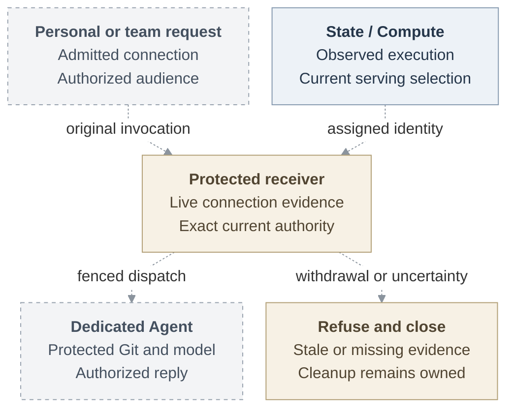

# RFC: Basic Agent identity MVP

## Problem and goal

A team member should be able to mention an Agent, ask it to change an approved
repository, and receive a pull request through an authorized channel. Today, an
Agent principal and a repository session do not establish that a protected request
came from the currently admitted execution. The receiver also needs the original
requester's authority and the intended response audience.

The proposal connects those checks. An ordinary Agent in the enforced profile
must present current verified execution evidence before acquiring repository
credentials or dispatching protected work. The complete selected outcome uses
dedicated Codex, a separate trusted Agent Gateway, qualified gVisor, verified
Git/`gh`, protected model access, and authorized replies. A personal Agent uses
one explicitly connected human's admitted integration, up to that connection's
existing permissions. A team Agent uses its admitted team service integration.
The requester remains distinct from the deployer, and Git author metadata supplies
attribution only.

**Status:** Proposed. Connected implementation and qualification remain pending.
The recorded baseline is [main at `724dcb5`](https://github.com/openclaw/openclaw-enterprise/tree/724dcb5cb80b5e76a62e8267a21185a2e91a85c2).
OCC/State, Compute, selected IAM, identity, egress, and credential owners retain
their existing responsibilities.

## Proposed journey

Proposed connections are dashed, including joins between existing components.
Execution identity and ordinary invocation are independent inputs to the receiving
decision. This picture establishes no composed, installed, or provider result.

## MVP boundary and present evidence

Start with operator-managed SPIRE and rotating X.509-SVIDs, which are certificates
carrying workload identity. Reuse the existing Agent ServicePrincipal. The first
connected consumer proves a genuine approved repository read through the actual
Harness. An embedded repository checkpoint is optional and cannot replace the
complete dedicated contribution journey or its protected model path.

Current source at [pinned main `e9766f3`](https://github.com/openclaw/openclaw-enterprise/tree/e9766f35a25afa240ee109b41a6ef821fb68687e)
supplies Agent principals, immutable revisions, IAM, and Compute seams. The
separate repository supplier remains embedded-only and bearer-based. Registration,
Agent admission, current-serving resolution, execution-bound sessions, and protected
consumers remain joins to build. Source definitions do not establish installed
behavior, live-provider qualification, or release readiness.

Omitted Installation configuration retains compatibility and its existing checks,
without verified-execution assurance. Only an authorized operator selects
enforcement. The admitted revision and operation/session retain that selection.
Missing evidence and dependency loss deny protected use without downgrading.

Off-Pod replay denial is required. Exact-container origin, stronger host assurance,
OCE-managed SPIRE packaging, and independent outage-time physical termination
remain separate follow-ups. This proposal does not turn workload identity into
human permission or a repository bearer into requester attribution.

## Supporting design

- [Architecture](basic-agent-identity-mvp/architecture.md) follows assignment,
  observation, registration, immutable session delivery, and serving selection.
  Its [request lifecycle SVG](basic-agent-identity-mvp/request-lifecycle.svg)
  shows the ordinary request and withdrawal across actual component boundaries.
- [Security](basic-agent-identity-mvp/security.md) explains receiving custody,
  off-Pod denial, protected key handling, and currentness controls. It separates
  recorded trust limits from missing implementation and unresolved risk decisions.
- [Interfaces](basic-agent-identity-mvp/interfaces.md) distinguishes main contracts,
  separate suppliers, and proposed extensions. It defines the local obligations
  for verified evidence, repository binding, expiry, and safe observations without
  inventing wire APIs.
- [Delivery](basic-agent-identity-mvp/delivery.md) defines the first real consumer,
  complete contribution, composition qualification, and remaining owner decisions.
  It keeps reviewed checkpoints useful without treating them as completion.

## References

- [Agent, revision, and identity contracts at pinned main](https://github.com/openclaw/openclaw-enterprise/blob/e9766f35a25afa240ee109b41a6ef821fb68687e/packages/contracts/src/index.ts#L344-L423)
  and [ComputeDriver](https://github.com/openclaw/openclaw-enterprise/blob/e9766f35a25afa240ee109b41a6ef821fb68687e/packages/contracts/src/index.ts#L714-L745).
- [Separate repository credential supplier](https://github.com/openclaw/openclaw-enterprise/blob/eb52cc4cfe68f08017e7ece6585fe7e937e0747a/docs/reference/repository-credentials.md)
  describes its existing topology, profiles, and custody limits.
- [SPIRE registration model](https://spiffe.io/docs/latest/deploying/registering/)
  and [SPIFFE Workload API](https://spiffe.io/docs/latest/spiffe-specs/spiffe_workload_api/)
  define workload identity issuance and delivery, not operation authorization.
