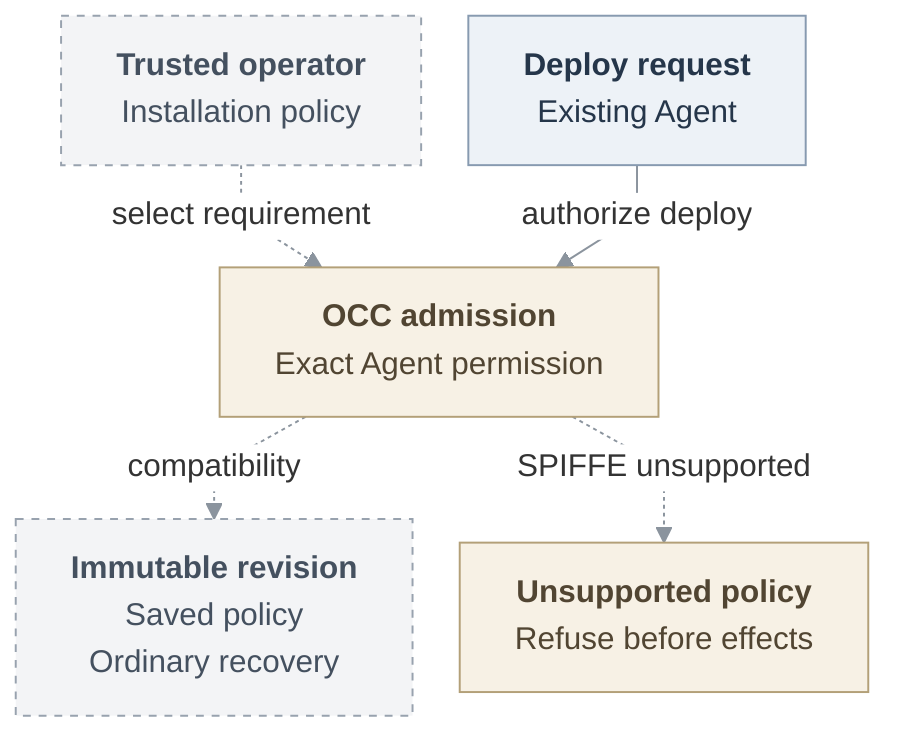
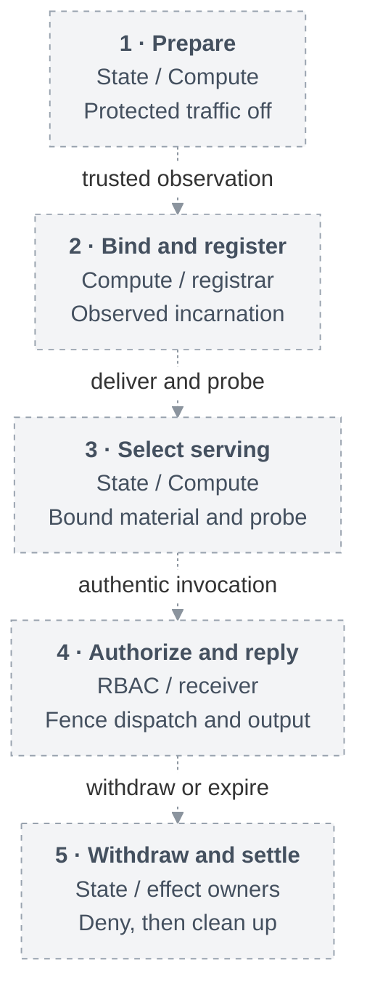

# RFC: Basic Agent identity MVP

**Status:** Proposed.
**Baseline:** [Main `724dcb5`](https://github.com/openclaw/openclaw-enterprise/tree/724dcb5cb80b5e76a62e8267a21185a2e91a85c2).

<a id="problem-and-proposal"></a>

## Problem and Decision

Repository sessions lack execution/requester identity. Optional immutable-policy groundwork refuses unsupported enforcement. B–D deliver protected team-Agent reads.

<a id="first-usable-milestone-and-complete-scope"></a>
<a id="design-and-deferred-work"></a>

## Scope

Policy groundwork stays outside the first incremental v0.x batch. Customer writes require predecessor withdrawal despite retained credentials and authentic authorization for **every effective mutating Git/HTTP/API request**, including native Git follow-on requests and GraphQL POSTs. Product selects any narrower mechanism/read-only release. `git-write` remains default.

### Minimum release requirements

The complete profile is not a universal v0.x prerequisite:

1. Stable Agent and terminal retirement.
2. Constrained registration and verified identity.
3. Protected Git/model, custody, replay denial.
4. Explicit personal/team authority.
5. Bounded withdrawal and recovery.
6. Immutable policy without downgrade.
7. Installed acceptance and security fixes.

## Contract

<a id="initial-policy-milestone"></a>

### Operator policy and revision admission

Prerequisites: migrated State, Drivers, ready Namespace, saved Agent/Configuration, Harness-auth and IAM. Unmerged, unexecuted YAML through absolute `OCC_CONFIG_PATH`:

```yaml
occ:
  agent_identity:
    mode: spiffe
    profileRef: enterprise/workload-v1
    profileVersion: 1
    profileDigest: "sha256:0123456789abcdef0123456789abcdef0123456789abcdef0123456789abcdef"
```

Revision policy:

```ts
type AgentIdentityRequirementV1 = Readonly<
  | { mode: "compatibility" }
  | {
      mode: "spiffe";
      profileRef: string;
      profileVersion: number;
      profileDigest: string;
    }
>;
// AgentRevision attachment:
readonly identityRequirement: AgentIdentityRequirementV1;
```

Require 1–200-character `[A-Za-z0-9._:/-]+` reference, positive safe-integer version, and `sha256:` plus 64 lowercase hex digits. Only omission defaults to compatibility. Null/extra/malformed values fail before Driver resolution/construction. OCC freezes the detached selection.

Bodyless [deploy/readback][deploy]:

```text
POST /namespaces/:namespaceId/agents/:agentId/deploy
  compatibility -> 202 AgentRevisionResponse, with identityRequirement
  authorized unsupported SPIFFE -> 503 DEPENDENCY_UNAVAILABLE
GET /namespaces/:namespaceId/agents/:agentId/revisions/:revisionId
GET /namespaces/:namespaceId/agents/:agentId/deployments/:deploymentId
```

Exact-Agent authorization precedes refusal and Configuration/Secret, revision or reconcile-Work creation. Tenant inputs cannot override policy. State saves `admitted_spec.identity_requirement` for operation/session owners. Recovery accepts only historical omission as compatibility. Malformed state refuses. Worker recovery preserves original Work, ownership/IAM/Provider/claim checks and authorized stopped cleanup, then reports permanent `IDENTITY_RUNTIME_UNSUPPORTED` before unsupported running repository/Secret/workspace/Compute preparation. Compatibility preserves existing checks without execution assurance. Requests/outages cannot downgrade.



Solid: existing authorization. Dashed: proposed policy.

### Components and authority

The **Agent** is the immutable Namespace-scoped ServicePrincipal across revisions. An **execution** is independently observed, with at most one serving generation per Agent component. **Requester authority** retains permission, scope, audience and deadline. Execution proof does not authorize a request.

| Owner and placement                                                                        | Responsibility                                                                                                                                                                 |
| ------------------------------------------------------------------------------------------ | ------------------------------------------------------------------------------------------------------------------------------------------------------------------------------ |
| OCC API/worker, PostgreSQL State, IAM                                                      | Resource/Work/audit custody, verified Agent lookup, exact `principalId/action/resource` authorization.                                                                         |
| Internal `RepoDriver` → [credential-service container in worker Pod][credential-placement] | Separate process, private Unix control/HTTPS, provider keys/tokens and acquisition/exchange/injection/renewal/dispatch/settlement.                                             |
| Compute, [dedicated Codex and separate Gateway Pods/ServiceAccounts][compute-placement]    | Workloads/material. Enrolled Gateway receives no repository session.                                                                                                           |
| Operator-managed SPIRE, registrar, identity, egress                                        | Rotating X.509-SVIDs. One egress Go service per assignment in a **separate trusted proxy Pod/network identity**. Identity verifies currentness. Egress owns receiving/routing. |

Trust node/control plane/CNI/SPIRE/registrar/receiver. Distrust tools/children/input. mTLS proves key possession. Pod networking cannot identify containers. Add no authority stores.

[Personal/team selection][rbac-context] permits one admitted human connection's permissions or an authorized member's team integration. Missing personal authority denies without team fallback. Login, creator Role, Git authorship/deployer/team-DM credentials grant no requester authority. Reject substitution. Personal GitHub requires OCE-account/requester consent and trusted-service App user-credential retention/renewal/revocation.

### Assignment and serving

[Assignment records][assignment] and Compute's Pod/container/restart selectors remain authoritative.

1. State allocates an execution from the admitted revision. Compute prepares traffic-disabled, independently observes, then State binds the incarnation.
2. The separately authenticated registrar creates only the assigned identity under operator trust domain/parent using trusted selectors. Refuse broad/caller-authored registration. Retain exact readback/deletion ownership.
3. Persist the execution-bound attempt before session open. Deliver `RepositoryCredentialRuntimeBinding`, prove unchanged incarnation/material and Git/`gh` shim/PATH, then perform the separately authorized probe.
4. State/Compute serialize serving with predecessor withdrawal. Replacement closes the prior attempt, requiring fresh evidence/admission. Never rebind or use temporary compatibility.

[Compute readiness/stop][main-contract] proves neither serving nor termination. Protection cannot be optional.

### Request lifecycle



Proposed. [Detailed lifecycle](basic-agent-identity-mvp/request-lifecycle.svg) · [editable source](basic-agent-identity-mvp/request-lifecycle.mmd).

**Pinned-main [RepoDriver][repo-contract]:** `created` delivers files. `recovered` cannot rediscover bearers. `recoverOnly` creates no authority.

```ts
export interface OpenRepositorySessionInput {
  readonly namespaceId: string;
  readonly admissionId: string;
  readonly binding: AdmittedRepositoryBinding;
  readonly durationSeconds: number;
  readonly deadlineWallMs: number;
  readonly recoverOnly?: true;
}
export type OpenRepositorySessionResult =
  | {
      readonly kind: "created";
      readonly session: RepositoryCredentialSessionStatus;
      readonly files: RepositoryCredentialSessionFiles;
    }
  | { readonly kind: "recovered"; readonly status: RepositoryCredentialSessionStatus }
  | { readonly kind: "missing" };
export interface RepoDriver extends Driver {
  readonly capability: "repo";
  readonly maintenanceIntervalMs: number;
  resolve(input: {
    readonly namespaceId: string;
    readonly bindings: readonly RepositoryBindingRequest[];
  }): RepositoryCredentialResolution;
  open(
    input: OpenRepositorySessionInput,
    signal: AbortSignal,
  ): Promise<OpenRepositorySessionResult>;
  status(
    sessionId: string,
    signal: AbortSignal,
  ): Promise<RepositoryCredentialSessionStatus | undefined>;
  close(
    sessionId: string,
    signal: AbortSignal,
  ): Promise<RepositoryCredentialSessionStatus | undefined>;
}
export type RepositoryCredentialRuntimeBinding = RepositoryCredentialMaterialRef & {
  readonly deadlineWallMs: number;
} & (
    | { readonly kind: "new"; readonly files: RepositoryCredentialSessionFiles }
    | { readonly kind: "retained" }
  );
```

Status: `sessionId`, `state: OPEN | CLOSED | DISPOSED`, `deadlineWallMs`, grant `binding`. Preserve [grants/material][repo-contract], [selector bounds][repo-selectors] and [profiles/deadlines/recovery][repo-reference], including full token-bounded `git-full` GraphQL. Proposed execution binding survives open/status/recovery/delivery. Unsupported binding refuses. Shape remains open.

**Supplier [process-local verifier][identity-contract]:** trusted receiver expectations, never request destination data.

```ts
export interface RuntimeWorkloadExpectationV1 {
  readonly target: ReadonlyValue<RuntimeAssignmentTargetV1>;
  readonly expectedPeerSPIFFEId: string;
  readonly recipientRef: string;
  readonly identityProfileRef: string;
  readonly limits: RuntimeIdentityLimitsV1;
}
export interface RuntimeWorkloadVerifierV1<OwnedConnection> {
  verify(
    connection: OwnedConnection,
    expected: RuntimeWorkloadExpectationV1,
    call: RuntimeAuthorityCallBoundsV1,
  ): Promise<RuntimeWorkloadVerificationResultV1>;
  inspect(
    proof: VerifiedWorkloadV1,
    call: RuntimeAuthorityCallBoundsV1,
  ): Promise<RuntimeWorkloadVerificationResultV1>;
}
export type RuntimeWorkloadVerificationResultV1 =
  { readonly kind: "verified"; readonly proof: VerifiedWorkloadV1 } | RuntimeIdentityFailureV1;
export interface RuntimeAuthorityCallBoundsV1 {
  readonly requestRef: string;
  readonly recipientRef: string;
  readonly deadline: string;
  readonly signal: AbortSignal;
}
export interface AuthorityCallV1 extends RuntimeAuthorityCallBoundsV1 {
  readonly context: RuntimeAuthorityTrustedContextV1;
}
```

The verifier binds X.509/registration evidence to the original request/connection and trusted expectations. Headers/JSON/diagnostics/bearers/relay identity create no proof. Unauthenticated recipients receive generic failure. Trusted assignment/ingress associates relay and Agent. Egress enforces every destination/operation, including `checkContinue`, rejects unsupported alternate/upgrade/CONNECT routes, and independently enforces pre-readiness ingress against external/sibling replay. Keys, long-lived/refresh/signing credentials and registration authority stay outside tools. Permit a **short-lived execution bootstrap credential** only when the selected transport requires it.

Before acquisition/dispatch/output, require current serving, authentic [RBAC invocation][rbac-invocation], original grant/scope/generation/deadline, exact operation and complete current audience. `use_repository` remains proposed. Enforce [dispatch/reply fences][rbac-fences] and [targeted withdrawal][rbac-withdrawal]. Ambiguity denies. [Audit][observations] records actors/authority/operation/result/verifier assurance. Lookup creates no proof.

### Withdrawal and recovery

Follow [original-State admission/renewal/withdrawal][state-transaction]. Only acknowledged COMMIT or retained exact readback releases authority. Atomic mutation/audit/Work excludes external effects. Preserve original effect identities/versions and readback ownership.

Consume [account/session][account-lifecycle] and [dependent-withdrawal][rbac-withdrawal] semantics. Logout is session-scoped. Disablement/method-repair/team-grant effects differ. Enablement never revives authority. Retired/withdrawn/stale/unavailable denies. Preserve source/generation/deadline and no-positive-cache rules. After waits, reinspect the same proof within its original budget and synchronously fence effects/output. Shared acquisition requires a current original waiter without borrowing or cancelling another's authority.

Normative [purpose/results][assignment-results] and [limits/streams][identity-contract] have no defaults. Unexecuted example:

```ts
const request: ResolveAssignmentRequestV1 = {
  schemaVersion: 1,
  installationId,
  namespaceId,
  agentId,
  assignmentRef: { schemaVersion: 1, id: assignmentId },
  requestRef,
  purpose: "repository-issuance",
};
export interface RuntimeIdentityPurposeGuardV1 {
  check(
    proof: VerifiedWorkloadV1,
    request: ResolveAssignmentRequestV1,
    call: AuthorityCallV1,
  ): Promise<RuntimeIdentityCheckResultV1>;
  openStream(
    proof: VerifiedWorkloadV1,
    request: ResolveAssignmentRequestV1,
    call: AuthorityCallV1,
    limits: RuntimeIdentityLimitsV1,
  ): Promise<RuntimeIdentityOpenStreamResultV1>;
}
export type RuntimeIdentityCheckResultV1 =
  | { readonly kind: "resolved"; readonly observation: ResolveAssignmentResultV1 }
  | RuntimeIdentityFailureV1;
export type RuntimeIdentityOpenStreamResultV1 =
  | { readonly kind: "opened"; readonly stream: RuntimeIdentityStreamV1 }
  | { readonly kind: "not-opened"; readonly observation: ResolveAssignmentResultV1 }
  | RuntimeIdentityFailureV1;
```

Inspect the request's [inner result][assignment-results]:

| `observation.result`                                   | Ordinary repository serving                                                                                                                 |
| ------------------------------------------------------ | ------------------------------------------------------------------------------------------------------------------------------------------- |
| `current`                                              | Require `purpose: "repository-issuance"`, `reasonCode: "conditions-satisfied"`, complete evidence, operation authorization and final fence. |
| `candidate-eligible`, `cleanup-eligible`               | Only stated registration/probe/restore/cleanup purpose. Never ordinary serving.                                                             |
| `pending`, `not-current`, `not-visible`, `unavailable` | Deny.                                                                                                                                       |

Unexecuted [typed failure][identity-failures]:

```ts
const failure: RuntimeIdentityFailureV1 = {
  schemaVersion: 1,
  kind: "transport-failure",
  reasonCode: "connection-closed",
  requestRef,
};
```

Dispatch and buffered output deny. Reconnection needs fresh evidence within the original horizon.

- Apply [all mandatory identity limits][identity-limits] and [withdrawal bounds][rbac-withdrawal]. Independently measure **30-second** refusal/last-byte closure under renewal loss, blocked readers and saturation. Preserve scoped five-second ceilings.
- Invalidation denies synchronously before cleanup even during audit outage. Terminal streams stay closed. Idempotent `close()` returns `closed` or transport failure, including `cleanup-unsettled`. Retain late I/O/custody/capacity/uncertainty until settlement. Enrolled cleanup needs no target SVID.

[Repository recovery][repo-reference] preserves surviving material. Service replacement can lose bearer/token-cleanup inventory that State cannot reconstruct. `REPOSITORY_SESSION_RECOVERY_UNSAFE` retains cleanup Work. `REPOSITORY_CLEANUP_PENDING` blocks replacement until `DISPOSED`. `CLOSED`, registration/connection closure, provider settlement and exact-incarnation stop differ. Report unavailable/termination-unverified until observed stopped. Accepted effects may finish. Never replay uncertain writes. Direct model-key custody is weaker.

## Implementation

| Cut | Prerequisite → observable completion                                                                                                                                                                                                          |
| --- | --------------------------------------------------------------------------------------------------------------------------------------------------------------------------------------------------------------------------------------------- |
| A   | API/State/worker → optional immutable-policy compatibility, refusal and authorized cleanup.                                                                                                                                                   |
| B   | State/IAM → allocate/bind/select/retire, with limited-role PostgreSQL concurrency/rollback/uncertain-COMMIT proof.                                                                                                                            |
| C   | B, Compute/transport, operator SPIRE → observed workload, registration readback, rotation and custody.                                                                                                                                        |
| D   | C and real session/receiving/serving/invocation producers → a local-account requester distinct from deployer uses one supported connector. Actual Harness managed `git-read` succeeds. Wrong/retired execution refuses. Embedded is optional. |
| E   | D, dedicated Codex/Gateway, qualified gVisor, provider authorization → protected model/probe, personal/team `git-full` contribution and authorized reply.                                                                                     |
| F   | E and installed fixtures → failure qualification, independent security review/fixes, buildable stack and final-tree equality.                                                                                                                 |

B/Compute/transport proceed in parallel, serving/receiving after C. Retain startup/assignment/native-X.509 source until real consumers exist. Update design/authentication/authorization/deployment/runtime-security references when shipping.

## Verification

2026-09-22 [`311bc230` assessment][history] records landed credentials #221/#235. Main [`f7e1f2d`][main] supports embedded OpenClaw/API-key/no-Sandbox repositories and rejects dedicated repository-bearing revisions. Policy/refusal is unmerged. [Positive serving][serving] remains unfinished. State must reconcile occupied migration `0028`, preserve constraints/privileged-function safeguards and qualify shipping history.

A requires authenticated API/worker success/refusal/cleanup and limited-role PostgreSQL immutable restart, malformed-state, fresh/populated/repeat/concurrent history proof. Enforced-recovery negatives need valid State-level preparation because admission refuses.

D–F require pinned source/artifacts/SPIRE/attestors/bundle/Workload-API/runtime/CNI and actual Harness material/shim/readiness. Separately prove personal and team clone/fetch → edit → test → commit → push → same-repository PR with provider readback. Exercise wrong-scope/component, copied material, retired-but-unexpired, rotation/restart/replacement/outage, uncertain cleanup, concurrent requester/connection/audience withdrawal and measured closure. Fixtures/maintenance constants prove no timing. Preserve validation/substitutions/limits. Source/component, composed, installed/runtime, live-provider, publication and release remain distinct.

## Open Decisions

- Product/credentials/RBAC/State/Compute/identity: customer-write mechanism or read-only release.
- Installation/admission: finite stronger-minimum combinations, affected admissions/renewals, audited event and unavailable result. No grace/automatic continuation.
- Identity/State/Compute/credentials: bootstrap, immutable delivery and genuine serving before D.
- Egress/identity/receivers: C3 peers and authenticated Go/TypeScript bridge before receiving. Components remain `gateway | harness`.
- RBAC/connector/Harness: authentic concurrent turns before D. Credential-consent owners: first personal connection before E.
- Runtime/identity/egress/receivers: measured timing before F. Compute/CNI/product: proposed containment before untrusted startup. Pre-readiness ingress remains mandatory.

Later:

- Identity/operator: OCE-managed SPIRE, same contract, installed custody/rotation/upgrade/restore.
- Compute/identity: runtime-aware caller/incarnation/request broker, including gVisor, and separate host qualification.
- Compute/runtime: independently expiring trusted supervisor with measured exact-incarnation stop.
- Storage/Compute/native-context: whole-Agent predecessor fencing before successor writes, authentic artifacts, fresh-authority turn. Restored files/context never revive authority.
- RBAC/operation/runtime: narrower-delegation/service/runtime consumer proving scope/denial/renewal/withdrawal. Keep operation-owner narrowing. Mixed contexts stay deferred. Fixed operator authentication needs a consumer.
- Credentials: protected recovered custody and provider-observed settlement/revocation.

## References

[Agent/IAM/Compute][main-contract] · [RepoDriver][repo-contract] · [gVisor](https://github.com/openclaw/openclaw-enterprise/pull/248) · [egress](https://github.com/openclaw/openclaw-enterprise/pull/249).

[main]: https://github.com/openclaw/openclaw-enterprise/tree/f7e1f2d1735eca442095304d5337109ec7ad97fa
[history]: https://github.com/openclaw/openclaw-enterprise/tree/311bc23012d0fd269483168b865adf79df630542
[deploy]: https://github.com/openclaw/openclaw-enterprise/blob/f7e1f2d1735eca442095304d5337109ec7ad97fa/packages/contracts/src/api/routes.ts#L762-L878
[credential-placement]: https://github.com/openclaw/openclaw-enterprise/blob/f7e1f2d1735eca442095304d5337109ec7ad97fa/deploy/helm/openclaw-enterprise/templates/deployments.yaml#L288-L314
[compute-placement]: https://github.com/openclaw/openclaw-enterprise/blob/f7e1f2d1735eca442095304d5337109ec7ad97fa/docs/reference/drivers/kubernetes-compute.md#L166-L184
[main-contract]: https://github.com/openclaw/openclaw-enterprise/blob/f7e1f2d1735eca442095304d5337109ec7ad97fa/packages/contracts/src/index.ts
[repo-contract]: https://github.com/openclaw/openclaw-enterprise/blob/f7e1f2d1735eca442095304d5337109ec7ad97fa/packages/contracts/src/repo.ts
[repo-reference]: https://github.com/openclaw/openclaw-enterprise/blob/f7e1f2d1735eca442095304d5337109ec7ad97fa/docs/reference/repository-credentials.md
[repo-selectors]: https://github.com/openclaw/openclaw-enterprise/blob/f7e1f2d1735eca442095304d5337109ec7ad97fa/packages/contracts/src/api/common.ts#L320-L350
[assignment]: https://github.com/openclaw/openclaw-enterprise/blob/f6f47f967a3c480dd7c7770072cd8a806978596d/packages/contracts/src/runtime-authority-v1.ts
[assignment-results]: https://github.com/openclaw/openclaw-enterprise/blob/f6f47f967a3c480dd7c7770072cd8a806978596d/packages/contracts/src/runtime-authority-v1.ts#L410-L625
[identity-contract]: https://github.com/openclaw/openclaw-enterprise/blob/f6f47f967a3c480dd7c7770072cd8a806978596d/packages/contracts/src/runtime-identity-v1.ts
[identity-failures]: https://github.com/openclaw/openclaw-enterprise/blob/f6f47f967a3c480dd7c7770072cd8a806978596d/packages/contracts/src/runtime-identity-v1.ts#L120-L165
[identity-limits]: https://github.com/openclaw/openclaw-enterprise/blob/f6f47f967a3c480dd7c7770072cd8a806978596d/packages/contracts/src/runtime-identity-v1.ts#L66-L124
[state-transaction]: https://github.com/openclaw/openclaw-enterprise/blob/0b3d1fd307fd1aaf99f93177f132e017f9dc97b0/specs/31-basic-rbac/architecture.md#original-state-transaction
[rbac-invocation]: https://github.com/openclaw/openclaw-enterprise/blob/0b3d1fd307fd1aaf99f93177f132e017f9dc97b0/specs/31-basic-rbac/interfaces.md#agent-invocation
[rbac-context]: https://github.com/openclaw/openclaw-enterprise/blob/0b3d1fd307fd1aaf99f93177f132e017f9dc97b0/specs/31-basic-rbac/invocation-and-content.md#contexts-and-selection
[rbac-fences]: https://github.com/openclaw/openclaw-enterprise/blob/0b3d1fd307fd1aaf99f93177f132e017f9dc97b0/specs/31-basic-rbac/invocation-and-content.md#dispatch-and-reply-fences
[rbac-withdrawal]: https://github.com/openclaw/openclaw-enterprise/blob/0b3d1fd307fd1aaf99f93177f132e017f9dc97b0/specs/31-basic-rbac/security.md#withdrawal-and-failure
[account-lifecycle]: https://github.com/openclaw/openclaw-enterprise/blob/785c7e0c35829afbcd04f90f30c7bd5530b4b0c7/specs/31-human-federated-sign-in.md#http-interfaces
[observations]: https://github.com/openclaw/openclaw-enterprise/pull/250
[serving]: https://github.com/openclaw/openclaw-enterprise/blob/f6f47f967a3c480dd7c7770072cd8a806978596d/packages/occ/src/runtime-authority/service.ts#L309-L352
