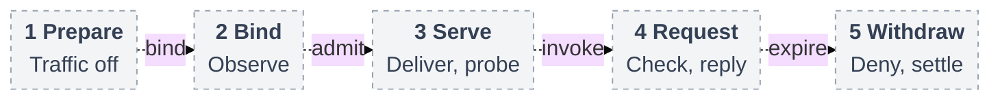

# RFC: Basic Agent identity MVP

**Status:** Proposed. **Baseline:** [Main `724dcb5`](https://github.com/openclaw/openclaw-enterprise/tree/724dcb5cb80b5e76a62e8267a21185a2e91a85c2).

## Problem and Decision

An authorized person should be able to ask an Agent to use a repository and receive an authorized reply. A repository session currently identifies a grant. It does not establish which running Agent sent the request or which person authorized it. This proposal adds both checks at the service receiving the operation.

The first protected result is a team repository read. Existing components support repository access, but the protected path still needs connected identity and requester checks. [Source status](basic-agent-identity-mvp/contract.md#source-status-and-qualification) records that distinction.

## Scope

Complete delivery includes personal and team Git/`gh` contributions, same-repository pull requests, and protected model access. It uses dedicated Codex, a separate trusted Gateway and the selected gVisor profile. The complete profile is not a universal v0.x prerequisite. Optional policy groundwork stays outside the first incremental batch. Embedded OpenClaw validation is optional.

Customer writes require withdrawal of the previous execution even when it retains credentials. **Every effective mutating Git/HTTP/API request** needs authentic authorization, including native Git follow-on requests and GraphQL POSTs. `git-write` remains the default. Product must decide any narrower mechanism or read-only release.

## Contract

### Components and authority

Three facts remain separate:

- **Agent identity** is the immutable Namespace-scoped ServicePrincipal, the permission identity retained across revisions.
- **Execution** is one independently observed running incarnation. Replacement needs fresh evidence, and retirement is permanent.
- **Requester authority** states whose permission allows this operation, its scope, its deadline and who may receive the reply.

IAM admits requester authority. State selects the serving execution. Compute owns runtime material. Credential services keep provider credentials, and workload private keys stay outside tools. The [component placement and security contract](basic-agent-identity-mvp/contract.md#receiving-proof-and-custody) explains where these owners run and meet.

### From deployment to a protected request

Prepare State, selected Drivers, a ready Namespace, saved Agent/Configuration, Harness authentication, exact IAM grants and an admitted team integration. Protection also needs pinned operator-managed SPIRE, its trust and workload configuration, and real observation, registration and receiving producers.

1. Deploy the saved Agent through the bodyless [deploy route][deploy], then read its revision and deployment. Proposed immutable [operator policy](basic-agent-identity-mvp/contract.md#operator-policy-and-revision-admission) refuses unsupported SPIFFE enforcement with authorized `503 DEPENDENCY_UNAVAILABLE` before effects.
2. State and Compute prepare with traffic disabled, observe and bind the execution, then register it. Deliver the bound repository session and probe it before selecting it to serve and withdrawing its predecessor.
3. A local-account requester **distinct from the deployer** uses a supported team connector. Its authenticated turn reaches managed `git-read` and the actual receiver. Success returns the permitted read and authorized reply. Wrong or retired executions and copied off-Pod material must be refused before protected effects.

The companion owns [policy](basic-agent-identity-mvp/contract.md#operator-policy-and-revision-admission), [assignment and serving](basic-agent-identity-mvp/contract.md#assignment-and-serving), and [receiving authority](basic-agent-identity-mvp/contract.md#receiving-proof-and-custody).

### Request lifecycle

Proposed handoffs. [Detailed lifecycle](basic-agent-identity-mvp/request-lifecycle.svg) and [editable source](basic-agent-identity-mvp/request-lifecycle.mmd).

### Withdrawal and recovery

[Withdrawal](basic-agent-identity-mvp/contract.md#withdrawal-and-recovery) must refuse new requests and close the last protected byte within 30 seconds, including renewal loss. Original deadlines and stricter selected five-second ceilings remain. Missing required facts deny without downgrade. Lost service memory can prevent safe recovery. Closed traffic proves neither provider settlement nor physical termination.

## Implementation

- **A, optional:** Save policy and preserve compatibility, refusal and cleanup.
- **B–C:** Connect State admission and settlement to Compute observation, constrained registration and protected custody. These suppliers can progress in parallel.
- **D:** Connect serving, receiving and requester association for the team read above.
- **E–F:** Complete personal/team clone/fetch → edit → test → commit → push → same-repository PR, protected model/probe access and installed acceptance. Complete independent security review and fixes before support, and verify the buildable final tree.

## Verification

Acceptance needs the real API, State, worker, SPIRE, Harness, receiver and provider. Prove separate personal/team contributions and authorized replies. Refuse wrong scope, copied material and retired identities, including unexpired certificates. Exercise replacement, outage, concurrent authority withdrawal and uncertain cleanup. Measure both traffic-closure endpoints under blocked readers and saturation. [Detailed qualification](basic-agent-identity-mvp/contract.md#source-status-and-qualification) preserves policy, PostgreSQL and pinned-environment checks. Source and fixture results do not establish installed protection.

## Open Decisions

Before D, State/Compute/identity must close bootstrap and serving, while receiving and connector owners close authenticated bridging and concurrent turn association. Before E, credential owners must close personal consent. Installation, runtime and Compute/CNI owners retain stronger-policy transition, measured timing and containment decisions. Pre-readiness ingress is required. [Later work](basic-agent-identity-mvp/contract.md#retained-follow-ups) retains stronger container identity, managed SPIRE, physical expiry and recovery.

## References

[Protected request contract](basic-agent-identity-mvp/contract.md) · [Agent/IAM/Compute][main-contract] · [RepoDriver][repo-contract] · [gVisor](https://github.com/openclaw/openclaw-enterprise/pull/248) · [egress](https://github.com/openclaw/openclaw-enterprise/pull/249).

[main]: https://github.com/openclaw/openclaw-enterprise/tree/3b632c6d4b3b194ae4e6da121612cb52e8d98fb1
[history]: https://github.com/openclaw/openclaw-enterprise/tree/311bc23012d0fd269483168b865adf79df630542
[deploy]: https://github.com/openclaw/openclaw-enterprise/blob/3b632c6d4b3b194ae4e6da121612cb52e8d98fb1/packages/contracts/src/api/routes.ts#L880-L998
[credential-placement]: https://github.com/openclaw/openclaw-enterprise/blob/3b632c6d4b3b194ae4e6da121612cb52e8d98fb1/deploy/helm/openclaw-enterprise/templates/deployments.yaml#L288-L314
[compute-placement]: https://github.com/openclaw/openclaw-enterprise/blob/3b632c6d4b3b194ae4e6da121612cb52e8d98fb1/docs/reference/drivers/kubernetes-compute.md#L188-L193
[main-contract]: https://github.com/openclaw/openclaw-enterprise/blob/3b632c6d4b3b194ae4e6da121612cb52e8d98fb1/packages/contracts/src/index.ts
[repo-contract]: https://github.com/openclaw/openclaw-enterprise/blob/3b632c6d4b3b194ae4e6da121612cb52e8d98fb1/packages/contracts/src/repo.ts
[repo-reference]: https://github.com/openclaw/openclaw-enterprise/blob/3b632c6d4b3b194ae4e6da121612cb52e8d98fb1/docs/reference/repository-credentials.md
[repo-selectors]: https://github.com/openclaw/openclaw-enterprise/blob/3b632c6d4b3b194ae4e6da121612cb52e8d98fb1/packages/contracts/src/api/common.ts#L320-L350
[assignment]: https://github.com/openclaw/openclaw-enterprise/blob/f6f47f967a3c480dd7c7770072cd8a806978596d/packages/contracts/src/runtime-authority-v1.ts
[assignment-results]: https://github.com/openclaw/openclaw-enterprise/blob/f6f47f967a3c480dd7c7770072cd8a806978596d/packages/contracts/src/runtime-authority-v1.ts#L410-L625
[identity-contract]: https://github.com/openclaw/openclaw-enterprise/blob/f6f47f967a3c480dd7c7770072cd8a806978596d/packages/contracts/src/runtime-identity-v1.ts
[identity-failures]: https://github.com/openclaw/openclaw-enterprise/blob/f6f47f967a3c480dd7c7770072cd8a806978596d/packages/contracts/src/runtime-identity-v1.ts#L120-L165
[identity-limits]: https://github.com/openclaw/openclaw-enterprise/blob/f6f47f967a3c480dd7c7770072cd8a806978596d/packages/contracts/src/runtime-identity-v1.ts#L66-L124
[state-transaction]: https://github.com/openclaw/openclaw-enterprise/blob/0b3d1fd307fd1aaf99f93177f132e017f9dc97b0/specs/31-basic-rbac/architecture.md#original-state-transaction
[rbac-invocation]: https://github.com/openclaw/openclaw-enterprise/blob/0b3d1fd307fd1aaf99f93177f132e017f9dc97b0/specs/31-basic-rbac/interfaces.md#agent-invocation
[rbac-context]: https://github.com/openclaw/openclaw-enterprise/blob/0b3d1fd307fd1aaf99f93177f132e017f9dc97b0/specs/31-basic-rbac/invocation-and-content.md#contexts-and-selection
[rbac-fences]: https://github.com/openclaw/openclaw-enterprise/blob/0b3d1fd307fd1aaf99f93177f132e017f9dc97b0/specs/31-basic-rbac/invocation-and-content.md#dispatch-and-reply-fences
[rbac-withdrawal]: https://github.com/openclaw/openclaw-enterprise/blob/0b3d1fd307fd1aaf99f93177f132e017f9dc97b0/specs/31-basic-rbac/security.md#withdrawal-and-failure
[account-lifecycle]: https://github.com/openclaw/openclaw-enterprise/blob/785c7e0c35829afbcd04f90f30c7bd5530b4b0c7/specs/31-human-federated-sign-in.md#http-interfaces
[observations]: https://github.com/openclaw/openclaw-enterprise/pull/250
[serving]: https://github.com/openclaw/openclaw-enterprise/blob/f6f47f967a3c480dd7c7770072cd8a806978596d/packages/occ/src/runtime-authority/service.ts#L309-L352
[historical-main]: https://github.com/openclaw/openclaw-enterprise/tree/f7e1f2d1735eca442095304d5337109ec7ad97fa
