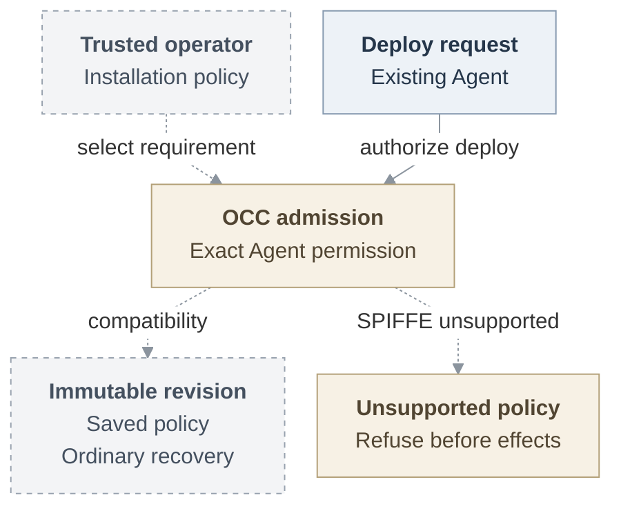

# Protected Agent request contract

This companion owns the implementer contract for the [proposed identity RFC](../basic-agent-identity-mvp.md). Examples are illustrative and unexecuted.

## Operator policy and revision admission

The operator supplies this proposed policy through an absolute `OCC_CONFIG_PATH`. The YAML and revision extension are unmerged and unexecuted examples, not a working protection switch:

```yaml
occ:
  agent_identity:
    mode: spiffe
    profileRef: enterprise/workload-v1
    profileVersion: 1
    profileDigest: "sha256:0123456789abcdef0123456789abcdef0123456789abcdef0123456789abcdef"
```

Revision policy:

```ts
type AgentIdentityRequirementV1 = Readonly<
  | { mode: "compatibility" }
  | {
      mode: "spiffe";
      profileRef: string;
      profileVersion: number;
      profileDigest: string;
    }
>;
// AgentRevision attachment:
readonly identityRequirement: AgentIdentityRequirementV1;
```

Require 1–200-character `[A-Za-z0-9._:/-]+` reference, positive safe-integer version, and `sha256:` plus 64 lowercase hex digits. Only omission defaults to compatibility. Null/extra/malformed values fail before Driver resolution/construction. OCC freezes the detached selection.

These bodyless [deploy/readback routes][deploy] exist on pinned main. The saved requirement and unsupported-mode refusal below belong to the proposed policy extension:

```text
POST /namespaces/:namespaceId/agents/:agentId/deploy
  compatibility -> 202 AgentRevisionResponse, with identityRequirement
  authorized unsupported SPIFFE -> 503 DEPENDENCY_UNAVAILABLE
GET /namespaces/:namespaceId/agents/:agentId/revisions/:revisionId
GET /namespaces/:namespaceId/agents/:agentId/deployments/:deploymentId
```

Exact-Agent authorization precedes refusal and Configuration/Secret, revision or reconcile-Work creation. Tenant inputs cannot override policy. State saves `admitted_spec.identity_requirement` for operation/session owners. Recovery accepts only historical omission as compatibility. Malformed state refuses. Worker recovery preserves original Work, ownership/IAM/Provider/claim checks and authorized stopped cleanup, then reports permanent `IDENTITY_RUNTIME_UNSUPPORTED` before unsupported running repository/Secret/workspace/Compute preparation. Compatibility preserves authentication, IAM, bounded sessions, custody and cleanup without execution assurance. An exposed bearer retains its existing replay limitation. Only the operator selects stronger enforcement. Requests and identity, registration, network or currentness failures cannot downgrade it.



Proposed policy. Solid: existing authorization. Dashed: proposed policy handoffs.

## Assignment and serving

[Assignment definitions][assignment] retain opaque reference, generation, exact Agent/revision/principal/component, observed incarnation, original lifetime and terminal retirement. State permits at most one serving generation per component. Compute owns Pod UID, container incarnation, restart discrimination and runtime selectors.

1. State allocates from an admitted immutable revision. Compute prepares traffic-disabled and independently observes. State binds before the original execution-bound attempt is persisted or opened.
2. A separately authenticated registrar creates only that assignment under the operator trust domain/SPIRE parent using trusted selectors and rotating X.509-SVID workload certificates. Reject broad/caller-authored registration. Preserve exact readback/deletion ownership.
3. Deliver bound material, verify unchanged incarnation and actual Git configuration/helper and `gh` launcher/PATH, then run the separately authorized probe.
4. State/Compute select serving with predecessor withdrawal. Relevant restart/replacement needs fresh evidence/admission and closes the prior attempt. Never rebind an open session, guess an incarnation or use temporary compatibility.

Genuine serving consumes current State selection, fresh Compute/registration/profile evidence, bound incarnation, original deadline and current IAM. [Unavailable supplier resolution][serving] is not a completed producer. Existing worker preparation opens before Compute, so protected staging must join that original caller. Gateway preparation consumes owner-prepared material and cannot repeat open, repair or retirement, or retroactively authorize acquisition.

The borrowed assignment repository consumes original State client/lifetime/repositories and `admit(scope, access)`. It returns prepared/prepared-replay results, not COMMIT. Authentic production admission remains required. Registrar, Gateway, preparation and cleanup services use their own enrolled identities. Exact cleanup and separately authorized preparation require no target SVID.

[ComputeReadiness/stop][main-contract] establish neither serving nor observed termination. Optional `PluginDeploymentWarning` uses admitted `pluginId` and only `PLUGIN_INSTALL_FAILED` or `PLUGIN_AUTH_REQUIRED`. A warning requires safe plugin disable and successful remaining readiness checks. Protected capabilities cannot become optional.


Proposed repository example, including denial and uncertain settlement. [Editable source](request-lifecycle.mmd). [Model/probe acceptance](../basic-agent-identity-mvp.md#verification) is separately required.

## Repository session and material delivery

The complete current [RepoDriver][repo-contract] owns `listOptions`, `resolve`, `open`, `status` and `close`. Open receives Namespace, admission, admitted binding, duration and absolute deadline plus optional `recoverOnly: true`. `created` returns session/files, `recovered` only status, and `missing` no session. Recovery never rediscovers bearers or creates authority. Status retains `sessionId`, `OPEN | CLOSED | DISPOSED`, deadline and grant binding.

`RepositoryCredentialRuntimeBinding` retains repository/session references and deadline. `new` carries files, while `retained` does not. Compute owns paths, modes and material objects for bearer, client configuration, Git configuration, `gh` files and optional CA. Keep [grant/selector bounds][repo-selectors], original profiles/deadlines/Git semantics, renewal, recovery, durable cleanup and uncertainty. [Profiles][repo-reference] retain default `git-write` and full-token-bounded `git-full` GraphQL.

The proposed delta adds an immutable expected execution to this original session, unchanged through open/status/recovery/delivery. Unsupported binding capability refuses enforcement. Its wire shape remains open. Authentic requester authority, expected execution and actual connection evidence must precede protected acquisition. If unavailable during staged acquisition, remain nonserving under separate preparation authorization. A profile, nominal context, retained session, bearer or abort signal creates no authority. Bootstrap must complete before forwarding. The receiving consumer must fence startup and recipient changes, retain source high-water/replay ordering, and measure expiry from the earliest relevant IAM/provider observation. These are proposed consumer duties. Their implementation and protected identity assurance remain unproved.

## Receiving proof and custody

OpenClaw Control Plane (OCC) API/worker and PostgreSQL State own resources, Work and transactions. `RepoDriver` is an internal adapter to a [separate credential-service container in the worker Pod][credential-placement], with private Unix control and HTTPS ingress. Compute owns runtime material. [Dedicated Codex and trusted Gateway][compute-placement] use separate Pods and ServiceAccounts. The Gateway receives no repository session. The protected proposal places one egress Go service per assignment in a separate trusted proxy Pod/network identity. Operator-managed SPIRE supplies identity through a constrained registrar. These boundaries add no issuer, authority store or session registry.

The receiver supplies trusted `RuntimeWorkloadExpectationV1`: target, expected peer SPIFFE ID, recipient, identity profile and limits. [The complete supplier verifier][identity-contract] verifies the actual X.509-SVID peer, trust domain, component, exact registration, assignment and live connection. `verify` returns opaque process-local `VerifiedWorkloadV1` or typed failure. `inspect` freshly checks that same owned proof. Call bounds preserve request reference, recipient, deadline and cancellation. `AuthorityCallV1` additionally carries trusted context.

The authenticated Go/TypeScript bridge must bind each exact HTTP request/stream to its original connection, recipient and incarnation. Headers, JSON, copied diagnostics, strings, repository bearers or relay identity create no proof. A relay certificate identifies the relay. Trusted assignment and independently enforced ingress associate it with the Agent. Egress enforces every destination/operation, including `checkContinue`, and rejects unsupported alternate/upgrade/CONNECT routes. Pre-readiness ingress must deny external and sibling off-Pod replay.

Trust node, control plane, CNI, SPIRE, registrar and receiver. Distrust tools, children and input. mTLS proves key possession, so a copied certificate/key can work wherever reachable. Pod networking does not identify containers. Workload keys, long-lived provider credentials, refresh tokens, signing and registration authority stay outside tools. A short-lived execution bootstrap credential is permitted only if selected transport requires it. Credential owners retain exchange/injection/renewal/dispatch/settlement. Direct model-key delivery has weaker custody.

Selected IAM/RBAC admits `AgentAuthorityContext` and `AgentInvocation` independently of execution identity. Resolve the Agent through selected IAM and authorize exact `principalId/action/resource`. Before acquisition, dispatch and output require current serving, authentic [invocation][rbac-invocation], original grant/connection, scope, generation, deadline, exact operation and complete current audience. `use_repository` remains proposed. Do not substitute legacy `operate`/`read` authority. Retain [dispatch/reply fences][rbac-fences]. Ambiguity denies.

[Personal authority][rbac-context] permits one explicitly admitted human connection's existing permissions, never beyond them. Missing personal authority denies without team fallback. Authorized channel members use the admitted team integration. Login, creator Role, Git authorship, deployer or team-DM credentials confer no requester authority. Reject person/team/grant/connection/audience substitution. Personal GitHub needs OCE-account/requester consent and trusted-service App user-credential retention, renewal and revocation.

Audit separates initiator, Agent/revision, admitted authority, operation/result and truthful verifier/guard assurance. Preserve original assignment/generation/component/profile/verification-expiry facts without sensitive material. [Protected observation lookup][observations] requires authorization. Serializable evidence creates neither proof nor effect authority. Unauthenticated recipients receive generic failures.

## Identity results and limits

The complete [assignment request/result declarations][assignment-results] and [identity verifier, guard, stream and failure declarations][identity-contract] are normative supplier contracts. Their parsing supplies shape, never authority.

Every request carries `schemaVersion`, `installationId`, `namespaceId`, `agentId`, `assignmentRef`, `requestRef` and `purpose`. Serving purposes are `runtime-peer`, `model-call`, `repository-issuance`. Registration/probe/cleanup/restore additionally require `operationRef` and `expectedResponsibilityVersion`. Cleanup adds `requestedOperation`. Restore adds `purposeContract: "completed-context-restore-v1"` and `requestedSuboperation` (`importCompletedContext` or `readImportedContext`).

All positive results retain schema, evaluation time, validity and request reference. Preserve the full linked evidence, version, profile and restore fields:

- `current` serving requires `conditions-satisfied`, bound snapshot, runtime/policy/identity/serving/mutation-eligibility evidence, lifecycle generation and selection version.
- Registration `candidate-eligible` carries responsibility, register/maintain permission, template, parent and selector evidence.
- Probe `candidate-eligible` carries responsibility, endpoint, peer pairing/version, peer snapshot and both identity evidences.
- Restore `candidate-eligible` carries the exact restore contract/suboperation, full checkpoint/store/tuple/peer binding and current policy/pairing evidence. It restores no grant.
- Bound `cleanup-eligible` carries responsibility, snapshot, allowed operation, successor exclusion, effect preconditions and cleanup policy. Unbound provider cleanup instead carries exact target/version/profiles/digests, Kubernetes namespace/deployment UIDs and retained create-effect ownership. Names/labels alone cannot prove ownership.
- `pending/evidence-incomplete`, `not-current` with its closed reasons, `not-visible/scope-hidden`, and `unavailable/lookup-unavailable` deny ordinary serving. Candidate/cleanup eligibility permits only its stated purpose.

In an unexecuted example, the receiving guard consumes an original request with `purpose: "repository-issuance"`. Only `current` plus `conditions-satisfied`, complete evidence, operation authorization and the final fence permits dispatch. `check` returns `resolved` plus that inner observation or failure. `openStream` returns `opened`, `not-opened` with observation, or failure. A `RuntimeIdentityFailureV1` with `schemaVersion: 1`, `kind: "transport-failure"`, `reasonCode: "connection-closed"` and the original `requestRef` denies dispatch and buffered output. Reconnect needs fresh evidence within the original horizon.

All 31 [RuntimeIdentityLimits members][identity-limits] are required without defaults:

- Profile: `schemaVersion`, `limitsProfileRef`.
- Renewal: `svidLifetimeMs`, `renewBeforeExpiryMs`, `renewalRetryBudgetMs`.
- Freshness: `runtimeEvidenceMaxAgeMs`, `policyEvidenceMaxAgeMs`, `identityEvidenceMaxAgeMs`, `identityHealthMaxAgeMs`, `identityHealthPollMs`.
- Calls/streams: `assignmentDeadlineMs`, `policyDeadlineMs`, `clockSkewAllowanceMs`, `connectionMaxAgeMs`, `streamRecheckMs`, `streamCloseDeadlineMs`.
- Trust/fences: `bundleUpdateMaxAgeMs`, `bundleOverlapMs`, `bundleRollbackPolicyRef`, `disableBudgetMs`, `invalidationProtocolRef`, `effectFenceProfileRef`.
- Capacity: `requestBoundsRef`, `connectionBoundsRef`, `registrationChurnBoundsRef`, `maxFrameBytes`, `maxBufferedBytes`, `maxBufferedMessages`, `maxConnections`, `maxStreamsPerConnection`, `maxPendingChecks`.

The four numerical ceiling classes are evidence age ≤15,000 ms, lookup deadlines ≤3,000 ms, skew 0–2,000 ms and active recheck ≤5,000 ms. Other numerical fields are positive safe integers. Seven predicates require renewal lead below lifetime, retry budget no greater than lead, health poll no greater than health age, recheck no greater than connection age, frame no greater than buffer, and safe-integer products for connections × streams and buffer × connections × streams. Queue capacity does not establish active concurrency.

## Withdrawal and recovery

[Original State][state-transaction] owns READ COMMITTED, lifetime drainage and Installation → account/session → policy → resource/withdrawal → audit ordering. No lock upgrade follows resource locks. Admission/renewal and durable withdrawal share this barrier. Register usable authority before COMMIT and preserve original transaction custody and currentness through COMMIT. Only acknowledged COMMIT or exact retained readback releases committed authority. Atomic mutation/audit/Work excludes external effects. Retain original create-effect/operation identities, exact versions and registration readback. Never duplicate uncertain creates or delete unrelated registrations.

Consume original local account/Principal, method/session and [dependent withdrawal][rbac-withdrawal] facts. Logout is session-scoped. Disablement, method repair and team-grant changes differ. Enablement never revives authority. Loss of requester, connection or audience eligibility denies further use. Retired/withdrawn/stale/missing/unavailable facts deny admission, renewal, acquisition and dispatch. Rotation/retry/reconnect/delayed positives cannot extend source, generation or absolute deadline. Preserve no-positive-cache behavior.

After waits, reinspect the same proof within its original budget. Immediately before effects/output, synchronously fence currentness/session without an intervening await. Shared acquisition requires a still-current original waiter after waits and at dispatch. A withdrawn waiter cannot borrow or cancel another's authority, authorize minting or abandon settlement.

Independently measure new-request refusal and last-byte closure within 30 seconds of withdrawal or renewal-loss onset, even with blocked readers/saturation. Expiry proceeds without Harness cooperation. Evidence age, scheduling, propagation, polling, skew and close reserve share the original budget. Preserve scoped five-second ceilings without a universal five-second claim. Installed profiles specify clocks, expiry, cadence and cancellation. Fixtures, TTLs and IAM/repository maintenance intervals prove no bound. Finite-currentness transports need authentic original Work/State production and independent maintenance even without repository grants. Plain sandbox-only compatibility launch gains no gateway/SPIFFE prerequisite.

Invalidation synchronously denies before cleanup, including audit outage. Streams stay terminal. Idempotent `close()` denies before its first await, joins owned work and returns `closed` or transport failure, including `cleanup-unsettled`. Retain late I/O, custody, capacity and uncertainty until settlement. Close only owned bindings, leaving borrowed connection/source closure to their owner. Cleanup needs no renewed target authority.

Worker restart may retain service sessions/Compute material. Service replacement can lose bearer and provider-token cleanup inventory that State correlations cannot reconstruct. `REPOSITORY_SESSION_RECOVERY_UNSAFE` retains cleanup Work. `REPOSITORY_CLEANUP_PENDING` blocks replacement until `DISPOSED`. `CLOSED`, registration retirement, connection closure, provider settlement and observed exact-incarnation stop differ. A void stop/delete acknowledgement, missing Pod, timeout or unreachable node proves no termination. Report unavailable/termination-unverified until observed stopped. Accepted effects may finish. Never replay uncertain writes.

## Source status and qualification

The 2026-09-22 [`311bc230` assessment][history] records landed credentials #221/#235. Historical [`f7e1f2d`][historical-main] rejected dedicated repository revisions. On 24 September, [main `3b632c6`][main] supports embedded OpenClaw and dedicated Codex repositories without Sandbox. It supplies existing Agent principals, deploy/readback, State/Work and repository sessions. This source support does not qualify protected execution.

Separate suppliers contain immutable policy/refusal, borrowed assignment storage and native exact-peer TLS. Later suppliers report original runtime/bootstrap/session binding and narrow human-account State receiving. Their reported component/PostgreSQL validation is not independently attributable from these public references and supplies no installed proof. Authentic AIM admission, account production, observation/registration, receiving/currentness and activation joins remain incomplete where consumed.

Retain each useful reviewed checkpoint with exact source, validation, substitutions and remaining assurance limits while successor work proceeds.

State owns canonical shipping history, constraints and privileged-function safeguards. The later selected append order puts account changes before identity. Occupied historical migration numbers require State reconciliation, not a new number here. Retain startup/assignment/native-X.509 source for its actual consumers. Shipping updates owning design, authentication, authorization, deployment and runtime-security references.

Qualification must establish:

- **A:** Actual authenticated API/worker compatibility, refusal and cleanup. Limited-role PostgreSQL must preserve immutable policy across restart and reject malformed state. Exercise fresh, populated, repeated and concurrent history. When admission refuses enforcement, prepare recovery negatives through valid State.
- **B:** Original-client/lifetime admission, lock order, compare-and-swap, rollback and uncertain-COMMIT exact readback.
- **D–F:** Pin source/artifacts, SPIRE release, attestors, bundle, Workload API, runtime and CNI. Exercise actual Harness files, native Git helper, `gh` launcher, readiness and replacement. Prove separate personal/team full contributions with provider readback, protected model/probe results and authorized audience. Deny wrong Agent/Namespace/revision/component, replay and retired unexpired identity. Exercise rotation, restart, outage, requester/connection/audience withdrawal and uncertain cleanup. Independently measure closure under saturation and blocked readers. Complete independent security review and resolve its findings before declaring the composed profile supported. Verify buildable stack and final-tree equality.

## Owner decisions

Installation/admission must select finite stronger-minimum combinations, affected admissions/renewals, audited transition and unavailable result, without grace or automatic continuation. Receiving owners must select C3 peers and the authenticated bridge before use. The component union remains `gateway | harness`. Personal/team contribution retains `git-full`. Timing must be measured before F. Containment before any untrusted startup remains a Compute/CNI/Product proposal.

## Retained follow-ups

- Identity/operator delivers OCE-managed SPIRE through the same contract, qualifying installed custody, rotation, upgrade and restore.
- Compute/identity supplies a runtime-aware caller/incarnation broker, including gVisor, with separate host qualification for exact-container assurance.
- Compute/runtime selects an independently expiring trusted supervisor and measures exact-incarnation stop.
- Storage/Compute/native-context fences the whole predecessor before successor writes and requires authentic artifacts plus fresh-authority turns. Restored files/context never revive authority.
- RBAC/operation/runtime supplies narrower service/runtime delegation with scope, denial, renewal and withdrawal proof. Preserve operation-owner narrowing. Mixed contexts stay deferred. Fixed operator authentication needs a real consumer.
- Credentials qualifies protected recovered custody and provider-observed settlement/revocation.

## References

[Overview and acceptance](../basic-agent-identity-mvp.md) · [Current repository behavior][repo-reference] · [Assignment results][assignment-results] · [Identity interfaces][identity-contract] · [Account/session lifecycle][account-lifecycle].

[main]: https://github.com/openclaw/openclaw-enterprise/tree/3b632c6d4b3b194ae4e6da121612cb52e8d98fb1
[history]: https://github.com/openclaw/openclaw-enterprise/tree/311bc23012d0fd269483168b865adf79df630542
[deploy]: https://github.com/openclaw/openclaw-enterprise/blob/3b632c6d4b3b194ae4e6da121612cb52e8d98fb1/packages/contracts/src/api/routes.ts#L880-L998
[credential-placement]: https://github.com/openclaw/openclaw-enterprise/blob/3b632c6d4b3b194ae4e6da121612cb52e8d98fb1/deploy/helm/openclaw-enterprise/templates/deployments.yaml#L288-L314
[compute-placement]: https://github.com/openclaw/openclaw-enterprise/blob/3b632c6d4b3b194ae4e6da121612cb52e8d98fb1/docs/reference/drivers/kubernetes-compute.md#L188-L193
[main-contract]: https://github.com/openclaw/openclaw-enterprise/blob/3b632c6d4b3b194ae4e6da121612cb52e8d98fb1/packages/contracts/src/index.ts
[repo-contract]: https://github.com/openclaw/openclaw-enterprise/blob/3b632c6d4b3b194ae4e6da121612cb52e8d98fb1/packages/contracts/src/repo.ts
[repo-reference]: https://github.com/openclaw/openclaw-enterprise/blob/3b632c6d4b3b194ae4e6da121612cb52e8d98fb1/docs/reference/repository-credentials.md
[repo-selectors]: https://github.com/openclaw/openclaw-enterprise/blob/3b632c6d4b3b194ae4e6da121612cb52e8d98fb1/packages/contracts/src/api/common.ts#L320-L350
[assignment]: https://github.com/openclaw/openclaw-enterprise/blob/f6f47f967a3c480dd7c7770072cd8a806978596d/packages/contracts/src/runtime-authority-v1.ts
[assignment-results]: https://github.com/openclaw/openclaw-enterprise/blob/f6f47f967a3c480dd7c7770072cd8a806978596d/packages/contracts/src/runtime-authority-v1.ts#L410-L625
[identity-contract]: https://github.com/openclaw/openclaw-enterprise/blob/f6f47f967a3c480dd7c7770072cd8a806978596d/packages/contracts/src/runtime-identity-v1.ts
[identity-failures]: https://github.com/openclaw/openclaw-enterprise/blob/f6f47f967a3c480dd7c7770072cd8a806978596d/packages/contracts/src/runtime-identity-v1.ts#L120-L165
[identity-limits]: https://github.com/openclaw/openclaw-enterprise/blob/f6f47f967a3c480dd7c7770072cd8a806978596d/packages/contracts/src/runtime-identity-v1.ts#L66-L124
[state-transaction]: https://github.com/openclaw/openclaw-enterprise/blob/0b3d1fd307fd1aaf99f93177f132e017f9dc97b0/specs/31-basic-rbac/architecture.md#original-state-transaction
[rbac-invocation]: https://github.com/openclaw/openclaw-enterprise/blob/0b3d1fd307fd1aaf99f93177f132e017f9dc97b0/specs/31-basic-rbac/interfaces.md#agent-invocation
[rbac-context]: https://github.com/openclaw/openclaw-enterprise/blob/0b3d1fd307fd1aaf99f93177f132e017f9dc97b0/specs/31-basic-rbac/invocation-and-content.md#contexts-and-selection
[rbac-fences]: https://github.com/openclaw/openclaw-enterprise/blob/0b3d1fd307fd1aaf99f93177f132e017f9dc97b0/specs/31-basic-rbac/invocation-and-content.md#dispatch-and-reply-fences
[rbac-withdrawal]: https://github.com/openclaw/openclaw-enterprise/blob/0b3d1fd307fd1aaf99f93177f132e017f9dc97b0/specs/31-basic-rbac/security.md#withdrawal-and-failure
[account-lifecycle]: https://github.com/openclaw/openclaw-enterprise/blob/785c7e0c35829afbcd04f90f30c7bd5530b4b0c7/specs/31-human-federated-sign-in.md#http-interfaces
[observations]: https://github.com/openclaw/openclaw-enterprise/pull/250
[serving]: https://github.com/openclaw/openclaw-enterprise/blob/f6f47f967a3c480dd7c7770072cd8a806978596d/packages/occ/src/runtime-authority/service.ts#L309-L352
[historical-main]: https://github.com/openclaw/openclaw-enterprise/tree/f7e1f2d1735eca442095304d5337109ec7ad97fa
