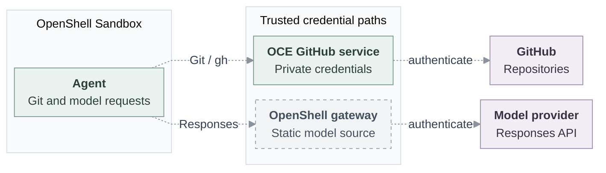

# RFC: Credential Gateway for OpenShell

**Status:** Proposed; the combined MVP and protected integration are not yet qualified.

**Alignment:** [#452](https://github.com/openclaw/openclaw-enterprise/pull/452) is the common source and revision-attachment interface; Sandbox selection stays independent, with the paired OpenShell Backend. This RFC retains the GitHub broker and protected future requirements. The earlier mediation interface and lifecycle illustration in the companion are historical design material, not competing Driver requirements.

## Problem and decision

An OpenClaw Enterprise (OCE) Agent needs to use GitHub and an AI model to do its work. It must use those services without carrying their long-lived credentials. We must be able to stop one Agent's access without disrupting other Agents.

OCE will use a Credential Gateway to make approved services available while trusted components retain the provider credentials. OpenShell provides the Agent's contained environment. The OpenClaw Control Plane (OCC) decides what the Agent may use. OCE's existing GitHub service retains its credentials and authenticates GitHub requests.

OCE selects the Sandbox and Credential Gateway capabilities independently. OpenShell is the proposed implementation for both; an Agent can use the Sandbox without the gateway.

## Scope

The first combined integration targets one API-created dedicated Codex Agent, with an OpenShell static model source and the existing GitHub broker in the same admitted revision. It must complete an approved Git or `gh` operation and an OpenAI Responses request over HTTPS, including supported streaming. The handoff, routing, invocation and proof remain open. Dedicated OpenClaw requires separate qualification.

The protected path must prevent Agent material copied outside the cluster from granting access, directly or through a reachable gateway. It must not fall back silently to weaker authentication. Existing direct model-key delivery and compatibility bearer sessions remain separate, weaker paths; neither establishes this protected guarantee.

## Contract

### Ownership and request paths

Compute owns Sandbox lifecycle; workers create, repair and retire credential sessions. Credential owners retain sources and renewal. Shared provider configuration grants no Agent authority; each attachment requires OCC authorization.

Dashed lines show proposed, unqualified paths. Git/`gh` uses the existing OCE HTTPS service and GitHub App credentials, with no second issuer or direct GitHub bypass. The repository worker owns admission, original session creation, recovery and cleanup; the service retains the App key, JWT and installation token. Authorized API registration reads the exact Secret and passes resolved plaintext to the trusted Driver and OpenShell gateway, which stores a copy. The intended Agent receives a placeholder and repository bearer, never the upstream model key, GitHub App private key, App JWT or installation token. The substitutes are sensitive usable authority, not proof of requester identity; their installed handoff and isolation remain unproved.

### Selected source and registration

The authorized registrar needs Namespace `credential_source:create` and `secret:operate` on the exact same-Namespace Secret before its value is read. The actor and Agent independently need `credential_source:operate` on the source at admission and dispatch. For any future value-resolving source update, including refresh of the same reference, the proposed rule requires the updater’s exact source-update and Secret-operation grants before the read or gateway call. Source configuration alone grants no Agent authority. [#461](https://github.com/openclaw/openclaw-enterprise/pull/461) merged the initial static-source implementation; source code does not prove the combined installed path. The current OpenShell Driver rejects `updateSource`, `rotateSource` and `withdraw` as unsupported, and OCC has no caller for them. Later Secret or grant changes do not automatically rotate or withdraw that copy or stop active use. The source owner must control grants, authorized replacement, removal and cleanup; referenced revisions may block deletion. Coupled Secret/source lifecycle, refresh, multi-driver routing and active withdrawal are future work.

The merged registration path attempts `removeSource` after a thrown registration, including a potentially uncertain call; a failed state update can leave the last committed `registering` or `deleting` state. Before enabling source registration, resolve uncertain external creation, failed cleanup and unknown database COMMIT. An absent provider read does not settle an in-flight create: retain its original recovery identity until terminal or a proven server fence prevents late completion. Do not replay or automatically compensate uncertain effects; ordinary compensation for definite pre-dispatch or terminal failures remains distinct. These are unresolved enablement prerequisites, not implemented protections. Discard a client after unknown COMMIT, make no further query on it and preserve the unknown. Owners must resolve exact ownership, shared-profile and concurrent create/delete fencing; the availability decision is pending. State transactions cover their records, not external effects. Deny use if required recovery inventory is lost; unavailable status or absence of inventory is not proof of settlement or permission to reacquire.

Delivery stages are B, authorized API-side plaintext input; A, a narrower trusted reference bridge; and C, operation-mediated brokerage. B and A do not establish protected per-operation authority. The [stronger target](https://github.com/openclaw/openclaw-enterprise/issues/118) remains a known gap.

### Agent access

The following lifecycle is the future protected target, not a first-MVP guarantee.

1. **Prepare.** Bind the worker-prepared session and admitted Agent revision to an opaque lease without creating or renewing credentials. Keep the Agent nonserving until the required session, authorization and connection evidence is available.
2. **Use.** Check current authorization and the bound session before dispatch through the approved Git/model path. Reject a read-only push before dispatch. The gateway is not an arbitrary proxy.
3. **Observe.** Distinguish connection, attachment, traffic closure and cleanup. OpenShell attachment readiness proves neither backend access nor active-stream closure. Unavailable status remains unknown.
4. **Withdraw and clean up.** Stop the Agent's new and active traffic; release only its session's resources. Detachment neither deletes shared configuration nor proves upstream revocation. Cleanup failure must not reopen access or disrupt another Agent.

Protected Git and model traffic must close within 30 seconds of withdrawal or loss of renewal, measured through the last active byte. Selected active exchanges recheck closure within five seconds. Where the original profile requires it, the separate five-second finalization observer also remains required. These bounds do not prove upstream credential revocation.

If a request might have reached the provider, retain its original attempt as uncertain and reconcile it; do not automatically replay it. Audit identifies the Agent, approved operation and outcome without recording credentials or request contents. The [contract companion](credential-gateway-driver/contract.md) defines bounds, failure handling and recovery in detail.

### Gateway interface

The common source and attachment contract is [#452](https://github.com/openclaw/openclaw-enterprise/pull/452). The existing GitHub broker still needs a #452-conforming adapter or attachment/consumer extension; the choice and conformance are unproved. The private Sandbox handoff and same-revision join remain open. Its Driver does not require per-request `mediate`; the former #386 shapes and method examples in the companion are retained only as historical design material. Future protected acquisition and dispatch still require genuine current requester authority, expected execution and actual receiving-connection association bound to the original Namespace, Agent, revision, attempt/session, source version, destination, operation, policy and deadline. Missing evidence refuses service without fallback. The [companion](credential-gateway-driver/contract.md) retains the protected routing, response association, bounds and recovery requirements.

## Implementation and verification

- **TODO — session delivery:** Bind the authenticated OpenShell session, readiness and private/workspace mounts to the admitted revision.
- **TODO — model access:** Supply private Responses authentication, streaming and credential custody through a supported OpenShell API/version.
- **TODO — closure and recovery:** Observe new/active traffic closure, reconcile uncertain attempts and retain session cleanup across restart.

For the first composition, use the authorized credential-source API, bind the source and repository on Agent create or PATCH, call the [deploy API](https://github.com/openclaw/openclaw-enterprise/blob/4373b6e39e9a9d1973abfeb08d751fbf53d501de/docs/reference/agents/deployment.md), and poll revision status with revision-read permission. A 202 admits Work, not readiness. The [existing embedded Gateway TUI Git procedure](https://github.com/openclaw/openclaw-enterprise/blob/4373b6e39e9a9d1973abfeb08d751fbf53d501de/docs/guides/repository-credentials.md#ask-the-agent-to-work-in-the-repository) and [separate loopback model check](https://github.com/openclaw/openclaw-enterprise/blob/4373b6e39e9a9d1973abfeb08d751fbf53d501de/docs/guides/operate/model-verification.md) are separate examples; neither is the dedicated Codex combined invocation. Owners must connect that invocation, observe a real model response and authorized Git/`gh` result in the same revision, independently read back the provider effect, and reject a read-only push and denied source grants. Keep existing guards until the join is proved.

For the future protected target, withdraw access while another Agent continues working and measure closure bounds and copied-authority denial. Source, component and CI evidence, installed composition, live-provider proof, issue acceptance, independent security and human review, and release qualification are separate.

## Open questions

[#452](https://github.com/openclaw/openclaw-enterprise/pull/452) proposes the
common source and revision-attachment interface; [#461](https://github.com/openclaw/openclaw-enterprise/pull/461)
shipped its first static-source implementation. The interface separates source
registration and removal from revision attachment and withdrawal; the shipped
OpenShell Driver still rejects withdrawal as unsupported. Source status, Sandbox
attachment status and active-stream closure are distinct observations; removing
one revision's access must preserve other Agents' shared configuration. The
earlier `AddProvider`, `AuthenticateProvider`, `ProviderStatus` and
`RemoveProvider` names are historical alternatives, not additional common Driver
requirements.

The first-slice development profile pins OpenShell source tag
`496ebba293f5cc2bb2753444dddd534f0b4aeb6a` (`v0.1.0`). The earlier
[source reference](https://github.com/NVIDIA/OpenShell/blob/f8002d19ad2f948abf48bd2f5ca4f8ebd388e3c8/proto/openshell.proto)
is historical context; supported versions and the protected integration still
need qualification.

- How should connection and reauthentication handle future OAuth or dynamically
  issued credentials? The first slice uses a static model source.
- Which model adapter and account/subscription modes should authenticate
  Responses and supported streams?
- Which runtime mechanisms should establish session identity, mounts, readiness
  and measured active-stream closure?

Protected requirements and historical interface: [contract companion](credential-gateway-driver/contract.md). Historical lifecycle: [SVG](credential-gateway-driver/request-lifecycle.svg), [editable Mermaid](credential-gateway-driver/request-lifecycle.mmd).
