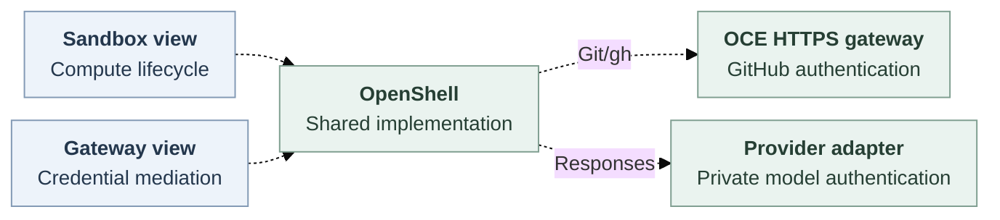

# Credential Gateway Driver

## Problem and Decision

**Proposed.** Independently select containment and credential mediation through singular `sandbox` and `credential_gateway` library views sharing OpenShell. No new service, Pod, issuer, inheritance or capability array is implied.

## Scope

Sandbox-only stays independent. Combined Codex targets ordinary API-created model turns, authorized Git/gh, withdrawal and cleanup. Dedicated OpenClaw remains required for [issue 118](https://github.com/openclaw/openclaw-enterprise/issues/118), with its protocol unresolved. Gateway-only OpenShell, external multirole factories and additional protocols remain deferred.

## Contract

Configure runtime, workspace, private-session delivery and authorized repository/model bindings. Proposed, unexecuted Installation input references canonical Sandbox configuration:

`{"drivers":{"credential_gateway":{"id":"openshell-credentials","configuration":{"sandboxDriverId":"openshell-sandbox"}}}}`

Validate role/id, methods/version and configuration before effects, preserving prior selection on invalid/mutated input. Reject external packages/conflicting references. Initialize/close once per API/worker process with one hook-bearing view, no cross-process serialization or API-only Provider credentials in workers.

After saving an Agent, its authorized caller uses the [bodyless deploy API](https://github.com/openclaw/openclaw-enterprise/blob/6b5c9093b75044f181db74bc14dffaa3410e617a/docs/reference/agents/deployment.md), then polls deployment status with revision-read permission. 202 admits work. Historical activation is not live health. Exercise authorized native Gateway ingress after readiness.

Dashed joins are proposed. RFC321 separates native Gateway and Codex Pods. Existing repository service attaches GitHub authentication. Model adapters privately authenticate allowed OpenAI Responses HTTPS/streaming. Arbitrary proxying and direct GitHub bypass are forbidden.

Compute retains Sandbox lifecycle. Workers create/repair/retire sessions once. Proposed `prepareGatewayMediation` consumes prepared context through material owners, never environment strings or repeated issuance. IAM/State/Work/source authority and custody remain unchanged.

Internal owner-produced nominal types confer no authority by cast. `oce-credential-gateway/v1` binds revision, credential, profile, session generation, original attempt and finite bounds:

`prepare` consumes an existing prepared binding, returning opaque lease/safe status or not-dispatched/uncertain. It only prepares mediation. `mediate` consumes authenticated operation, lease and ingress-bound exchange, returning completed status/attempt, not-dispatched or uncertain. `status(lease)` observes admission, cleanup and deadline or unavailable. `withdraw(lease)` closes new/active traffic, returning withdrawn or pending attempt. `dispose(lease)` releases owned attachments, returning disposed or cleanup-pending attempt.

Protected acquisition/dispatch requires requester authority, expected execution and actual receiving-connection evidence. Missing evidence keeps staged admission nonserving. Background Work retains its admission. Compatibility retains weaker bearer replay/recovery without mandatory SPIRE.

Freeze roles/config/hooks before dependents. Persist `driverId`, `implementation`, `contractVersion`, `profileDigest` and `sandboxDriverId` in the existing revision transaction. Identical selection is a no-op. Restart retains bindings/cleanup routes. Changed selection cannot retarget or extend authority/deadlines.

Use the existing closed GitHub parser and `git-read`, `git-write`, `git-full` semantics. Reject mismatched effects, unknown routes, redirects and destination rewrites. Bound responses/time/headers. Existing mandatory audit records safe correlation/outcomes, never credentials, payloads, raw URLs/headers or provider errors.

Partial setup compensates or retains cleanup before throwing. Outer rollback sees only returned adapters. Uncertain acquisition/dispatch retains attempts, capacity and late settlement without replay/reissue. Cancellation bounds waiting. Lost ephemeral inventory or unavailable status proves neither absence nor settlement. State atomicity cannot settle provider effects. Protected recovery requiring durable inventory still requires its supplier.

Ready means mediation-only. Withdrawn never reopens despite cleanup failure. Source owners retain validity, renewal/overlap and retirement. Static disposal neither revokes upstream keys nor deletes shared material. Protected closure of new/active Git/model traffic must finish within 30 seconds of withdrawal or renewal loss, including observation/caching/scheduling. Selected stricter five-second bounds and compatibility limits remain.

## Implementation and Open Questions

Main supplies session preparation and Sandbox foundations, while repository-with-Sandbox and non-Codex OpenShell guards remain. Registration, profile persistence and receiving joins are proposed. Original owners must resolve RFC321's compatibility-first sequence against this contract's protected-model-first combined target without weakening either assurance.

Mrunal/OpenShell must identify supported authenticated original-session transport/readiness despite Authorization stripping, private/workspace mounts despite pre.7 PVC/projected-token limits, Responses attach/status/detach and observable active-stream closure. IAM/State/Work and Compute must supply genuine admission/observation. Profile encoding and dedicated OpenClaw protocol remain open.

## Verification

Keep guards until actual API/worker consumers prove replaceable selection, effect counts, invalid configuration refusal, model/Git provider readback, read-only-write and foreign-scope/destination denial, confidentiality, safe responses/audit, rotation, partial/unknown failures, profile-bound restart and sibling-safe cleanup. Pin image/chart/kernel/CNI/storage/tool/model versions. Measure withdrawal onset, observation, last admission and last active byte separately. Preserve caller DNS pins with hostname/SNI/certificate checks. `tls: skip` routes without OpenShell substitution.

Source/conformance, composition, installed, live-provider and release proof remain separate. Embedded GitHub success does not qualify OpenShell. No runtime proof is supplied.

## References

- [Main foundations](https://github.com/openclaw/openclaw-enterprise/tree/6b5c9093b75044f181db74bc14dffaa3410e617a), [Driver ownership](https://github.com/openclaw/openclaw-enterprise/blob/6b5c9093b75044f181db74bc14dffaa3410e617a/specs/17-provider-driver-abstraction.md), [binding authority](https://github.com/openclaw/openclaw-enterprise/blob/6b5c9093b75044f181db74bc14dffaa3410e617a/specs/30-harness-auth-binding.md), [deployment](https://github.com/openclaw/openclaw-enterprise/blob/6b5c9093b75044f181db74bc14dffaa3410e617a/docs/reference/agents/deployment.md).
- [RFC321](https://github.com/openclaw/openclaw-enterprise/blob/388864ebec1474ee1d10ce0001c256bf5063b5de/specs/37-openshell-runtime.md) is a separate unmerged proposal. [OpenShell pre.7](https://github.com/NVIDIA/OpenShell/tree/f8002d19ad2f948abf48bd2f5ca4f8ebd388e3c8) is source, not installed proof.
- Proposed request lifecycle: [SVG](credential-gateway-driver/request-lifecycle.svg), [editable Mermaid](credential-gateway-driver/request-lifecycle.mmd).
