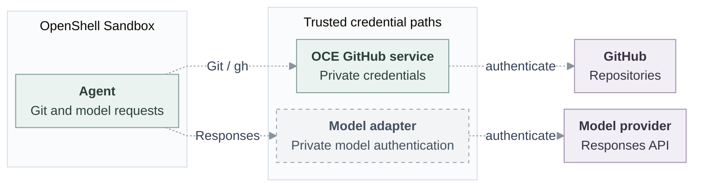

# RFC: Credential Gateway for OpenShell

**Status:** Proposed; the protected integration is not yet qualified.

## Problem and decision

An OpenClaw Enterprise (OCE) Agent needs to use GitHub and an AI model to do its work. It must use those services without carrying their long-lived credentials. We must be able to stop one Agent's access without disrupting other Agents.

OCE will use a Credential Gateway to make approved services available while trusted components retain the provider credentials. OpenShell provides the Agent's contained environment. The OpenClaw Control Plane (OCC) decides what the Agent may use. OCE's existing GitHub service retains its credentials and authenticates GitHub requests.

OCE selects the Sandbox and Credential Gateway capabilities independently. OpenShell is the proposed implementation for both; an Agent can use the Sandbox without the gateway.

## Scope

The first combined integration targets an API-created dedicated Codex Agent. It must complete an approved Git or `gh` operation and an OpenAI Responses request over HTTPS, including supported streaming. Dedicated OpenClaw requires separate qualification.

The protected path must prevent Agent material copied outside the cluster from granting access, directly or through a reachable gateway. It must not fall back silently to weaker authentication. Existing direct model-key delivery and compatibility bearer sessions remain separate, weaker paths; neither establishes this protected guarantee.

## Contract

### Ownership and request paths

Compute owns Sandbox lifecycle; workers create, repair and retire credential sessions. Credential owners retain sources and renewal. Shared provider configuration grants no Agent authority; each attachment requires OCC authorization.

Dashed lines show proposed, unqualified paths. Git/`gh` uses the existing OCE HTTPS service and GitHub App credentials, with no second issuer or direct GitHub bypass. Model authentication remains private.

### Agent access

1. **Prepare.** Bind the worker-prepared session and admitted Agent revision to an opaque lease without creating or renewing credentials. Keep the Agent nonserving until the required session, authorization and connection evidence is available.
2. **Use.** Check current authorization and the bound session before dispatch through the approved Git/model path. Reject a read-only push before dispatch. The gateway is not an arbitrary proxy.
3. **Observe.** Distinguish connection, attachment, traffic closure and cleanup. OpenShell attachment readiness proves neither backend access nor active-stream closure. Unavailable status remains unknown.
4. **Withdraw and clean up.** Stop the Agent's new and active traffic; release only its session's resources. Detachment neither deletes shared configuration nor proves upstream revocation. Cleanup failure must not reopen access or disrupt another Agent.

Protected Git and model traffic must close within 30 seconds of withdrawal or loss of renewal, measured through the last active byte. Selected active exchanges recheck closure within five seconds. Where the original profile requires it, the separate five-second finalization observer also remains required. These bounds do not prove upstream credential revocation.

If a request might have reached the provider, retain its original attempt as uncertain and reconcile it; do not automatically replay it. Audit identifies the Agent, approved operation and outcome without recording credentials or request contents. The [contract companion](credential-gateway-driver/contract.md) defines bounds, failure handling and recovery in detail.

### Gateway interface

`prepare` binds the original session and revision; `mediate` checks and forwards each operation; `status` reports admission and cleanup; `withdraw` stops use and observes closure; `dispose` releases session-owned attachments while retaining unresolved cleanup. The companion defines the complete proposed interface. **TODO:** Map provider management to these methods.

## Implementation and verification

- **TODO — session delivery:** Bind the authenticated OpenShell session, readiness and private/workspace mounts to the admitted revision.
- **TODO — model access:** Supply private Responses authentication, streaming and credential custody through a supported OpenShell API/version.
- **TODO — closure and recovery:** Observe new/active traffic closure, reconcile uncertain attempts and retain session cleanup across restart.

Verify through the ordinary API and worker: create a dedicated Codex Agent, complete model and authorized Git/`gh` work, reject a read-only push, then withdraw access while another Agent continues working. Measure closure bounds and copied-authority denial. Source and mocks do not prove installed or live-provider behavior.

## Open questions

The OpenShell version, provider-management names and signatures remain open. The [pinned OpenShell APIs](https://github.com/NVIDIA/OpenShell/blob/f8002d19ad2f948abf48bd2f5ca4f8ebd388e3c8/proto/openshell.proto) provide these starting points:

| Working name           | Decision and existing OpenShell surface                                                                                                                                                                  |
| ---------------------- | -------------------------------------------------------------------------------------------------------------------------------------------------------------------------------------------------------- |
| `AddProvider`          | Expose `CreateProvider` and `AttachSandboxProvider` separately, or combine them? Separate operations make shared ownership clearer.                                                                      |
| `AuthenticateProvider` | Keep this connection/reauthentication name, or use `ConnectProvider`? No matching RPC exists in the pinned source; grant acquisition and refresh need a mapping. This is not per-request authentication. |
| `ProviderStatus`       | Combine `GetProviderRefreshStatus` and `GetSandboxProviderStatus`, or preserve separate observations? Neither establishes active-stream closure.                                                         |
| `RemoveProvider`       | Expose `DetachSandboxProvider` and `DeleteProvider` separately? Removing one Agent's access must preserve other Agents' shared configuration.                                                            |

- Which static, OAuth or dynamically issued credentials should the first slice exercise? How should connection and reauthentication handle them?
- Which model adapter and account/subscription modes should authenticate Responses and supported streams?
- Which runtime mechanisms should establish session identity, mounts, readiness and active-stream closure?

Full interface, environment limits and acceptance: [contract companion](credential-gateway-driver/contract.md). Proposed lifecycle: [SVG](credential-gateway-driver/request-lifecycle.svg), [editable Mermaid](credential-gateway-driver/request-lifecycle.mmd).
