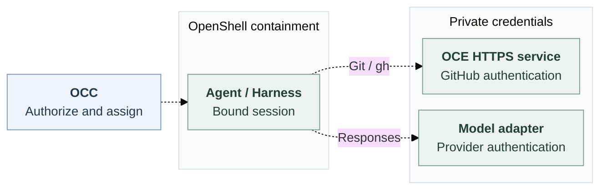

# OpenShell credential integration

## Goal and review request

OpenClaw Enterprise (OCE) needs straightforward recovery when an Agent fails or
is compromised:

- **Disposable Agents:** withdraw one Agent's access without disrupting others
  or rotating every shared provider credential.
- **No long-lived credentials in the Agent container:** keep provider credentials
  outside the Agent on the protected path. Copied Agent material must not grant
  access from outside the cluster, directly or through a reachable gateway.
- **Auditable use:** identify the Agent, approved operation and outcome without
  recording credentials or sensitive request contents.

**Mrunal: help us refine the design and define the interface: function names,
inputs, results and failure behavior.** Please map the provider lifecycle below
to supported OpenShell APIs and versions, and identify the smallest gaps for a
first integration. This is a proposal, not a qualified integration.

## One integration, two capabilities

OCE selects **Sandbox** to contain execution and **Credential Gateway** to make
approved services available. One OpenShell implementation can supply both,
composing with existing Secret and credential owners. OpenClaw Control Plane
(OCC) retains authorization and assignment; Compute owns Sandbox lifecycle;
workers prepare credential sessions once.

Dashed connections show the proposed protected path. OCE retains its GitHub App
key, installation-token issuer and existing HTTPS mediation. Model authentication
is private and grants no GitHub authority. Arbitrary proxying and direct GitHub
bypass are forbidden.

Credential Gateway is implementation-neutral. A CI `.env` reader or local script
are possible simpler implementations, not delivered features. CI may use fake
credentials and mocked models without strong isolation. Real local credentials
need a separate isolation decision; environment labels cannot weaken a protected profile.

## Provider interface to review

Connecting a provider and authorizing one Agent to use it are separate concerns.
These names are **placeholders, not final signatures**. Please help resolve:

| Starting operation     | Meaning and open choice                                                                                                                                                                                                     |
| ---------------------- | --------------------------------------------------------------------------------------------------------------------------------------------------------------------------------------------------------------------------- |
| `AddProvider`          | OpenShell separates `CreateProvider` and `AttachSandboxProvider`. Expose both, or combine them? We favor separation for clear ownership of shared providers.                                                                |
| `AuthenticateProvider` | No matching RPC exists in the pinned source. Keep this connection/reauthentication name, or `ConnectProvider`? Map grant/refresh handling separately; the implementation authenticates individual requests.                 |
| `ProviderStatus`       | OpenShell separates `GetProviderRefreshStatus` and `GetSandboxProviderStatus`. A summary is simpler; distinct, current connection/attachment/closure observations clarify recovery. We favor preserving those distinctions. |
| `RemoveProvider`       | OpenShell has `DetachSandboxProvider` and `DeleteProvider`. Keep scopes distinct? Detachment must close traffic without deleting shared material; neither implies upstream revocation.                                      |

The interface should accommodate **static secrets, OAuth grants and dynamic
issuance**; OAuth and dynamic issuance can overlap. Static-first keeps the initial
integration small; exercising refresh early tests more lifecycle behavior. All
three in MVP would be useful, not required. Please help choose the first slice.
Source owners retain custody and renewal; static values may remain long-lived
outside the protected Agent.

The [contract companion](credential-gateway-driver/contract.md) preserves the proposed
`prepare`, `mediate`, `status`, `withdraw` and `dispose` interface. Those methods
cover mediation and cleanup; their mapping to provider operations needs review.

## OpenShell integration questions

The [attachment/status](https://github.com/NVIDIA/OpenShell/blob/f8002d19ad2f948abf48bd2f5ca4f8ebd388e3c8/proto/openshell.proto#L131-L169)
and [provider/refresh](https://github.com/NVIDIA/OpenShell/blob/f8002d19ad2f948abf48bd2f5ca4f8ebd388e3c8/proto/openshell.proto#L281-L414)
APIs above exist in pinned OpenShell source. Please review the mapping and resolve:

- **Session delivery:** authenticated original-session access, readiness and
  private/workspace mounts despite the inspected Authorization and volume limits.
- **Model access:** private authentication for **OpenAI Responses over HTTPS and
  supported streaming**. Account/subscription support remains a question.
- **Withdrawal:** observable closure of new and active Git/model traffic.
  Attachment readiness neither tests backend access nor proves active-stream closure.

OCE supplies authorization and execution/connection evidence. Missing protected
evidence keeps the Agent nonserving. [Remaining owner decisions](credential-gateway-driver/contract.md#supplier-decisions-and-ownership)
include revision encoding, delivery sequencing and dedicated OpenClaw's protocol.

## First integration and incident response

Keep Sandbox-only independent. First, create a dedicated Codex Agent through the
ordinary API, attach approved model/repository access, complete a Responses turn
and an authorized Git/`gh` operation, then inspect and withdraw access. A read-only
push must fail; another Agent must keep working. Dedicated OpenClaw needs separate
qualification for [issue 118](https://github.com/openclaw/openclaw-enterprise/issues/118).

Withdrawal must close new and active traffic within the protected profile's
[bounds](credential-gateway-driver/contract.md#bounds-and-source-lifetime).
Uncertain effects retain their original attempt without replay or reissuance;
missing inventory remains unknown. Cleanup failures cannot reopen access or
remove another Agent's attachments.

## Verification

The existing direct-key exception delivers authorized model keys to workloads;
it does not provide protected mediation or copied-authority guarantees.
Compatibility retains weaker bearer replay and withdrawal/restart limits without
mandatory SPIRE. Neither silently replaces a protected profile.

Keep existing guards until real API/worker consumers meet the companion's
[acceptance obligations](credential-gateway-driver/contract.md#implementation-and-acceptance-detail),
including provider readback, refusal, confidentiality, audit, rotation, recovery,
measured closure and sibling-safe cleanup. Source and mock checks do not prove
installed OpenShell, live-provider or release readiness.

## References

[Detailed contract and source references](credential-gateway-driver/contract.md#references).
Full proposed lifecycle: [SVG](credential-gateway-driver/request-lifecycle.svg),
[editable Mermaid](credential-gateway-driver/request-lifecycle.mmd).
