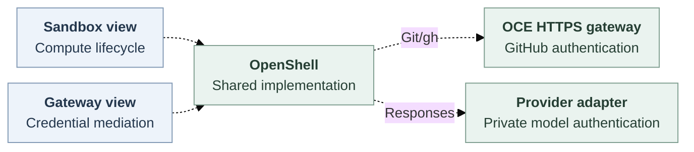

# Credential Gateway Driver

## Problem and Decision

Developers need independent containment and credential mediation. **Proposed:** select singular `sandbox` and `credential_gateway` library views sharing OpenShell. Existing authority, custody, services, Pods and issuers remain unchanged. No inheritance/capability-array migration.

## Scope

Sandbox-only stays independent. Combined Codex targets API-created model turns, authorized Git/gh, withdrawal and cleanup. Dedicated OpenClaw remains required for [issue 118](https://github.com/openclaw/openclaw-enterprise/issues/118). Gateway-only OpenShell, external multirole factories and additional protocols remain deferred.

## Contract

Configure runtime, workspace, private-session delivery and authorized repository/model bindings. This proposed, unexecuted Installation input references canonical Sandbox configuration: `{"drivers":{"credential_gateway":{"id":"openshell-credentials","configuration":{"sandboxDriverId":"openshell-sandbox"}}}}` Validate role/id, methods/version and configuration before effects, preserving prior selection on invalid/mutated input. Reject external packages/conflicting references. Initialize/close once per API/worker process through one hook-bearing view. Sharing confers neither cross-process serialization nor API-only Provider credentials on workers.

Save an Agent, invoke its authorized [bodyless deploy API](https://github.com/openclaw/openclaw-enterprise/blob/6b5c9093b75044f181db74bc14dffaa3410e617a/docs/reference/agents/deployment.md), then poll with revision-read permission. 202 admits work. Historical activation does not prove live readiness: verify it before exercising authorized native Gateway ingress.

Dashed joins are proposed. RFC321 separates native Gateway and Codex Pods. The repository service attaches GitHub authentication. Model adapters privately authenticate allowed OpenAI Responses HTTPS/streaming. Arbitrary proxying/direct GitHub bypass are forbidden. Compute retains Sandbox lifecycle. Workers create/repair/retire sessions once. Proposed `prepareGatewayMediation` consumes their prepared context, never environment strings or repeated issuance.

Proposed `oce-credential-gateway/v1` consumes internal owner-produced objects, never authority from casts/strings. Every call takes finite receiving-process monotonic deadlines and cancellation signals (`bounds`):

- `prepare`: trusted revision, owner-prepared material binding, original attempt → opaque lease/safe status or `not-dispatched`/`uncertain`. Prepares mediation only.
- `mediate`: lease, authenticated caller, trusted revision, assurance, credential reference, permitted operation, approved HTTPS destination, original attempt and ingress-bound exchange → completed response status/attempt, `not-dispatched` or `uncertain`. Responses use only the exchange bound to that session/request/parsed plan.
- `status(lease)` → admission, independent cleanup state and wall deadline, or `unavailable`.
- `withdraw(lease)` → `withdrawn` or `pending`/original attempt. Requests/observes original-owner new/active traffic closure.
- `dispose(lease)` → `disposed` or `cleanup-pending`/original attempt. Releases only exact owned attachments through original custody.

The lease pins exact credential, revision, profile and original session generation. Each new request requires fresh authenticated operation/original-attempt binding without widening the lease. `Assurance.kind` must match the revision-selected trust profile or deny. Missing genuine producer ports refuse. Protected acquisition/dispatch requires requester authority, expected execution and actual receiving-connection evidence. Missing evidence keeps staged admission nonserving. Background Work retains admission. Compatibility retains weaker bearer replay/recovery without mandatory SPIRE.

Freeze roles/config/hooks before dependents. The existing revision transaction persists `driverId`, `implementation`, `contractVersion`, `profileDigest` and `sandboxDriverId`. Identical selection is a no-op. Restart retains bindings/cleanup routes. Changed selection cannot retarget or extend authority/deadlines.

Use the closed GitHub parser with `git-read`, `git-write`, `git-full`. Reject mismatched effects, unknown routes, redirects and destination rewrites. Bound responses/time/headers. Mandatory audit records safe correlation/outcomes, never credentials, payloads, raw URLs/headers or provider errors.

Deadlines cannot extend source validity/authority. Reject remote monotonic timestamps. Restart conservatively converts persisted wall deadlines under the original owner's clock policy. Cancellation/deadline stops submission and bounds waiting. Accepted finalization remains owned after disconnect. `not-dispatched` carries a closed safe reason. Uncertain acquisition/dispatch retains attempts, capacity and late settlement without replay/reissue. Partial setup compensates or retains cleanup before throwing: outer rollback sees only returned adapters. Lost ephemeral inventory/unavailable status proves neither absence nor settlement. State atomicity cannot settle provider effects. Protected recovery requiring durable inventory still requires its supplier.

Ready means mediation-only. Withdrawn never reopens despite cleanup failure. Source owners retain validity, renewal/overlap and retirement. Static disposal neither revokes upstream keys nor deletes shared material. Protected new/active Git/model closure must finish within 30 seconds of withdrawal or renewal loss, including observation/caching/scheduling. The selected five-second finalization-observer profile bound remains stricter. Compatibility retains existing withdrawal/restart limits.

## Implementation and Open Questions

Main supplies session preparation and Sandbox foundations. Repository-with-Sandbox and non-Codex OpenShell guards remain. Registration, profile persistence and receiving joins are proposed. Original owners must reconcile RFC321's compatibility-first sequence with the protected-model-first combined target, preserving both assurances.

Mrunal/OpenShell must identify authenticated original-session transport/readiness despite Authorization stripping, private/workspace mounts despite pre.7 PVC/projected-token limits, Responses attach/status/detach and observable active-stream closure. IAM/State/Work and Compute must supply genuine admission/observation. Profile encoding and dedicated OpenClaw protocol remain open.

## Verification

Keep guards until actual API/worker consumers prove replaceable selection, effect counts, invalid configuration refusal, model/Git provider readback, read-only-write and foreign-scope/destination denial, confidentiality, safe responses/audit, rotation, partial/unknown failures, profile-bound restart and sibling-safe cleanup. Pin image/chart/kernel/CNI/storage/tool/model versions. Measure withdrawal onset, observation, last admission and last active byte separately. Preserve caller DNS pins with hostname/SNI/certificate checks. `tls: skip` routes without OpenShell substitution. Source/conformance, composition, installed, live-provider and release proof remain separate. Embedded GitHub success does not qualify OpenShell.

## References

[Main foundations](https://github.com/openclaw/openclaw-enterprise/tree/6b5c9093b75044f181db74bc14dffaa3410e617a), [Driver ownership](https://github.com/openclaw/openclaw-enterprise/blob/6b5c9093b75044f181db74bc14dffaa3410e617a/specs/17-provider-driver-abstraction.md), [binding authority](https://github.com/openclaw/openclaw-enterprise/blob/6b5c9093b75044f181db74bc14dffaa3410e617a/specs/30-harness-auth-binding.md), [deployment](https://github.com/openclaw/openclaw-enterprise/blob/6b5c9093b75044f181db74bc14dffaa3410e617a/docs/reference/agents/deployment.md). [RFC321](https://github.com/openclaw/openclaw-enterprise/blob/388864ebec1474ee1d10ce0001c256bf5063b5de/specs/37-openshell-runtime.md) is a separate unmerged proposal. [OpenShell pre.7](https://github.com/NVIDIA/OpenShell/tree/f8002d19ad2f948abf48bd2f5ca4f8ebd388e3c8) is source, not installed proof. Proposed lifecycle: [SVG](credential-gateway-driver/request-lifecycle.svg), [editable Mermaid](credential-gateway-driver/request-lifecycle.mmd).
