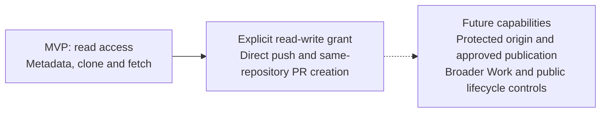

# Enterprise runtime and access: RFC series

These four proposals define the GitHub gateway MVP within the
[OCE platform design](../../../docs/design.md). Each RFC owns its contract;
implementation and runtime qualification remain separate work.

## Four owners

| Proposal                                                                             | Owns                                                                              |
| ------------------------------------------------------------------------------------ | --------------------------------------------------------------------------------- |
| [0034: credentials and GitHub](../0034-github-app-credentials.md)                    | Repository grants, credential custody, mediated operations and cleanup.           |
| [0035: identity and enforcement](../0035-workload-identity-and-runtime-authority.md) | Stable identity, execution binding, finite leases and withdrawal.                 |
| [0036: Work authority](../0036-turn-bound-delegated-authority.md)                    | Service-owned root Work, immutable scope, requester attribution and cancellation. |
| [0037: runtime lifecycle](../0037-persistent-agent-runtime-lifecycle.md)             | Construction, preparation handoff, writer exclusion and replacement.              |

## Delivery stages

The MVP admits one private repository with `read` access by default. An explicit
`read-write` grant also permits direct push and same-repository PR creation,
without candidate approval or branch provenance requirements. Ongoing destination
ownership/visibility protection is a known gap; exact repository binding remains.

All MVP operations require current OCC/IAM authority and protected provider
credentials. A bearer identifies its original grant and execution without proving
which container presented it. The shared credential broker and GitHub adapter run
in one active credential gateway, separate from the Agent messaging gateway.
Constrained recipes select trusted primitives, with one pinned version per bundle.
Replacement requires observed predecessor stop and accepts downtime; scaling,
concurrent versions and remote-broker execution are deferred.

## One operation

1. **Admit.** OCC checks requester invocation permission and service authority
   separately. Retain genuine root Work, immutable repository/revision/access
   scope, execution assignment and selected duration policy. Preparation has its
   own admitted read-only authority; draft configuration and pending assignment
   grant no access.
2. **Authorize and dispatch.** Validate the Agent access token, current Work,
   assignment, lease and IAM authority, then the exact operation. The broker
   retains protected GitHub material before use. One fixed token profile serves
   the grant; each operation receives its own finite, one-use permit. The
   [issuer policy](../0034/github-issuer-policy.md) owns replacement and shared
   inventory limits.
3. **Retain the outcome.** PR requests retain stable operation identity and
   immutable contents. Current authorization gates repeated requests and result
   disclosure. Independent finalization records known or uncertain effects;
   cancellation, restart and token replacement cannot authorize resubmission.
4. **Close and replace.** Lease expiry ends that lease's authority; terminal Work
   closure prevents new authority. Cleanup survives closure and Agent deletion.
   Observe preparation writers stopped before handoff and predecessor termination
   before successor writes. Changes to admitted permission scope require a fresh execution and a
   fresh Pod in the Kubernetes/gVisor profile. Routing withdrawal and provider
   revocation are separate from physical termination.

## Acceptance boundary

Every dispatch requires current online authority; outages deny access. Execution
may be uncapped, but leases and operation deadlines remain finite. Root-only
execution may qualify first; helpers require proven scope, aggregate limits,
attribution and stop ownership. Broader Work APIs, independent durable children,
public Stop/Start controls and completed-state recovery remain future scope.

The [acceptance matrix](../0034/lifecycle-acceptance.md) covers reads, direct push,
PR creation, denied access, shared custody, unknown outcomes, cleanup and writer
handoff. Keep reviewed source, composed components, installed runtime and live
provider evidence distinct. Component checks alone do not qualify the running
Agent workflow.
