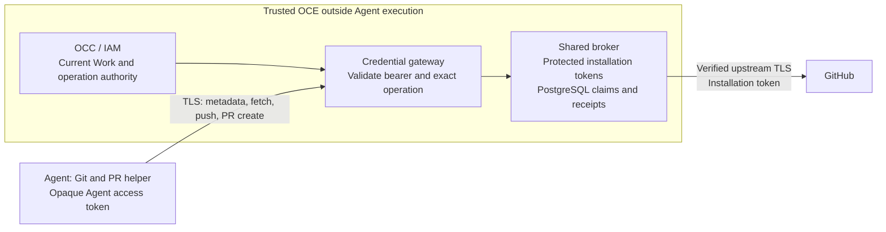

# Proposal: Credential lifecycle and GitHub App access for Enterprise Agents

## Summary

Extend OpenClaw Enterprise's `SecretBroker` to manage issued credentials, starting with GitHub Apps. OCC/IAM authorizes each operation; a standalone TypeScript credential gateway mediates repository metadata, clone/fetch, direct push and minimal same-repository PR creation. The Agent receives an opaque bearer, while App keys and installation tokens remain outside execution.

## Motivation

Agents need organization-managed repository access. Shared credential lifecycle management avoids duplicating authorization, issuance and recovery across providers. Mediation keeps reusable provider credentials outside execution while allowing regular Git clients and a bounded PR helper.

## Goals

- Keep provider credentials outside Agent execution and enforce exact repository operations.
- Preserve original Work, current authority, durable outcomes and independent cleanup.
- Share broker lifecycle and extension interfaces, with GitHub as the first consumer.

## Non-Goals

Personal GitHub ACL synchronization, general GitHub API access, multiple repositories per execution, human-approved publication, physical caller-origin proof, and disclosure prevention across every output channel. Broader Work, public Stop/Start controls and additional production providers are later scope.

## Proposal

### Configure repository access

An administrator admits one private GitHub.com repository by numeric identity. Versioned Agent configuration selects `accessProfile: read | read-write`, defaulting to `read`; existing read-only selections acquire no write authority. A separately authorized deployment verifies the repository and checkout commit and freezes the selection into `AgentRevision`. Draft save grants nothing. Invocation allowlists and the App installation's broader permissions do not grant repository access.

The [configuration contract](0034/repository-configuration.md) defines the proposed DTO and admission. Repository/profile or Work-context changes require fresh admission and execution, including a fresh Pod in the selected Kubernetes/gVisor profile.

### Assign ownership

OCC/IAM remains the sole platform authorizer. The proposed `CredentialGatewayDriver` composes mediation and the shared broker; constrained recipes select implemented trusted primitives. Ship one active TypeScript gateway with durable PostgreSQL custody and claims, reusing existing State transaction owners. Replacement requires observed predecessor termination; downtime is accepted. Scaling and overlapping rollout are deferred. Named connections configure upstreams; separate OCE grants authorize their use. GitHub ships first; an independently authored synthetic non-GitHub recipe must prove extensibility through real admission and credential owners, without claiming live-provider support. Provider-specific recipes and implementations may be maintained in separate repositories and remain subject to the same admission, authority and custody contracts.

Each access lease binds genuine service-owned root **Work**, its exact Agent/revision and execution assignment, or separately admitted read-only preparation. The broker cannot create Work authority. Current operation checks, cancellation, durable outcomes and independent cleanup are required from the first read. [Broker contract](0034/credential-broker-v1-spec.md).

The gateway validates an opaque **Agent access token**, invalid at GitHub, and resolves its original server-owned grant, Work and execution. Each dispatch separately requires current online IAM, Work, assignment and lease authority. A copied live bearer can exercise that original grant from a reachable location; it does not prove physical container origin. [Bearer and transport contract](0034/github-mediated-access.md#agent-access-token).

### Deliver the gateway MVP

| Access       | Operations                                                               |
| ------------ | ------------------------------------------------------------------------ |
| `read`       | Repository metadata and HTTPS clone/fetch, with verified preparation.    |
| `read-write` | The same reads, direct Git push and minimal same-repository PR creation. |

Root-only execution may qualify first. Helpers require proven shared scope, aggregate limits and stop ownership. Broader Work and independently admitted children remain later scope. Qualification must exercise the [regular Agent workflow](0034/lifecycle-acceptance.md#acceptance-matrix).

### Authorize publication

An explicit read-write grant permits all valid refs GitHub accepts, including tags, force updates, deletion and multiple updates, without App rule bypass. Authorize and retain the complete bounded command prefix before streaming PACK data. Human approval, a retained candidate and branch provenance are not required.

PR creation is independent of push and permits any distinct head/base branches in the admitted repository; `draft` defaults to `false`. Canonical input, safe output, one-use dispatch and unknown-outcome retention are owned by the [publication contract](0034/github-publication.md#trusted-publication). General `gh pr create`, issue operations and other PR operations are deferred.

**Known MVP gap:** ongoing ownership/visibility checks and protection against a repository becoming public while access or writes remain outstanding are deferred. Contents and PR text may become public. Exact admitted-repository binding remains required; stronger destination protection is not an MVP launch gate.

### Enforce and close access

Production is mediated only. Online authority is required for every dispatch, including reads, issuance and maintenance; outages deny new effects. Each grant fixes one installation-token profile. Read-write reads use its write token; preparation has its own read-only grant. Enforce two aggregate outstanding token slots and one in-flight mint per lease across concurrent requests and retained attempts. [Issuer policy](0034/github-issuer-policy.md).

Work may be uncapped, while leases and operation deadlines remain finite. Closure retains receipts and cleanup without implying process termination or provider revocation. Never automatically replay a possibly submitted push or PR. Preparation and predecessor writers must be observed stopped before workspace handoff or successor writes.

## Rationale

The shared broker centralizes custody and recovery, while trusted primitives own provider operation semantics. Recipes configure supported combinations without executable extensions. Bearer authentication simplifies the Agent path but allows copying; the broader write token also serves read requests. Current authorization, exact routing and protected custody remain necessary under those accepted limits.

## Unresolved questions

Implementation must map genuine root Work into inventory's original-operation binding and specify OCC's authoritative preparation-context handoff. Fabricated IDs and pending assignments cannot supply either authority. The [acceptance plan](0034/lifecycle.md) distinguishes component, installed-runtime and live-provider evidence; this proposal does not claim delivery.
