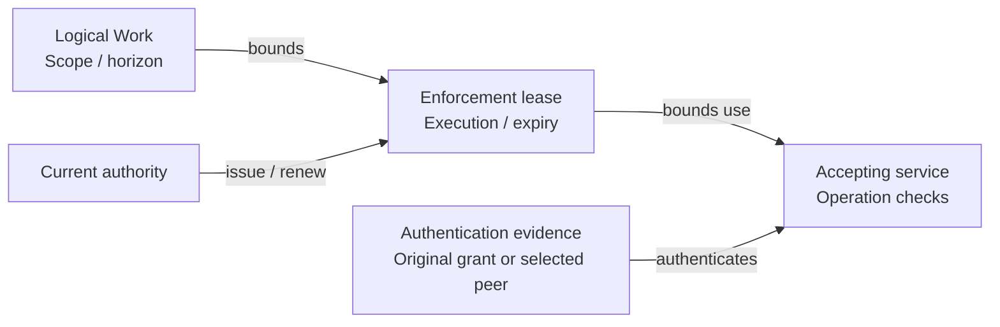

# Proposal: Workload identity and runtime authority

## Summary

Bind Enterprise access to stable Agent identity, original Work and exact execution, with current permission checks and finite authority leases. The GitHub gateway MVP uses bearer authentication; SPIFFE/SPIRE is an optional protected-origin profile. Preserve [OCE platform design](../../docs/design/access.md#iam-and-authority)'s Namespace authorization and single active revision.

## Motivation

An Agent can keep working across many turns and restart with the same configuration. Its certificates and connections may outlive an execution or permission change. The system must recognize the stable Agent without allowing old processes or credentials to recover withdrawn authority.

## Goals

Separate stable identity, execution identity and permission; bound authority withdrawal; support long-running work; and preserve independently authorized bootstrap and cleanup.

## Non-Goals

Replacing human login, OAG, IAMAdapter or Kubernetes authorization; adding a user-facing execution resource; federation; cross-Namespace references; or proving physical termination from authorization alone.

## Proposal

### Identity and authority

[OCE platform design](../../docs/design/access.md#iam-and-authority) distinguishes a human `Principal`, an automation `ServicePrincipal` and an Agent's `WorkloadIdentity`. Explicit `AccessBinding`s grant roles to the appropriate stable subject. An Agent never inherits its creator's identity or permissions.

The existing Agent-owned `ServicePrincipal`, referenced by `Agent.servicePrincipalId` and allocated as `service-agent-<Agent ID>`, supplies the stable Agent identity. No new identity type or binding migration is required. The [identity model](0035/identity-registration.md#identity-model) distinguishes this workload subject from general automation principals and native and Kubernetes ServiceAccounts.

OCC selects the admitted revision and execution assignment. Restart or replacement creates a fresh assignment; grants and leases never rebind to it. For the GitHub gateway, an opaque Agent access token authenticates the original server-owned grant and resolves its Agent, root Work and execution. It does not prove caller-container origin: a copied live bearer can use its original still-authorized grant from a reachable location.

Other OCC and Kubernetes authentication boundaries retain their contracts, including RFC 0027's pod-bound ServiceAccount-token baseline. Installation configuration may select an X.509-SVID profile: Compute supplies execution evidence and a constrained registrar and SPIRE issue an execution-bound certificate. Protected-origin authentication remains future scope for the GitHub gateway. Authentication failure never changes profiles; a selected origin check must prove the actual caller's assignment, beyond copied fields or TLS key possession.

### Delivery stages

The MVP supports [RFC 0034's mediated reads, direct push and minimal same-repository PR creation](0034-github-app-credentials.md). It needs one immutable service-owned root Work per execution with requester, immutable scope and horizon, current cancellation and assignment state, and operation/effect attribution. Subordinate helpers share that Work's authority, resource limits and cancellation; the runtime must demonstrate physical stop for every helper or support root-only execution. A broad Work API and durable child hierarchy are unnecessary.

Direct push and PR creation require current operation authority without a retained candidate or human approval. Approved-candidate publication remains a future profile owned by RFC 0034.

Full durable Work, independently continuing children and user-facing Stop/Start follow under [RFC 0036](0036-turn-bound-delegated-authority.md) and [RFC 0037](0037-persistent-agent-runtime-lifecycle.md). Initial delivery does not require active-session migration or effect replay. The [stage requirements](0035/identity-registration.md#stage-requirements) keep the necessary identity and cancellation checks in every stage.

### Runtime enforcement

Every operation in the first GitHub profile requires online OCC authority, including reads and credential maintenance. Provider credentials remain outside Agent workloads. An optional [read-outage profile](0035/authority-leases.md#outage-operation) requires separate selection; finite leases alone never enable offline access.

Execution duration defaults to uncapped; configured work and execution horizons are immutable for the admitted context. Every enforcement lease has a finite expiry and binds exact work and execution. Renewal requires current authority and cannot extend a configured cap. Later children also remain bounded by any configured ancestor horizons.

_Work and executions may run without a duration cap. Every authority lease expires._

In the Kubernetes/gVisor profile, increases or decreases to admitted permission scope require a fresh Pod/gVisor sandbox and execution identity. Withdraw old dispatch authority before admitting the changed scope. Retained processes, credentials or state cannot acquire new permissions in place; context handoff requires scope and isolation checks.

[Dispatch and lifecycle enforcement](0035/authority-leases.md#dispatch-and-lifecycle) rechecks evidence at final submission and protected delivery. Queues and reconnects cannot extend deadlines. Effective withdrawal requires complete holder acknowledgements or proven expiry; physical termination remains separate. Compute observes predecessor termination before a writable successor, and cleanup retains its own authority after Agent deletion.

## Rationale

Stable IAM subjects preserve policy across restarts; execution-bound grants retain original attribution. Bearer authentication and online checks keep the GitHub MVP small, with the stated token-copy limitation. SPIFFE adds registration and attestation for selected protected-origin profiles. Optional read leases trade outage availability for bounded withdrawal delay.

## Unresolved questions

Which lease protocol and measured withdrawal bounds qualify? Runtime-purpose authorization and GitHub access still need their authoritative producers integrated under the [enforcement specification](0035/enforcement-spec.md). Optional protected-origin profiles additionally need a demonstrated gVisor origin mechanism and installed SPIRE integration.
