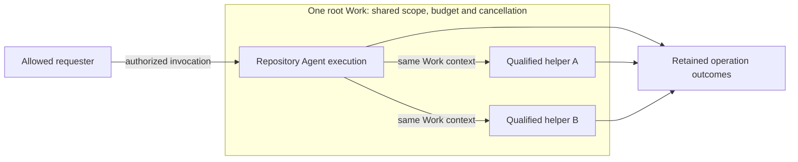

# Proposal: Service-owned work authority for Enterprise Agents

## Summary

Give repository Agents the minimum service-owned Work authority needed to bind each operation to its original request, exact execution and current service permissions. The selected GitHub profile supports repository reads, direct push and minimal same-repository PR creation under an immutable explicit grant. Broader persistent Work and lifecycle features follow later. This extends [OCE platform design](../../docs/design/access.md#iam-and-authority) without requiring a general Work product for the first release.

## Motivation

A review can take many turns and outlast a provider token. The service still needs to know which request each operation belongs to, whether it was canceled, and whether an earlier submission succeeded. Repository access alone cannot answer those questions. A small root Work profile supplies that missing authority while keeping the first release practical.

## Goals

Preserve original request identity, current authorization, configured limits, cancellation and durable outcomes. Support one root Work per execution, with qualified subordinate helpers and the same authority boundary for reads and writes.

## Non-Goals

The initial release excludes a general Work UI/API, multi-Work dispatch, separately admitted durable children, continuation after coordinator loss across fresh attempts, and advanced orchestration. User-owned execution, human impersonation, cross-Namespace access, offline GitHub operations and guaranteed exactly-once provider effects are outside this proposal.

## Proposal

### Select an explicit repository grant

| Grant        | Supported scope                                                                                                       |
| ------------ | --------------------------------------------------------------------------------------------------------------------- |
| `read`       | Metadata and clone/fetch for the admitted repository. This is the default.                                            |
| `read-write` | The same reads, direct push and independent same-repository PR creation under [RFC 0034](0034/github-publication.md). |

Read grants and invocation allowlists confer no write authority. Writes require current operation authorization within the explicit grant, without a retained candidate or human approval. RFC 0034 owns the operation bounds and accepted destination-visibility gap. General Work interfaces, independently admitted durable children, continuation across fresh attempts and public Stop/Start controls remain later capabilities under [RFC 0037](0037-persistent-agent-runtime-lifecycle.md).

### Admit a small root Work record

An administrator grants the service access to selected repositories and operations. Native-channel user and channel allowlists separately determine who may invoke it. OCC checks invocation, current service access, workload permissions and data eligibility. The original invocation records attribution; it does not become a continuing service grant or transfer the requester's provider credentials.

Before execution, persist the minimum root Work contract:

- The original invocation, service owner, Installation/Namespace, Agent/revision and exact execution assignment.
- Immutable repository/action scope, purpose, data eligibility, audience and provider selections.
- The effective duration policy, any configured original horizons, resource limits and cancellation or withdrawal dependencies.

Each dispatch also retains its operation identity, immutable request and durable submission outcome. Provider credentials stay in trusted mediation. OCC constructs separately admitted read-only preparation authority and hands it to access delivery; pending assignment or readiness alone grants nothing. Preparation never borrows execution credentials, and its writers must stop before workspace handoff.

Work admission, enforcement and recovery remain required even when these facts are stored on existing request records. Inventory must bind operations to genuine root Work through an explicit projection or versioned schema; fabricated turn/message IDs cannot supply that binding. Qualification must compose authentic invocation, State, execution and credential custody. Component tests do not establish a deployed repository flow.

### Keep helpers inside the root

A helper shares the original Work context, aggregate resource budget and cancellation. It has no independent authority or renewal and cannot reset a limit. The supported runtime must own and prove physical stop for every helper; an unqualified helper mechanism remains unsupported. Distinct child Work and renewal without a running coordinator belong to the Work lifecycle stage.

**Figure 1.** Both helpers remain inside one Work's authority and stop boundary.

### Enforce authority throughout execution

Execution duration defaults to uncapped. Finite leases and operation deadlines still apply; configured horizons never extend through activity, token replacement or renewal. Current authority may narrow access, but cannot expand the admitted scope. An Agent can retain its identity indefinitely; that does not authorize an arbitrary process to run forever. Changes to admitted permission scope follow RFC 0027's fresh-Pod path.

[RFC 0035](0035-workload-identity-and-runtime-authority.md) binds finite leases and withdrawal to the exact assignment. The gateway resolves the Agent access token to its original server-owned grant and Work; bearer possession does not prove the presenter's container. GitHub requires current OCC authority for every dispatch, including reads and credential maintenance. [RFC 0034](0034-github-app-credentials.md) owns credential mediation and durable write claims. Unknown submission remains unknown until independently resolved; a replacement token, process or Work record cannot justify replay. Completion, cancellation or Work's own configured expiry closes it terminally; lease expiry only ends that lease's authority. Closure cannot erase operation receipts or independently bounded finalization.

[RFC 0037](0037-persistent-agent-runtime-lifecycle.md) owns execution and stop evidence. Where completed-result delivery is supported, it has separate finite authority for the exact content, audience and destination. Delivery cannot extend computation or its horizons.

## Rationale

The root profile makes repository access accountable without making general scheduling or durable child execution a prerequisite. The [supporting specification](0036/work-authority-spec.md) preserves the fuller model and marks later features explicitly.

## Unresolved questions

How will the Kubernetes/gVisor runtime demonstrate complete helper stop ownership? Which lease and withdrawal bounds qualify the service? Which inventory projection and preparation-delivery interfaces implement the required root Work bindings?
