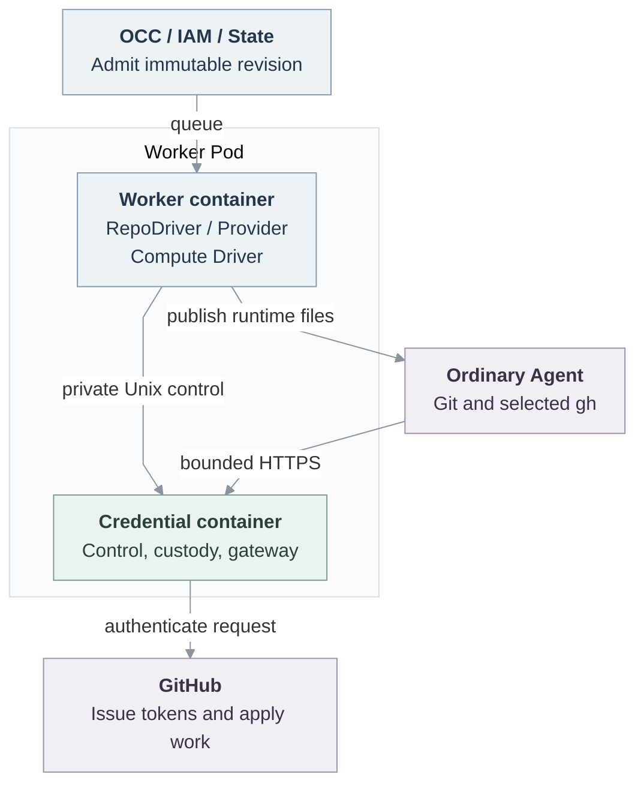

# RFC: GitHub credentials for ordinary Agents

## Objective

An API-created ordinary Agent can contribute to approved repositories through Git and selected `gh` operations while GitHub App keys, JWTs, installation tokens and renewal secrets remain outside its workload.

**Status: Proposed, unmerged and unqualified.** Start with the [architecture](github-credentials/architecture.md) for concepts and credential placement, then the [contract](github-credentials/contract.md) for interfaces, limits and recovery.

## Deliverables and boundary

The first demonstration uses the Agent's actual model and tools to clone or fetch, edit, test, commit, push and create a same-repository PR with explicit `git-full`. An independent read-only binding demonstrates routing and push refusal. Stop must withdraw access and retire owned material without harming a sibling Agent.

Selected delivery also includes all supported profiles/routes, concurrent repository use, renewal beyond twelve hours, uncertainty and cleanup. The demonstration alone does not complete that scope.

The selected composition is Kubernetes Compute, embedded OpenClaw, `api_key` Harness authentication, no SandboxDriver and one worker/credential-service owner. Integration is opt-in. Unbound Agents retain their lifecycle. Unsupported repository-bearing compositions reject. Later runtime, personal-access and durable-recovery work has [separate owners](github-credentials/contract.md#restart-and-future-obligations).

## Components and architecture

OpenClaw Control Plane (OCC) freezes approved bindings. The worker opens their sessions through RepoDriver, and its Compute Driver delivers client material. The credential service authorizes each request and attaches provider credentials outside the Agent workload. The [architecture](github-credentials/architecture.md#responsibilities) defines OpenClaw Enterprise (OCE) owners and the [alternatives](github-credentials/architecture.md#why-these-boundaries).

Proposed architecture. Solid edges identify inspected source connections, not installed proof. Worker and service are separate containers in one Pod, with the Agent outside. The [lifecycle SVG](github-credentials/request-lifecycle.svg), [editable source](github-credentials/request-lifecycle.mmd) and [contract](github-credentials/contract.md#request-lifecycle) explain ordering and uncertainty.

## Implementation and unresolved work

State, worker and credential owners must align admission, claims and delivery, and resolve these deletion gaps: Agent deletion retires Compute without repository closure, cleanup admission lacks a deleted-Agent target, and immutable attempts restrict revision deletion even after disposal, conflicting with the Agent finalizer. Namespace soft deletion hides revisions needed by deferred cleanup. Initiating closure before infrastructure removal is insufficient. Select compatible retention/finalization and demonstrate intended deletion, executable cleanup, preserved history and sibling safety. No cascade, history waiver or permanent deletion deferral is selected.

Safe replacement after lost issuance/write history is [unfinished](github-credentials/contract.md#restart-and-future-obligations).

Proposed feature-local divergence rule: ordinary implementation details remain owner work, and bugs require correction. Changes to scope, authority, ownership, interfaces, defaults, guarantees or acceptance require a short decision delta and affected-owner/human agreement before conformance claims.

## Verification

| Outcome                           | Required evidence                                                                                                                                                                                                                                                                                                                                                                                                                                                                 |
| --------------------------------- | --------------------------------------------------------------------------------------------------------------------------------------------------------------------------------------------------------------------------------------------------------------------------------------------------------------------------------------------------------------------------------------------------------------------------------------------------------------------------------- |
| Ordinary contribution and custody | Helm-installed API, PostgreSQL, worker and actual Agent model/tools, independent commit/PR readback, running-container custody inspection and normal stop. Ready Pods, fixtures, host Git and pod-exec Git do not substitute.                                                                                                                                                                                                                                                     |
| Exact scope and renewal           | All profiles/routes, immutable grants, concurrent bindings and refusal. Controlled hour-13 push/API with unchanged bearer/files and no expired-credential authentication. Platform hour-13 fetch is separate proof.                                                                                                                                                                                                                                                               |
| Recovery and terminal cleanup     | Lost responses, partial delivery, real claim loss, worker-only restart, Pod replacement, missing-Secret repair and sibling safety. Abrupt service loss after issuance, uncertain issuance and possible writes must exercise production adapter/control, worker and delivery paths. Safe replacement remains unfinished. Proof must show old access refused, justify any bounded replacement and exclude unsafe remint/replay. No-token or graceful-drain restart is insufficient. |
| Backend and packaging conformance | An alternate identity/auth/permission/expiry/renewal and drain-before backend exercises the same production owners. Run emitted service/client/controller artifacts with native clients and controlled peers, without source fallback. This selects no additional provider.                                                                                                                                                                                                       |

An authorized live smoke checks real App scope and PR/issue/comment behavior separately from controlled expiry. Missing provider/model inputs or authorization leave that proof unavailable. Record exact base/head/tree, artifacts, images, clients, topology, configuration, skips and cleanup. Source, composition, installed, live-provider and release evidence remain separate. Disabled CodeQL is no scan. Owner acceptance is not release acceptance.

## References

- [Driver model](../docs/design/drivers.md), [Providers](../docs/reference/providers.md), [IAM](../docs/reference/authorization.md), [SecretDriver](../docs/reference/drivers/secret.md) and [Harness authentication](30-harness-auth-binding.md) own existing platform behavior.
- Immutable unmerged sources: [RepoDriver interface](https://github.com/openclaw/openclaw-enterprise/blob/06d441b73e6fc3dd6e04096afae6f34f7c09ddf3/packages/contracts/src/repo.ts) and [worker-Pod template](https://github.com/openclaw/openclaw-enterprise/blob/06d441b73e6fc3dd6e04096afae6f34f7c09ddf3/deploy/helm/openclaw-enterprise/templates/deployments.yaml). These are file-specific references, not main or adoption of later implementation work.
