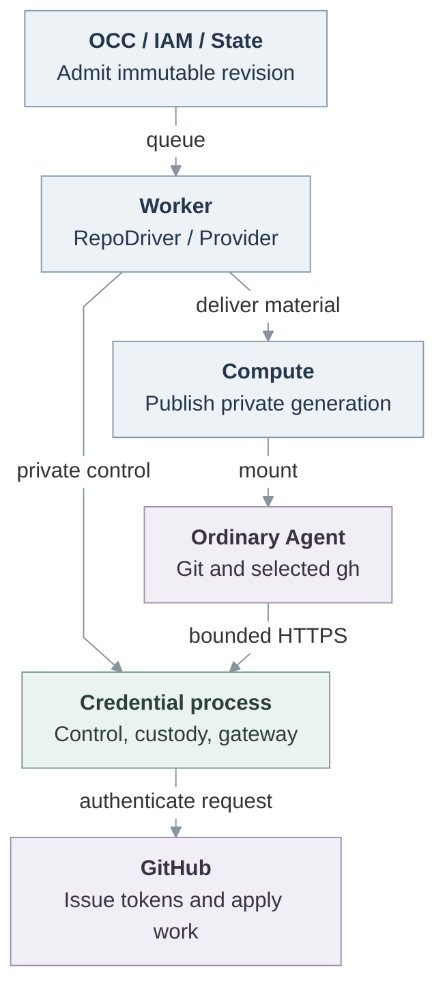

# RFC: GitHub credentials for ordinary Agents

## Objective

An ordinary Agent needs to contribute to approved repositories without receiving GitHub provider credentials. This proposal adds a repository capability to OpenClaw Enterprise (OCE): an API-created Agent uses Git and selected `gh` operations while a separate credential process retains App keys, JWTs, installation tokens and provider renewal secrets.

**Status: Proposed consolidation of selected, unmerged design.** Product acceptance and deployment qualification remain open.

The [contract](github-credentials/contract.md) explains admission, delivery, request handling and recovery. Recovering a session, recovering credentials and continuing work are different outcomes.

## Deliverables and boundary

The first connected demonstration uses the Agent's model and tools to clone or fetch, edit and test, commit, push, and create a same-repository native PR with explicit `git-full`. A second read-only repository demonstrates independent routing and push refusal. Normal stop withdraws access and retires owned material without harming a sibling Agent.

Selected delivery also includes every supported profile and route, concurrent repository use, renewal beyond twelve hours, uncertainty handling and cleanup. The first demonstration does not complete that scope.

The consumer is Kubernetes Compute with embedded OpenClaw, `api_key` Harness authentication, no SandboxDriver, and one worker/credential-service owner. Repository integration is opt-in. Unbound Agents retain their existing lifecycle, and unsupported repository-bearing topologies reject. Dedicated runtimes, gVisor, personal delegation and full durable recovery remain later work with [named owners](github-credentials/contract.md#restart-and-future-obligations).

## Components and architecture

OpenClaw Control Plane (OCC) authorizes admission through IAM and freezes the selected revision in State. Existing Provider configuration declares Driver membership and supplies a concrete private control client. Provider membership does not grant repository authority, and a repository Provider is distinct from an Agent's model-provider association.

The introduced `RepoDriver` exposes [four repository operations](github-credentials/contract.md#repodriver-operations). The worker consumes them while retaining State claim and cleanup ownership. Compute owns the complete private material generation delivered to the Agent.

The separate credential process contains session management, credential custody and request mediation. “Credential broker” describes its internal coordination responsibility. Its private GitHub backend requests and retires credentials, while GitHub is the token issuer and remote effect authority. The credential gateway is this process's HTTPS boundary, not another Driver or service.

Existing `SecretDriver` stores supplied Namespace secrets and resolves safe backend references. The inspected App/TLS loading, provider-token custody and repository bearer-delivery paths do not call it. Protected files supply the service, and Compute creates Kubernetes Secrets directly. Model-key delivery separately uses the existing Secret path.

Proposed unmerged architecture. Solid edges show inspected source connections, without establishing installed qualification. Dashed edges are reserved for pending joins. The [request lifecycle](github-credentials/contract.md#request-lifecycle) shows ordering and uncertainty. [Security](github-credentials/contract.md#security-and-request-bounds) defines bearer and client limits.

## Implementation and unresolved work

1. Keep admission, Provider membership, State correlations, worker recovery and Compute delivery aligned with the [compatibility and custody contract](github-credentials/contract.md#repodriver-operations).
2. Resolve terminal lifecycle incompatibilities. Agent deletion currently retires Compute resources without repository closure, and cleanup admission lacks a deleted-Agent target. Retained attempts restrict revision deletion even after disposal, while the finalizer deletes revisions. Namespace deletion initiates closure without requiring settlement, then ordinary revision reads hide the deleted Namespace from deferred cleanup. State, worker and credential owners must preserve executable cleanup and required history while enabling intended deletion. No cascade or retention waiver is selected.

Proposed divergence rule: implementation details may evolve with tests and current documentation. Bugs require correction. Changes to scope, authority, ownership, interfaces, defaults, guarantees or acceptance need a short RFC delta and affected-owner/human agreement before claiming conformance. This is a feature-local proposal.

## Verification

| Outcome                           | Required evidence                                                                                                                                                                                                                                                                                            |
| --------------------------------- | ------------------------------------------------------------------------------------------------------------------------------------------------------------------------------------------------------------------------------------------------------------------------------------------------------------ |
| Ordinary contribution and custody | Helm-installed API, PostgreSQL, worker and actual model/tools, independent commit/PR readback, running-container inspection and normal stop. Ready Pods, fixtures, host Git and pod-exec Git do not substitute.                                                                                              |
| Exact scope and renewal           | All profiles/routes, immutable grants, concurrent bindings and refusal. Controlled hour-13 push/API with unchanged bearer/files and no later authentication using expired credentials. Platform hour-13 fetch is separate evidence.                                                                          |
| Recovery and terminal cleanup     | Lost responses, partial delivery, claim loss, worker replacement, missing-Secret repair and sibling safety. Abrupt service loss after issuance, uncertain issuance and a possible write must show old access refused, bounded replacement and no replay. No-token or graceful-drain restart is insufficient. |
| Backend and packaging conformance | A different identity/auth/permission/expiry/renewal and drain-before backend exercises the same production owners. Run emitted service/client/controller artifacts with native clients and controlled peers, without source fallback. This does not select another production provider.                      |

An additional authorized live smoke checks real App scope and PR/issue/comment behavior without waiting for real token expiry. Missing authorization, provider or model inputs leave that evidence unavailable. Controlled hour-13 qualification remains separate.

Bind results to exact base/head/tree, combined artifacts, image digests, client versions, topology, configuration, skips and cleanup. Source/component, composition, installed/runtime, live-provider and release evidence remain separate. Historical passing checks do not qualify this consolidation. Disabled CodeQL is no scan, and code-owner acceptance remains separate from release.

## Alternatives and open decisions

The narrow Driver and private backend fit existing owners with less public API than generic issuer/broker frameworks or recipes. Stock Git preserves native selection and compatibility within the contract's request-level limits. Protected native identity/read mediation addresses stronger authority goals separately. Full durable custody, PAT import, another provider and multiple replicas need their own selection.

Deletion/retention and later recovery mechanisms remain owner decisions without waiving required outcomes.

## References

- [Platform Driver model](../docs/design/drivers.md) and [Providers](../docs/reference/providers.md) own composition and membership.
- [Authorization](../docs/reference/authorization.md) owns existing IAM behavior.
- [SecretDriver](../docs/reference/drivers/secret.md) and [Harness authentication](30-harness-auth-binding.md) explain separate supplied-secret and model-auth responsibilities.
- [Repository contract](github-credentials/contract.md) owns this proposal's complete consumer behavior and lifecycle assets.
