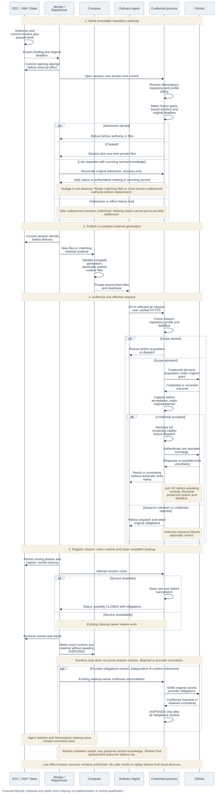

# GitHub credential contract

[Overview](../github-credentials.md) · [Architecture](architecture.md). This contract binds admission, worker, Compute and credential-service implementations. The overview's delivery record distinguishes merged source from runtime qualification.

## Admission and authority

An Agent requests `repositoryRef` and optional `profile`. Resolution returns the profile, configured `providerId` and grant `{providerInstanceId, repositoryId, grantId}`, identifying upstream instance, repository and authority independently. Opaque identities are nonempty, at most 512 UTF-8 bytes, without ASCII controls.

OCC checks Namespace policy and Driver/Provider membership. State commits the immutable revision and queued work before session creation, freezing Driver ID/implementation, bindings and absolute `deadlineWallMs`. Configuration cannot widen admission. Revalidation rejects drift while preserving restrictive cleanup.

The receiving service independently resolves Namespace/repository/profile registry policy, matches the frozen grant and rejects drift or invalid duration before authority/files. Registry/service duration ceilings and the original deadline apply.

One configured App installation supports at most sixteen distinct bindings per Agent. Each session fixes one repository/grant/deadline. Repository-set sessions remain unselected.

| Profile             | Exact token permissions                                                  | Operations                                                            |
| ------------------- | ------------------------------------------------------------------------ | --------------------------------------------------------------------- |
| `git-read`          | `metadata:read`, `contents:read`                                         | Clone, fetch, checkout. Push discovery/RPC deny before mint/dispatch. |
| `git-write`         | `metadata:read`, `contents:write`                                        | Native writes subject to repository rules. Omitted-profile default.   |
| Explicit `git-full` | `metadata:read`, `contents:write`, `pull_requests:write`, `issues:write` | Git and selected APIs below.                                          |

Git-only profiles deny all APIs. Reject `read-write`. Every issuance/replacement requests exactly one repository and validates complete permissions. Missing, surplus or inherited permissions refuse without widening or ambient credentials. Read-first new assignments belong to later IAM work.

Team App authority applies even in one-to-one chat. GitHub attributes API actions to the App. OIDC login and Agent invocation do not delegate repositories.

Later personal mode uses the same App with service-owned user tokens/renewal secrets. OIDC/account, invocation, IAM and credential owners must bind consent, verified OCE/GitHub account, current requester and authority mode, intersect user/App/installation/OCE grants, and qualify both modes, consent withdrawal, renewal/revocation and cross-user refusal. Never fall back silently to team authority. Invocation/Audit records requester and authority separately from commit author metadata.

## RepoDriver operations

`RepoDriver extends Driver` has capability `repo`, supplied to OCC/worker through existing selection. No repository CRUD, public issuance or generic broker resource is introduced. Common session/custody/lifecycle owners must avoid provider-name branches and one-hour-token assumptions. The emitted service starts independently of worker/database dependencies.

```ts
resolve(input: {
  readonly namespaceId: string;
  readonly bindings: readonly RepositoryBindingRequest[];
}): RepositoryCredentialResolution;
open(input: OpenRepositorySessionInput, signal: AbortSignal): Promise<OpenRepositorySessionResult>;
status(sessionId: string, signal: AbortSignal): Promise<RepositoryCredentialSessionStatus | undefined>;
close(sessionId: string, signal: AbortSignal): Promise<RepositoryCredentialSessionStatus | undefined>;
```

`resolve` returns admitted `bindings` and registry-bounded `sessionDurationSeconds`. `open` takes `namespaceId`, immutable `admissionId`, admitted `binding`, `durationSeconds`, `deadlineWallMs` and optional `recoverOnly: true`. The signal cancels. Duration cannot extend admission.

```ts
type OpenRepositorySessionResult =
  | {
      readonly kind: "created";
      readonly session: RepositoryCredentialSessionStatus;
      readonly files: RepositoryCredentialSessionFiles;
    }
  | { readonly kind: "recovered"; readonly status: RepositoryCredentialSessionStatus }
  | { readonly kind: "missing" };
```

Creation returns files once, recovery only status. `recoverOnly` never creates authority. Missing means authoritative absence, not unavailability. Missing `status`/`close` return `undefined`.

Validate complete private responses before fresh public snapshots/bindings across all four result paths. Public status has exactly `sessionId`, `state`, `deadlineWallMs`, `binding`. States are `OPEN`, `CLOSED`, `DISPOSED`. Disposal rejects active uses, active/pending/uncertain cleanup and auxiliary obligations. Historical expired/revoked counters may remain.

Permanent refusal maps to `ScopeViolationError`, unavailable/retryable/inconsistent results to `DependencyUnavailableError`. Reject wrong bindings, extended deadlines, recovery-only creation and OPEN close responses. `maintenanceIntervalMs` is 30000, not a withdrawal guarantee.

Preserve opaque Driver identities/persisted payloads without rename migration, private validators, closed material schemas and no emitted runtime dependency from private client DTOs. Source guards, entrypoints and build consumers must agree. Guards detect regressions, not malicious-code isolation.

Keep separate issuance/streaming senders, original-object borrowing, disposal sealed before awaiting, temporary-copy wiping before response disposal, and retry semantics. Introduce no test-only public API.

## Material delivery and recovery

The worker persists attempts before `open` and session identity before Compute delivery. Claims/phases fence concurrent workers. State stores correlations/cleanup, not a durable provider-token journal.

Lost-response reconciliation requires the service to retain original admission/effect knowledge. Recovery-only absence then fences delayed creation. Retain matching material, or close known-undelivered authority before justified replacement under the original grant/deadline. Status cannot regenerate files. Outage is not absence. This promise excludes erased service history.

`RepositoryCredentialSessionFiles` contains UTF-8 `bearer`, `client.json`, `gitconfig`, `gh/hosts.yml`, `gh/config.yml` and optional `ca.pem`. Bearers have at least 32 random bytes, looked up by digest. `RepositoryCredentialRuntimeBinding` supplies `repositoryRef`, `sessionId`, `deadlineWallMs` and either `kind: "new"` with files or `kind: "retained"` without them.

Compute validates complete generations, owns immutable scoped Kubernetes Secrets, private 0700/0600 placement, complete readiness, exact missing-subset repair and retirement through actual Pod references and UID/resourceVersion checks. Retained material must match its session. Atomic publication means runtime files become visible together. State transactions, sequential session opens, Kubernetes resources and GitHub effects remain separate.

Stock Git selects effective remotes through native configuration/helpers. Bounded `gh` routing selects actual targets. Ambiguous/conflicting selection rejects without global selected-repository mutation, custom Git grammar or verified-checkout startup gating.

## Request lifecycle



Proposed lifecycle, not runtime qualification. Time flows downward with normal request/reply notation. [Editable source](request-lifecycle.mmd).

1. Resolve bearer to server-owned session. Check exact repository/profile before acquisition. One exchange means one effective HTTP request, not a Git command.
2. Acquire on demand under the original grant/deadline. Concurrent waiters share acquisition and its fixed budget. Individual cancellation cannot extend it. Last-waiter cancellation retains capture/settlement responsibility.
3. Capture every observed token before scope/validity acceptance, including rejected/late material. Credential and session lifetimes differ. Idle-expiry renewal uses fresh JWTs and unchanged grants, retaining bearer/files beyond hour 13.
4. Require full remaining exchange validity plus margin. Trusted wall/monotonic time govern budgets. Backward wall time cannot extend authority/cleanup, and forward time alone cannot prove remote expiry. After asynchronous preparation, synchronously recheck authority/validity before dispatch. Join I/O before releasing custody. Drain-before rotation protects pushes and predecessor retirement preserves replacements.
5. Timeout/cancellation requests stop, not settlement. Preserve original handles/outcomes/reservations. Unknown issuance blocks remint. Possibly accepted writes and invoked uncertain cleanup must not automatically replay. Pre-invocation queue rescheduling differs. Reconcile effects through bounded unique ownership markers, reporting ambiguous/missing/truncated readback before independently authorized follow-up.
6. Persist closing phases and register owned cleanup before closure. Close denies use before cancellation. After attempting close, recheck owned stop intent and retire exact runtime/material without waiting for settlement or `DISPOSED`. Unavailability/unsettled cleanup retains the existing owner.
7. `CLOSED` retains capacity until actions, captures and auxiliary renewal authority settle. `DISPOSED` requires resolved obligations and actual finalization, not a predicate. One session cannot finalize the shared signing key. Revocation requires observed GitHub HTTP 204, otherwise uncertainty remains. Runtime stop proves neither closure/disposal/revocation, nor does either session state prove runtime termination. Finite shutdown may leave obligations. Grace expiry never settles them.

## Security and request bounds

App/TLS private material stays service-only. Enforce ownership, permissions, ancestor/descriptor checks, rejecting symlinks, nonregular/oversized inputs and replacement races. Agents cannot use Unix control. Failed transfers, including descriptor-close failure, dispose still-owned candidate bytes. Temporary wiping is best effort, not forensic JavaScript erasure. Only the upstream sender attaches provider authentication.

Agents hold gateway bearers and model credentials: this is not an all-Agent credential ban. Bearers prove neither workload origin nor current human. Routing is not confinement. Ordinary process/container/filesystem separation remains the trust assumption.

Authorize each request. Reject ambiguous framing, noncanonical targets, traversal and encoded aliases. Require fixed origins, canonical `github.com` identity, verified TLS/SNI and gateway port 443. Discard incoming credentials/cookies/hop-by-hop fields and upstream authentication challenges. Allowlist headers, reconstruct framing, validate/rewrite follow-up links and preserve body text. No ambient proxy, redirect, retry, login or PAT fallback.

| Target                                                                    | Methods            |
| ------------------------------------------------------------------------- | ------------------ |
| `/OWNER/REPO.git/info/refs?service=git-upload-pack` or `git-receive-pack` | GET                |
| `/OWNER/REPO.git/git-upload-pack` or `git-receive-pack`                   | POST               |
| `/repos/OWNER/REPO`                                                       | GET                |
| Its `/pulls` and `/issues` collections                                    | GET, POST          |
| Their numbered items                                                      | GET, PATCH         |
| Its `/issues/{number}/comments`                                           | GET, POST          |
| Its `/issues/comments/{id}`                                               | GET, PATCH, DELETE |
| `/meta`                                                                   | GET                |
| `/graphql`                                                                | POST               |

APIs require `git-full`. Repository REST routes match exact repository identity. Query/media/framing policy bounds pagination, repository-ID links and bodyless 204 responses.

Explicit `git-full` permits `POST /graphql` queries and mutations within the admitted installation token's authority, without semantic operation, field or global-ID filtering. This is broader than the listed REST operations. Exact one-repository issuance, complete permissions, session/profile/deadline, custody and transport checks remain. Every GraphQL POST is a possible write. Filtering is outside MVP.

GitHub may return permitted public information. There is no local branch authorization. Additional REST endpoints, whole-command preflight, administration, extra workflow permissions, SSH, LFS and extra-repository submodules remain excluded.

The [landed configuration](https://github.com/openclaw/openclaw-enterprise/blob/48ec47c0c7f105d32b09ac87b29b2666749503ef/apps/controller/src/drivers/repo/credentials/configuration.ts) retains these operational defaults. Source inspection does not qualify deployment capacity:

| Resource                               | Default                                   |
| -------------------------------------- | ----------------------------------------- |
| Sessions including cleanup             | 16                                        |
| Credential slots                       | 2 per session                             |
| Provider actions                       | 1 active, 64 queued                       |
| Sockets                                | 64 per listener                           |
| Exchanges                              | 32 total, 4 per session, 1 per connection |
| Headers                                | 32 KiB, 64 pairs                          |
| Target / control body                  | 8 KiB / 16 KiB                            |
| Fetch input                            | 1 MiB                                     |
| Push input and output                  | 256 MiB each                              |
| API input / response                   | 1 MiB / 8 MiB                             |
| TLS, header, connect, stall deadlines  | 5 seconds each                            |
| API/fetch input, first response header | 30 seconds each                           |
| Exchange / provider action             | 5 minutes / at most 30 seconds            |
| Validity margin / shutdown grace       | 60 seconds each                           |
| Token / renewal material / PEM         | 16 KiB / 16 KiB / 64 KiB                  |

Sixteen bindings/Agent and [registry capacity 128](https://github.com/openclaw/openclaw-enterprise/blob/48ec47c0c7f105d32b09ac87b29b2666749503ef/apps/controller/src/drivers/repo/github/credentials/registry.ts) are hardcoded scale constraints requiring coordinated changes. Admission reserves no sessions. The shared sixteen-session budget includes CLOSED cleanup and failed construction. One fully bound Agent can exhaust sibling/replacement headroom. Credential slots and surviving upstream tokens measure different things.

Git's 256 MiB bodies and 5-second inactivity/5-minute exchange budgets are operational choices. Requests 32/4, sockets 64 and sessions 16 require capacity evidence. API 1 MiB/8 MiB buffers require memory accounting across copies/concurrency. Client/control/shutdown/Pod/provider ceilings may require coordinated changes.

Operators can already override operational budgets through the protected service configuration. Git byte limits are separate from API byte limits; exchange and stall timeouts are shared. Overrides apply at service startup, subject to credential validity, original deadlines and transport/deployment ceilings. No replacement defaults or qualified capacity are selected. Provider concurrency one is a hardcoded queue simplification; more queue capacity adds no concurrency. Changing it requires separate lifecycle/scheduling work.

The current rotation design requires at least two credential slots for replacement overlap. Full-exchange validity, original deadlines and unresolved obligations remain binding, without arbitrary cleanup TTLs.

Wire/decoded bounds are independent. Queue/input time counts toward the original total budget. Push input uses the exchange deadline. Header timing follows TLS, upstream response-header timing follows upload unless headers arrive earlier. Overrides require positive safe integers under tested policy. Unknown keys/zero reject, hard material/action caps remain. Saturation cannot drain indefinitely or discard obligations.

Compatibility is HTTP/1.1 without CONNECT, HTTP/2, arbitrary forwarding or interception, Node 24 and exactly `gh` 2.100.0. [Client commands](https://github.com/openclaw/openclaw-enterprise/blob/48ec47c0c7f105d32b09ac87b29b2666749503ef/apps/controller/src/drivers/repo/github/credentials/client/commands.ts) permit only `api` and `pr create` with restricted flags. `pr create` requires explicit `--head`. More commands require qualification, not larger budgets.

## Restart and future obligations

**Surviving service knowledge.** Worker process/container restart may retain sessions only if the credential service and matching material survive. The [delivery recovery contract](#material-delivery-and-recovery) depends on that service retaining original admission/effect knowledge.

**Lost service knowledge.** Replacing the selected Recreate worker Pod also replaces its credential sidecar. Service replacement loses sessions/provider inventory, needs new material and may replace the Agent Pod. State's persisted correlations and cleanup records do not restore that inventory. Provider tokens can survive until expiry. Repeated crashes defeat aggregate token bounds derived from process-local capacity.

The [landed worker](https://github.com/openclaw/openclaw-enterprise/blob/48ec47c0c7f105d32b09ac87b29b2666749503ef/apps/controller/src/worker/repository-credentials.ts#L150) invalidates a missing recorded session, fails the affected revision with `REPOSITORY_SESSION_RECOVERY_UNSAFE`, blocks automatic same-revision replacement and queues exact runtime retirement while retaining cleanup. A user may explicitly deploy a new authorized revision; this neither settles old obligations nor replays Git/API operations. This revision-level refusal is not a service-generation-wide issuance fence.

Durable issuance/custody/outcome accounting and reconciliation of forgotten effects remain deferred, as does full encrypted material recovery. Any successor must retain original obligations and fence predecessors before issuance, with repeated-crash cleanup/no-unsafe-remint-or-replay proof. No JWT/Postgres design is selected. Persistence alone cannot guarantee exactly-once effects. Invalidation is not disposal/revocation or seamless continuation.

**Runtime continuation.** Worker/Compute/Harness separately own safe refresh or explicit resume, workspace ownership and observed predecessor writer termination. Actual ordinary-Agent model/tool and real-Git evidence must prove continuity without stale credentials, concurrent writers or uncertain-effect replay.

Retained successor owners:

- IAM/Work: read-first assignments, root Work, fresh per-effect authorization, durable dispatch permits, PR submission identity/deduplication and unknown outcomes.
- Identity/Compute/receivers: disabled preparation, independently observed execution, fresh immutable admission, delivery/recheck/enable and protected receiving evidence before acquisition/dispatch.
- Egress: mandatory routing and authenticated currentness ordered against withdrawal. Measure new/active-use closure within 30 seconds, including renewal loss and selected tighter bounds. Network, repository composition and protected currentness need separate proof.
- Custody/State: encrypted inventory, canonical holds, original-key retirement and compatibility drains. Repository publication: per-ref receive-pack/receipts, approved retained candidates, branch policy and ownership/visibility protection.
- Compute/Harness: dedicated/gVisor delivery, readiness, retirement and retained-workspace writer exclusion. Runtime/Compute: helper aggregation, independent children, stop/start/result delivery, compatible context restoration and host-loss recovery.
- OIDC/account: identity-only login with discarded login tokens. Invocation/Audit: current requester distinct from deployer/reader, using observed or explicitly unknown facts. Native-token/offline-read modes need independent qualification and are never fallbacks.

These successors add no gates to this narrow refinement. Owners update current documentation with exact-source evidence upon delivery.
