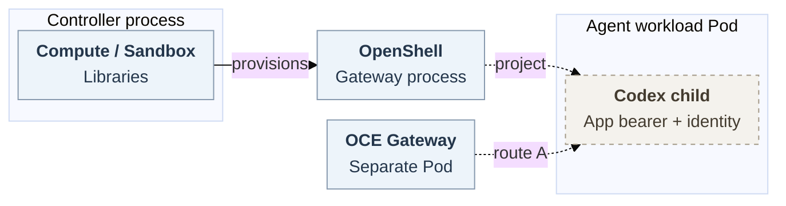

# OpenShell Kubernetes identity and transport

## Problem and proposal

**Goal:** Let an operator deploy and use a dedicated Codex Agent in an OpenShell Sandbox on Kubernetes. The Agent needs its app-server token, workload identity and approved storage. The OpenClaw Enterprise (OCE) Gateway, which sends requests to the Agent, needs an authenticated private WebSocket connection to it.

**Why it is needed:** Today, the OCE adapter rejects the Secret reference carrying the app-server token before it creates a Sandbox. Projecting that Secret into a Pod would not be enough: the OpenShell launcher clears its child process's environment. Workload identity, mounts and the private route also need support and verification. Creating a Sandbox alone would not complete [issue #78](https://github.com/openclaw/openclaw-enterprise/issues/78).

**Proposal:** Extend OpenShell to make only approved resources available in the workload Pod and deliver selected values to the intended child process. OCE would map its existing deployment requirements to that contract. Evaluate the existing private route first (option A); options B and C remain alternatives. Credential mediation for useful model and repository operations is separate work under [issue #118](https://github.com/openclaw/openclaw-enterprise/issues/118). Immutable image and configuration remain required.

**This is a proposal for team decision.** It does not approve implementation or accept risk.

Solid arrows show source behavior. Dashed arrows show proposed integration that still needs qualification. The [detailed lifecycle](openshell-kubernetes-identity-and-transport/request-lifecycle.svg) includes refusal and recovery.

## Projection contract

Compute and Sandbox are libraries in the controller process. The OpenShell gateway, supervisor Pod and Agent workload Pod are separate. Compute owns the revision and transport Secret. The intended Agent needs the app-server token and workload identity, both of which grant scoped capabilities. Provider keys and OpenShell gateway, workspace and supervisor credentials remain outside the Agent. [Issue #118](https://github.com/openclaw/openclaw-enterprise/issues/118) owns repository-session bearer custody.

The required token and identity conflict with OpenShell's current rule that workloads be capability-free. OpenShell isolation and OCE identity owners must agree on a narrow exception for the required capabilities and how to enforce it.

Compute passes its existing [requirements contract](https://github.com/openclaw/openclaw-enterprise/blob/73632989f1377f74dc417febf57e2748536a995d/packages/contracts/src/index.ts#L847-L898) to `provisionHarness` through `SandboxHarnessContext.requirements`. It includes image, command, login mode, labels, credential attachments, environment, identity and mounts. For example, `APP_SERVER_TOKEN` is an environment entry with `valueFrom.secretKeyRef{name,key}`. Under the proposal, kubelet would resolve the authorized same-Namespace Secret key for the intended child. Foreign or replaced references must prevent activation. This behavior has not been executed.

### Identity, mounts and integrity

Map `serviceAccountName` and the projected `serviceAccountToken`, including its audience, `expirationSeconds`, mountPath, path and `readOnly:true`. Preserve the approved 600–86400-second expiry range without adding a default. Preserve each approved PVC's claimName, subPath, mountPath and readOnly setting. Reassess mounts after common-PVC removal.

The OCE adapter currently rejects Secret references. At the pinned upstream version, OpenShell supports PVCs but lacks per-workload ServiceAccount selection and rejects stored projected tokens. The proposed extension must update the accepted resource types, authorization, Pod construction and integrity checks together. Authorize the exact Secret, key, recipient and ServiceAccount. Record resource UIDs, disable automount and protect reserved mounts. On reuse, recheck Pod and resource UIDs and immutable revision material. A UID alone does not prove that Secret data or authorization is still current.

### Child delivery and node bootstrap

Kubelet projection alone does not deliver a Secret to Codex: OpenShell's `boundary_exec` clears the environment before expanding a shared environment map. The proposed handoff must admit named values only and resolve kubelet-provided values inside the workload. It must separately address the initial wrapper/startup and later exec or reconnect recipients, keeping bootstrap values out of unintended Codex and later-exec recipients. Reject missing, colliding or reserved names and any inherit-all behavior. Do not put resolved setup or token values in persisted Sandbox/configuration, logs or the shared serialized `OPENSHELL_USER_ENVIRONMENT`. OCE maps references without reading the values and rejects deployed APIs that lack the required support. Upstream must approve the mechanism and fields.

When node enrollment is selected, deliver the original owner's `OPENCLAW_NODE_SETUP_CODE` Secret/key `setupCode` to `AGENT_WITH_NODE_ENTRYPOINT`. Preserve expiry, one-shot use, and restart and retirement handling. Otherwise omit it. The wrapper constructs an explicit `nodeEnv`, removes node setup, state, CA and bootstrap values from `codexEnv`, and retains `APP_SERVER_TOKEN`. The setup code enters `node run --pair-if-needed` arguments. Filtering the environment therefore does not prove `/proc` confidentiality within the shared Pod/process boundary. This is separate bootstrap authority; the newer non-Sandbox setup-file path does not apply.

Conditional workspace and node-state initialization are still unavailable: Compute rejects `initialize-workspace`, and the handoff has no initializer field. For affected profiles, owners must approve a producer and consumer for bootstrap, preserving private directory creation (`0700`), Agent-scoped identity reuse and cleanup.

## Transport options

**A — evaluate the existing private route first.** Compute supplies `APP_SERVER_URL` only to nonembedded workloads without `nativeRuntime`, including dedicated Codex: same-cluster `ws`, or `executionCluster` `wss`. Native OpenClaw workers use their node path. The combined repository path remains single-cluster. OCE discards OpenShell's validated exposed URL, so that URL's header stripping does not establish that A is blocked.

Released isolation permits only same-Namespace supervisor-role ingress on the boundary port. Direct app-port ingress requires upstream isolation and network-owner approval. Kubernetes NetworkPolicies are additive, so qualification must check all policies that select the workload together. It must also check revision labels, endpoints, the listener, peers and application authentication. Routing alone does not provide encryption. Preserve TLS policy without waivers.

**B — released opaque `ForwardTcp`.** Its first frame requires the exact workspace and Sandbox, loopback target, gateway authorization and a sandbox-bound SSH session token. The trusted adapter must pin the app-server port: the token is not port-scoped and Codex listens beyond loopback. The real OCE wrappers and an authenticated native Gateway receiver need an owned interface for two-way data, closure and settlement. It must join cancellation in both directions, close idle connections, and terminate them on expiry, revocation or loss of current authority. A revocation record does not itself close a stream. These Driver API changes remain conditional proposals.

The released limits are process-local: three connections per token, twenty per Sandbox and, separately, 256 queued frames. SSH expiry defaults to 86400 seconds; configurable zero means no expiry. B needs an owner-approved short, finite lifetime and closure bounds without token churn.

**C — experimental exposed-service passthrough.** [OpenShell PR #3796](https://github.com/NVIDIA/OpenShell/pull/3796), pinned at `3bc98285`, is unmerged. This option needs upstream acceptance, distinct gateway and application issuers and audiences, an OCE URL consumer, and WebSocket proof. Projection and authority remain separate requirements.

The decisions for review are the projection and child-delivery contract, including its recipients and workload exception; the transport and its authentication, TLS and closure requirements; and the bootstrap contract for profiles that need initialization. The upstream, OCE identity and network owners must agree on their respective boundaries before implementation.

## Lifecycle

The [editable lifecycle](openshell-kubernetes-identity-and-transport/request-lifecycle.mmd) shows the proposed path:

1. An operator configures Kubernetes Compute, paired OpenShell Backend and Sandbox, an operator workspace, authorized resources, and immutable image and configuration. An authorized actor calls [`deployAgent`](https://github.com/openclaw/openclaw-enterprise/blob/73632989f1377f74dc417febf57e2748536a995d/docs/reference/api.md#post-namespacesnamespaceidagentsagentiddeploy). Worker reconciliation admits the saved draft, then calls `Compute.prepareRevision` and `SandboxDriver.provisionHarness`.
2. Bind the Namespace, Agent, revision and workspace. Unsupported projection prevents activation. Once the projection and route are accepted, the native Gateway uses current authority and the startup-derived bearer to reach Codex. Observe an authenticated exchange and mediated useful work.
3. On stop or replacement, the original owners withdraw old access and select a closure bound. Reconnection requires current authority and the exact revision.

If a reply is lost, the app effect is unknown. Revision and resource correlations and PVC contents may survive the lost connection, but they do not settle the effect. The original request/effect owner retains the unknown outcome without automatic replay or compensation. No transaction spans State, Kubernetes/OpenShell and app effects. Restarting or recording a revocation does not prove remote closure.

## Implementation and verification

Upstream owners first agree on and implement projection, child delivery and integrity. OCE then maps the contract and qualifies A, or owners explicitly select B or C with their additional work. Preserve admission, native authentication, TLS/CA checks and existing access holds. Static-token bridges, borrowed supervisor tokens, `pods/proxy` waivers and hidden shared modes are excluded.

The deployment and request must retain the original request's authority through State, Work and IAM. The integration also needs the separate image and configuration, plus a broker, credential material and a way to check that access is still current. These suppliers are tracked in [issue #118](https://github.com/openclaw/openclaw-enterprise/issues/118). Originating a request does not authenticate the transport. Require agreement on the startup-derived bearer and immutable plugin configuration. These inputs have not yet been accepted together as a working integration.

Before accepting the integration:

- Verify intended-recipient delivery at startup and later exec/reconnect, including nested serialized values and the absence of bootstrap values from unintended recipients. Test foreign, replaced and widened references for denial.
- Qualify conditional bootstrap at first launch, replacement and restart. Prove identity binding, token rotation/reload and replacement/deletion on the actual workload Pod, not with a copied test-Job token.
- Qualify the ordinary Kubernetes/OpenShell/Codex launch, private endpoints, sibling isolation, cleanup, stopped/replaced denial and unknown-outcome recovery.
- Test actual network enforcement. NetworkPolicies are additive, so broad public TCP 443 plus empty egress does not deny a GitHub bypass. Prove DNS/IP/443 denial while preserving mediated model traffic and TLS. Issue #118 separately owns model operations, selected Git/`gh` profiles, provider proof and the later protected target for both dedicated OpenClaw and Codex Agents.

Pinned source and doubles do not establish installed Kubernetes, OpenShell or Codex behavior, CNI enforcement, genuine runtime, live-provider behavior or release acceptance.

## References

[OCE provisioning at `73632989`](https://github.com/openclaw/openclaw-enterprise/blob/73632989f1377f74dc417febf57e2748536a995d/docs/flows/openshell-sandbox-provisioning.md) · [OpenShell v0.1.2 driver at `6648bd0`](https://github.com/NVIDIA/OpenShell/blob/6648bd0c290efbc41ba131ee9831ee45cd431f94/crates/openshell-driver-kubernetes/src/driver.rs) · [ForwardTcp source](https://github.com/NVIDIA/OpenShell/blob/6648bd0c290efbc41ba131ee9831ee45cd431f94/crates/openshell-server/src/grpc/sandbox.rs) · [Child launch](https://github.com/NVIDIA/OpenShell/blob/6648bd0c290efbc41ba131ee9831ee45cd431f94/crates/openshell-sandbox/src/boundary_exec.rs).
