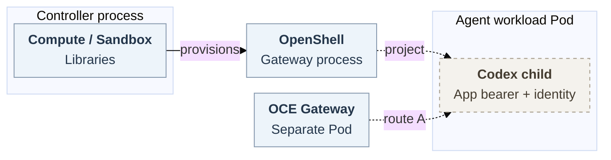

# OpenShell Kubernetes identity and transport

## Problem and proposal

**Proposed for team decision, without implementation approval or risk acceptance.** OpenClaw Enterprise (OCE) [issue #78](https://github.com/openclaw/openclaw-enterprise/issues/78) remains unavailable: ordinary dedicated Codex needs its app bearer, workload identity, approved mounts and private authenticated WebSocket together. Propose narrow upstream projection and evaluate route A first. Credential mediation and immutable image/config remain required. B/C are unselected alternatives.

Solid arrows show source behavior, dashed arrows proposed integration requiring qualification. [Detailed lifecycle](openshell-kubernetes-identity-and-transport/request-lifecycle.svg).

## Transport options

**A — evaluate existing private routing first.** Compute supplies `APP_SERVER_URL` only for nonembedded workloads without `nativeRuntime`, including dedicated Codex: same-cluster `ws`, or `executionCluster` `wss`. Native OpenClaw workers use their node path. The combined repository path remains single-cluster. OCE discards OpenShell's validated exposed URL, whose header stripping therefore does not prove A blocked.

Released isolation permits only same-Namespace supervisor-role ingress on the boundary port. Direct app-port ingress needs upstream isolation/network-owner approval plus proof of the full additive policy union, revision labels, endpoints, listener, peers and app authentication. Routing alone proves no encryption. Preserve TLS policy without waivers.

**B — released opaque `ForwardTcp`.** First-frame initialization requires exact workspace/Sandbox, loopback target, gateway authorization and a sandbox-bound SSH session token. The trusted adapter pins the app-server port because the token is not port-scoped and Codex listens beyond loopback. Real OCE wrappers and an authenticated native Gateway receiver need an owned duplex/close/settlement interface, joined two-way cancellation, idle closure and expiry/revocation/currentness termination. Revocation records do not close streams. These remain conditional Driver API proposals.

Released limits are process-local: three connections/token, twenty/Sandbox, separately 256 queued frames. SSH expiry defaults to 86400 seconds, with configurable zero meaning no expiry. B needs owner-approved short finite lifetime and closure bounds, without token churn.

**C — experimental exposed-service passthrough.** [OpenShell PR #3796](https://github.com/NVIDIA/OpenShell/pull/3796), pinned at `3bc98285`, is unmerged. It needs upstream acceptance, distinct gateway/application issuers/audiences, an OCE URL consumer and WebSocket proof. Projection and authority remain separate.

## Projection contract

Compute/Sandbox are controller libraries. OpenShell gateway, supervisor Pod and workload Pod are separate. Compute owns revision and transport Secret. App-server and workload capabilities reach the intended Agent. Provider keys and OpenShell gateway/workspace/supervisor credentials stay outside it. Repository-session bearer custody follows [issue #118](https://github.com/openclaw/openclaw-enterprise/issues/118). Upstream isolation and OCE identity owners must approve this narrow capability-free workload exception.

Compute supplies the existing [requirements contract](https://github.com/openclaw/openclaw-enterprise/blob/73632989f1377f74dc417febf57e2748536a995d/packages/contracts/src/index.ts#L847-L898) at `SandboxHarnessContext.requirements` for `provisionHarness`: image, command, login mode, labels, credential attachments, environment, identity and mounts. Example: `environment` supplies `APP_SERVER_TOKEN` through `valueFrom.secretKeyRef{name,key}`. Proposed, unexecuted behavior: kubelet resolves the authorized same-Namespace key for the intended child. Foreign/replaced references refuse activation.

For selected node enrollment, deliver the original owner's `OPENCLAW_NODE_SETUP_CODE` Secret/key `setupCode` to `AGENT_WITH_NODE_ENTRYPOINT`. Preserve expiry, one-shot use and restart/retirement. Otherwise omit it. The wrapper constructs explicit `nodeEnv`, removes node setup/state/CA/bootstrap from `codexEnv`, and retains `APP_SERVER_TOKEN`. Setup enters `node run --pair-if-needed` arguments, so filtering does not prove `/proc` confidentiality across the shared Pod/process boundary. This is separate bootstrap authority. The newer non-Sandbox setup-file path is inapplicable.

Map `serviceAccountName` with `serviceAccountToken` audience/`expirationSeconds`/mountPath/path/`readOnly:true`. Preserve approved expiry (600–86400 seconds), with no new default, and each PVC claimName/subPath/mountPath/readOnly tuple. Reassess mounts after common-PVC removal. Conditional workspace/node-state initialization remains unavailable: Compute rejects `initialize-workspace`, and the handoff has no initializer field. Owners must approve producer/consumer bootstrap for affected profiles, preserving private directory creation (`0700`), Agent-scoped identity reuse and cleanup.

OCE rejects Secret references. Upstream supports PVCs only, lacks per-workload ServiceAccount selection, and rejects stored projected tokens. Extend closed types, scoped Secret/key/recipient/ServiceAccount authorization, UID recording, Pod rendering and integrity together. On reuse, recheck Pod/resource UIDs and immutable revision material. Disable automount and protect reserved mounts. UIDs alone prove neither unchanged Secret data nor current authority.

Pod `secretKeyRef` is insufficient: `boundary_exec` clears environment, then expands the shared map. Proposed delivery carries admitted names only, resolving kubelet-provided values inside the workload separately for initial wrapper/startup and later exec/reconnect recipients. Keep bootstrap absent from unintended Codex/later-exec recipients. Exclude resolved setup/token values from persisted Sandbox/config, logs and shared serialized `OPENSHELL_USER_ENVIRONMENT`. Refuse missing/colliding/reserved names and inherit-all. Upstream must approve the mechanism/fields. OCE maps references without reading values and rejects unsupported deployed APIs.

## Lifecycle

[Editable lifecycle](openshell-kubernetes-identity-and-transport/request-lifecycle.mmd).

1. The operator configures Kubernetes Compute, paired OpenShell Backend/Sandbox, operator workspace, authorized resources and immutable image/config. The authorized actor calls [`deployAgent`](https://github.com/openclaw/openclaw-enterprise/blob/73632989f1377f74dc417febf57e2748536a995d/docs/reference/api.md#post-namespacesnamespaceidagentsagentiddeploy), admitting the saved draft through worker reconciliation, `Compute.prepareRevision`, then `SandboxDriver.provisionHarness`.
2. Bind Namespace, Agent, revision and workspace. Unsupported projection refuses activation. With accepted support, the native Gateway uses current authority and startup-derived bearer to reach Codex. Observe authenticated exchange and mediated useful work.
3. Original owners withdraw old access on stop/replacement and select the closure bound. Reconnection requires current authority and exact revision.

Lost replies leave app effects unknown. Revision/resource correlations and PVC contents may survive lost connection knowledge, without settling effects. The original request/effect owner preserves unknown outcomes without automatic replay or compensation. No transaction spans State, Kubernetes/OpenShell and app effects. Restart or a revoke record does not prove remote closure.

## Implementation and verification

Upstream owners first implement agreed projection, child delivery and integrity. OCE then maps it and qualifies A, or explicitly selects B/C with their additional work. Preserve admission, native authentication, TLS/CA checks and existing access holds. Static-token bridges, borrowed supervisor tokens, `pods/proxy` waivers and hidden shared modes are excluded.

Receive genuine original-request/State/Work/IAM authority, separate image/config and [issue #118](https://github.com/openclaw/openclaw-enterprise/issues/118) broker/material/currentness suppliers. A request producer is not transport authentication. Require startup-derived bearer agreement and immutable plugin configuration. These suppliers remain unaccepted positive composition evidence.

Verify intended-recipient delivery on both startup and later exec/reconnect, including nested serialized values and bootstrap absence; test foreign/replaced/widened denial. Qualify conditional bootstrap on first launch, replacement and restart. Prove actual workload-Pod identity binding, token rotation/reload and replacement/deletion, never a copied test-Job token. Qualify ordinary Kubernetes/OpenShell/Codex launch, private endpoints, sibling isolation, cleanup, stopped/replaced denial and unknown-outcome recovery. NetworkPolicies are additive: broad public TCP443 plus empty egress does not deny GitHub bypass. Prove DNS/IP/443 denial while preserving mediated model traffic and TLS. Issue #118 still owns model operations, selected Git/`gh` profiles, provider proof and the later protected both-Harness target.

Pinned source and doubles do not establish the unavailable installed/CNI, genuine runtime, live-provider or release acceptance.

## References

[OCE provisioning at `73632989`](https://github.com/openclaw/openclaw-enterprise/blob/73632989f1377f74dc417febf57e2748536a995d/docs/flows/openshell-sandbox-provisioning.md) · [OpenShell v0.1.2 driver at `6648bd0`](https://github.com/NVIDIA/OpenShell/blob/6648bd0c290efbc41ba131ee9831ee45cd431f94/crates/openshell-driver-kubernetes/src/driver.rs) · [ForwardTcp source](https://github.com/NVIDIA/OpenShell/blob/6648bd0c290efbc41ba131ee9831ee45cd431f94/crates/openshell-server/src/grpc/sandbox.rs) · [Child launch](https://github.com/NVIDIA/OpenShell/blob/6648bd0c290efbc41ba131ee9831ee45cd431f94/crates/openshell-sandbox/src/boundary_exec.rs).
